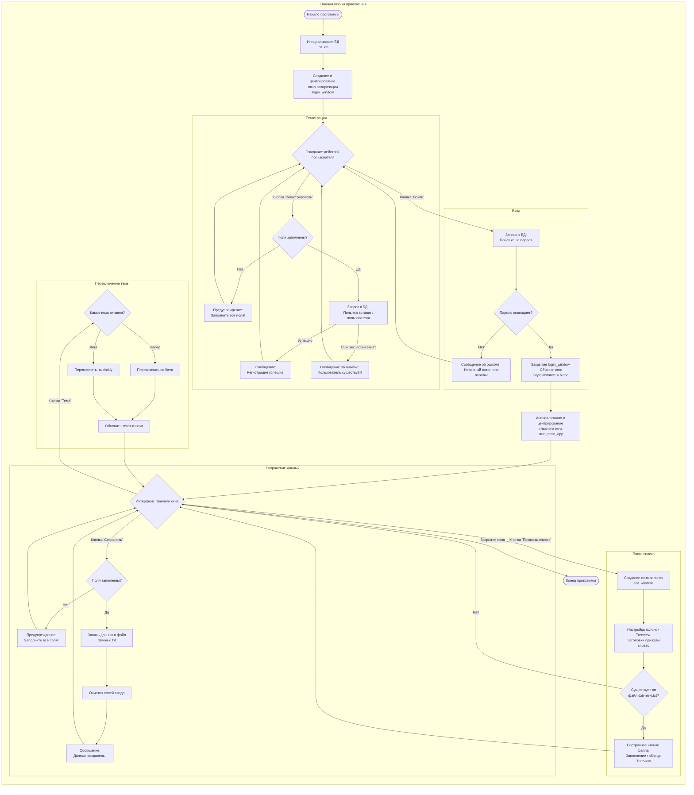
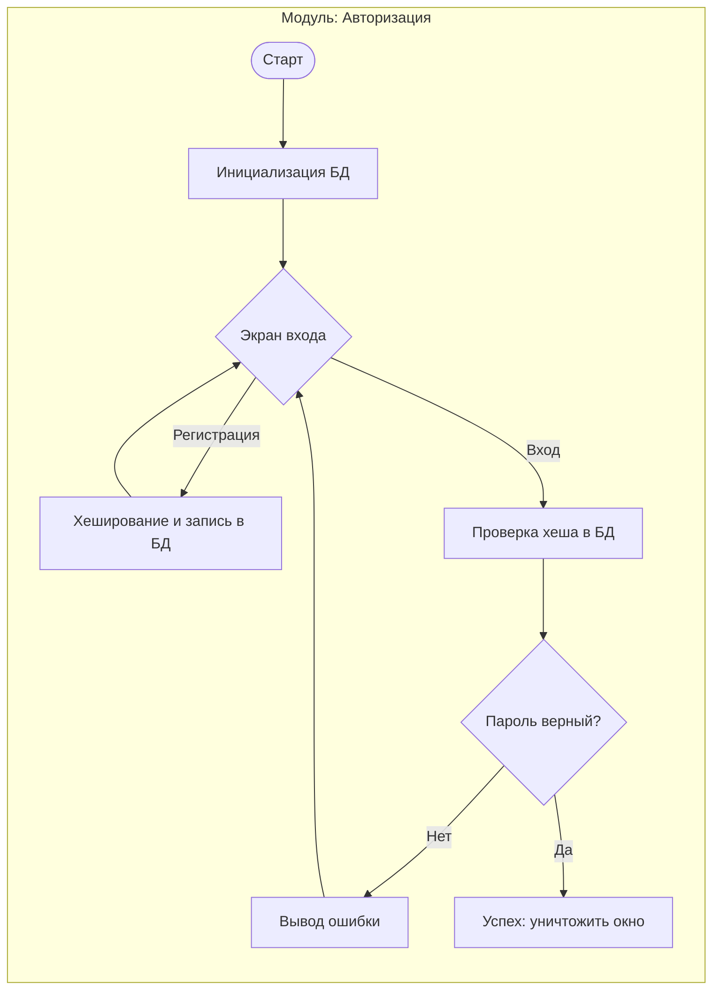
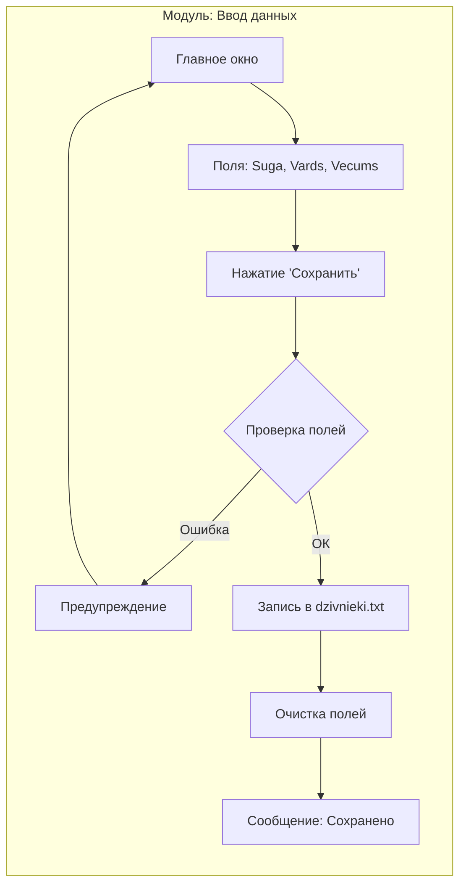
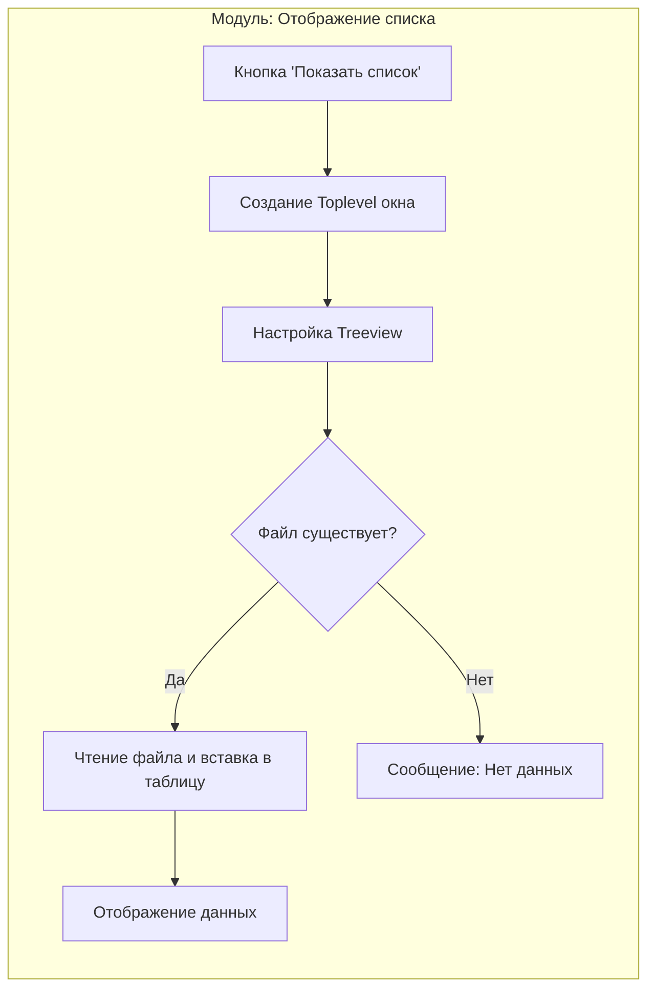
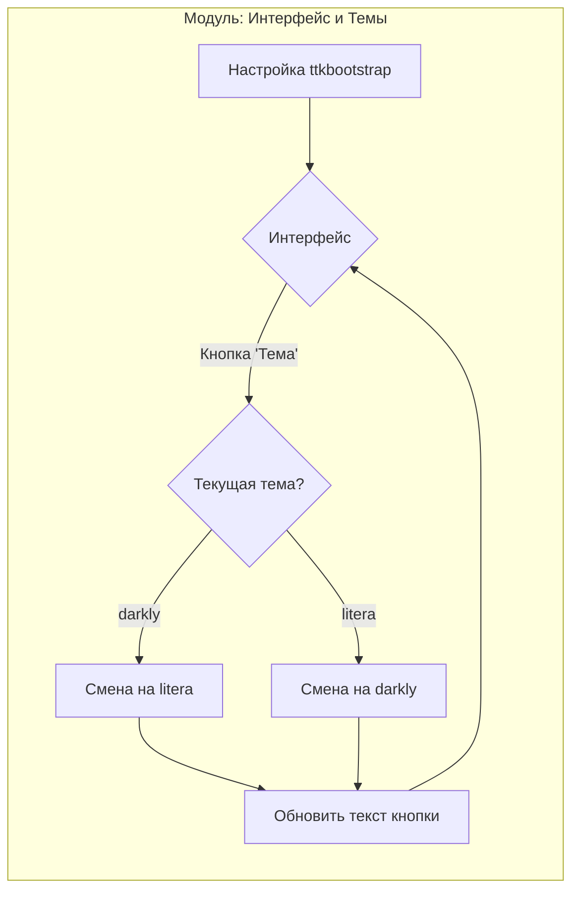

# Моя блок-схема

```mermaid

graph TB
    subgraph FullLogic [Полная логика приложения]
        direction TB

        Start([Начало программы]) --> InitDB[Инициализация БД <br> init_db]
        InitDB --> StartLogin[Создание и центрирование <br> окна авторизации login_window]
        StartLogin --> LoginLoop{Ожидание действий пользователя}

        %% Регистрация
        subgraph Registration [Регистрация]
            LoginLoop -->|Кнопка 'Регистрировать'| RegCheck{Поля заполнены?}
            RegCheck -->|Нет| RegWarn[Предупреждение: <br> Заполните все поля!]
            RegWarn --> LoginLoop
            RegCheck -->|Да| DBReg[Запрос к БД: <br> Попытка вставить пользователя]
            DBReg -->|Успешно| RegSuccess[Сообщение: <br> Регистрация успешна!]
            RegSuccess --> LoginLoop
            DBReg -->|Ошибка: логин занят| RegError[Сообщение об ошибке: <br> Пользователь существует!]
            RegError --> LoginLoop
        end

        %% Вход
        subgraph LoginProcess [Вход]
            LoginLoop -->|Кнопка 'Войти'| LoginCheck[Запрос к БД: <br> Поиск хеша пароля]
            LoginCheck --> AuthValid{Пароль совпадает?}
            AuthValid -->|Нет| AuthError[Сообщение об ошибке: <br> Неверный логин или пароль!]
            AuthError --> LoginLoop
            AuthValid -->|Да| CloseLogin[Закрытие login_window <br> Сброс стиля: Style.instance = None]
        end

        %% Главное окно
        CloseLogin --> InitMain[Инициализация и центрирование <br> главного окна start_main_app]
        InitMain --> MainLoop{Интерфейс главного окна}

        %% Сохранение данных
        subgraph Saving [Сохранение данных]
            MainLoop -->|Кнопка 'Сохранить'| SaveCheck{Поля заполнены?}
            SaveCheck -->|Нет| SaveWarn[Предупреждение: <br> Заполните все поля!]
            SaveWarn --> MainLoop
            SaveCheck -->|Да| SaveData[Запись данных в файл <br> dzivnieki.txt]
            SaveData --> ClearFields[Очистка полей ввода]
            ClearFields --> SaveSuccess[Сообщение: <br> Данные сохранены!]
            SaveSuccess --> MainLoop
        end

        %% Показ списка
        subgraph Viewing [Показ списка]
            MainLoop -->|Кнопка 'Показать список'| ShowList[Создание окна saraksts <br> list_window]
            ShowList --> SetupTree[Настройка колонок Treeview <br> Заголовки прижаты вправо]
            SetupTree --> ReadFile{Существует ли <br> файл dzivnieki.txt?}
            ReadFile -->|Да| PopulateTable[Построчное чтение файла <br> Заполнение таблицы Treeview]
            ReadFile -->|Нет| MainLoop
            PopulateTable --> MainLoop
        end

        %% Переключение темы
        subgraph Theme [Переключение темы]
            MainLoop -->|Кнопка 'Тема'| CheckTheme{Какая тема активна?}
            CheckTheme -->|darkly| SwitchLitera[Переключить на litera]
            CheckTheme -->|litera| SwitchDarkly[Переключить на darkly]
            SwitchLitera --> UpdateBtnText[Обновить текст кнопки]
            SwitchDarkly --> UpdateBtnText
            UpdateBtnText --> MainLoop
        end

        %% Завершение
        MainLoop -->|Закрытие окна| End([Конец программы])
    end

```
### 1. Модуль: Авторизация

```mermaid
graph TB
    subgraph Auth [Модуль: Авторизация]
        direction TB
        Start([Старт]) --> InitDB[Инициализация БД]
        InitDB --> LoginLoop{Экран входа}
        LoginLoop -->|Регистрация| Register[Хеширование и запись в БД]
        Register --> LoginLoop
        LoginLoop -->|Вход| AuthCheck[Проверка хеша в БД]
        AuthCheck --> IsValid{Пароль верный?}
        IsValid -->|Нет| Error[Вывод ошибки]
        Error --> LoginLoop
        IsValid -->|Да| CloseLogin[Успех: уничтожить окно]
    end 
        
```   
### 2. Модуль Управления данными (Data Entry)

```mermaid
graph TB
    subgraph DataEntry [Модуль: Ввод данных]
        direction TB
        MainWin[Главное окно] --> InputForm[Поля: Suga, Vards, Vecums]
        InputForm --> SaveBtn[Нажатие 'Сохранить']
        SaveBtn --> Validate{Проверка полей}
        Validate -->|Ошибка| Warn[Предупреждение]
        Warn --> MainWin
        Validate -->|ОК| SaveFile[Запись в dzivnieki.txt]
        SaveFile --> Clear[Очистка полей]
        Clear --> Success[Сообщение: Сохранено]
    end
```   
### 3. Модуль Отображения (View/List)

```mermaid    
graph TB
    subgraph ListView [Модуль: Отображение списка]
        direction TB
        ListBtn[Кнопка 'Показать список'] --> OpenWin[Создание Toplevel окна]
        OpenWin --> Setup[Настройка Treeview]
        Setup --> ReadFile{Файл существует?}
        ReadFile -->|Да| Load[Чтение файла и вставка в таблицу]
        Load --> Finish[Отображение данных]
        ReadFile -->|Нет| NoFile[Сообщение: Нет данных]
    end
``` 
### 4. Модуль Интерфейса (UI & Settings)

```mermaid    
graph TB
    subgraph UI [Модуль: Интерфейс и Темы]
        direction TB
        InitUI[Настройка ttkbootstrap] --> MainLoop{Интерфейс}
        MainLoop -->|Кнопка 'Тема'| SwitchTheme{Текущая тема?}
        SwitchTheme -->|darkly| SetLitera[Смена на litera]
        SwitchTheme -->|litera| SetDarkly[Смена на darkly]
        SetLitera --> UpdateBtn[Обновить текст кнопки]
        SetDarkly --> UpdateBtn
        UpdateBtn --> MainLoop
    end
```  

