# Praktiskā darba atskaite — PD11

**Tēma:** Programma sāk aprakstīt objektus 
**Vārds, Uzvārds:** Zhan Teivan 
**Datums:** 2026-05-25  
**Grupa:**  DAAVP_Daugavpils_80


[Mana praktiskā darba mape GitHub platformā](https://github.com/JanTey/Python_Course/blob/main/PD09/atskaite_PD09.md)


---
# 📁 0. Sagatavošanās darbi

Pārbaudi, vai sagatavota darba vide:

* [x] Izveidota mape `PB2_PD11_Teivan_Zhan`
* [x] Izveidota apakšmape `pielikumi`
* [x] Izveidota apakšmape `atteli`
* [x] Izveidots fails `atskaite_PD11.md`

---

## Mapju struktūra

```text
PB2_PD11_Teivan_Zhan/
├─ Pielikumi/
│  ├─ vng01.py
│  ├─ vng02.py
│  ├─ vng03.py
│  ├─ vng04.py
│  ├─ vng05.py
│  ├─ vng06.py
│  ├─ vng07.py
│  ├─ vng08.py
│  ├─ vng09.py
│  └─ vng10.py
├─ atteli/
│  ├─ maps_structure.png
│  ├─ vng01.png
│  ├─ vng02.png
│  ├─ vng03.png
│  ├─ vng04.png
│  ├─ vng05a.png
│  ├─ vng05b.png
│  ├─ vng06a.png
│  ├─ vng06b.png
│  ├─ vng07.png
│  ├─ vng08.png
│  ├─ vng09.png
│  └─ vng10.png
└─ atskaite_PD11.md
```

---

## Ekrānuzņēmums

Pievieno ekrānuzņēmumu ar mapes struktūru.

```markdown id="j0m2om"

```


---

# 🧩 vnginājums 01

## Faila nosaukums

```text id="pjlwmj"
vng01.py
```
---

## Python kods

```python id="p62h2r"
"""
Uzdevums
Izveido vārdnīcu persona.
Lauki:
vārds
vecums
pilsēta
Izdrukā visu vārdnīcu.
Sagaidāmais rezultāts
{'vārds': 'Anna', 'vecums': 25, 'pilsēta': 'Riga'}
"""

persona = {
    'vārds': 'Anna',
    'vecums': 25,
    'pilsēta': 'Riga'
}
print('\n', persona, '\n')
```
---

## Rezultāts / izvade

Pievieno:

* ekrānuzņēmumu.

Rezultāts

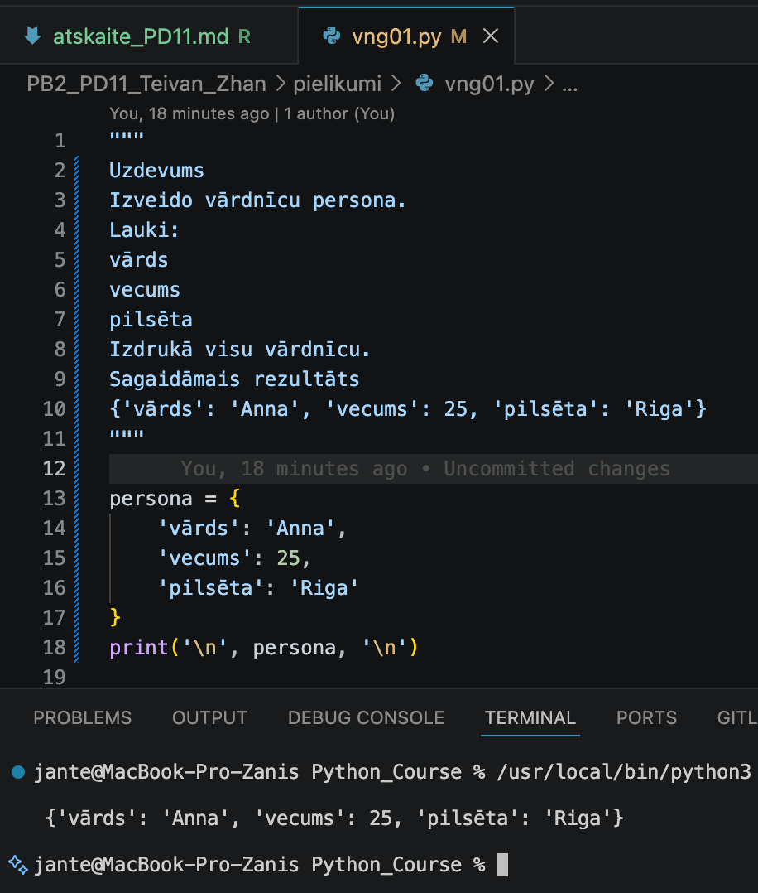

---

## Komentāri / piezīmes

Programmā izveidots vārdnīcas (dictionary) tipa mainīgais persona, kurā dati glabājas 
pāros "atslēga — vērtība" (key-value pair). Funkcija print() izvada vārdnīcu uz termināli.


---

# 🧩 vnginājums 02

## Faila nosaukums

```text id="sdm8v5"
vng02.py
```
---

## Python kods

```python id="mt3k0v"
"""
Uzdevums
No vārdnīcas persona izdrukā:
Sveiks, Anna!
Izmanto tikai:
persona["..."]
"""
persona = {
    'vārds': 'Anna',
    'vecums': 25,
    'pilsēta': 'Riga'
}

vards = persona["vārds"]
print(f"\nSveiks, {vards}!\n")
```
---

## Rezultāts / izvade

Pievieno:

* ekrānuzņēmumu.

Rezultāts

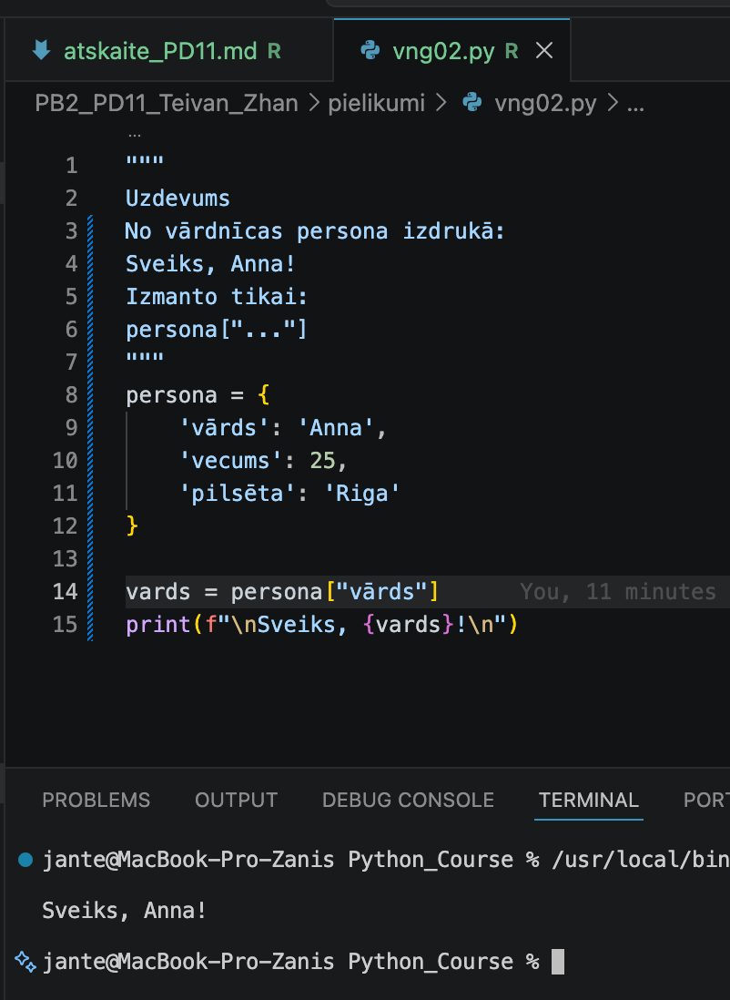

---

## Komentāri / piezīmes

Programmā informācija no vārdnīcas persona tiek iegūta, norādot atbilstošo atslēgu 
kvadrātiekavās [...]. Vērtība tiek saglabāta mainīgajā vards un pēc tam izvadīta terminālī, 
izmantojot f-virkni (f-string).


---

# 🧩 vnginājums 03 

## Faila nosaukums

```text id="sdm8v5"
vng03.py
```
---

## Python kods

```python id="mt3k0v"
"""
Uzdevums
Dots:
persona = {
"vards":"Anna",
"vecums":25
}
Palielini vecumu par 1.
Izdrukā rezultātu.
"""
persona = {
"vards":"Anna",
"vecums":25
}
persona["vecums"] += 1
print('\n', persona, '\n')
```
---

## Rezultāts / izvade

Pievieno:

* ekrānuzņēmumu.

Rezultāts

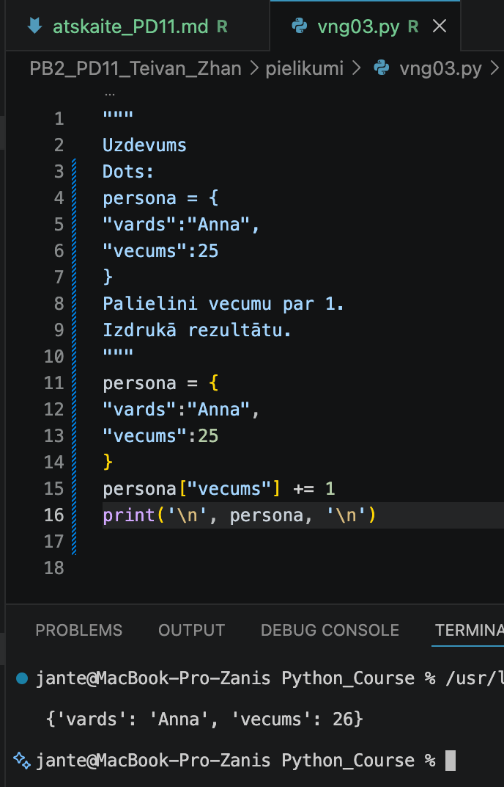

---

## Komentāri / piezīmes

Programmā vecuma vērtība tiek piekļūta, izmantojot atslēgu "vecums", un palielināta par 1 
ar operatoru +=. Funkcija print() izvada atjaunināto vārdnīcu uz termināli.


---

# 🧩 vnginājums 04 

## Faila nosaukums

```text id="sdm8v5"
vng04.py
```
---

## Python kods

```python id="mt3k0v"
"""
Uzdevums
Pievieno:
epasts
Izdrukā pilnu objektu.
"""
persona = {
    'vārds': 'Anna',
    'vecums': 25,
    'pilsēta': 'Riga'
}

persona['epasts'] = 'anna@examp
```
---

## Rezultāts / izvade

Pievieno:

* ekrānuzņēmumu.

Kods ir labots

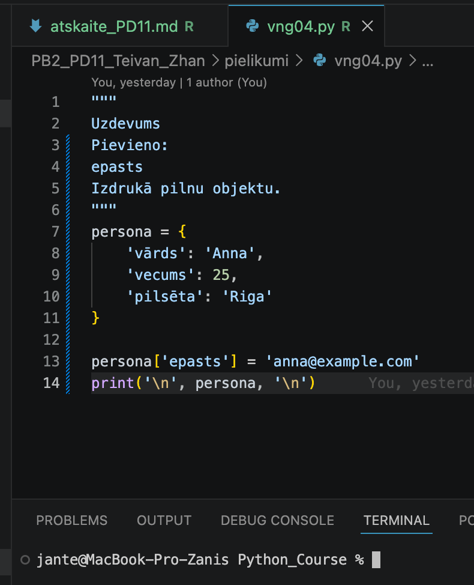

---

## Komentāri / piezīmes

LProgrammā vārdnīcai persona tiek pievienota jauna atslēga 'epasts' ar atbilstošo vērtību, 
izmantojot piešķiršanas operatoru. Funkcija print() izvada vārdnīcu uz termināli.


---

# 🧩 vnginājums 05

## Faila nosaukums

```text id="sdm8v5"
vng05.py
```
---

## Python kods

```python id="mt3k0v"
"""
Uzdevums
Dots kods:
persona = {
"vards":"Neo"
}
print(persona["telefons"])
Izlabo.
Programmai jāizvada:
Telefons nav norādīts
"""

persona = {
"vards":"Neo"
}
print(persona.get("telefons", "\nTelefons nav norādīts\n"))
```
---

## Rezultāts / izvade

Pievieno:

* ekrānuzņēmumu.

Kods ar kļūdu

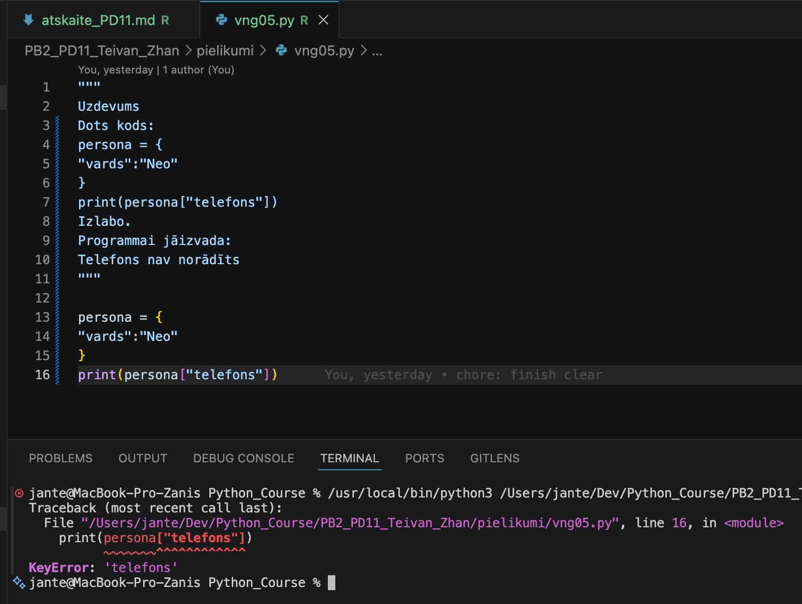

Kods ir labots

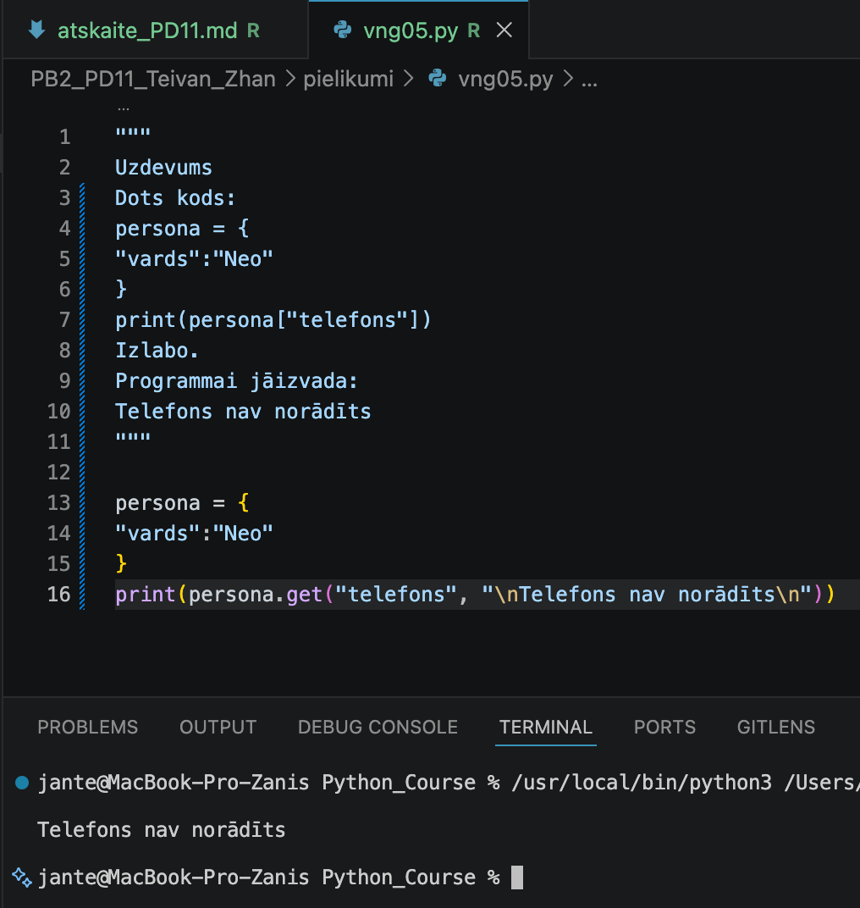

---

## Komentāri / piezīmes

Programmā izmantota vārdnīcas metode .get(), kas ļauj droši piekļūt atslēgai. Ja atslēga 
"telefons" vārdnīcā nepastāv, funkcija izvada norādīto kļūdas ziņojumu, nevis pārtrauc 
programmas darbību ar kļūdu.
 

---

# 🧩 vnginājums 06

# Faila nosaukums

```text id="sdm8v5"
vng06.py
```
---

## Python kods

```python id="mt3k0v"
"""
Uzdevums
Izveido vārdnīcu:
serveris
Lauki:
nosaukums
ip
Mēģini nolasīt:
temperatura
izmantojot get()
"""

serveris = {
    "nosaukums": "Serveris1",
    "ip": "192.168.1.1"
}

# print(serveris["temperatura"])
print(serveris.get("temperatura", "\nTemperatura nav norādīta\n"))
```
---

## Rezultāts / izvade

Pievieno:

* ekrānuzņēmumu.

Kods ar kļūdu

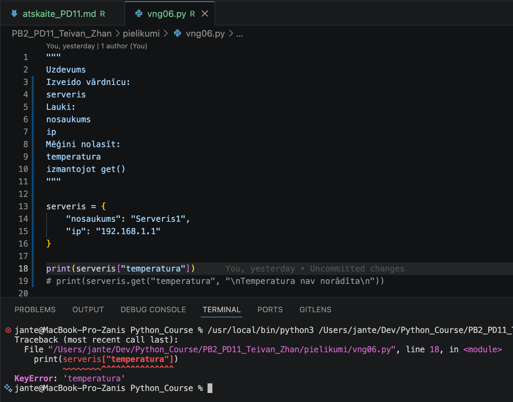

Kods ir labots

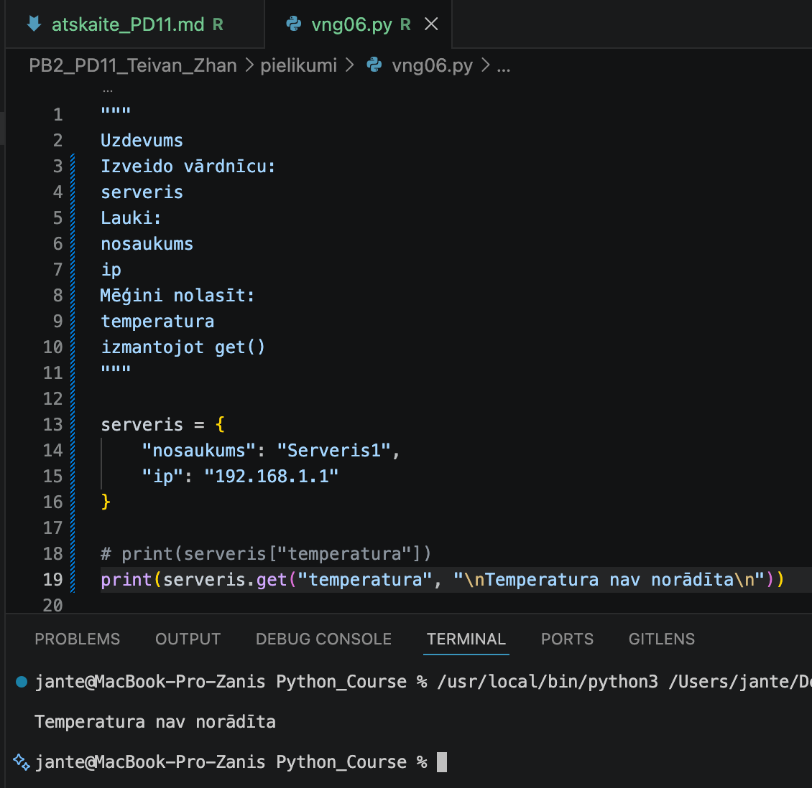

---

## Komentāri / piezīmes

Programmā izmantota vārdnīcas metode .get(), lai mēģinātu nolasīt atslēgu "temperatura". 
Tā kā šī atslēga vārdnīcā nav definēta, funkcija izvada norādīto noklusējuma ziņojumu.
Pretējā gadījumā, mēģinot piekļūt neesošai atslēgai, programma beidzas ar kļūdas 
ziņojumu KeyError: 'temperatura'.


---

# 🧩 vnginājums 07

# Faila nosaukums

```text id="sdm8v5"
vng07.py
```
---

## Python kods

```python id="mt3k0v"
"""
Uzdevums
Izveido:
serveris = {
}
Lauki:
nosaukums
ip
temperatura
statuss
Programma izvada:
Serveris:
...
Ja temperatūra >70:
BRĪDINĀJUMS
"""

serveris = {
    "nosaukums": "Serveris01",
    "ip": "192.168.1.1",
    "temperatura": 70,
    "statuss": "aktīvs"
}
serveris["temperatura"] = int(input("\nIevadi temperatūru: "))
print("\nServeris:\n")
for key, value in serveris.items():
    print(f"  {key}: {value}")
print()
if serveris["temperatura"] > 70:
    print("\nBBRĪDINĀJUMS: temperatūra ir pārāk augsta!\n")
else:
    print("Temperatūra ir normas robežās.\n")    
```
---

## Rezultāts / izvade

Pievieno:

* ekrānuzņēmumu.

Rezultāts

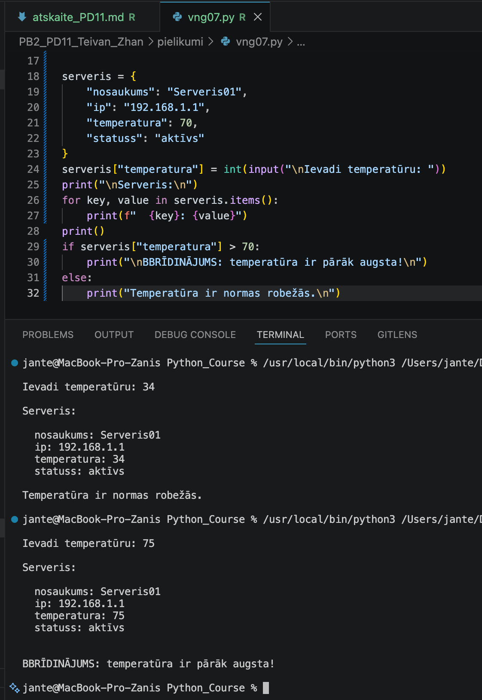

---

## Komentāri / piezīmes

Programmā tiek izmantots for cikls, lai izvadītu visus vārdnīcas datus, un if-else nosacījums, 
lai pārbaudītu servera temperatūru. Ja ievadītā vērtība pārsniedz 70, programma izvada brīdinājumu.

---

# 🧩 vnginājums 08

# Faila nosaukums

```text id="sdm8v5"
vng08.py
```
---

## Python kods

```python id="mt3k0v"
"""
Uzdevums
Izveido:
Pēc tam:
🧩 VNG09 — Artefaktu katalogs
temperatura
statuss
Serveris:
...
BRĪDINĀJUMS
vards
dzivibas
limenis
samazini dzīvības;
palielini līmeni;
izdrukā rezultātu.
"""

games_player = {
    "temperatura": 36.6,
    "statuss": "normāls",
    "vards": "Vilks",
    "dzivibas": 100,
    "limenis": 1,
}

teksts1 = "Spēlētāja statuss spēles sākumā:"
teksts2 = "Spēlētāja statuss spēles beigās:"
print(f"\n{teksts1:<46} {teksts2}\n")
for key, value in games_player.items():
    if key == 'temperatura':
        val2 = round(value + 1.2, 1)
    elif key == 'statuss':
        val2 = 'noguris'
    elif key == 'vards':
        val2 = value
    elif key == 'dzivibas':
        val2 = value - 20
    elif key == 'limenis':
        val2 = value + 1
    else:
        val2 = 0

    print(f"{f'{key}: {value}':<46} {key}: {val2}")
print()  
```
---

## Rezultāts / izvade

Pievieno:

* ekrānuzņēmumu.

Rezultāts

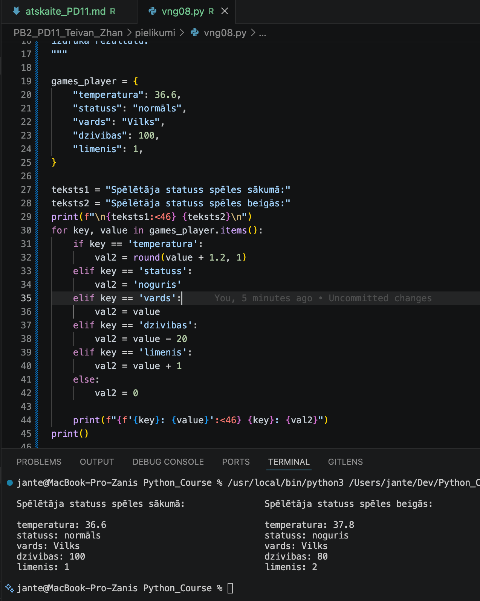

---

## Komentāri / piezīmes

Šī programma demonstrē strukturētu datu apstrādi, izmantojot vārdnīcu un ciklu. Pateicoties 
f-virknēm ar fiksētu platumu (:<46), tiek izveidota tabula ar precīzi izlīdzinātām kolonnām. 
Ar if-elif-else struktūru palīdzību tiek veikta datu transformācija, kur katram vārdnīcas 
atslēgas laukam ir definēti individuāli vērtību maiņas noteikumi. Izmantojot metodi .items(), 
programma var iterēt cauri visiem vārdnīcas elementiem, iepriekš nezinot to skaitu.

---

# 🧩 vnginājums 09

# Faila nosaukums

```text id="sdm8v5"
vng09.py
```
---

## Python kods

```python id="mt3k0v"
"""
Uzdevums
Izveido artefaktu.
Obligāti:
nosaukums
retums
vertiba
Papildini ar vismaz 2 laukiem.
"""

def print_artifact(data):
    print("\nArtefakta dati:")
    for key, value in data.items():
        print(f"  {key.capitalize()}: {value}")
    print()    

artefakts = {
    'nosaukums': 'Zelta Krūze',
    'retums': 'Ļoti reta',
    'vertiba': 1000,
}

print_artifact(artefakts)

artefakts.update({
    'izgatavots': 'Seno laiku meistars',
    'materiāls': 'Zelts',
    'statuss': 'Eksponāts muzejā'
})
print_artifact(artefakts)
```
---

## Rezultāts / izvade

Pievieno:

* ekrānuzņēmumu.

Rezultāts

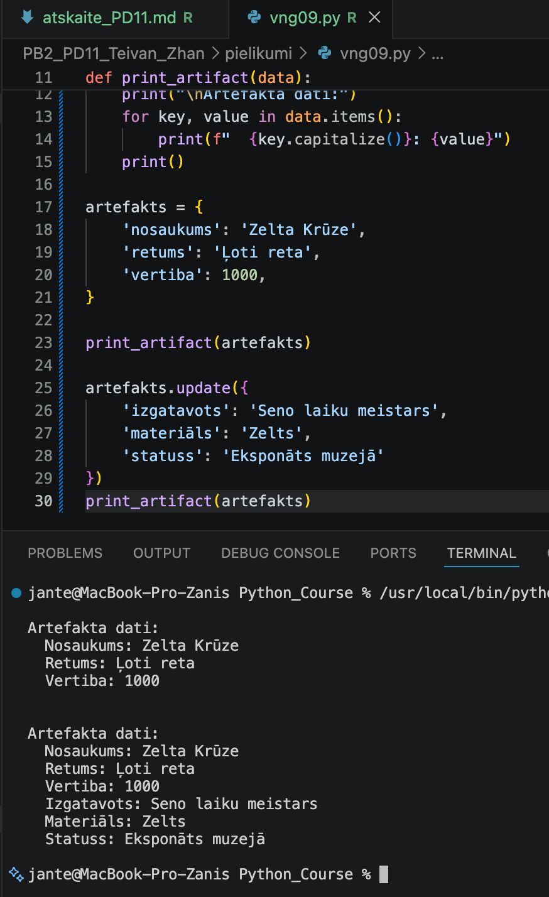

---

## Komentāri / piezīmes

Programma demonstrē strukturētu vārdnīcas izveidi un tās papildināšanu. Funkcija 
print_artifact nodrošina vienotu datu formatējumu un koda atkārtotu izmantojamību. 
Vārdnīca tiek papildināta ar vairākiem laukiem vienlaikus, izmantojot metodi .update(). 
Python metode .capitalize() pārveido virknes pirmo burtu par lielo burtu, bet visus 
pārējos burtus — par mazajiem burtiem.

---

# 🧩 vnginājums 10

# Faila nosaukums

```text id="sdm8v5"
vng10.py
```
---

## Python kods

```python id="mt3k0v"
"""
Uzdevums
Programma:
1. prasa ievadīt vārdu;
2. prasa vecumu;
3. izveido vārdnīcu;
4. pievieno pilsētu;
5. izvada:
Objekts izveidots:
{ ... }
"""

vards = input("\nIevadi vārdu: ")
vecums = int(input("Ievadi vecumu: "))
pilseta = input("Ievadi pilsētu: ")

persona = {
    'vards': vards,
    'vecums': vecums,
    'pilseta': pilseta
}

print(f"\nObjekts izveidots: {persona}\n")
for key, value in persona.items():
    print(f"  {key.capitalize()}: {value}")
print()
```
---

## Rezultāts / izvade

Pievieno:

* ekrānuzņēmumu.

Rezultāts

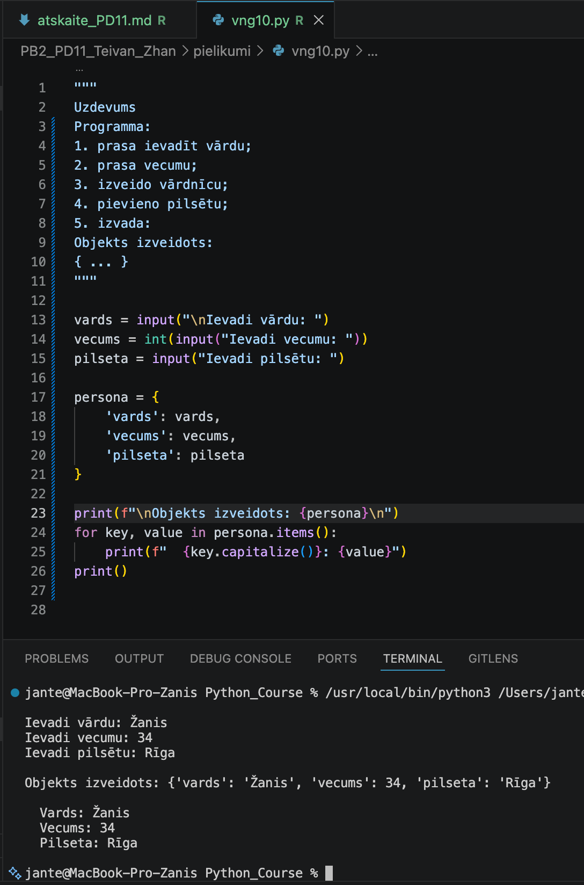

---

## Komentāri / piezīmes

Programma demonstrē lietotāja ievadīto datu saglabāšanu vārdnīcā. Ar for ciklu un items() metodi tiek veikta datu iterācija, izmantojot .capitalize() atslēgu noformēšanai.


---

# 📝 Refleksija — piedzīvojumi un pārdzīvojumi

* Kas jums šodien patika visvairāk?
Visvairāk man patika 9. uzdevums, kur varēja patrenēties mainīt geimera datus un izvadīt tos uz ekrāna.

* Kas bija vissarežģītākais?
Nekas nebija sarežģīts.

* Kādu kļūdu jūs atradāt un izlabojāt?
Es izlaboju kļūdu 5. uzdevumā, kur metode .get ļāva droši apstrādāt pieprasījumu pēc neeksistējošas atslēgas vārdnīcā.

* Kas bija interesants vai smieklīgs?
Viss bija interesanti.

---

# 🎯 Pamatots pašvērtējums (0-100)

| Kritērijs | Punkti | Pamatojums |
| :---      | :---:  | :---       |
| Kods un funkcionalitāte | 60 | Visi uzdevumi ir izpildīti un strādā bez kļūdām. |
| Izpratne un komentāri | 20 | Koda rindas ir nokomentētas, izpratne par tēmu ir pilnīga. |
| Refleksija | 10 | Refleksija ir sniegta godīgi un pilnā apjomā. |
| Noformējums un struktūra | 10 | Visi faili un attēli ir sakārtoti atbilstošajās mapēs. |
| **Kopā** | **100/100** | Viss ir izpildīts precīzi pēc prasībām. |

---

# 📦 Iesniegšana

Pirms iesniegšanas pārbaudi:

* [x] Visi `.py` faili atrodas mapē `Pielikumi`
* [x] Ekrānuzņēmumi ievietoti mapē `atteli`
* [x] Atskaites fails ir aizpildīts
* [x] Programmas darbojas

---

## Arhivēšana

Arhivē visu mapi:

```text id="h1xcm7" 
PB2_PD11_Teivan_Zhan.zip
```