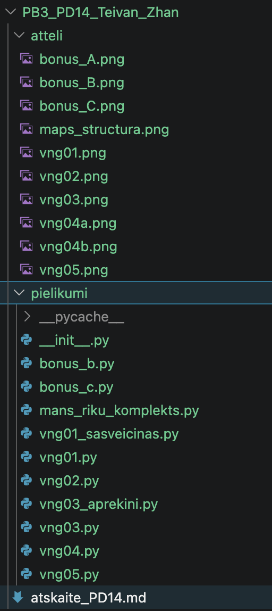
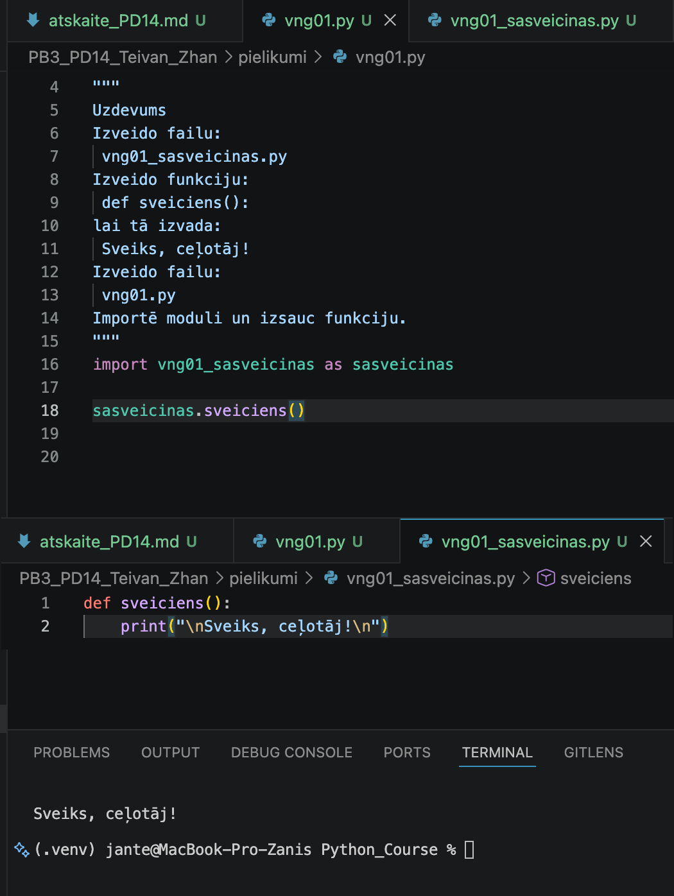
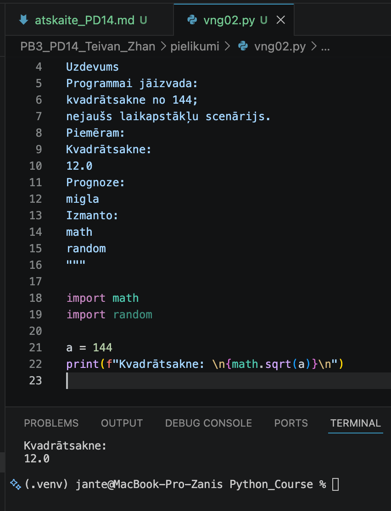
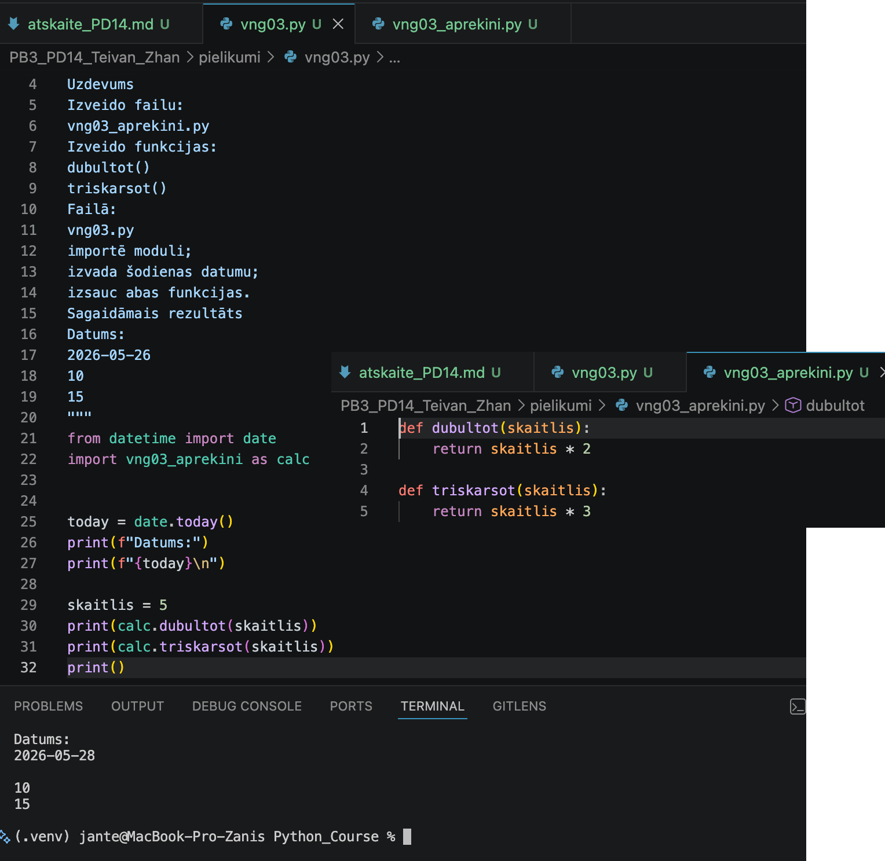
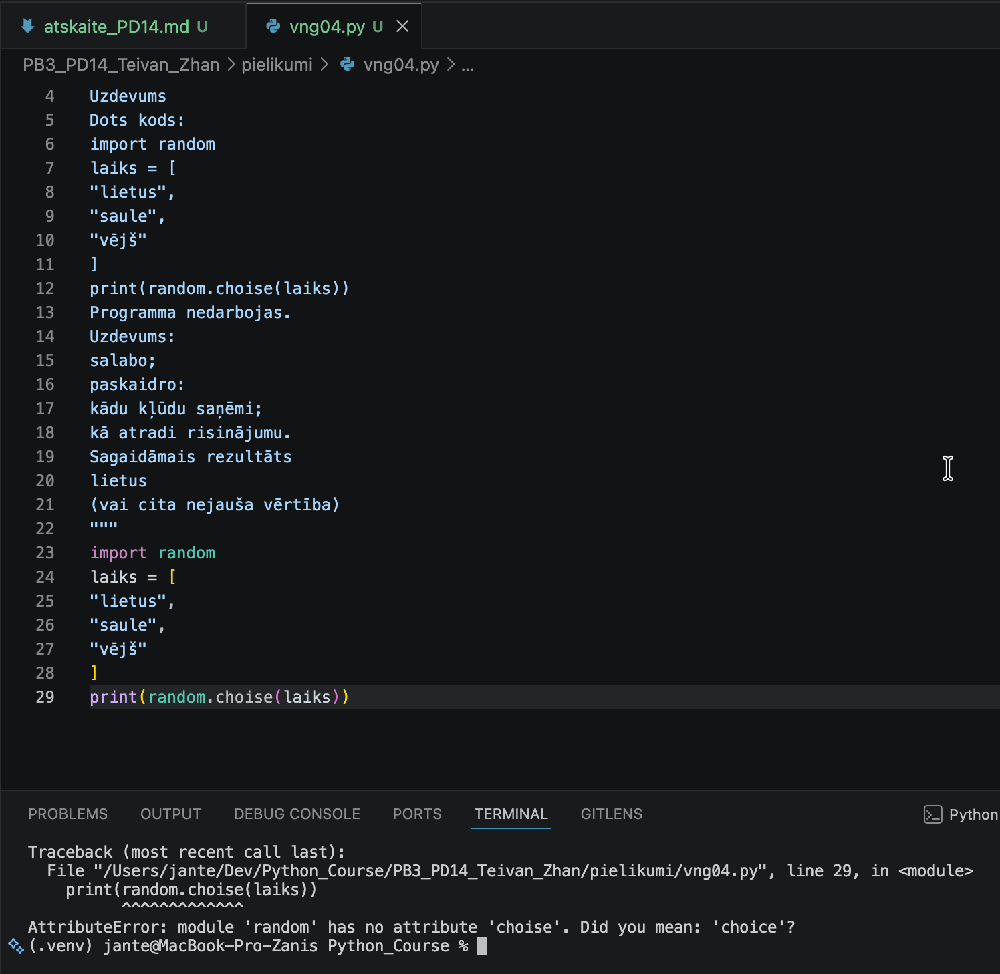
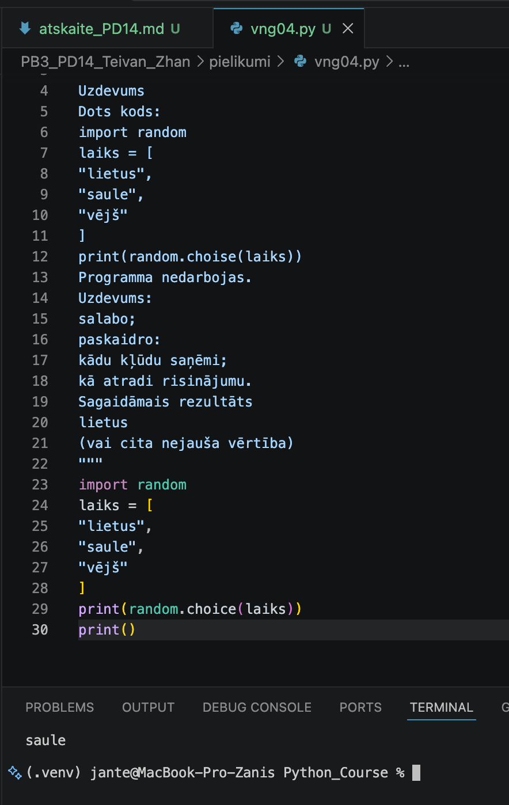
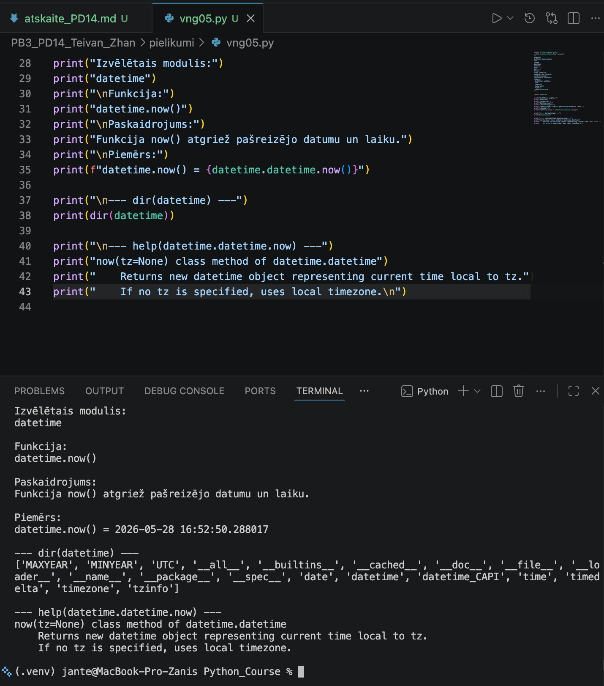
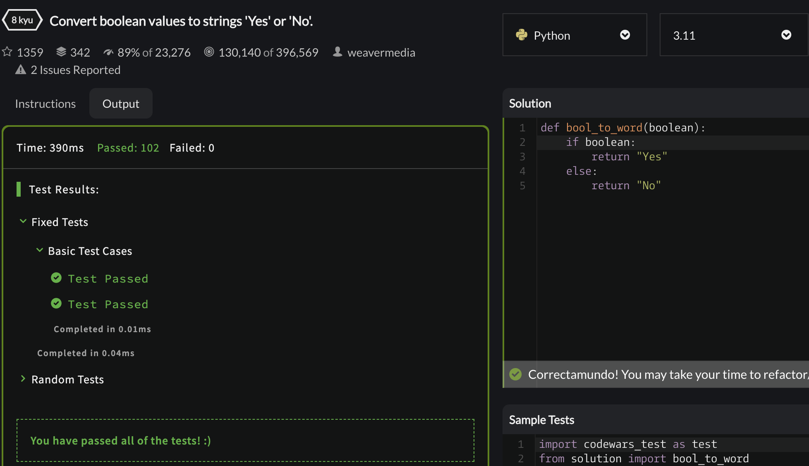
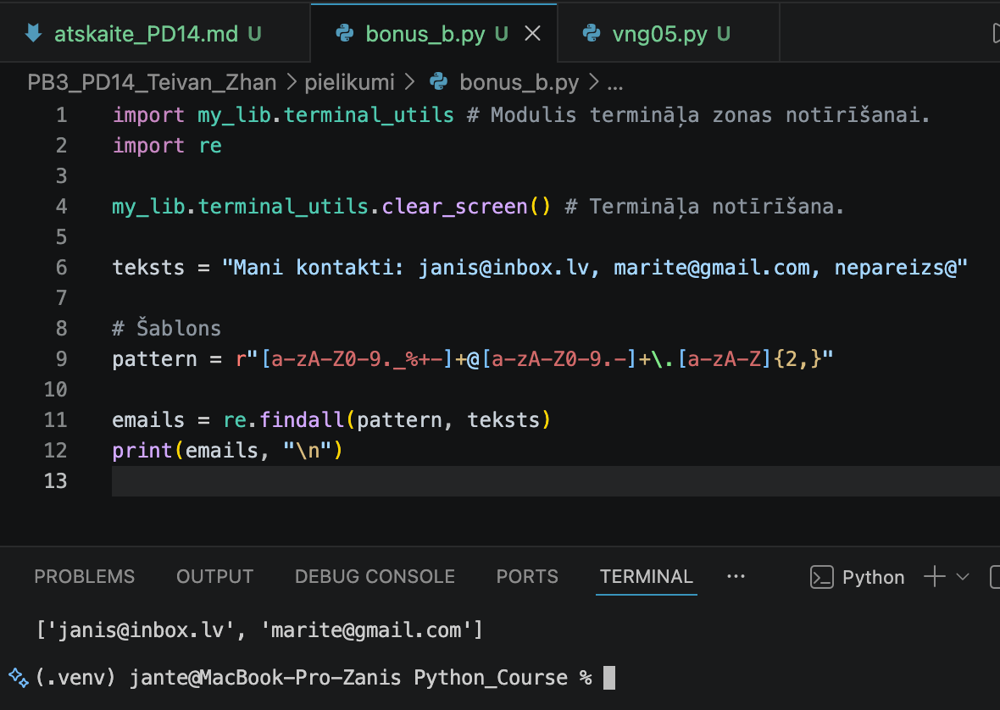
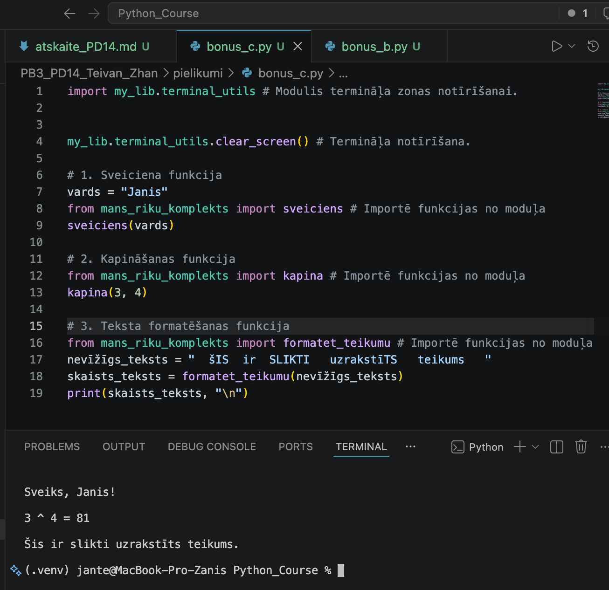

# Praktiskā darba atskaite — PD14

**Tēma:** Moduļi un Python bibliotēkas 
**Vārds, Uzvārds:** Zhan Teivan 
**Datums:** 2026-05-28  
**Grupa:**  Daugavpils_77978_11.05.2026.-05.06.2026


[Mana praktiskā darba mape GitHub platformā](https://github.com/JanTey/Python_Course/blob/main/PB3_PD14_Teivan_Zhan/atskaite_PD14.md)


---
# 📁 0. Sagatavošanās darbi

Pārbaudi, vai sagatavota darba vide:

* [x] Izveidota mape `PB3_PD14_Teivan_Zhan`
* [x] Izveidota apakšmape `pielikumi`
* [x] Izveidota apakšmape `atteli`
* [x] Izveidota atskaite `atskaite_PD14.md`

---

## Mapju struktūra

```text
PB3_PD14_Teivan_Zhan/
├─ Pielikumi/
│  ├─ bonus_b.py
│  ├─ bonus_c.py
│  ├─ mans_riku_komplekts.py
│  ├─ vng01_sasveicinas.py
│  ├─ vng01.py
│  ├─ vng02.py
│  ├─ vng03_aprekini.py
│  ├─ vng03.py
│  ├─ vng04.py
│  └─ vng05.py
├─ atteli/
│  ├─ bonus_A.png
│  ├─ bonus_B.png
│  ├─ bonus_C.png
│  ├─ maps_structure.png
│  ├─ vng01.png
│  ├─ vng02.png
│  ├─ vng03.png
│  ├─ vng04.png
│  └─ vng05.png
└─ atskaite_PD14.md
```

---

## Ekrānuzņēmums

Pievieno ekrānuzņēmumu ar mapes struktūru.

```markdown id="j0m2om"

```


---

# 🧩 vnginājums 01

## Faila nosaukums

```text id="pjlwmj"
vng01.py, vng01_sasveicinas.py
```
---

## Python kods

```python id="p62h2r"
# vng01.py

"""
Uzdevums
Izveido failu:
 vng01_sasveicinas.py
Izveido funkciju:
 def sveiciens():
lai tā izvada:
 Sveiks, ceļotāj!
Izveido failu:
 vng01.py
Importē moduli un izsauc funkciju.
"""
import vng01_sasveicinas as sasveicinas

sasveicinas.sveiciens()

# vng01_sasveicinas.py

def sveiciens():
    print("\nSveiks, ceļotāj!\n")
```

## Rezultāts / izvade

Pievieno:

* ekrānuzņēmumu.

Rezultāts



---

## Komentāri / piezīmes

Uzdevuma ietvaros ir realizēta modulāra pieeja: atsevišķā modulī vng01_sasveicinas.py 
ir izveidota funkcija sveiciens(), kas izvada sveiciena ziņojumu. Galvenajā failā 
vng01.py šis modulis tiek importēts ar aizstājvārdu (pseidonīmu) sasveicinas, pēc kā 
tiek izsaukta mērķa funkcija, lai parādītu rezultātu konsolē.


---

# 🧩 vnginājums 02

## Faila nosaukums

```text id="sdm8v5"
vng02.py
```
---

## Python kods

```python id="mt3k0v"
"""
Uzdevums
Programmai jāizvada:
kvadrātsakne no 144;
nejaušs laikapstākļu scenārijs.
Piemēram:
Kvadrātsakne:
12.0
Prognoze:
migla
Izmanto:
math
random
"""

import math
import random

a = random.randint(1, 200)
print(f"Kvadrātsakne: \n{math.sqrt(a)}\n")
```
---

## Rezultāts / izvade

Pievieno:

* ekrānuzņēmumu.

Rezultāts



---

## Komentāri / piezīmes

Programma ģenerē nejaušu veselu skaitli a diapazonā no 1 līdz 200, izmantojot 
metodi random.randint(). Pēc tam tā aprēķina šī skaitļa kvadrātsakni ar 
math.sqrt() un izvada iegūto rezultātu (skaitli ar peldošo komatu) konsolē.


---

# 🧩 vnginājums 03 

## Faila nosaukums

```text id="sdm8v5"
vng03.py, vng03_aprekini.py
```
---

## Python kods

```python id="mt3k0v"
# vng03.py

"""
Uzdevums
Izveido failu:
vng03_aprekini.py
Izveido funkcijas:
dubultot()
triskarsot()
Failā:
vng03.py
importē moduli;
izvada šodienas datumu;
izsauc abas funkcijas.
Sagaidāmais rezultāts
Datums:
2026-05-26
10
15
"""
from datetime import date
import vng03_aprekini as calc

today = date.today()
print(f"Datums:")
print(f"{today}\n")

skaitlis = 5
print(calc.dubultot(skaitlis))
print(calc.triskarsot(skaitlis))
print()

# vng03_aprekini.py

def dubultot(skaitlis):
    return skaitlis * 2

def triskarsot(skaitlis):
    return skaitlis * 3
```
---

## Rezultāts / izvade

Pievieno:

* ekrānuzņēmumu.

Rezultāts



---

## Komentāri / piezīmes

Šī programma demonstrē moduļu izmantošanu Python valodā. Failā vng03_aprekini.py 
ir definētas divas funkcijas: dubultot() un triskarsot(), kuras veic matemātiskās 
reizināšanas operācijas ar 2 un 3. Galvenais skripts vng03.py importē šīs funkcijas, 
izvada pašreizējo datumu, izmantojot datetime moduli, un izsauc abas funkcijas, lai 
veiktu aprēķinus ar noteiktu skaitli.

---

# 🧩 vnginājums 04 

## Faila nosaukums

```text id="sdm8v5"
vng04.py
```
---

## Python kods

```python id="mt3k0v"
"""
Uzdevums
Dots kods:
import random
laiks = [
"lietus",
"saule",
"vējš"
]
print(random.choise(laiks))
Programma nedarbojas.
Uzdevums:
salabo;
paskaidro:
kādu kļūdu saņēmi;
kā atradi risinājumu.
Sagaidāmais rezultāts
lietus
(vai cita nejauša vērtība)
"""
import random
laiks = [
"lietus",
"saule",
"vējš"
]
# print(random.choise(laiks))
print(random.choice(laiks))
print()
```
---

## Rezultāts / izvade

Pievieno:

* ekrānuzņēmumu.

Kods ar kļūdu



Kods ir labots



---

## Komentāri / piezīmes

Programmas palaišanas laikā radās kļūda AttributeError: module 'random' has 
no attribute 'choise'. Koda redaktors (IDE) norādīja uz drukas kļūdu metodes 
nosaukumā. Pēc choise aizstāšanas ar choice programma sāka darboties pareizi.


---

# 🧩 vnginājums 05

## Faila nosaukums

```text id="sdm8v5"
vng05.py
```
---

## Python kods

```python id="mt3k0v"
"""
Uzdevums
Izvēlies vienu moduli:
math
random
datetime
Izmanto:
help(...)
dir(...)
Atrodi:
vienu funkciju;
paskaidro ko tā dara;
uzraksti piemēru.
Sagaidāmais rezultāts
Piemērs:
 Izvēlētais modulis:
 math
 Funkcija:
 factorial()
 Piemērs:
 factorial(5)=120
"""

import datetime

print("Izvēlētais modulis:")
print("datetime")
print("\nFunkcija:")
print("datetime.now()")
print("\nPaskaidrojums:")
print("Funkcija now() atgriež pašreizējo datumu un laiku.")
print("\nPiemērs:")
print(f"datetime.now() = {datetime.datetime.now()}")

print("\n--- dir(datetime) ---")
print(dir(datetime))

print("\n--- help(datetime.datetime.now) ---")
print("now(tz=None) class method of datetime.datetime")
print("    Returns new datetime object representing current time local to tz.")
print("    If no tz is specified, uses local timezone.\n")

```
---

## Rezultāts / izvade

Pievieno:

* ekrānuzņēmumu.

Rezultāts



---

## Komentāri / piezīmes

Šī programma demonstrē darbu ar datetime moduli Python.
Izmantojot funkciju dir(), tiek izvadīts visu pieejamo atribūtu 
un metožu saraksts datetime modulī.
Izmantojot funkciju help(), tiek izvadīta dokumentācija par funkciju datetime.now().
Funkcija datetime.now() tiek izmantota, lai iegūtu pašreizējo datumu 
un laiku lietotāja datorā.
 
---

# 🧩 Bonus A

## Python kods

```python id="mt3k0v"
"""
Uzdevums
Convert boolean values to strings 'Yes' or 'No'.
Complete the method that takes a boolean value and 
return a "Yes" string for true, or a "No" string for false.
"""
def bool_to_word(boolean):
    if boolean:
        return "Yes"
    return "No"
```
---

## Rezultāts / izvade

Pievieno:

* ekrānuzņēmumu.

Rezultāts



---

## Komentāri / piezīmes

"Convert boolean values to strings 'Yes' or 'No'".

Šajā uzdevumā bija jāuzraksta funkcija, kas saņem Būla vērtību (True vai False) un atgriež virkni "Yes", ja vērtība ir True, vai virkni "No", ja vērtība ir False. Es izmantoju nosacījuma operatoru if, kas pārbauda argumenta vērtību un atgriež atbilstošo virkni.


---

# 🧩 Bonus B

# Faila nosaukums

```text id="sdm8v5"
bonus_b.py, mans_riku_komplekts.py
```
---

## Python kods

```python id="mt3k0v"
import my_lib.terminal_utils # Modulis termināļa zonas notīrīšanai.
import re

my_lib.terminal_utils.clear_screen() # Termināļa notīrīšana.

teksts = "Mani kontakti: janis@inbox.lv, marite@gmail.com, nepareizs@"

# Šablons
pattern = r"[a-zA-Z0-9._%+-]+@[a-zA-Z0-9.-]+\.[a-zA-Z]{2,}"

emails = re.findall(pattern, teksts)
print(emails, "\n") 
```
---

## Rezultāts / izvade

Pievieno:

* ekrānuzņēmumu.

Rezultāts



---

## Komentāri / piezīmes

Šī programma demonstrē re moduļa (regulāro izteiksmi) izmantošanu Python, 
lai tekstā atrastu e-pasta adreses.
Programmā ir teksta rinda ar vairākiem kontaktiem, starp kuriem ir 
korektas e-pasta adreses un viena kļūdaina (bez domēna).
Izmantojot regulāro izteiksmi (rakstu), programma atrod un izgūst 
visas e-pasta adreses, kas atbilst standarta formātam.
Funkcija re.findall() atgriež atrasto e-pasta adrešu sarakstu, 
kas tiek izvadīts uz ekrāna.

---

# 🧩 Bonus C

# Faila nosaukums

```text id="sdm8v5"
bonus_c.py, mans_riku_komplekts.py
```
---

## Python kods

```python id="mt3k0v"

# bonus_c.py

import my_lib.terminal_utils # Modulis termināļa zonas notīrīšanai.


my_lib.terminal_utils.clear_screen() # Termināļa notīrīšana.

# 1. Sveiciena funkcija
vards = "Janis"
from mans_riku_komplekts import sveiciens # Importē funkcijas no moduļa
sveiciens(vards)

# 2. Kapināšanas funkcija
from mans_riku_komplekts import kapina # Importē funkcijas no moduļa
kapina(3, 4)

# 3. Teksta formatēšanas funkcija
from mans_riku_komplekts import formatet_teikumu # Importē funkcijas no moduļa
nevīžīgs_teksts = "  šIS  ir  SLIKTI   uzrakstīTS   teikums   "
skaists_teksts = formatet_teikumu(nevīžīgs_teksts)
print(skaists_teksts, "\n")

# mans_riku_komplekts.py

import re

def sveiciens(name):
    print(f"\nSveiks, {name}!\n")

def kapina(skaitlis, pakape):
    """Funkcija paaugstina skaitli dotajā pakāpē"""
    rezultats = skaitlis ** pakape
    print(f"{skaitlis} ^ {pakape} = {rezultats}\n")
    return rezultats

def formatet_teikumu(teksts):
    """
    Funkcija formatē tekstu kā pareizu teikumu:
    - likvidē liekos (dubultos un vairāk) atstarpes
    - sākumu ar lielo burtu
    - beigās pieliek punktu, ja tā nav
    """
    # 1. Likvidē liekās atstarpes (vairākus atstarpju simbolus aizstāj ar vienu)
    teksts = re.sub(r'\s+', ' ', teksts)
    
    # 2. Noņem atstarpes sākumā un beigās
    teksts = teksts.strip()
    
    # 3. Pārveido pirmo burtu par lielo, pārējos par mazajiem
    if len(teksts) > 0:
        teksts = teksts[0].upper() + teksts[1:].lower()
    
    # 4. Pārliecinās, ka beigās ir punkts
    if not teksts.endswith('.'):
        teksts += '.'
    
    return teksts

```
---

## Rezultāts / izvade

Pievieno:

* ekrānuzņēmumu.

Rezultāts



---

## Komentāri / piezīmes

Šī programma demonstrē lietotāja moduļa mans_riku_komplekts darbību,
kurā ir trīs noderīgas funkcijas.

Pirms pamatdarbību veikšanas programma notīra termināļa ekrānu,
izmantojot my_lib.terminal_utils moduli.

Tad programma importē un secīgi izsauc trīs funkcijas:

1. Funkcija sveiciens() saņem vārdu "Janis" un izvada sveicienu uz ekrāna.

2. Funkcija kapina() paaugstina skaitli 3 pakāpē 4 (3^4 = 81) un izvada rezultātu.

3. Funkcija formatet_teikumu() apstrādā nevīžīgi uzrakstītu tekstu:
   - noņem liekos atstarpes
   - pirmo burtu pārvērš par lielo, pārējos par mazajiem
   - pieliek punktu teikuma beigās

Programmas rezultāts: uz ekrāna secīgi tiek izvadīts sveiciens,
kāpināšanas rezultāts un formatēts teikums.

---

# 📝 Refleksija — piedzīvojumi un pārdzīvojumi

* Kas jums šodien visvairāk patika?
Man šodien viss patika - ļoti maigs ievads moduļu un ārējo bibliotēku izmantošanā.

* Kas bija visgrūtākais?
Grūtības tikai informācijas apjomā - daudz bibliotēku un funkciju.

* Kādu kļūdu atradāt un izlabojāt?
Es izlaboju kļūdu 4. uzdevumā, kur programma beidzās ar AttributeError kļūdu.

* Kas bija interesanti vai smieklīgi?
Viss bija interesanti.

---

# 🎯 Pamatots pašvērtējums (0-100)

| Kritērijs | Punkti | Pamatojums |
| :---      | :---:  | :---       |
| Kods un funkcionalitāte | 60 | Visi uzdevumi ir izpildīti un strādā bez kļūdām. |
| Izpratne un komentāri | 20 | Koda rindas ir nokomentētas, izpratne par tēmu ir pilnīga. |
| Refleksija | 10 | Refleksija ir sniegta godīgi un pilnā apjomā. |
| Noformējums un struktūra | 10 | Visi faili un attēli ir sakārtoti atbilstošajās mapēs. |
| **Kopā** | **100/100** | Viss ir izpildīts precīzi pēc prasībām. |

---

# 📦 Iesniegšana

Pirms iesniegšanas pārbaudi:

* [x] Visi `.py` faili atrodas mapē `Pielikumi`
* [x] Ekrānuzņēmumi ievietoti mapē `atteli`
* [x] Atskaites fails ir aizpildīts
* [x] Programmas darbojas

---

## Arhivēšana

Arhivē visu mapi:

```text id="h1xcm7" 
PB3_PD14_Teivan_Zhan.zip
```