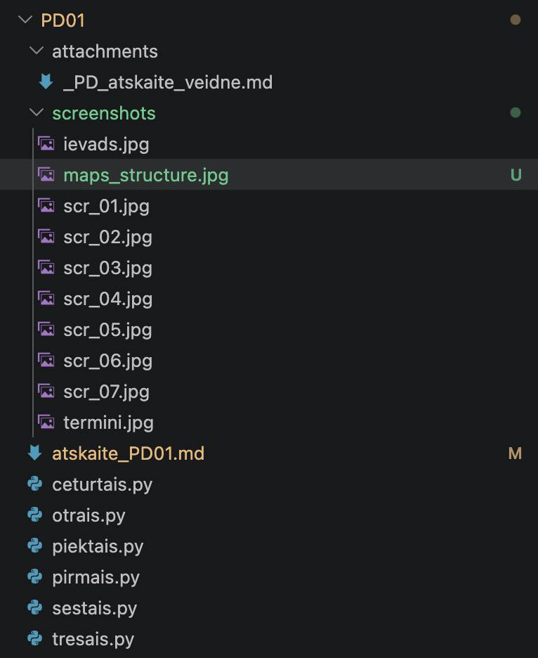
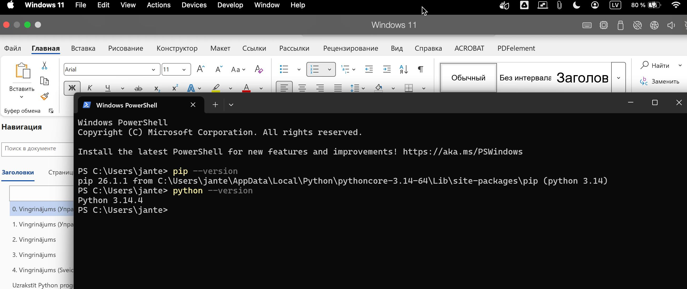
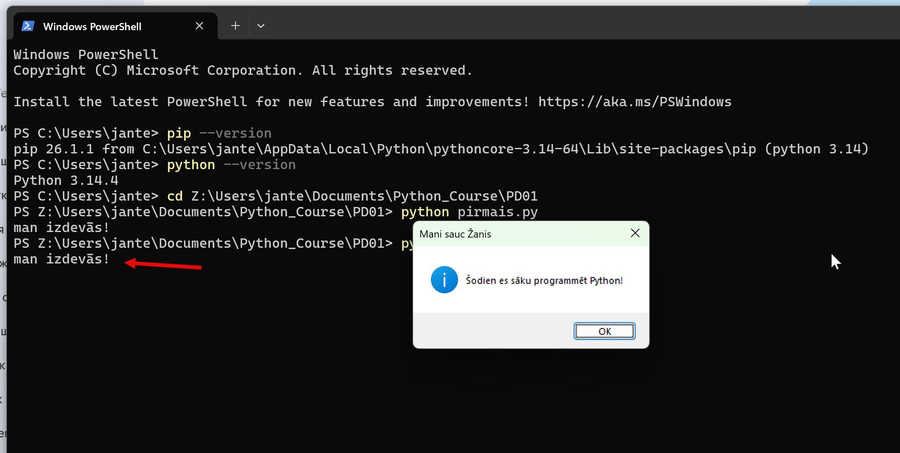
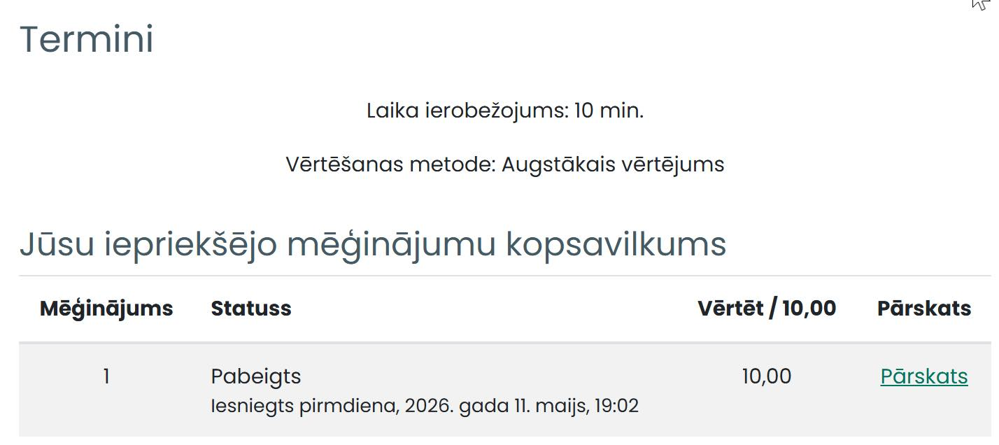
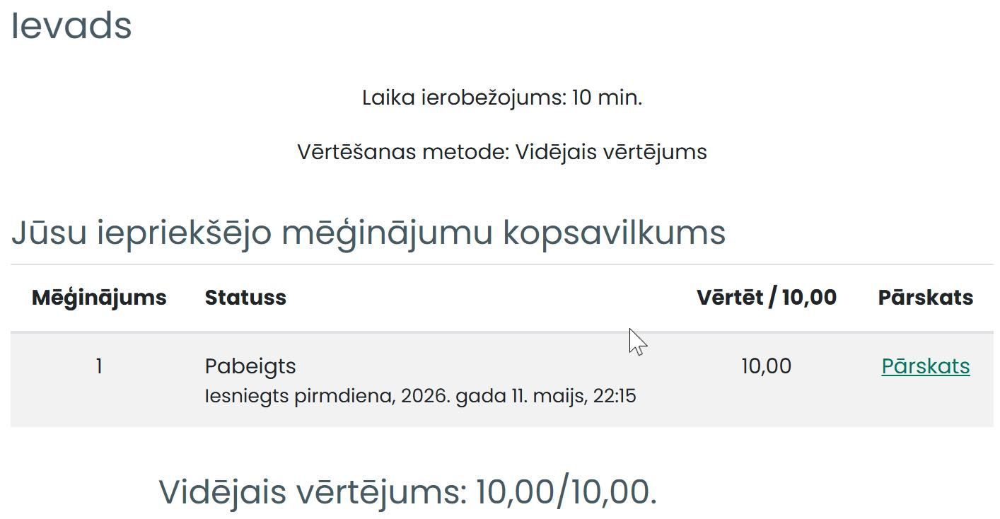
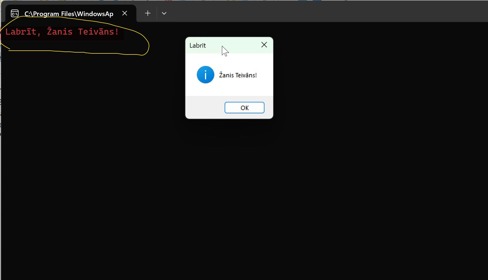
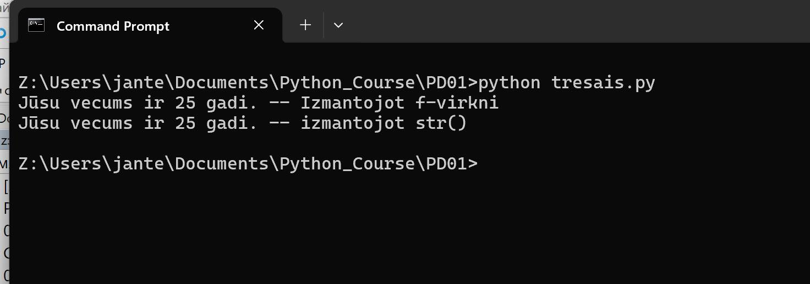
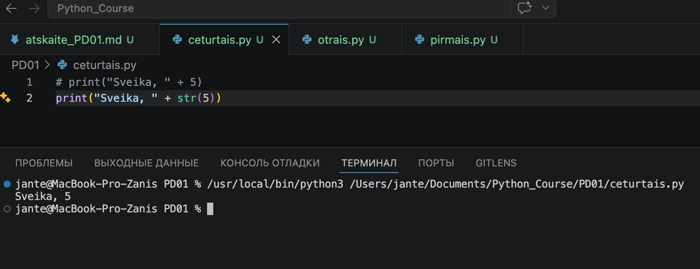
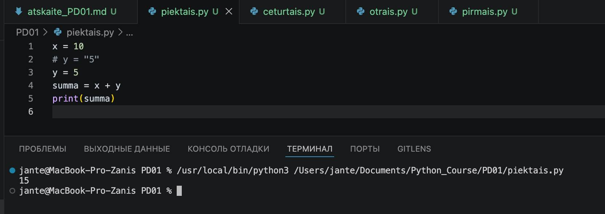
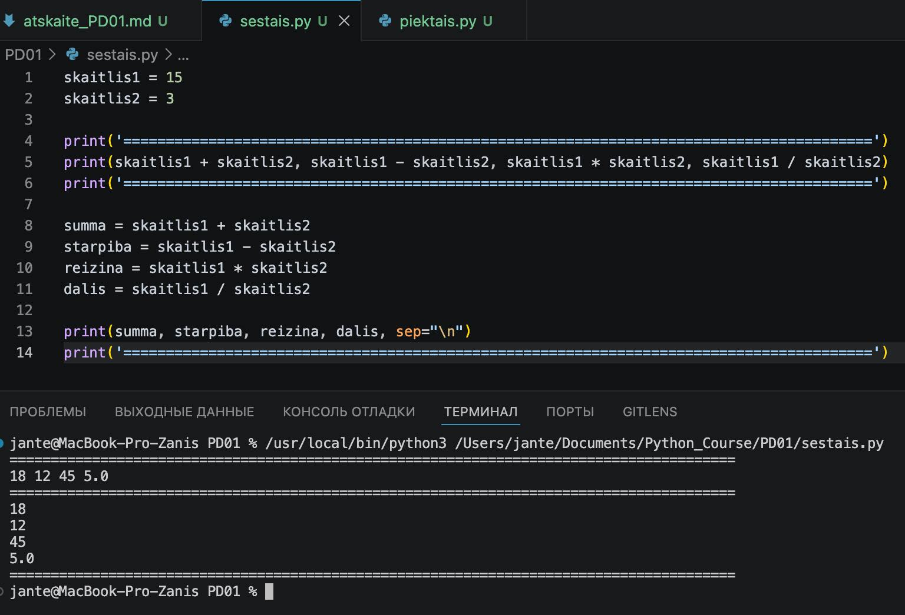

# Praktiskā darba atskaite — PD01

**Tēma:** Python pamati  
**Vārds, Uzvārds:** Zhan Teivan 
**Datums:** 2026-05-12  
**Grupa:**  DAAVP_Daugavpils_80


[Mana praktiskā darba mape GitHub platformā](https://github.com/JanTey/Python_Course/tree/main/PD01)

---
# 📁 0. Sagatavošanās darbi

Pārbaudi, vai sagatavota darba vide:

* [ ] Izveidota mape `PD01`
* [ ] Izveidota apakšmape `pielikumi`
* [ ] Izveidota apakšmape `atteli`
* [ ] Izveidots fails `atskaite_PD01.md`

---

## Mapju struktūra

```text
PD01/
├─ attachments/
│  └─ _PD_atskaite_veidne.md
├─ screenshots/
│  ├─ ievads.jpg
│  ├─ maps_structure.jpg
│  ├─ scr_01.jpg
│  ├─ scr_02.jpg
│  ├─ scr_03.jpg
│  ├─ scr_04.jpg
│  ├─ scr_05.jpg
│  ├─ scr_06.jpg
│  ├─ scr_07.jpg
│  └─ termini.jpg
├─ atskaite_PD01.md
├─ ceturtais.py
├─ otrais.py
├─ piektais.py
├─ pirmais.py
├─ sestais.py
└─ tresais.py
````

---

## Ekrānuzņēmums

Pievieno ekrānuzņēmumu ar mapes struktūru.

```markdown id="j0m2om"
[Mapes struktūra](screenshots/maps_structure.jpg)
```


---

# 🧩 Vingrinājums 01

## Uzdevums

```text id="pjlwmj"
Python uzstādīšana Windows virtuālajā vidē operētājsistēmā macOS un uzstādītās versijas pārbaude.
```
---

## Terminālī izpildītās komandas


| Komanda | Apraksts |
| :--- | :--- |
| `pip --version` | Pārbauda Python pakotņu pārvaldnieka (pip) versiju un tā atrašanās vietu sistēmā |
| `python --version` | Pārbauda uzstādīto Python interpretatora versiju, lai pārliecinātos par veiksmīgu instalāciju |

---

## Rezultāts / izvade

Pievieno:

* ekrānuzņēmumu.

```markdown id="k9m4me"

```


---

## Komentāri / piezīmes

Python uzstādīšana neradīja nekādas grūtības, un viss izdevās ar pirmo reizi.

---

# 🧩 Vingrinājums 02

## Uzdevums

```text id="pjlwmj"
 1. Izveidot jaunu Python programmas failu: pirmais.py.

 2. Ierakstīt tajā tekstu: print("man izdevās!").

 3. Palaist programmas izpildi no komandrindas.
```
---
## Faila nosaukums

```text id="sdm8v5"
otrais.py
```
---

## Python kods

```python id="mt3k0v"
import tkinter as tk
from tkinter import messagebox
'=================================================================='
print("man izdevās!")
'=================================================================='
# Paslēpjam galveno tukšo logu (Прячем основное окно)
root = tk.Tk()
root.withdraw()

messagebox.showinfo("Mani sauc Žanis", "Šodien es sāku programmēt Python!")

root.destroy()
```
---

## Rezultāts / izvade

Pievieno:

* ekrānuzņēmumu.

```markdown id="k9m4me"

```


---

## Komentāri / piezīmes

Lai padarītu darbu interesantāku, es papildināju kodu ar grafiskā lietotāja saskarnes (GUI) elementiem, izmantojot tkinter bibliotēku.

Veiktās darbības:

* Tika importēta tkinter.messagebox modulārie elementi.

* Programma ne tikai izvada tekstu terminālī, bet arī atver uznirstošo logu (Message Box) ar virsrakstu "Mani sauc Žanis" un paziņojumu: "Šodien es sāku programmēt Python!".

* Izmantota funkcija root.withdraw(), lai paslēptu galveno tukšo programmas logu un parādītu tikai pašu ziņojumu.

---

# 🧩 Vingrinājums 03

## Uzdevums

```text id="pjlwmj"
Vairākas reizes pildīt testus (līdz sekmīgi): 
● Ievads
● vienkāršie datu tipi

Par mācību materiāla apguves rezultātu var uzskatīt izpildītos testus par tēmām "Termini" un "Ievads
```

## Rezultāts / izvade

Pievieno:

* ekrānuzņēmumu.

```markdown id="k9m4me"

```

```markdown id="k9m4me"

```

---

## Komentāri / piezīmes

Ļoti baidījos neiziet testus, bet, par laimi, tiku galā ar pirmo reizi. Tas man deva nedaudz vairāk pašpārliecinātības.

---

# 🧩 Vingrinājums 04 

## Uzdevums

```text id="pjlwmj"
Uzrakstīt Python programmu (otrais.py), kas izvada sveicienu "Labrīt, [vards] [uzvards]!"
```
---
## Faila nosaukums

```text id="sdm8v5"
otrais.py
```
---

## Python kods

```python id="mt3k0v"
import tkinter as tk
from tkinter import messagebox

vards = "Žanis"
uzvards = "Teivāns"
print(f"Labrīt, {vards} {uzvards}!")

# Paslēpjam galveno tukšo logu (Прячем основное окно)
root = tk.Tk()
root.withdraw()

messagebox.showinfo(f"Labrīt", f"{vards} {uzvards}!")

root.destroy()
```
---

## Rezultāts / izvade

Pievieno:

* ekrānuzņēmumu.

```markdown id="k9m4me"

```


---

## Komentāri / piezīmes

Lai padarītu darbu interesantāku, es papildināju kodu ar grafiskā lietotāja saskarnes (GUI) elementiem, izmantojot tkinter bibliotēku.

Veiktās darbības:

* Tika importēta tkinter.messagebox modulārie elementi.

* Programma ne tikai izvada tekstu terminālī, bet arī atver uznirstošo logu (Message Box) ar virsrakstu "Labrīt" un paziņojumu: "Žanis Teivāns!".

* Izmantota funkcija root.withdraw(), lai paslēptu galveno tukšo programmas logu un parādītu tikai pašu ziņojumu.

---

# 🧩 Vingrinājums 05 

## Uzdevums

```text id="pjlwmj"
Nosakiet, kāds ir katra no sekojošo mainīgo datu tips:
x = 5
y = 3.14
z = "Sveika, pasaule!"
a = True
```
---

## Rezultāts / izvade

x = 5: *int (vesels skaitlis).*   

y = 3.14: *"float (daļskaitlis jeb peldošā komata skaitlis).*   

z = "Sveika, pasaule!": *str (teksta virkne).*   

a = True: *bool (loģiskais tip).*

---

## Komentāri / piezīmes

Protams, datu tipi ir jāzina, taču vēl lietderīgāk ir strādāt ar tiem tieši kodā.

---

# 🧩 Vingrinājums 06 

## Uzdevums

```text id="pjlwmj"
Uzrakstīt Python programmu (tresais.py), kurā definēts mainīgais vecums ar vērtību, piemēram, 25. Pēc tam pārveidojiet to par teksta virkni, lai izvadītu teikumu "Jūsu vecums ir [vecums] gadi."
```
---
## Faila nosaukums

```text id="sdm8v5"
tresais.py
```
---

## Python kods

```python id="mt3k0v"
# Definējam mainīgo vecums ar vērtību 25
vecums = 25

# 1. veids: Izmantojot f-virkni 

print(f"Jūsu vecums ir {vecums} gadi. -- Izmantojot f-virkni")


""" 
    2. veids: Eksplicīta tipa pārveidošana, izmantojot str()
    Tas ir tieši tas, kas domāts ar "pārveidojiet to par teksta virkni"
"""

vecums_teksts = str(vecums)
print("Jūsu vecums ir " + vecums_teksts + " gadi. -- izmantojot str()")
```
---

## Rezultāts / izvade

Pievieno:

* ekrānuzņēmumu.

```markdown id="k9m4me"

```


---

## Komentāri / piezīmes

Datu tipu pārveidošana ir būtisks uzdevums. Ir lietderīgi ar tiem strādāt praktiski, rakstot kodu.

---

# 🧩 Vingrinājums 07 

## Uzdevums

```text id="pjlwmj"
Sekojošajā kodā ir kļūda. Atrodiet un izlabojiet to, lai programma darbotos pareizi:
print("Sveika, " + 5)
```
---
## Faila nosaukums

```text id="sdm8v5"
ceturtais.py
```
---

## Python kods

```python id="mt3k0v"
# print("Sveika, " + 5)
print("Sveika, " + str(5))
```
---

## Rezultāts / izvade

Pievieno:

* ekrānuzņēmumu.

```markdown id="k9m4me"

```


---

## Komentāri / piezīmes

Koda labošanas variantu ir daudz, bet šeit, manuprāt, problēma ir datu tipu nesaderībā.

---

# 🧩 Vingrinājums 08 

## Uzdevums

```text id="pjlwmj"
Sekojošajā kodā ir kļūda. Atrodiet un izlabojiet to, lai programma darbotos pareizi:
x = 10
y = "5"
summa = x + y
print(summa)
```
---
## Faila nosaukums

```text id="sdm8v5"
piektais.py
```
---

## Python kods

```python id="mt3k0v"
x = 10
# y = "5"
y = 5
summa = x + y
print(summa)
```
---

## Rezultāts / izvade

Pievieno:

* ekrānuzņēmumu.

```markdown id="k9m4me"

```


---

## Komentāri / piezīmes

Šeit ir acīmredzama problēma ar datu tipu nesaderību saskaitīšanas operācijas veikšanai.

---

# 🧩 Vingrinājums 09 

## Uzdevums

```text id="pjlwmj"
Uzrakstīt Python programmu (sestais.py), kur definēti divi mainīgie skaitlis1 un skaitlis2 ar vērtībām, piemēram, 15 un 3. Pēc tam uzrakstīt Python kodu, kas izvada to summu, starpību, reizinājumu un dalījumu.
```
---
## Faila nosaukums

```text id="sdm8v5"
piektais.py
```
---

## Python kods

```python id="mt3k0v"
skaitlis1 = 15
skaitlis2 = 3

print('========================================================================================')
print(skaitlis1 + skaitlis2, skaitlis1 - skaitlis2, skaitlis1 * skaitlis2, skaitlis1 / skaitlis2)
print('========================================================================================')

summa = skaitlis1 + skaitlis2
starpiba = skaitlis1 - skaitlis2
reizina = skaitlis1 * skaitlis2
dalis = skaitlis1 / skaitlis2

print(summa, starpiba, reizina, dalis, sep="\n")
print('========================================================================================')
```
---

## Rezultāts / izvade

Pievieno:

* ekrānuzņēmumu.

```markdown id="k9m4me"

```


---

## Komentāri / piezīmes

Es neveicu manuālu datu tipu konvertēšanu no int uz float, jo Python izmanto netiešo tipu pārveidošanu (implicit type conversion). Veicot operācijas ar dažādiem skaitļu tipiem, Python automātiski paaugstina int tipu uz float, lai saglabātu datu precizitāti un nezaudētu daļskaitļa vērtību.

---

### 10. Vingrinājums: Piedzīvojumi un secinājumi

* **Piedzīvojums:** Lielākais izaicinājums bija failu ceļu sakārtošana, lai programma spētu atrast izpildāmos failus.
* **Pārdzīvojums:** Bija grūti izvēlēties variantu kļūdas labošanai, saskaitot tekstu ar skaitli, līdz sapratu, ka, izvadot rezultātu, divi dažādi datu tipi loģiski nevar summēties, bet virkņu savienošana (konkatenācija) ir pilnīgi vietā. Ļoti sarūgtināja veidnes faila PD_veidne_atskaite.md trūkums, jo bez tā paveiktā darba atskaiti var nepieņemt.
* **Prieks:** Milzīgu gandarījumu sniedza tas, ka pēc 20 gadu pārtraukuma esmu atgriezies pie programmēšanas, un šķiet, ka šis tas vēl nāk prātā!

### 11. Pamatota pašnovērtējums

*Savu darbu vērtēju ar 90/100, jo visi uzdevumi ir izpildīti, lai gan sākumā bija grūtības ar vides konfigurēšanu.*