# Praktiskā darba atskaite — PD02

**Tēma:** Python pamati  
**Vārds, Uzvārds:** Zhan Teivan 
**Datums:** 2026-05-12  
**Grupa:**  DAAVP_Daugavpils_80


[Mana praktiskā darba mape GitHub platformā](https://github.com/JanTey/Python_Course/tree/main/PD02)

---
# 📁 0. Sagatavošanās darbi

Pārbaudi, vai sagatavota darba vide:

* [x] Izveidota mape `PD02`
* [x] Izveidota apakšmape `pielikumi`
* [x] Izveidota apakšmape `atteli`
* [x] Izveidots fails `atskaite_PD02.md`

---

## Mapju struktūra

```text
PD02/
├─ atskaite_PDXX.md
├─ Pielikumi/
│  ├─ vng01.py
│  ├─ vng02.py
│  ├─ vng03.py
│  ├─ vng04.py
│  ├─ vng05.py
│  ├─ vng06.py
│  ├─ vng07.py
│  ├─ vng08.py
│  └─ vng09.py
├─ atteli/
│  ├─ sig01.jpg
│  ├─ sig02.jpg
│  ├─ sig03.jpg
│  ├─ sig04.jpg
│  ├─ sig05.jpg
│  ├─ sig06.jpg
│  ├─ sig07.jpg
│  ├─ sig08-1.jpg
│  ├─ sig09.jpg
│  ├─ sig10.jpg
│  └─ maps_structure.jpg
└─ atskaite_PD02.md
````

---

## Ekrānuzņēmums

Pievieno ekrānuzņēmumu ar mapes struktūru.

```markdown id="j0m2om"
[Mapes struktūra](atteli/maps_structure.jpg)
```
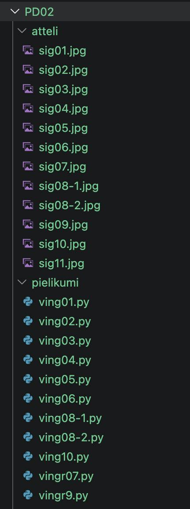

---

# 🧩 Vingrinājums 01

## Faila nosaukums

```text id="sdm8v5"
ving01.py
```
---

## Python kods

```python id="mt3k0v"
vecum = 25
print(vecum)
```
---

## Rezultāts / izvade

Pievieno:

* ekrānuzņēmumu.

```markdown id="k9m4me"
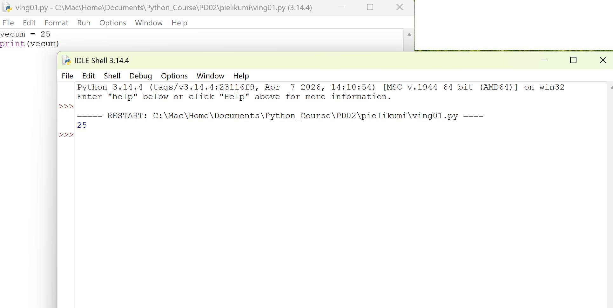
```


---

## Komentāri / piezīmes

Līdz šim viss ir vienkārši. Mēs atkārtojām piešķiršanas un izvades operatorus

---

# 🧩 Vingrinājums 02

## Faila nosaukums

```text id="sdm8v5"
ving02.py
```
---

## Python kods

```python id="mt3k0v"
vards = "Jānis"
augums_metrjs = 1.80
ir_studets = True

print(f"Vards = {vards}, type: {type(vards)}")
print(f"augums_metrjs = {augums_metrjs}, type: {type(augums_metrjs)}")
print(f"ir_studets = {ir_studets}, type: {type(ir_studets)}")
```
---

## Rezultāts / izvade

Pievieno:

* ekrānuzņēmumu.

```markdown id="k9m4me"
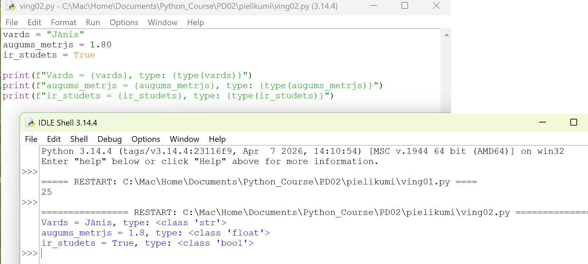
```


---

## Komentāri / piezīmes

Pagaidām viss skaidrs. Atkārtojām datu tipus, kā tos definēt un kā izvadīt vērtības.

---

# 🧩 Vingrinājums 03 

## Faila nosaukums

```text id="sdm8v5"
vingr03.py
```
---

## Python kods

```python id="mt3k0v"
garums = 5
platums = 3

taisnstura_laukums = garums * platums

print(f"Taisnstūra ar garumu {garums} un platumu {platums} laukums ir {taisnstura_laukums:.2f}")
```
---

## Rezultāts / izvade

Pievieno:

* ekrānuzņēmumu.

```markdown id="k9m4me"
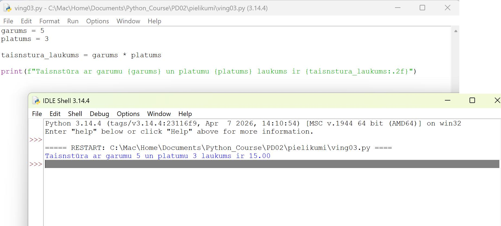
```


---

## Komentāri / piezīmes

Līdz šim viss ir vienkārši. Mēs atkārtojām reizināšanas darbību un rezultāta izvadīšanu.

---

# 🧩 Vingrinājums 04 

## Faila nosaukums

```text id="sdm8v5"
vingr04.py
```
---

## Python kods

```python id="mt3k0v"
# 1skaitlis = 10
# print(1skaitlis)

skaitlis = 10

print("==========")
print(skaitlis)
print("==========")
```
---

## Rezultāts / izvade

Pievieno:

* ekrānuzņēmumu.

```markdown id="k9m4me"
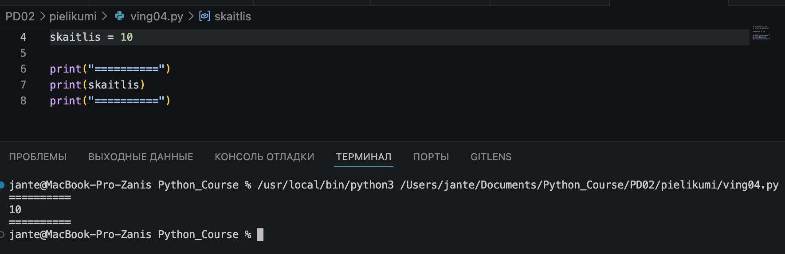
```


---

## Komentāri / piezīmes

Līdz šim viss ir vienkārši. Atkārtojām mainīgo nosaukumu veidošanas noteikumus.

---

# 🧩 Vingrinājums 05

# Faila nosaukums

```text id="sdm8v5"
vingr05.py
```
---

## Python kods

```python id="mt3k0v"
rezultats = (5 + 3) * 2

print("=========================")
print(f"Rezultats ir {rezultats}")
print("=========================")
```
---

## Rezultāts / izvade

Pievieno:

* ekrānuzņēmumu.

```markdown id="k9m4me"
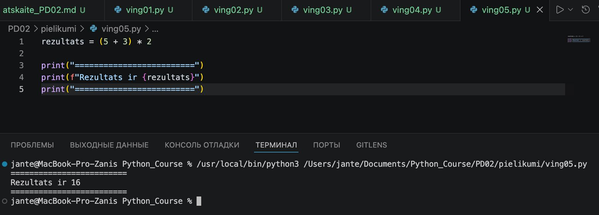
```


---

## Komentāri / piezīmes

Līdz šim viss ir vienkārši. Mēs atkārtojām matemātiskos noteikumus par iekavām.

---

# 🧩 Vingrinājums 06 

# Faila nosaukums

```text id="sdm8v5"
vingr06.py
```
---

## Python kods

```python id="mt3k0v"
skaitlis1 = 10
# skaitlis2 = "5"
skaitlis2 = 5

rezultats = skaitlis1 / skaitlis2

print("=========================")
print(f"Rezultats ir {rezultats}")
print("=========================")
```
---

## Rezultāts / izvade

Pievieno:

* ekrānuzņēmumu.

```markdown id="k9m4me"
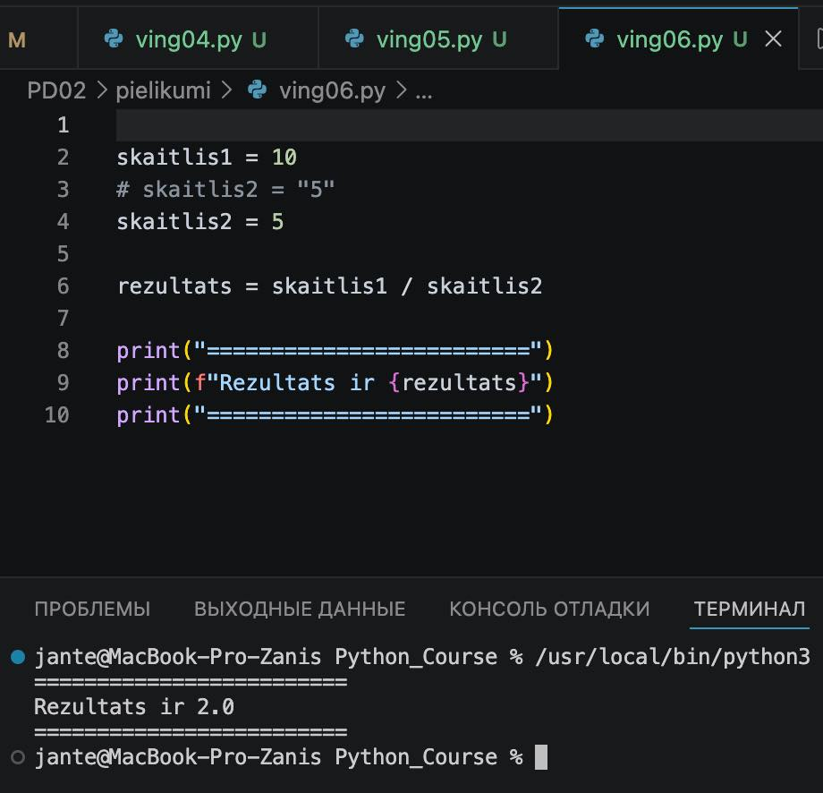
```


---

## Komentāri / piezīmes

Līdz šim viss ir vienkārši. Mēs atkārtojām matemātiskos noteikumus par iekavām.Pagaidām viss ir vienkārši. Aprēķinu veikšanas laikā tika atklāta kļūda datu tipos.

---

# 🧩 Vingrinājums 07 

# Faila nosaukums

```text id="sdm8v5"
vingr07.py
```
---

## Python kods

```python id="mt3k0v"
x = 10
# x = x + 5
x1 = x + 5

print("=========================")
print(f"{x}  {x1}")
print("=========================")
print(f"Sākotnējā vērtība ir {x}.\nJaunā vērtība ir {x1}")
print("=========================")
```
---

## Rezultāts / izvade

Pievieno:

* ekrānuzņēmumu.

```markdown id="k9m4me"
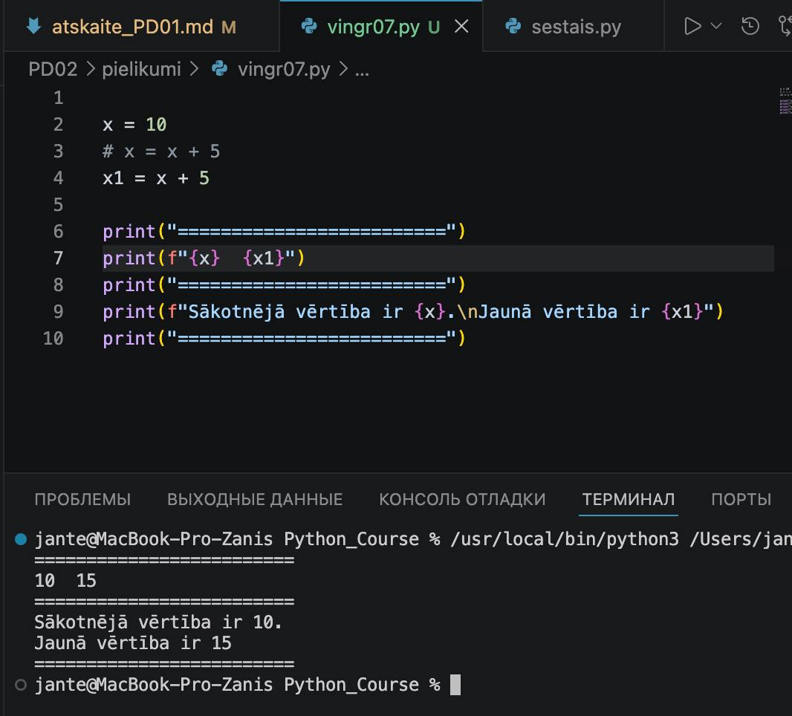
```


---

## Komentāri / piezīmes

Vienmēr cenšos atrast kaut ko interesantu. Šajā gadījumā atradu iespēju, kā izvadīt vērtības stabiņā.

---

# 🧩 Vingrinājums 08

# Faila nosaukums

```text id="sdm8v5"
vingr08-1.py
```
---

## Python kods

```python id="mt3k0v"
a = input("Ievadiet pirmo skaitli: ")
b = input("Ievadiet otro skaitli: ")

rezultats = float(a) + float(b)

print("=======================================")
print(f"Summa divu skaitļu ir: {rezultats:.2f}")
print("=======================================")
```
---

## Rezultāts / izvade

Pievieno:

* ekrānuzņēmumu.

```markdown id="k9m4me"
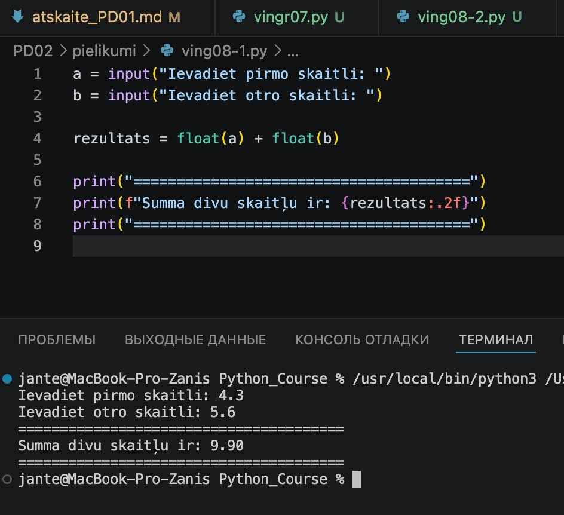
```


---

## Komentāri / piezīmes

Вот перевод вашей фразы на латышский язык с добавлением ссылки на GitHub. Он звучит грамотно и хорошо структурирован для учебного отчета:

«Mani nedaudz iedvesmoja iespēja programmēt dialogu ar lietotāju. Papildus uzdevumam es to atkārtoju uznirstošajā logā, kur šūnās var ievadīt divus skaitļus un uzreiz redzēt saskaitīšanas rezultātu – faili ir pieejami GitHub: [GitHub](https://github.com/JanTey/Python_Course/tree/main/PD02) (skatīt ingr08-2.py un sig08-2.jpg).

---

# 🧩 Vingrinājums 09

# Faila nosaukums

```text id="sdm8v5"
vingr09.py
```
---

## Python kods

```python id="mt3k0v"
vards = input("Kā tevi sauc? ")

print("=========================================")
print(f"Sveicināti, {vards}!")
print("=========================================")
```
---

## Rezultāts / izvade

Pievieno:

* ekrānuzņēmumu.

```markdown id="k9m4me"
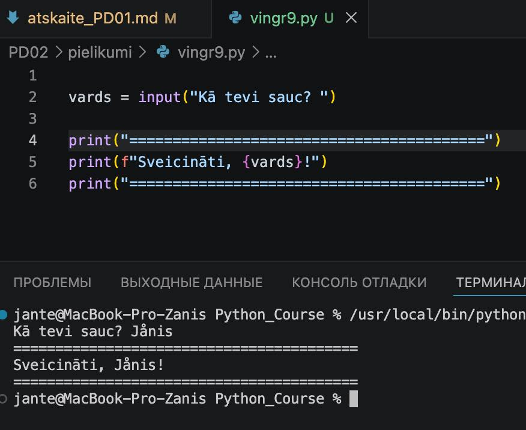
```


---

## Komentāri / piezīmes

Jā, paliek interesantāk. Mani viennozīmīgi piesaista interaktīvas programmas.

---

# 🧩 Vingrinājums 10

# Faila nosaukums

```text id="sdm8v5"
vingr10.py
```
---

## Python kods

```python id="mt3k0v"
skaitlis = 37
dalitajs = 5

veselie = skaitlis // dalitajs
atlikums = skaitlis % dalitajs

print("===========================================================")
print(f"{dalitajs} ietilpst {skaitlis} tieši {veselie} reizes. Atlikums ir {atlikums}.")
print("===========================================================")
```
---

## Rezultāts / izvade

Pievieno:

* ekrānuzņēmumu.

```markdown id="k9m4me"
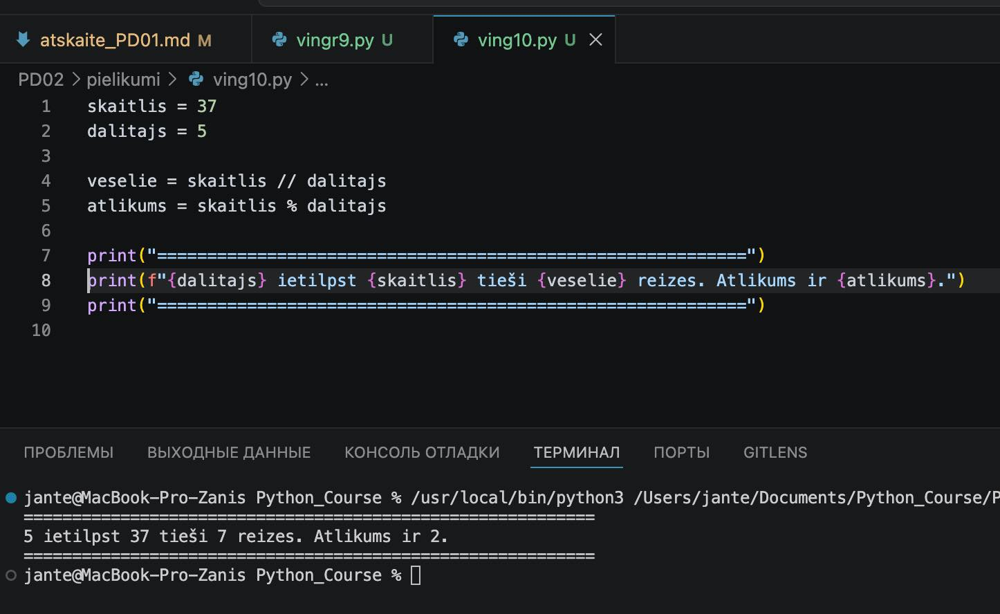
```


---

## Komentāri / piezīmes

Veselo skaitļu dalīšana un dalīšana ar atlikumu – es aizdomājos par šo iespēju pielietojumu. Jā, tas ir ļoti svarīgi – var pārbaudīt skaitļu pāra vai nepāra īpašību, pārvērst laiku (piemēram, 70 sekundes -> 1 minūte un 10 sekundes), meklēt optimālu sadalījumu grupās... Šīs operācijas ir būtiskas arī darbā ar masīviem un cikliem, kad dati jāsadala lapās.

---

# Piedzīvojumi un secinājumi

  Šodien izdevās izpildīt visus uzdevumus. Nelielas grūtības sagādāja veselo skaitļu dalīšana un dalīšana ar atlikumu – šeit man vēl jātrenējas.

# Pamatota pašnovērtējums

*Savstarpēji vērtēju savu darbu uz 90 no 100 — lai gan visi uzdevumi ir izpildīti, esmu nedaudz neapmierināts ar sava darba ātrumu, it īpaši atskaites sagatavošanā.*