# Praktiskā darba atskaite — PD03

**Tēma:** Lietotāja ievade un rezultātu izvade 
**Vārds, Uzvārds:** Zhan Teivan 
**Datums:** 2026-05-12  
**Grupa:**  DAAVP_Daugavpils_80


[Mana praktiskā darba mape GitHub platformā](https://github.com/JanTey/Python_Course/tree/main/PD03)

---
# 📁 0. Sagatavošanās darbi

Pārbaudi, vai sagatavota darba vide:

* [x] Izveidota mape `PD03`
* [x] Izveidota apakšmape `pielikumi`
* [x] Izveidota apakšmape `atteli`
* [x] Izveidots fails `atskaite_PD03.md`

---

## Mapju struktūra

```text
PD03/
├─ Pielikumi/
│  ├─ vng01.py
│  ├─ vng02.py
│  ├─ vng03.py
│  ├─ vng04.py
│  ├─ vng05.py
│  ├─ vng06.py
│  ├─ vng07.py
│  ├─ vng08.py
│  └─ vng09.py
├─ atteli/
│  ├─ maps_structure.png
│  ├─ vng01.png
│  ├─ vng02.png
│  ├─ vng03.png
│  ├─ vng04.png
│  ├─ vng05.png
│  ├─ vng06.png
│  ├─ vng07.png
│  ├─ vng08-1.png
│  ├─ vng09.png
│  └─ vng10.png
└─ atskaite_PD03.md
````

---

## Ekrānuzņēmums

Pievieno ekrānuzņēmumu ar mapes struktūru.

```markdown id="j0m2om"
[Mapes struktūra](atteli/maps_structura.png)
```
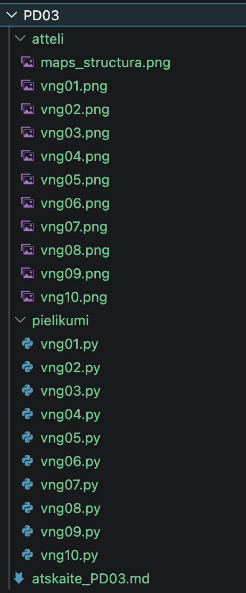

---

# 🧩 vnginājums 01

## Faila nosaukums

```text id="sdm8v5"
vng01.py
```
---

## Python kods

```python id="mt3k0v"
'''
Uzdevums
Izveido programmu, kas:

1.	pajautā lietotāja vārdu,
2.	saglabā to mainīgajā,
3.	sasveicinās ar lietotāju.

Sagaidāmais rezultāts
Kā tevi sauc?
Anna
S̶v̶e̶i̶k̶s̶ Sveika, Anna!
'''

vards = input("Kā tevi sauc? ")
if vards[-1].lower() == "a" or vards[-1].lower() == "e":
    print(f"Sveika, {vards}!")
else:
    print(f"Sveiks, {vards}!")
```
---

## Rezultāts / izvade

Pievieno:

* ekrānuzņēmumu.

```markdown id="k9m4me"
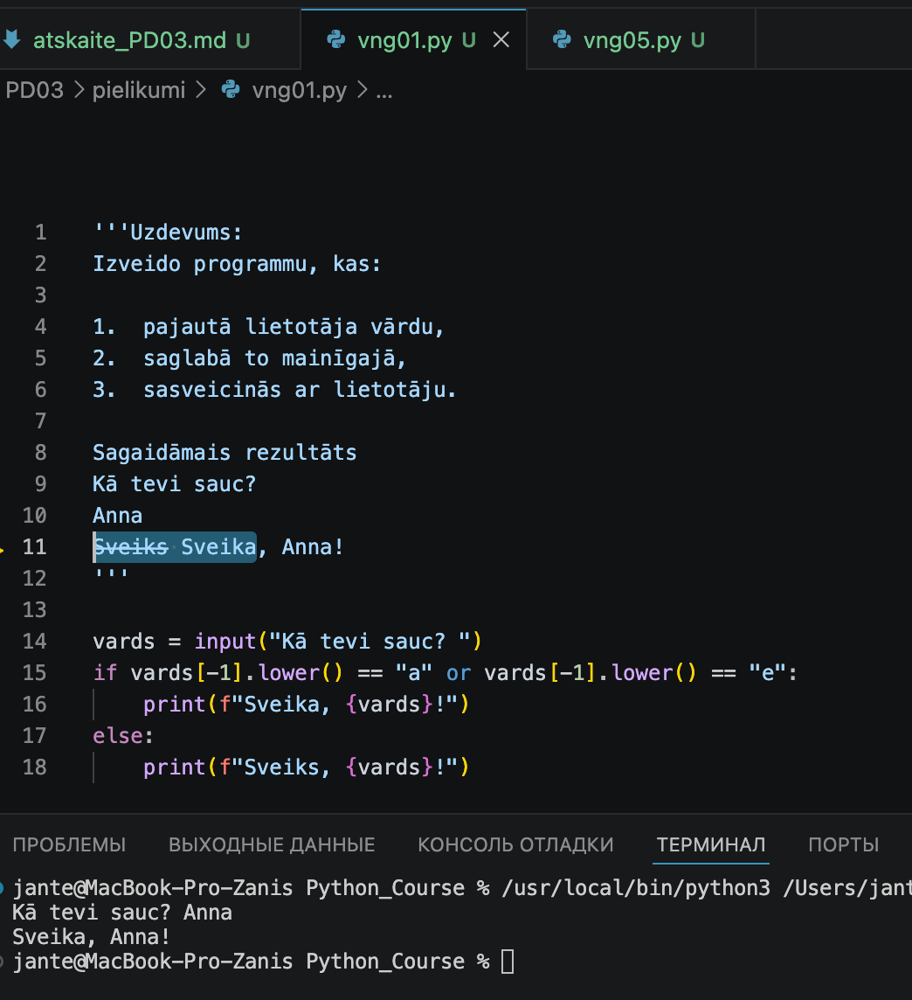
```


---

## Komentāri / piezīmes

Uzrakstīt kodu, kas ņem vērā vārdu dzimti, ir interesants uzdevums. Šeit vajag būt arī valodniekam!

---

# 🧩 vnginājums 02

## Faila nosaukums

```text id
vng02.py
```
---

## Python kods

```python id="mt3k0v"
'''
Uzdevums
Izveido programmu, kas:

1.	pajautā lietotāja vecumu,
2.	pārvērš ievadi par skaitli,
3.	aprēķina vecumu nākamgad,
4.	izvada rezultātu.
Sagaidāmais rezultāts
Cik tev ir gadi?
20
Nākamgad tev būs 21 gadi.
'''

vecums = input("Cik ir tev gadi? ")
vecums = int(vecums)
vecums_nakamgad = vecums + 1
print(f"Nākamgad tev būs {vecums_nakamgad} gadi.")
```
---

## Rezultāts / izvade

Pievieno:

* ekrānuzņēmumu.

```markdown id="k9m4me"
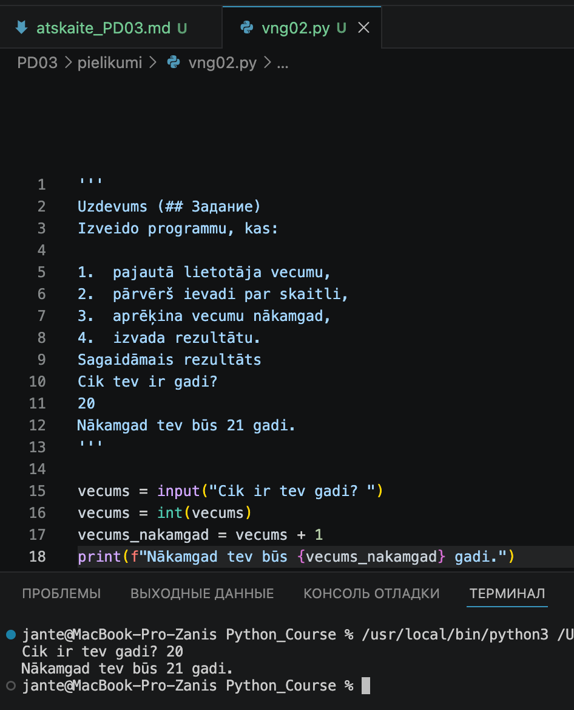
```


---

## Komentāri / piezīmes

Šeit nedrīkst aizmirst pārveidot datu tipu no teksta vērtības uz skaitlisko.

---

# 🧩 vnginājums 03 

## Faila nosaukums

```text id="sdm8v5"
vng03.py
```
---

## Python kods

```python id="mt3k0v"
'''
Uzdevums
Izveido programmu, kas:
1. pajautā vienas kafijas cenu,
2. pajautā izdzerto kafiju skaitu,
3. aprēķina kopējās izmaksas.
Sagaidāmais rezultāts
Cik maksā viena kafija?
2.5
Cik kafijas izdzer mēnesī?
30
Tu mēnesī kafijai iztērē 75.0 EUR.
'''
cena = float(input("Cik maksā viena kafija? "))
skaits = int(input("Cik kafijas izdzer mēnesī? "))
kopējās_izmaksas = cena * skaits
print(f"Tu mēnesī kafijai iztērē {kopējās_izmaksas} EUR.")
```
---

## Rezultāts / izvade

Pievieno:

* ekrānuzņēmumu.

```markdown id="k9m4me"
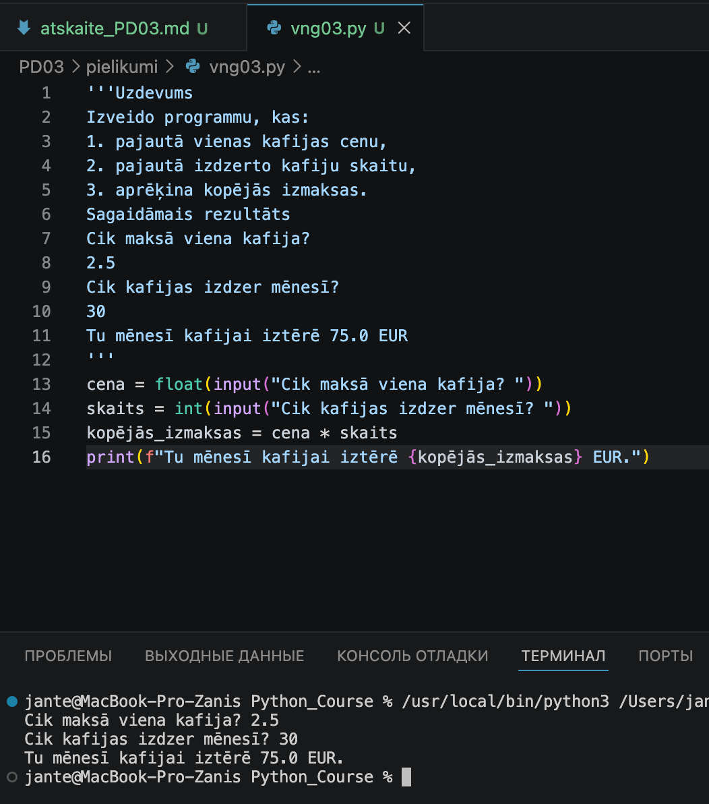
```


---

## Komentāri / piezīmes

Tika izmantoti datu tipa pārveidošanas operatori — float() un int()

---

# 🧩 vnginājums 04 

## Faila nosaukums

```text id
vng04.py
```
---

## Python kods

```python id="mt3k0v"
'''
Uzdevums
Izveido programmu, kas pajautā:
vārdu, mīļāko krāsu, mīļāko ēdienu.
Programmai jāizvada īss personalizēts teksts.
Sagaidāmais rezultāts
Kā tevi sauc? / Anna
Kāda ir tava mīļākā krāsa? / zila
Kāds ir tavs mīļākais ēdiens? / pica
Annai patīk zila krāsa un pica.
'''
vards = input("Kā tevi sauc? ")
krausa = input("Kāda ir tava mīļākā krāsa? ")
edieni = input("Kāds ir tavs mīļākais ēdiens? ")

# Vārdnīca: nominatīvs -> datīvs
datīvs_vārdnīca = {
    "Anna": "Annai",
    "Jānis": "Jānim",
    "Ilze": "Ilzei",
    "Toms": "Tomam",
    "Marta": "Martai",
    "Pēteris": "Pēterim",
    "Artis": "Artim",
    "Dārta": "Dārtai"
}

if vards in datīvs_vārdnīca:
    print(f"{datīvs_vārdnīca[vards]} patīk {krausa} krāsa un {edieni}.")
else:
    print(f"Sveiki, {vards}! Tava mīļākā krāsa ir {krausa}, un tavs mīļākais ēdiens ir {edieni}.")
```
---

## Rezultāts / izvade

Pievieno:

* ekrānuzņēmumu.

```markdown id="k9m4me"
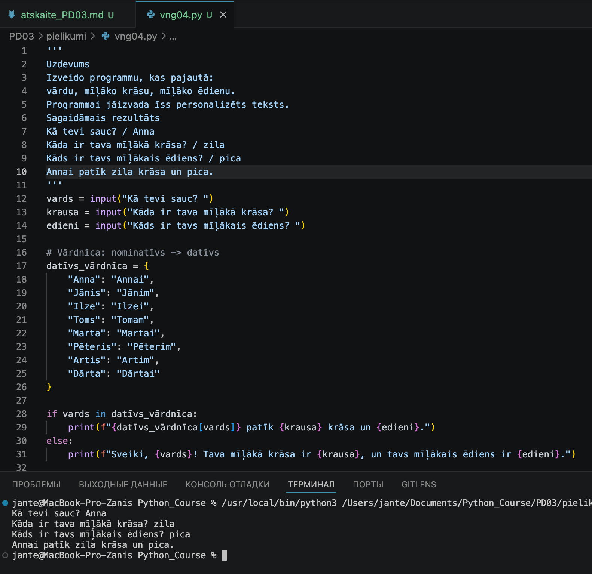
```


---

## Komentāri / piezīmes

Protams, lai nodrošinātu automātisku vārdu locīšanu visos locījumos, būtu jāizmanto 
specializētās NLP (dabiskās valodas apstrādes) bibliotēkas.

---

# 🧩 vnginājums 05

# Faila nosaukums

```text id
vng05.py
```
---

## Python kods

```python id="mt3k0v"
'''
Uzdevums
Programmai jāizvada lietotāja vārds, bet tā to nedara pareizi.
Salabo kodu:
    vards = input("Kā tevi sauc? ")       # Anna
    print(f"Sveiks, vards!") --- nepareizi, jo vārds tiek izvadīts kā teksts "vards", nevis mainīgā vērtība
    print(f"Sveika, {vards}!")     # Sveika, Anna!
'''

vards = input("Kā tevi sauc? ")
if vards[-1].lower() == "a" or vards[-1].lower() == "e":
    print(f"Sveika, {vards}!")
else:
    print(f"Sveiks, {vards}!")
```
---

## Rezultāts / izvade

Pievieno:

* ekrānuzņēmumu.

```markdown id="k9m4me"
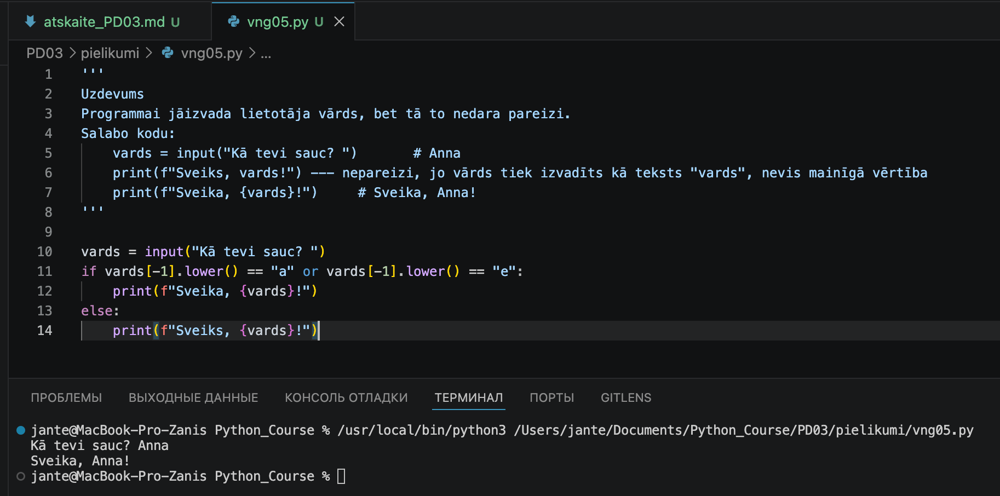
```


---

## Komentāri / piezīmes

Šī uzdevuma izpilde praktiski atkārtoja kodu no pirmā uzdevuma. Taču šeit bija jāatrod kļūda. 
Es sev pievienoju nelielu uzdevumu valodniecības jomā.

---

# 🧩 vnginājums 06 

# Faila nosaukums

```text id="sdm8v5"
vng06.py
```
---

## Python kods

```python id="mt3k0v"
'''
Uzdevums
Programma avarē.
Noskaidro:
 - kāpēc,
 - un salabo to.
    vecums = input("Cik tev ir gadi? ")
    print(vecums + 1)
Sagaidāmais rezultāts
Cik tev ir gadi?
20
21    
'''
vecums = input("\nCik tev ir gadi? ")

print('''\nFunkcija input() vienmēr atgriež tekstu (string). 
Lai ievadītos datus izmantotu aritmētiskajās operācijās, 
tie ir jāpārvērš skaitļos, izmantojot int() vai float(), 
pretējā gadījumā radīsies kļūda.''')

print(f"\n{vecums} \n{int(vecums) + 1}\n")
```
---

## Rezultāts / izvade

Pievieno:

* ekrānuzņēmumu.

```markdown id="k9m4me"
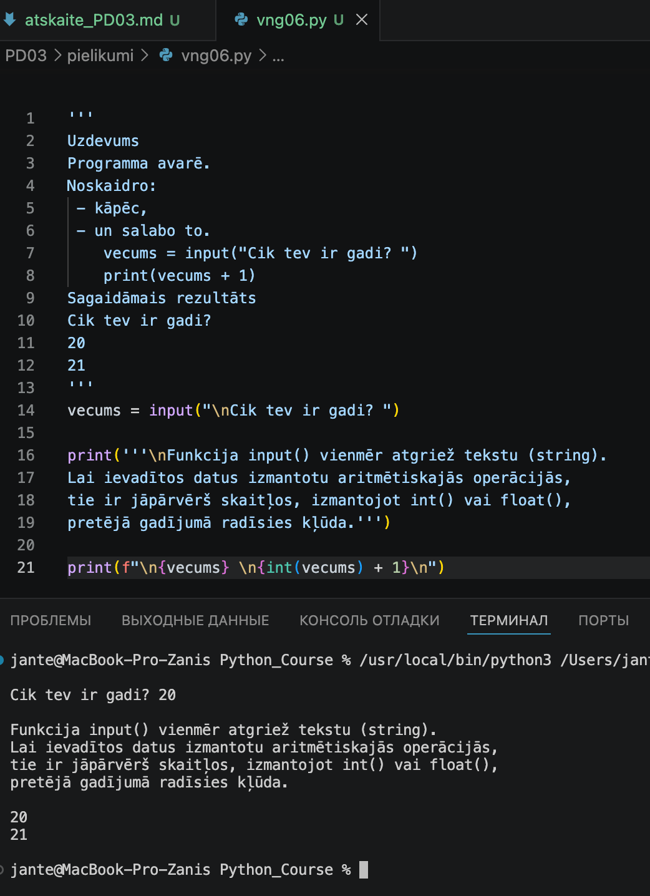
```


---

## Komentāri / piezīmes

Pievienots teksta izvade uz ekrāna: "Funkcija input() vienmēr atgriež tekstu (string). Lai ievadītos 
datus izmantotu aritmētiskajās operācijās, tie ir jāpārvērš skaitļos, izmantojot int() vai float(), 
pretējā gadījumā radīsies kļūda."

---

# 🧩 vnginājums 07 

# Faila nosaukums

```text id="sdm8v5"
vng07.py
```
---

## Python kods

```python id="mt3k0v"
'''
Uzdevums
Palaid programmu un apraksti:
kāds ir rezultāts,
kāpēc tas notiek.
    print("5" * 2)
    print(5 * 2)
Sagaidāmais rezultāts
55
10    
'''

print('''\nMēģinājums veikt saskaitīšanu ar teksta vērtībām izraisa vērtību apvienošanu.\n''')
print("5" * 2, 5*2, sep="\n", end="\n\n")
```
---

## Rezultāts / izvade

Pievieno:

* ekrānuzņēmumu.

```markdown id="k9m4me"
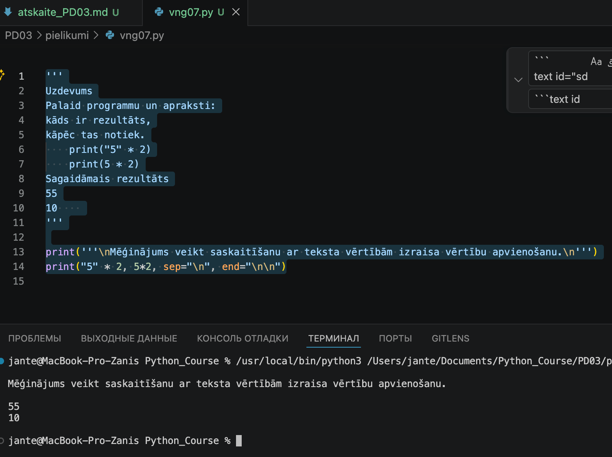
```


---

## Komentāri / piezīmes

Mēģinājums veikt saskaitīšanu ar teksta vērtībām izraisa vērtību apvienošanu.

---

# 🧩 vnginājums 08

# Faila nosaukums

```text id="sdm8v5"
vng08-1.py
```
---

## Python kods

```python id="mt3k0v"
'''
Uzdevums
Programma nedarbojas.
Atrodi kļūdu un salabo programmu.

    vards = input("Vārds: ") 
    print(f"Sveiks, {vards}!")    =====> {vards}  
    
Sagaidāmais rezultāts
Vārds:
Anna
Sveika, Anna!
'''

vards = input("\nVards: ")
if vards[-1].lower() == "a" or vards[-1].lower() == "e":
    print(f"Sveika, {vards}!\n")
else:
    print(f"\nSveiks, {vards}!\n")
```
---

## Rezultāts / izvade

Pievieno:

* ekrānuzņēmumu.

```markdown id="k9m4me"
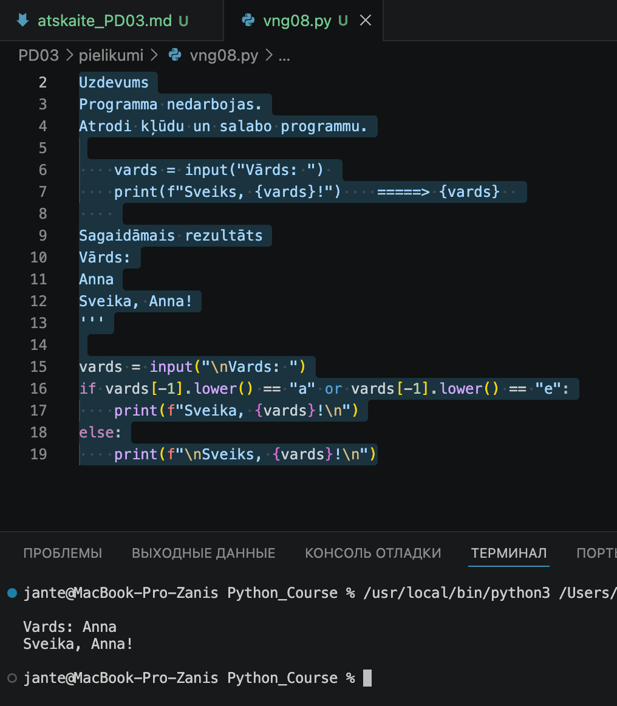
```


---

## Komentāri / piezīmes

Pamanīt aizverošās figūriekavas trūkumu ir diezgan sarežģīti.

---

# 🧩 vnginājums 09

# Faila nosaukums

```text id="sdm8v5"
vng09.py
```
---

## Python kods

```python id="mt3k0v"
'''
Uzdevums
Izveido programmu, kas:
 1. pajautā divus skaitļus,
 2. aprēķina to summu,
 3. izvada rezultātu.

Sagaidāmais rezultāts
 Ievadi pirmo skaitli:
 5
 Ievadi otro skaitli:
 7
 Summa ir 12.
'''
a = float(input("\nIevadi pirmo skaitli: "))
b = float(input("Ievadi otro skaitli: "))
summa = a + b

if summa.is_integer():
    print(f"\nSumma ir {summa:.0f}7.\n")
else:
    print(f"\nSumma ir {summa:.2f}\n")
```
---

## Rezultāts / izvade

Pievieno:

* ekrānuzņēmumu.

```markdown id="k9m4me"
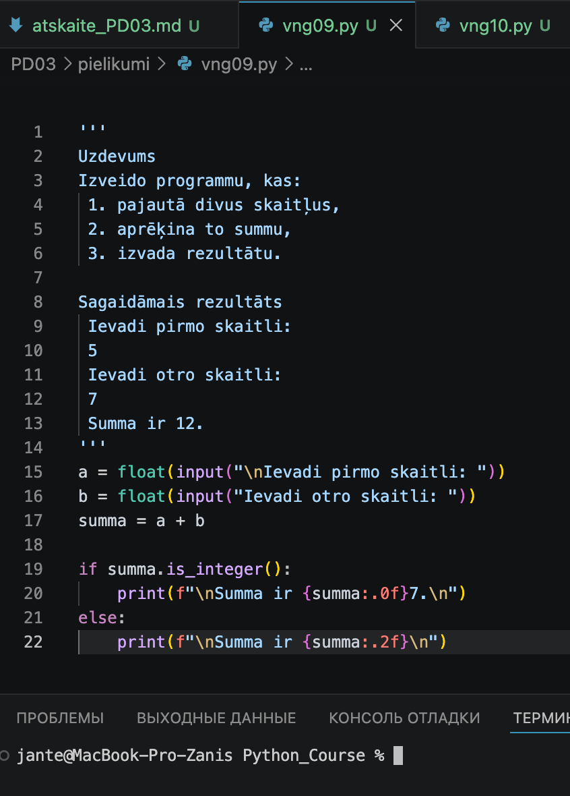
```


---

## Komentāri / piezīmes

Atbilstoši uzdevuma nosacījumiem, izmantojot float datu tipu, vesels skaitlis ir jāizvada ar punktu beigās. 
Es izmantoju .is_integer() metodi, lai pārbaudītu rezultātu: ja skaitlis ir vesels, tas tiek parādīts ar punktu 
(piemēram, '12.'), ja nē – kā decimāldaļskaitlis ar divām zīmēm aiz komata.

---

# 🧩 vnginājums 10

# Faila nosaukums

```text id="sdm8v5"
vng10.py
```
---

## Python kods

```python id="mt3k0v"
'''
Uzdevums
Izveido savu mazo interaktīvo programmu.
Dienas budžeta kalkulators

Sagaidāmais rezultāts
1. čeks. Ievadiet čeka summu: 23.3
Vai vēlaties pievienot jaunu čeku? (Y/N): y
2. čeks. Ievadiet čeka summu: 50
Vai vēlaties pievienot jaunu čeku? (Y/N): y
3. čeks. Ievadiet čeka summu: 5.47
Vai vēlaties pievienot jaunu čeku? (Y/N): n

Jūsu dienas tēriņu summa ir: 78.77 EUR.
'''

kopa = 0  # Mainīgais kopējai summai
turpinat = "Y"  # Mainīgais Cikla turpināšanas kontrolei
ceka_numurs = 1  # Mainīgais čeku skaitim

print("\nDienas budžeta kalkulators\n")
while turpinat.upper() == "Y":
    
    # Pieprasām pašreizējā čeka summu
    summa = float(input(f"{ceka_numurs}. čeks. Ievadiet čeka summu: "))
    kopa += summa  # Pieskaitām kopējai summai
    
    # Jautājam, vai lietotājs vēlas pievienot vēl vienu kvīti
    turpinat = input("Vai vēlaties pievienot jaunu čeku? (Y/N): ")
    ceka_numurs += 1

# Galīgā rezultāta aprēķināšana un izvadīšana
print(f"\nJūsu dienas tēriņu summa ir: {kopa:.2f} EUR.\n")
```
---

## Rezultāts / izvade

Pievieno:

* ekrānuzņēmumu.

```markdown id="k9m4me"
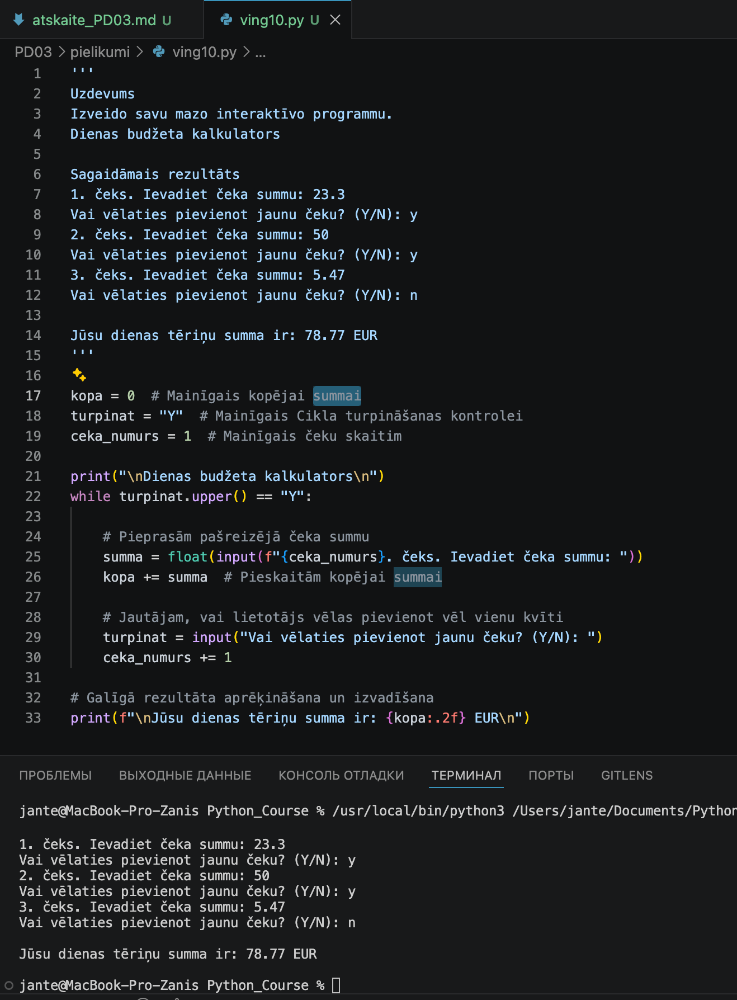
```


---

## Komentāri / piezīmes

Interaktīvs dienas budžeta kalkulators, kas izmanto while ciklu neierobežotai datu ievadei. 
Programma summē lietotāja ievadītās float vērtības, veic čeku uzskaiti un izvada kopējo summu, 
izmantojot f-virknes precīzam rezultāta formatējumam (2 zīmes aiz komata).
Programma realizē dinamisku datu ievadi, izmantojot while ciklu. Tā summē lietotāja ievadītās 
float tipa vērtības, veic automātisku čeku skaita uzskaiti un izvada galīgo rezultātu, izmantojot 
f-virknes (f-strings) valūtas formatēšanai.

---

# Piedzīvojumi un secinājumi

  Šodien ar gandarījumu izpildīju visus uzdevumus. Galvenais izaicinājums bija nepieciešamība ierobežot 
  vēlmi pēc pārmērīgiem programmas uzlabojumiem. Tāpat radās jautājums par pieturzīmēm sagaidāmajos 
  rezultātos: vai punkts sniegtā rezultāta piemēra beigās ir obligāts izvades elements vai tikai teikuma 
  beigu zīme aprakstā. Rezultātā secināju, ka jebkuri simboli sagaidāmajā rezultātā ir jāuztver kā daļa 
  no tehniskā uzdevuma, un realizēju izvadi stingrā saskaņā ar paraugu.

# Pamatota pašnovērtējums

*Šodien esmu apmierināts ar savu darbu. Ja ņemtu vērā, cik daudz vēl ir jāapgūst un jāizmēģina, es savu 
darbu novērtētu ar 98 punktiem, atlikušos 2 punktus atstājot iespējamām kļūdām, kuras es neesmu pamanījis.*