# Praktiskā darba atskaite — PD04

**Tēma:** Lēmumu pieņemšana programmā 
**Vārds, Uzvārds:** Zhan Teivan 
**Datums:** 2026-05-15  
**Grupa:**  DAAVP_Daugavpils_80


[Mana praktiskā darba mape GitHub platformā](https://github.com/JanTey/Python_Course/tree/main/PD04_Teivan_Zhan)

---
# 📁 0. Sagatavošanās darbi

Pārbaudi, vai sagatavota darba vide:

* [x] Izveidota mape `PD04_Teivan_Zhan`
* [x] Izveidota apakšmape `pielikumi`
* [x] Izveidota apakšmape `atteli`
* [x] Izveidots fails `atskaite_PD04.md`

---

## Mapju struktūra

```text
PD04_Teivan_Zhan/
├─ Pielikumi/
│  ├─ vng01.py
│  ├─ vng02.py
│  ├─ vng03.py
│  ├─ vng04-1.py
│  ├─ vng04-2.py
│  ├─ vng05-1.py
│  ├─ vng05-2.py
│  ├─ vng06-1.py
│  └─ vng06-2.py
├─ atteli/
│  ├─ maps_structure.png
│  ├─ vng01.png
│  ├─ vng02.png
│  ├─ vng03.png
│  ├─ vng04-1.png
│  ├─ vng04-2.png
│  ├─ vng05-1a.png
│  ├─ vng05-1b.png
│  ├─ vng05-2a.png
│  ├─ vng05-2b.png
│  ├─ vng06-1.png
│  ├─ vng06-2a.png
│  └─ vng06-2b.png
└─ atskaite_PD04.md
````

---

## Ekrānuzņēmums

Pievieno ekrānuzņēmumu ar mapes struktūru.

```markdown id="j0m2om"
[Mapes struktūra](atteli/maps_structura.png)
```
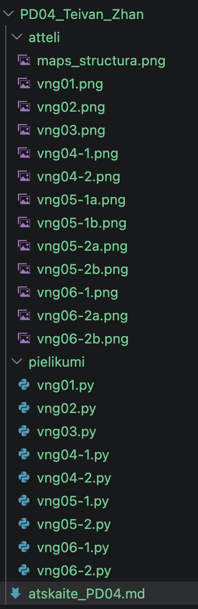

---

# 🧩 vnginājums 01

## Faila nosaukums

```text id="sdm8v5"
vng01.py
```
---

## Python kods

```python id="mt3k0v"
'''
Uzdevums:
Izveido programmu, kas pajautā lietotāja vecumu un pasaka, vai lietotājs ir pilngadīgs.
Sagaidāmais rezultāts:
Ievadi savu vecumu: 21
Tu esi pilngadīgs.
vai:
Ievadi savu vecumu: 15
Tu vēl neesi pilngadīgs.
'''

vecums = int(input("\nIevadi savu vecumu: "))
if vecums >= 18:
    print(f"\nTu esi pilngadīgs.\n")
else:
    print(f"\nTu vēl neesi pilngadīgs.\n")
```
---

## Rezultāts / izvade

Pievieno:

* ekrānuzņēmumu.

Rezultāts

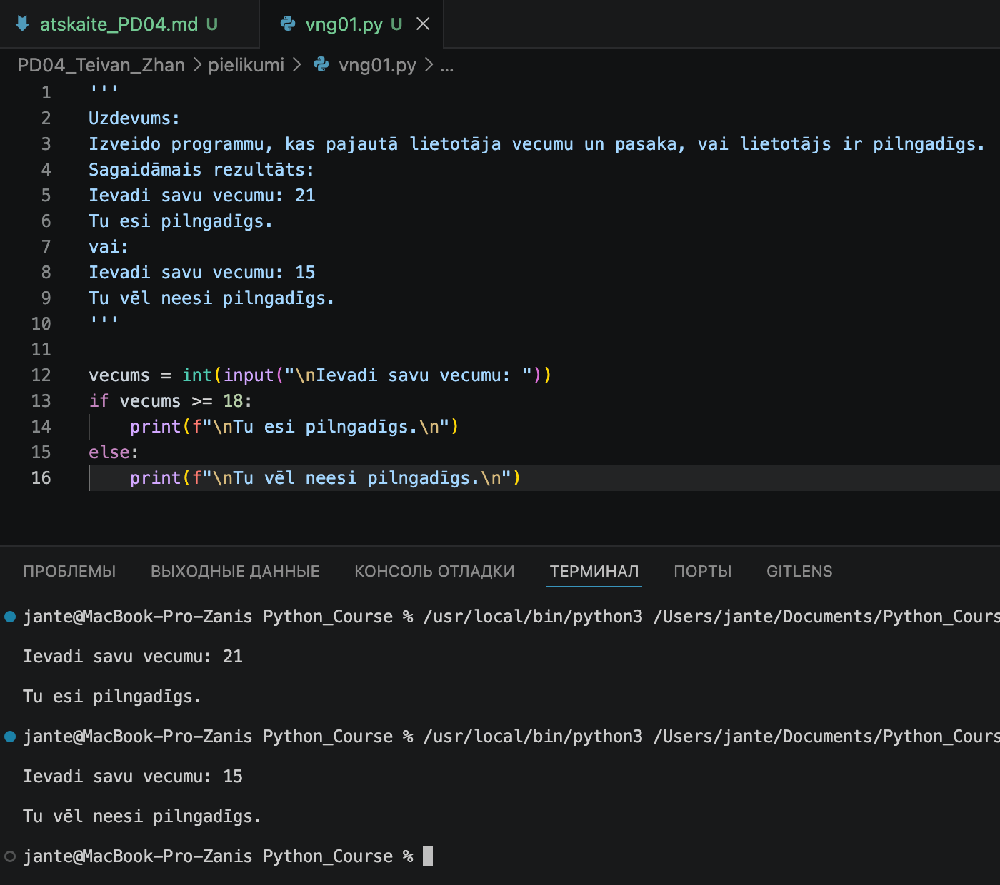

---

## Komentāri / piezīmes

Programma demonstrē nosacījuma operatora if-else izmantošanu skaitliskā kritērija pārbaudei. 
Lietotāja ievadītie dati tiek konvertēti par int tipu, kas ļauj tos salīdzināt ar sliekšņa vērtību 18.
Operatora >= (lielāks vai vienāds) izmantošana ir kritiski svarīga, lai pareizi apstrādātu vecumu tieši 
18 gadi. f-virkņu lietošana ļauj kodolīgi izvadīt rezultātu kopā ar vadības simboliem \n, lai uzlabotu 
vizuālo uztveri konsolē.

---

# 🧩 vnginājums 02

## Faila nosaukums

```text id
vng02.py
```
---

## Python kods

```python id="mt3k0v"
'''
Uzdevums
Izveido programmu, kas pajautā temperatūru un dod vienkāršu ieteikumu.
Ja temperatūra ir lielāka par 38, programma izvada brīdinājumu par drudzi. Citādi
programma pasaka, ka temperatūra nav paaugstināta.
Sagaidāmais rezultāts
Ievadi temperatūru: 39
Temperatūra ir paaugstināta. Ieteicams atpūsties.
'''

temperatura = float(input("\nIevadi temperatūru: "))
if temperatura >= 37:
    print(f"\nTemperatūra ir paaugstināta. Ieteicams atpūsties.\n")
else:
    print(f"\nTemperatūra nav paaugstināta.\n")
```
---

## Rezultāts / izvade

Pievieno:

* ekrānuzņēmumu.

Rezultāts

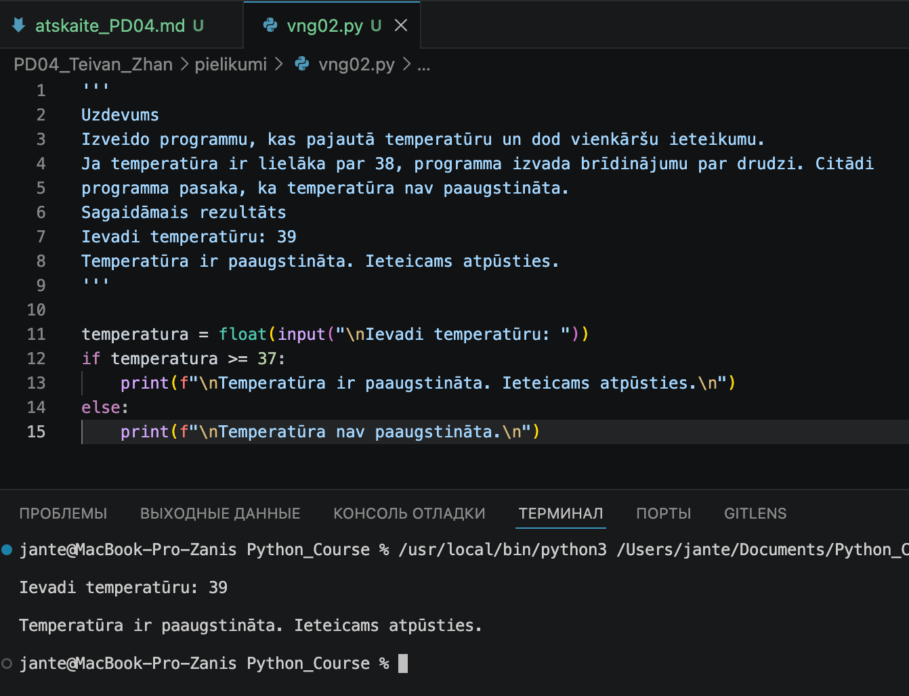

---

## Komentāri / piezīmes

Programma apstrādā lietotāja ievadīto temperatūras rādījumu un, izmantojot if-else atzari, 
nosaka, vai tā ir vienāda ar vai pārsniedz sliekšņa vērtību 37 grādi.
Lietotāja ievadītā vērtība tiek pārvērsta reālajā skaitlī (float) matemātiskai salīdzināšanai 
ar konstanti 37. Rezultāts tiek izvadīts, izmantojot f-virknes formatēšanu.
Šajā uzdevumā tika realizēta vienkārša loģiskā pārbaude. Programma pareizi apstrādā robežvērtību 
37 (ieskaitot) pateicoties salīdzināšanas operatoram >=.

---

# 🧩 vnginājums 03 

## Faila nosaukums

```text id="sdm8v5"
vng03.py
```
---

## Python kods

```python id="mt3k0v"
'''
Uzdevums
Izveido vienkāršu piekļuves pārbaudes programmu.
Programma pajautā paroli. Ja parole ir pareiza, programma izvada paziņojumu par piekļuves
atļaušanu. Ja parole nav pareiza, programma izvada atteikumu.
Sagaidāmais rezultāts
Ievadi paroli: python123
Piekļuve atļauta.
'''
parole = input("\nIevadi paroli: ")
if parole == "python123":
    print(f"\nPiekļuve atļauta.\n")
else:
    print(f"\nPiekļuve liegta.\n")
```
---

## Rezultāts / izvade

Pievieno:

* ekrānuzņēmumu.

Rezultāts

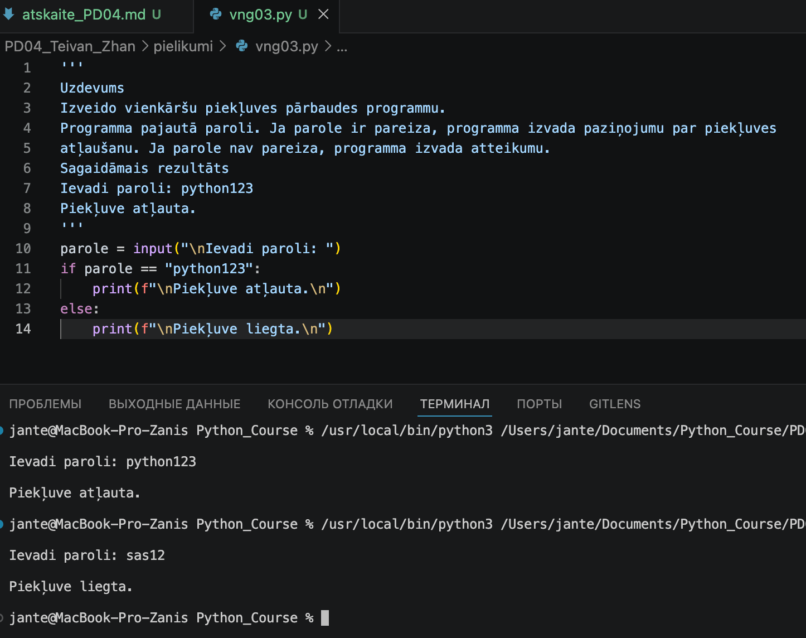

---

## Komentāri / piezīmes

Programma realizē vienkāršu autentifikācijas pārbaudi. Atšķirībā no iepriekšējiem uzdevumiem, 
šeit tiek izmantota virkņu datu (str) salīdzināšana, tāpēc tipu konvertēšana nav nepieciešama. 
Operators == pārbauda pilnīgu ievadītā teksta sakritību ar etalona vērtību.
Loģika ir balstīta uz stingru vienādību. Ja lietotājs ievadīs paroli ar lielo burtu vai lieku 
atstarpi, if nosacījums atgriezīs False un nostrādās else bloks. f-virkņu izmantošana saglabā 
vienotu izvades stilu visā darbā.

---

# 🧩 vnginājums 04-1 

## Faila nosaukums

```text id
vng04-1.py
```
---

## Python kods

```python id="mt3k0v"
'''
Uzdevums
Zemāk dots bojāts kods. Pārraksti to savā failā, palaid un izlabo kļūdu.
vecums = 18
if vecums = 18:      ============> === BOJĀTS KODS ===> if vecums == 18:
print("Vecums ir 18.")
else:
print("Vecums nav 18.")
Sagaidāmais rezultāts
Programma darbojas bez kļūdām un pareizi pārbauda vecumu.
'''

vecums = 18
if vecums == 18:
    print("\nVecums ir 18.\n")
else:
    print("\nVecums nav 18.\n")
```
---

## Rezultāts / izvade

Pievieno:

* ekrānuzņēmumu.

Kods ir labots

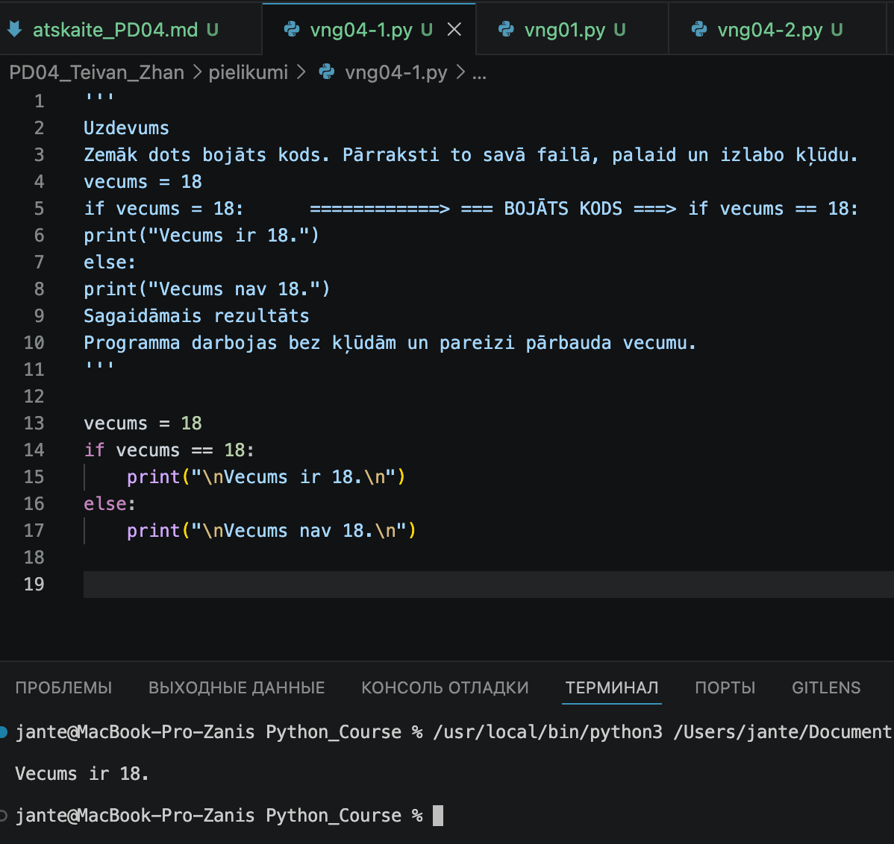

---

## Komentāri / piezīmes

Sākotnējā kodā bija pieļauta kritiska sintakses kļūda: piešķiršanas operatora = izmantošana 
salīdzināšanas operatora == vietā if nosacījumā. Pēc operatora maiņas programma spēj loģiski 
pārbaudīt mainīgā vērtību, nevis mēģināt to pārrakstīt nosacījuma iekšienē.

---

# 🧩 vnginājums 04-2 

## Faila nosaukums

```text id
vng04-2.py
```
---

## Python kods

```python id="mt3k0v"
'''
Uzdevums
Izveido programmu, kas pajautā skaitli un pārbauda, vai tas ir pozitīvs.
Prasības
Ja skaitlis ir lielāks par 0, izvada:
Skaitlis ir pozitīvs.
Citādi izvada:
Skaitlis nav pozitīvs.
'''

skaitlis = int(input("\nIevadi skaitli: "))
if skaitlis > 0:
    print("\nSkaitlis ir pozitīvs.\n")
else:
    print("\nSkaitlis nav pozitīvs.\n")
```
---

## Rezultāts / izvade

Pievieno:

* ekrānuzņēmumu.

Rezultāts

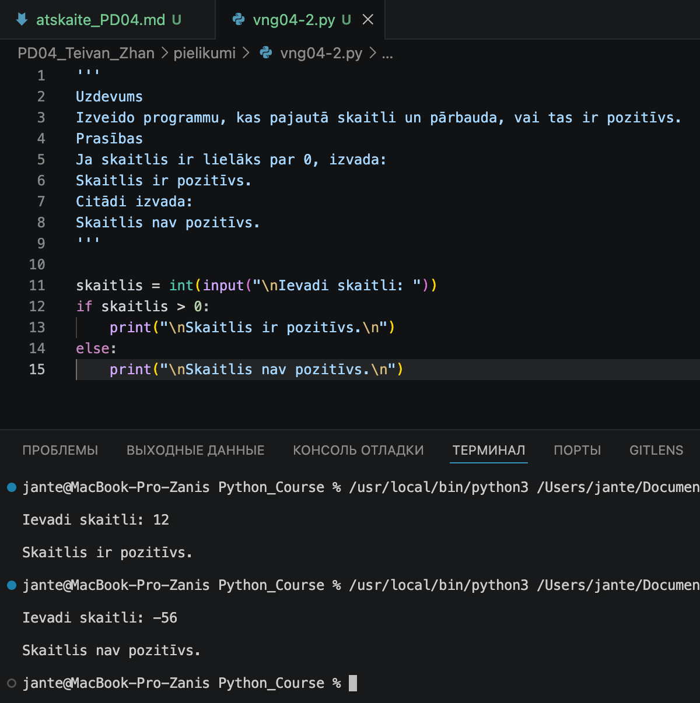

---

## Komentāri / piezīmes

Programma pārbauda, vai lietotāja ievadītais skaitlis ir pozitīvs. Galvenā loģika 
balstās uz stingru nevienādību > 0. Skaitlis 0 un negatīvie skaitļi nonāk else blokā, 
jo tie neatbilst pozitīva skaitļa nosacījumam.
Korektai salīdzināšanai tiek izmantota funkcija int(), kas konvertē teksta ievadi par 
veselu skaitli. Loģiskā zarošanās ļauj skaidri sadalīt visus iespējamos skaitļus divās 
grupās: tajos, kas ir lielāki par nulli, un visos pārējos.

---

# 🧩 vnginājums 05-1

# Faila nosaukums

```text id
vng05-1.py
```
---

## Python kods

```python id="mt3k0v"
Uzdevums
Zemāk dots bojāts kods. Tajā trūkst pareizas atkāpes.
temperatura = 39
if temperatura > 38:
print("Temperatūra ir paaugstināta.")         =======> nav atkāpes
else:
print("Temperatūra nav paaugstināta.")        =======> nav atkāpes
Sagaidāmais rezultāts
Programma darbojas bez 
IndentationError kļūdas
'''

temperatura = 39
if temperatura > 38:
    print("\nTemperatūra ir paaugstināta.\n")
else:
    print("\nTemperatūra nav paaugstināta.\n")
```
---

## Rezultāts / izvade

Pievieno:

* ekrānuzņēmumu.

Kods ar kļūdu

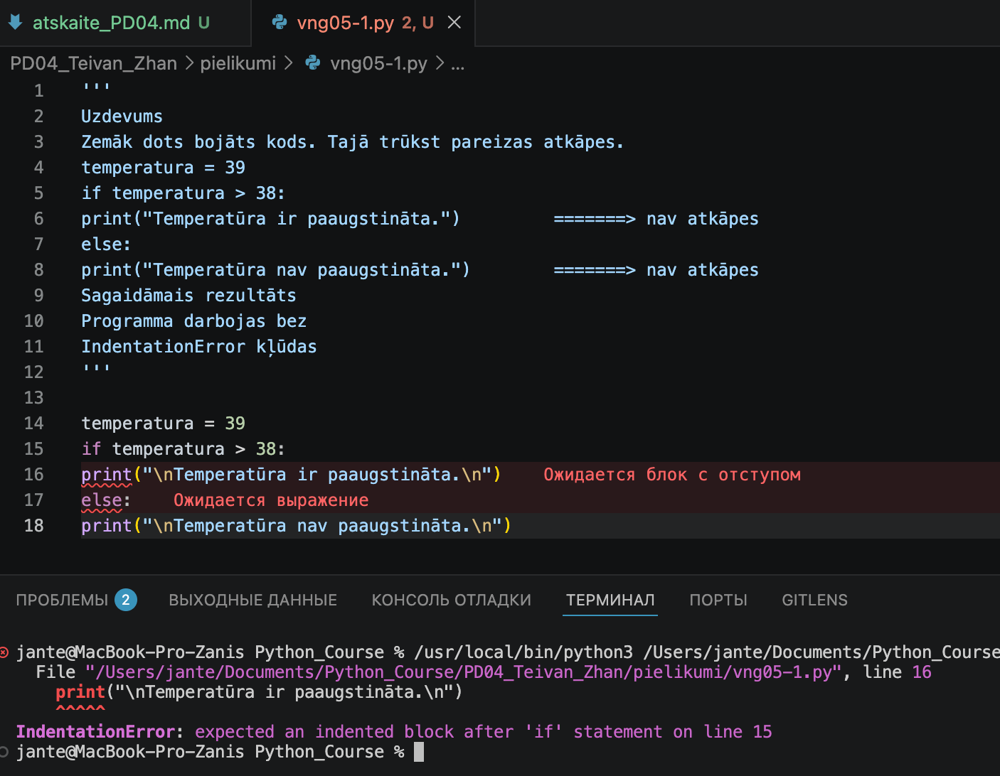

Kods ir labots

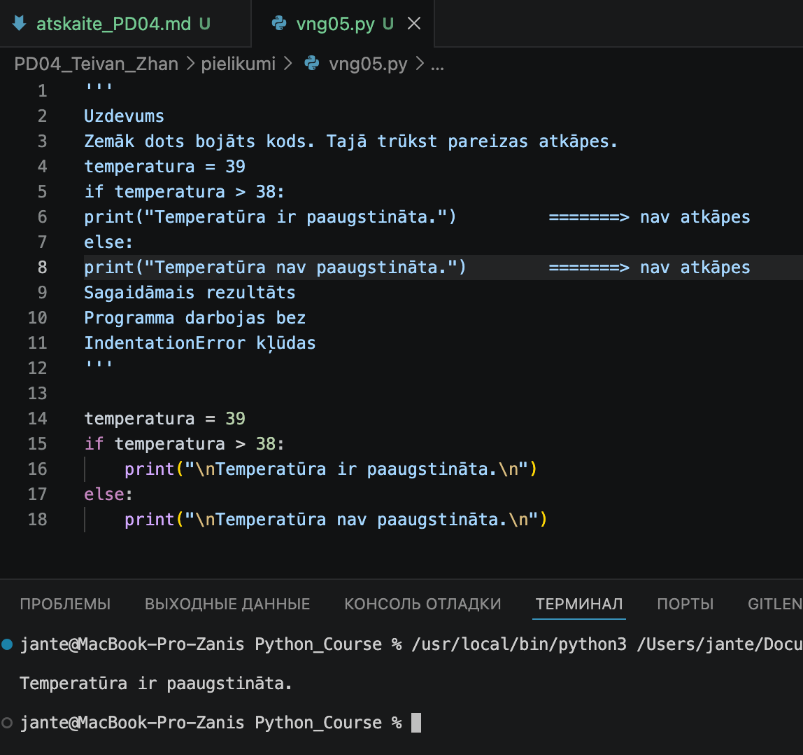

---

## Komentāri / piezīmes

Kļūdas apraksts: 
Mēģinot palaist kodu, tika saņemta IndentationError kļūda, jo koda blokiem trūka obligāto atkāpju.

Problēma: Funkcijas print() atradās vienā līmenī ar if un else atslēgvārdiem, kas Python sintaksē nav pieļaujams.

Risinājums: Pievienotas atkāpes (4 atstarpes) pirms funkcijām, lai loģiski iekļautu tās attiecīgajos nosacījuma blokos.

Rezultāts: Programma darbojas bez kļūdām un pareizi apstrādā loģisko zarošanos.

---

# 🧩 vnginājums 05-2

# Faila nosaukums

```text id
vng05-2.py
```
---

## Python kods

```python id="mt3k0v"
'''
'''
Uzdevums
Zemāk dots bojāts kods. Pārraksti to savā failā, palaid un izlabo kļūdu.
vecums = 18
if vecums = 18: if vecums = 18:  =====> Kļūda: tiek izmantots piešķiršanas operators "=" nevis salīdzināšanas operators "=="
    print("Vecums ir 18.")
else:
    print("Vecums nav 18.")
Tev jāizdara
1. Iekopē bojāto kodu failā.
2. Palaid programmu.
3. Apskati kļūdas paziņojumu.
4. Izlabo kodu.
5. Atskaitei pieraksti, kas bija kļūdas iemesls.
'''

vecums = 18
if vecums == 18:
    print("\nVecums ir 18.\n")
else:
    print("\nVecums nav 18.\n")
```
---

## Rezultāts / izvade

Pievieno:

* ekrānuzņēmumu.

Kods ar kļūdu

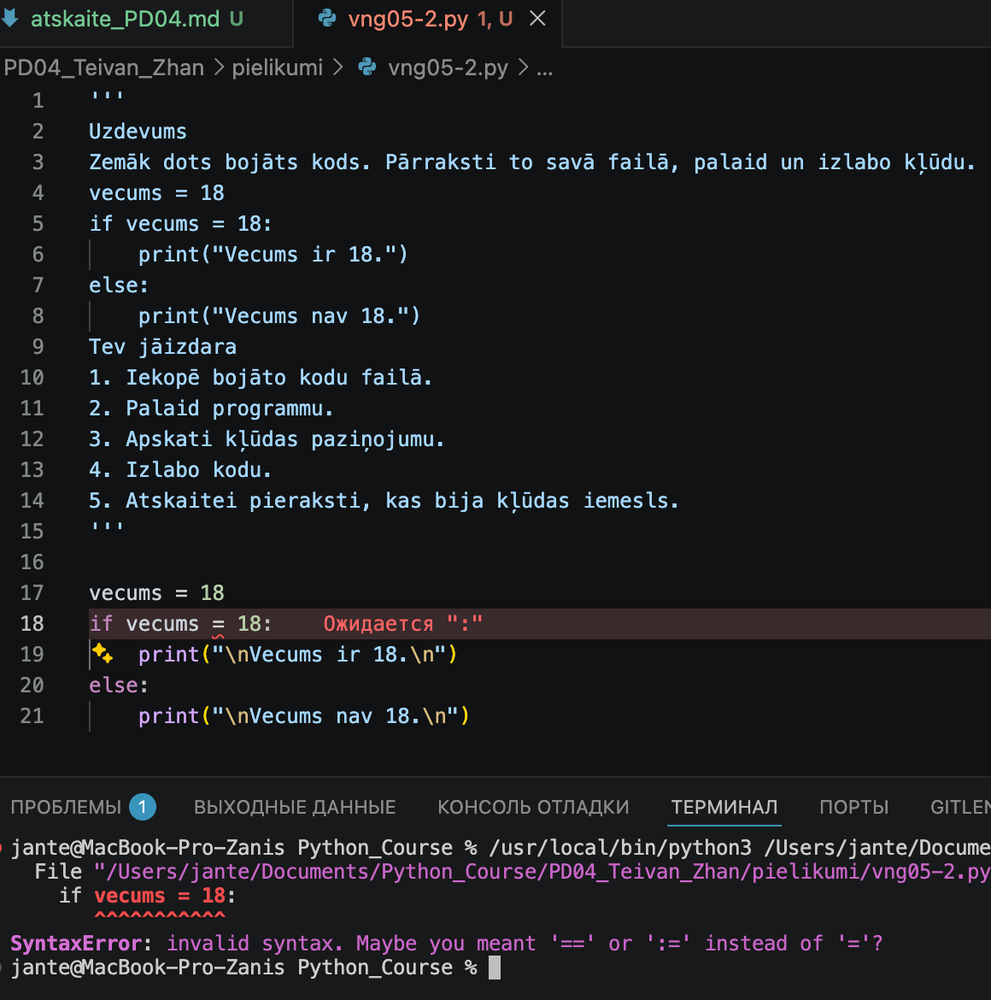

Kods ir labots

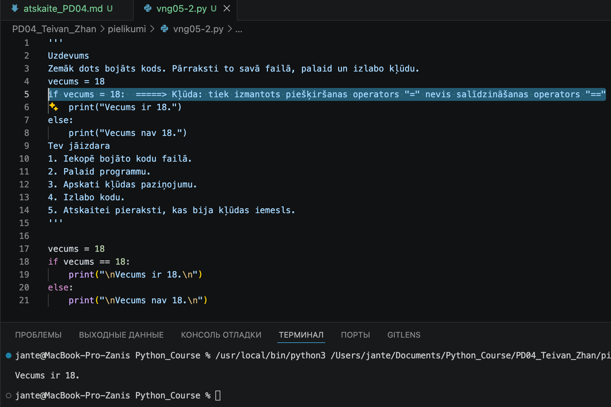

---

## Komentāri / piezīmes

#### Kļūdas apraksts:
Programma nefunkcionēja SyntaxError dēļ, jo if nosacījumā tika izmantots nepareizs operators.

#### Labošanas gaita:

Problēma: Izmantota viena vienādības zīme (=), kas ir piešķiršanas operators, nevis salīdzināšanas.

Risinājums: Nomainīts operators uz ==, kas paredzēts vērtību salīdzināšanai.

Rezultāts: Kods darbojas korekti, atgriežot loģisko vērtību un izpildot attiecīgo bloku.

---

# 🧩 vnginājums 06-1 

# Faila nosaukums

```text id="sdm8v5"
vng06-1.py
```
---

## Python kods

```python id="mt3k0v"
if temperatura > 100 or temperatura < 0:
    print(f"\nKļūda: Temperatūra {temperatura}°C nav iespējama šādos apstākļos!\n")
elif temperatura == 100:
    print(f"\nŪdens vārās! Temperatūra ir sasniegusi {temperatura}°C.\n")
else:
    print(f"\nŪdens vēl nevārās. Pašreizējā temperatūra: {temperatura}°C.\n")
```
---

## Rezultāts / izvade

Pievieno:

* ekrānuzņēmumu.

Rezultāts

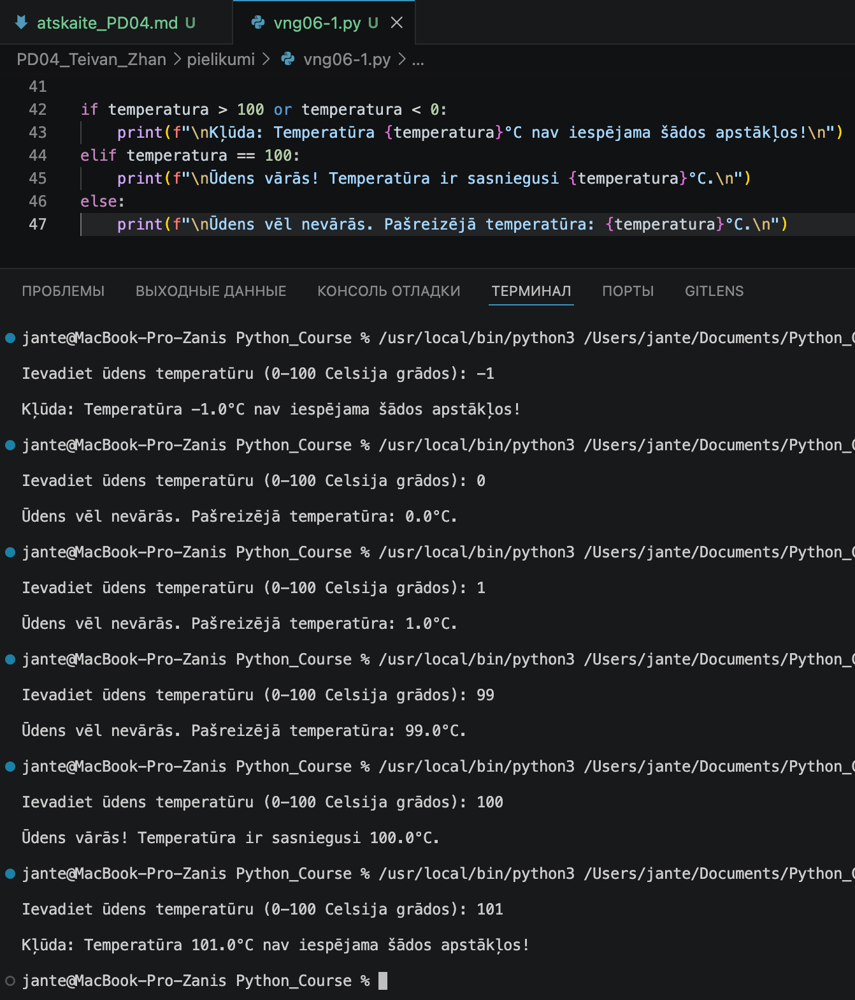

---

## Komentāri / piezīmes

Uzdevums: Ūdens vārīšanās temperatūras pārbaude

Mērķis:
Izveidot programmu, kas simulē temperatūras kontroli, izmantojot zarošanās loģiku (if-elif-else) un 
vairāku nosacījumu pārbaudi vienā rindā (or).

Uzdevuma nosacījumi:

Lietotājs ievada temperatūru kā decimālskaitli (float).

Programma pārbauda, vai ievadītā vērtība ir loģiskajās robežās (no 0 līdz 100 grādiem). Ja nē — 
izvada kļūdas paziņojumu.

Ja temperatūra ir precīzi 100 grādi, programma paziņo, ka ūdens vārās.

Ja temperatūra ir zem 100 grādiem, programma paziņo, ka vārīšanās vēl nav sākusies.

Sagaidāmie rezultāti (Expected Results)

1. scenārijs (Kļūda):

Ievadiet ūdens temperatūru (0-100 Celsija grādos): 105
Kļūda: Temperatūra 105.0°C nav iespējama šādos apstākļos!


2. scenārijs (Vārīšanās):

Ievadiet ūdens temperatūru (0-100 Celsija grādos): 100
Ūdens vārās! Temperatūra ir sasniegusi 100.0°C.


3. scenārijs (Zema temperatūra):

Ievadiet ūdens temperatūru (0-100 Celsija grādos): 75.5
Ūdens vēl nevārās. Pašreizējā temperatūra: 75.5°C.

---

# 🧩 vnginājums 06-2

# Faila nosaukums

```text id
vng05-1.py
```
---

## Python kods

```python id="mt3k0v"
'''
Uzdevums
Zemāk dots bojāts kods. Tajā trūkst pareizas atkāpes.
temperatura = 39
if temperatura > 38:
print("Temperatūra ir paaugstināta.")         =======> nav atkāpes
else:
print("Temperatūra nav paaugstināta.")        =======> nav atkāpes
Sagaidāmais rezultāts
Programma darbojas bez 
IndentationError kļūdas
'''
temperatura = 39
if temperatura > 38:
    print("\nTemperatūra ir paaugstināta.\n")
else:
    print("\nTemperatūra nav paaugstināta.\n")
```
---

## Rezultāts / izvade

Pievieno:

* ekrānuzņēmumu.

Kods ar kļūdu

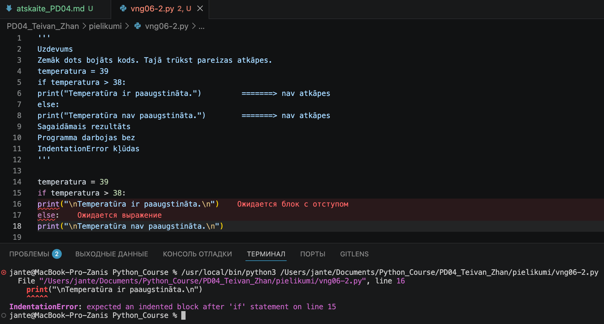

Kods ir labots

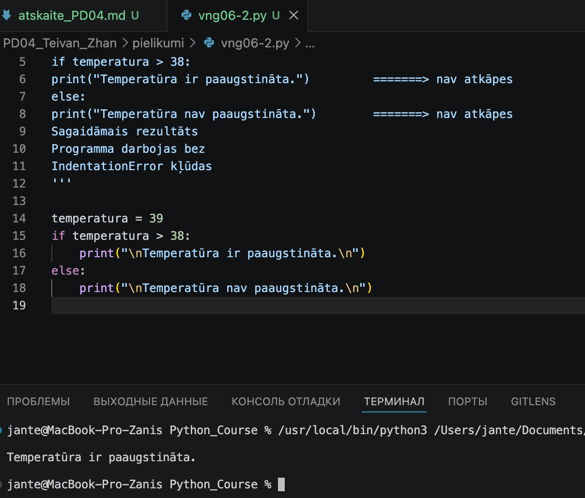

---

## Komentāri / piezīmes

Atšķirībā no citām programmēšanas valodām (piemēram, C++ vai Java), kur izmanto figūriekavas {}, 
Python paļaujas uz vizuālo struktūru:

Kols (:) kā signāls:
Kad Python redz kolu rindas beigās (if ... : vai else:), tas saprot, ka tālāk sekos koda bloks, 
kas izpildīsies tikai pie konkrētā nosacījuma.

Atkāpes (Indentation) loma:

Viss, kas ir nobīdīts pa labi (parasti par 4 atstarpēm) zem if teikuma, tiek uzskatīts par šī 
nosacījuma "ķermeni".

Ja atkāpes nav (kā dotajā bojātajā piemērā), Python "pazaudē" saikni un izvada IndentationError. 
Interpretators vienkārši nezina, ka print funkcija ir daļa no pārbaudes.

Vertikālā izlīdzināšana:
Python saprot, ka bloks ir beidzies, kad rinda atkal sākas tajā pašā līmenī, kurā sākās if.

---

# Piedzīvojumi un secinājumi

  Mācību process kļūst arvien sarežģītāks, interesantāks un apjomīgāks. Ir patīkami pārsteidzoši, 
  ka tiek skarta arī lietotņu testēšanas joma. Šķiet, ka, ņemot vērā nepieciešamību veidot detalizētus 
  paveiktā darba aprakstus, kursos iegūtās zināšanas būs tiešām praktiski pielietojamas.

# Pamatota pašnovērtējums

*Vai var cerēt uz maksimālo vērtējumu?*