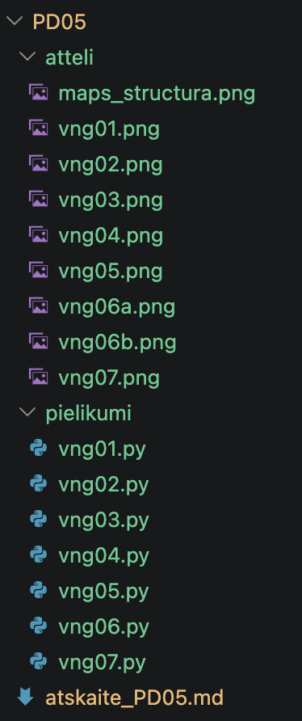
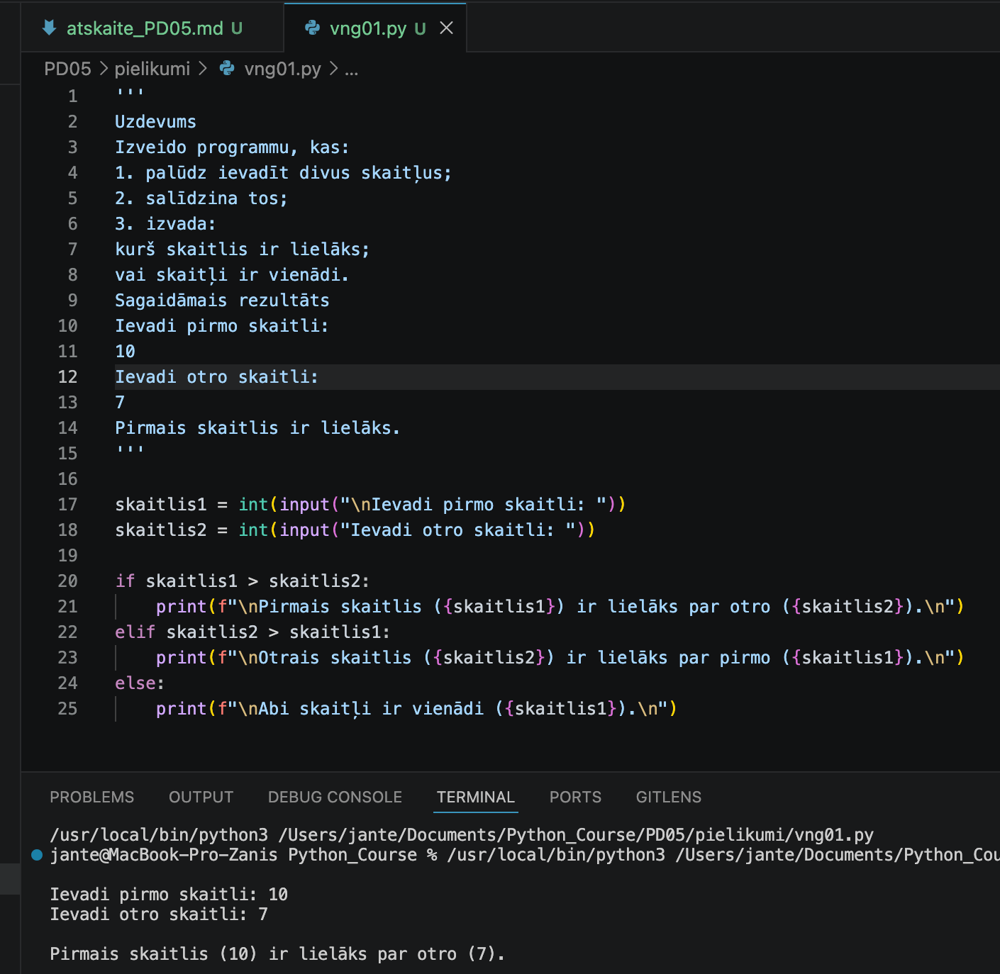
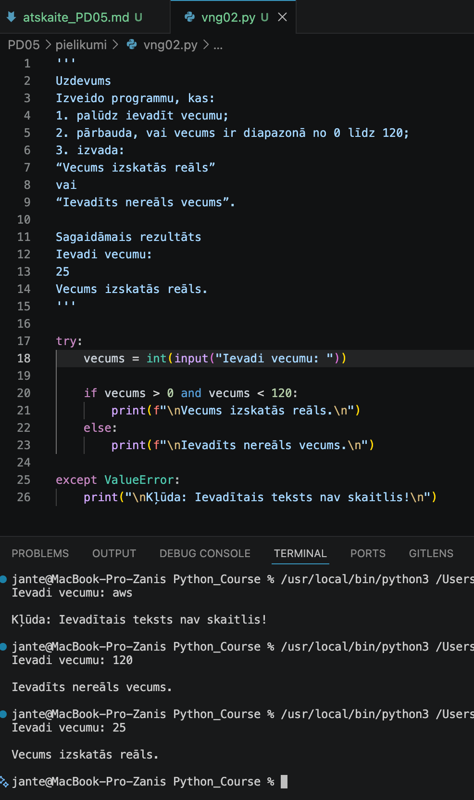
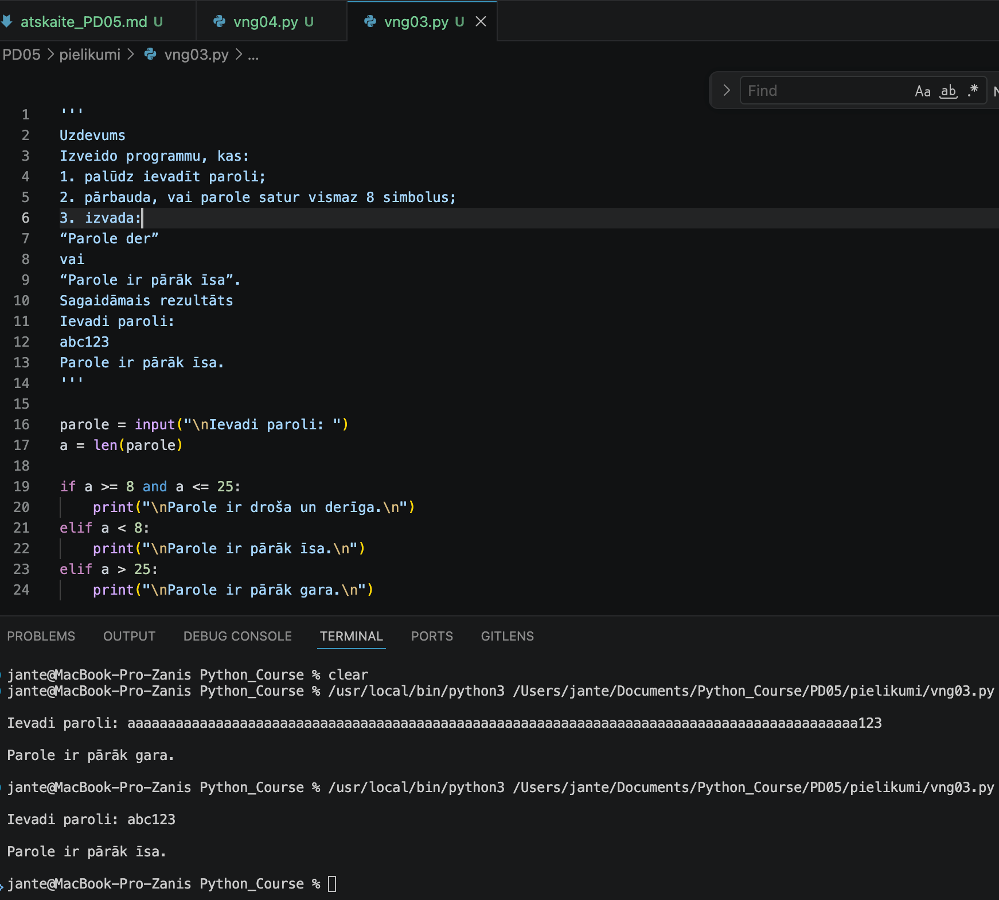
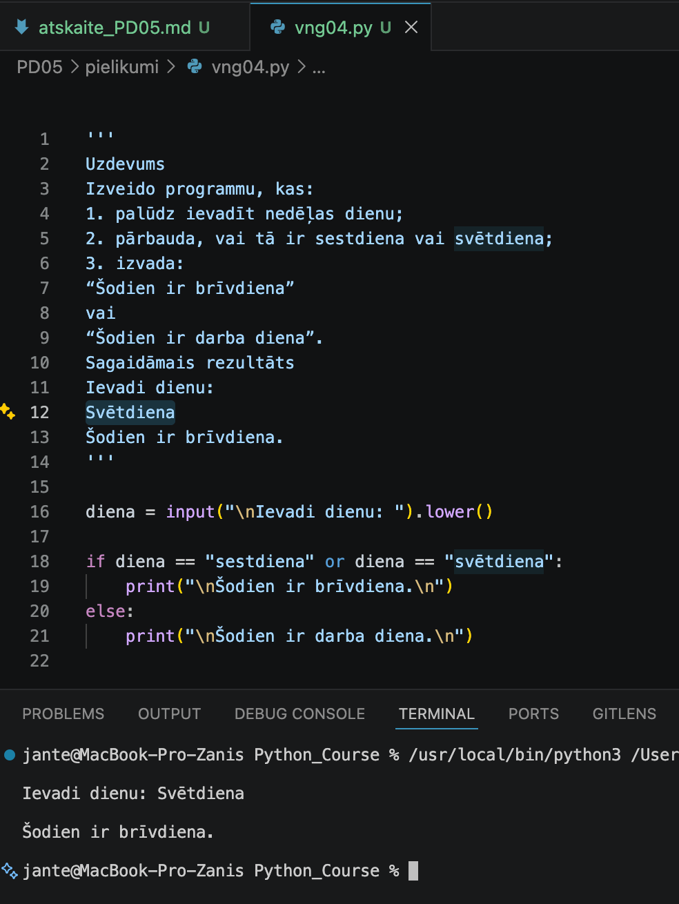
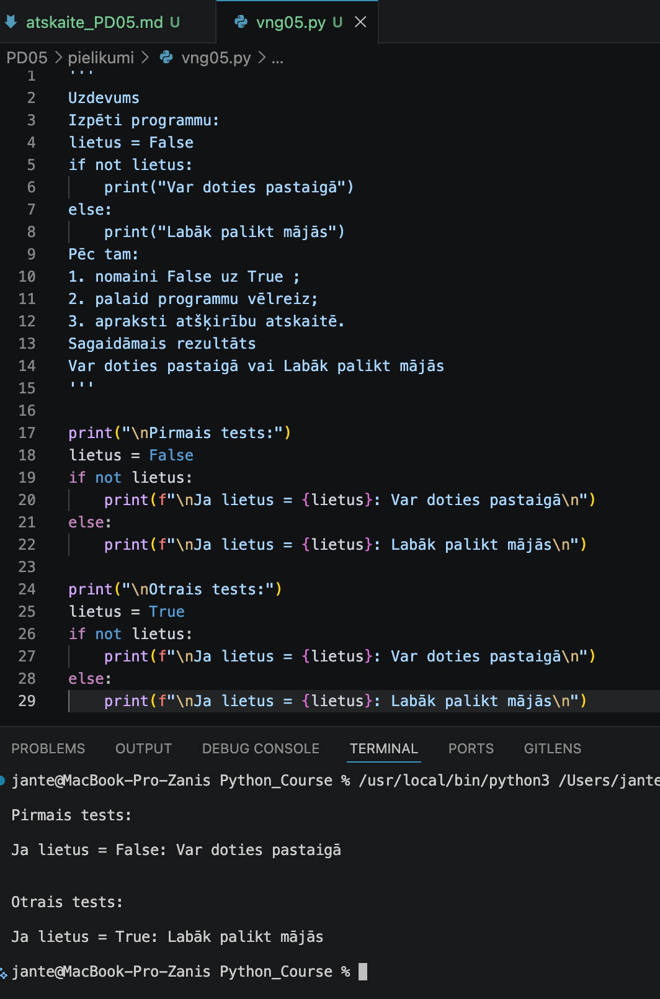
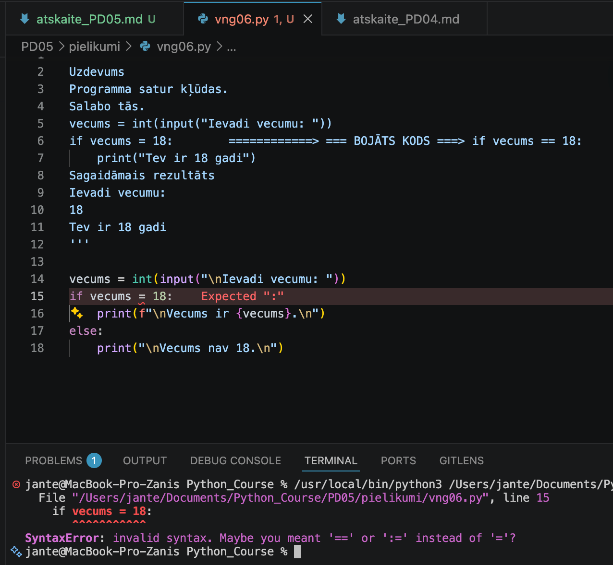
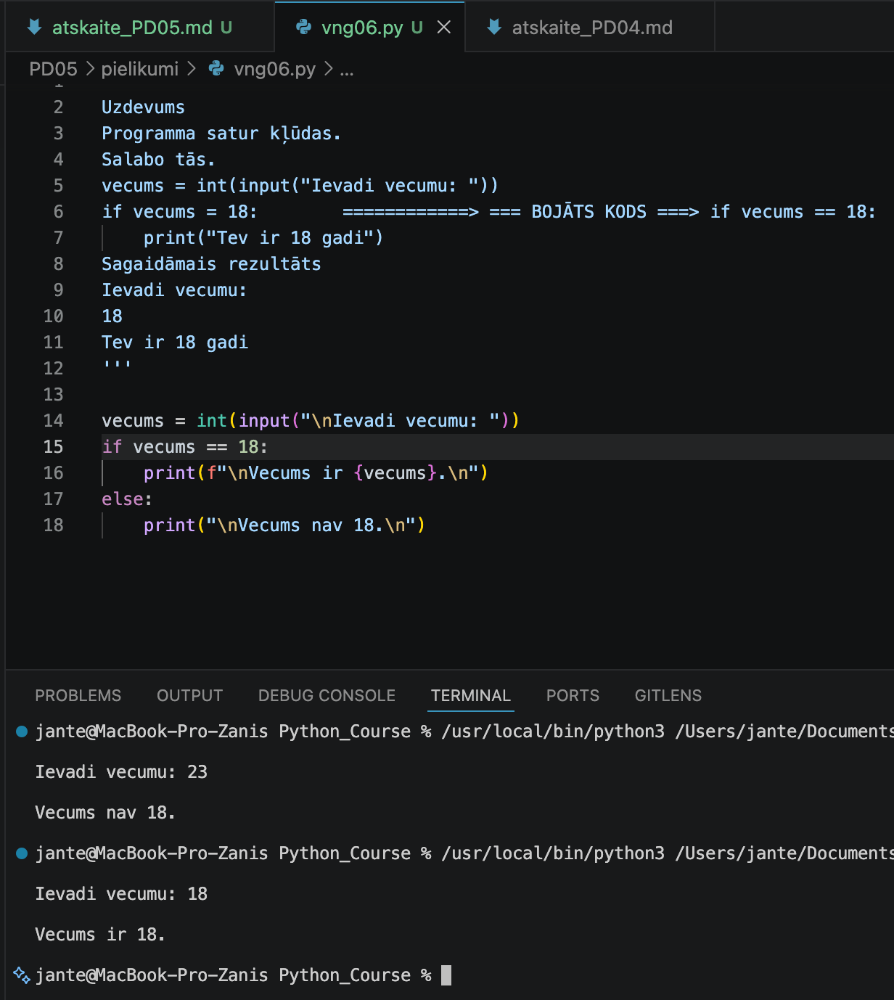
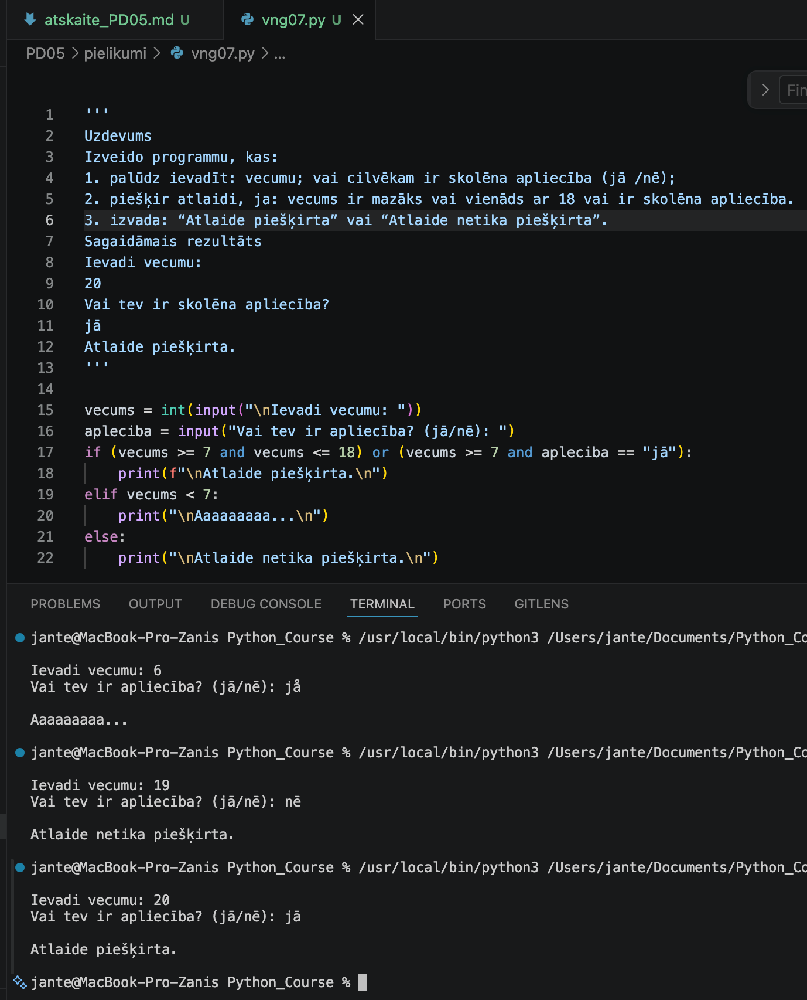

# Praktiskā darba atskaite — PD05

**Tēma:** Lēmumu pieņemšana programmā 
**Vārds, Uzvārds:** Zhan Teivan 
**Datums:** 2026-05-16  
**Grupa:**  DAAVP_Daugavpils_80


[Mana praktiskā darba mape GitHub platformā](https://github.com/JanTey/Python_Course/blob/main/PD05/atskaite_PD05.md)

---
# 📁 0. Sagatavošanās darbi

Pārbaudi, vai sagatavota darba vide:

* [x] Izveidota mape `PD05`
* [x] Izveidota apakšmape `pielikumi`
* [x] Izveidota apakšmape `atteli`
* [x] Izveidots fails `atskaite_PD04.md`

---

## Mapju struktūra

```text
PD05/
├─ Pielikumi/
│  ├─ vng01.py
│  ├─ vng02.py
│  ├─ vng03.py
│  ├─ vng04.py
│  ├─ vng05.py
│  ├─ vng06.py
│  └─ vng07.py
├─ atteli/
│  ├─ maps_structure.png
│  ├─ vng01.png
│  ├─ vng02.png
│  ├─ vng03.png
│  ├─ vng04.png
│  ├─ vng04-2.png
│  ├─ vng05.png
│  ├─ vng06a.png
│  ├─ vng06b.png
│  └─ vng07.png
└─ atskaite_PD05.md
````

---

## Ekrānuzņēmums

Pievieno ekrānuzņēmumu ar mapes struktūru.

```markdown id="j0m2om"
[Mapes struktūra](atteli/maps_structura.png)
```


---

# 🧩 vnginājums 01

## Faila nosaukums

```text id="sdm8v5"
vng01.py
```
---

## Python kods

```python id="mt3k0v"
'''
'''
Uzdevums
Izveido programmu, kas:
1. palūdz ievadīt divus skaitļus;
2. salīdzina tos;
3. izvada:
kurš skaitlis ir lielāks;
vai skaitļi ir vienādi.
Sagaidāmais rezultāts
Ievadi pirmo skaitli:
10
Ievadi otro skaitli:
7
Pirmais skaitlis ir lielāks.
'''

skaitlis1 = int(input("\nIevadi pirmo skaitli: "))
skaitlis2 = int(input("Ievadi otro skaitli: "))

if skaitlis1 > skaitlis2:
    print(f"\nPirmais skaitlis ({skaitlis1}) ir lielāks par otro ({skaitlis2}).\n")
elif skaitlis2 > skaitlis1:
    print(f"\nOtrais skaitlis ({skaitlis2}) ir lielāks par pirmo ({skaitlis1}).\n")
else:
    print(f"\nAbi skaitļi ir vienādi ({skaitlis1}).\n")
```
---

## Rezultāts / izvade

Pievieno:

* ekrānuzņēmumu.

Rezultāts



---

## Komentāri / piezīmes

Šajā kodā izmantojam zarošanos ar trim variantiem: programma ne tikai nosaka, kurš skaitlis ir 
lielāks, bet arī saprot, kad tie ir vienādi. Ievadītie dati tiek pārveidoti par int, lai 
salīdzināšana darbotos pareizi.

---

# 🧩 vnginājums 02

## Faila nosaukums

```text id
vng02.py
```
---

## Python kods

```python id="mt3k0v"
'''
Uzdevums
Izveido programmu, kas:
1. palūdz ievadīt vecumu;
2. pārbauda, vai vecums ir diapazonā no 0 līdz 120;
3. izvada:
“Vecums izskatās reāls”
vai
“Ievadīts nereāls vecums”.

Sagaidāmais rezultāts
Ievadi vecumu:
25
Vecums izskatās reāls.
'''

try:
    vecums = int(input("Ievadi vecumu: "))
    
    if vecums > 0 and vecums < 120:
        print(f"\nVecums izskatās reāls.\n")
    else:
        print(f"\nIevadīts nereāls vecums.\n")
        
except ValueError:
    print("\nKļūda: Ievadītais teksts nav skaitlis!\n")
```
---

## Rezultāts / izvade

Pievieno:

* ekrānuzņēmumu.

Rezultāts



---

## Komentāri / piezīmes

Šajā kodā tiek pārbaudīts skaitliskais intervāls, izmantojot and operatoru un if-else 
konstrukciju. Tāpat tiek izmantots try-except bloks datu validācijai, kas novērš programmas 
sabojāšanos, ja tiek ievadīti neatbilstoši simboli (burti).

---

# 🧩 vnginājums 03 

## Faila nosaukums

```text id="sdm8v5"
vng03.py
```
---

## Python kods

```python id="mt3k0v"
'''
Uzdevums
Izveido programmu, kas:
1. palūdz ievadīt paroli;
2. pārbauda, vai parole satur vismaz 8 simbolus;
3. izvada:
“Parole der”
vai
“Parole ir pārāk īsa”.
Sagaidāmais rezultāts
Ievadi paroli:
abc123
Parole ir pārāk īsa.
'''

parole = input("\nIevadi paroli: ")
a = len(parole)

if a >= 8 and a <= 25:
    print("\nParole ir droša un derīga.\n")
elif a < 8:
    print("\nParole ir pārāk īsa.\n")
elif a > 25:
    print("\nParole ir pārāk gara.\n")
```
---

## Rezultāts / izvade

Pievieno:

* ekrānuzņēmumu.

Rezultāts



---

## Komentāri / piezīmes

Šajā kodā ir īstenota paroles pārbaude, kas apvieno divus nosacījumus, izmantojot operatoru „and“.
Programma secīgi pārbauda paroles drošību garuma diapazonā a >= 8 un a <= 25 (8 <= a <= 25): tiek pārbaudīts, vai parole nav pārāk īsa vai pārāk gara.

---

# 🧩 vnginājums 04 

## Faila nosaukums

```text id
vng04.py
```
---

## Python kods

```python id="mt3k0v"
'''
Uzdevums
Izveido programmu, kas:
1. palūdz ievadīt nedēļas dienu;
2. pārbauda, vai tā ir sestdiena vai svētdiena;
3. izvada:
“Šodien ir brīvdiena”
vai
“Šodien ir darba diena”.
Sagaidāmais rezultāts
Ievadi dienu:
Svētdiena
Šodien ir brīvdiena.
'''

diena = input("\nIevadi dienu: ").lower()

if diena == "sestdiena" or diena == "svētdiena":
    print("\nŠodien ir brīvdiena.\n")
else:
    print("\nŠodien ir darba diena.\n")
```
---

## Rezultāts / izvade

Pievieno:

* ekrānuzņēmumu.

Kods ir labots



---

## Komentāri / piezīmes

Šajā kodā mēs trenējam loģiskā operatora or (VAI) izmantošanu, lai pārbaudītu vairākus 
nosacījumus vienlaicīgi. Metode .lower() automātiski pārvērš ievadīto tekstu mazajos 
burtos, kas pasargā programmu no kļūdām, ja lietotājs dienu ieraksta ar lielo burtu 
(piemēram, "Svētdiena"). Ja ir ievadīts "sestdiena" VAI "svētdiena", programma nosaka, 
ka tā ir brīvdiena, bet visos pārējos gadījumos — darba diena.

---

# 🧩 vnginājums 05

## Faila nosaukums

```text id
vng05.py
```
---

## Python kods

```python id="mt3k0v"
'''
Uzdevums
Izpēti programmu:
lietus = False
if not lietus:
    print("Var doties pastaigā")
else:
    print("Labāk palikt mājās")
Pēc tam:
1. nomaini False uz True ;
2. palaid programmu vēlreiz;
3. apraksti atšķirību atskaitē.
Sagaidāmais rezultāts 
Var doties pastaigā vai Labāk palikt mājās
'''

print("\nPirmais tests:")
lietus = False
if not lietus:
    print(f"\nJa lietus = {lietus}: Var doties pastaigā\n")
else:
    print(f"\nJa lietus = {lietus}: Labāk palikt mājās\n")    
    
print("\nOtrais tests:")
lietus = True
if not lietus:
    print(f"\nJa lietus = {lietus}: Var doties pastaigā\n")
else:
    print(f"\nJa lietus = {lietus}: Labāk palikt mājās\n")   
```
---

## Rezultāts / izvade

Pievieno:

* ekrānuzņēmumu.

Rezultāts



---

## Komentāri / piezīmes

Pirmais tests:
Operators not apgriež otrādi (invertē) loģisko vērtību. Šajā kodā nosacījums if not lietus 
burtiski nozīmē: "Ja lietus IR". Tā kā mainīgais lietus ir False, operators not pārvērš 
to par True. Rezultātā programmas izpilde pāriet un iesaka doties pastaigā.
Otrais tests:
Šajā kodā nosacījums if not lietus 
burtiski nozīmē: "Ja lietus NAV". Tā kā mainīgais lietus ir True, operators not pārvērš 
to par False. Rezultātā programmas izpilde pāriet uz else bloku un iesaka palikt mājās.

---

# 🧩 vnginājums 06

# Faila nosaukums

```text id
vng06.py
```
---

## Python kods

```python id="mt3k0v"
'''
Uzdevums
Programma satur kļūdas.
Salabo tās.
vecums = int(input("Ievadi vecumu: "))
if vecums = 18:        ============> === BOJĀTS KODS ===> if vecums == 18:
    print("Tev ir 18 gadi")
Sagaidāmais rezultāts
Ievadi vecumu:
18
Tev ir 18 gadi
'''

vecums = int(input("\nIevadi vecumu: "))
if vecums == 18:
    print(f"\nVecums ir {vecums}.\n")
else:
    print("\nVecums nav 18.\n")
```
---

## Rezultāts / izvade

Pievieno:

* ekrānuzņēmumu.

Kods ar kļūdu



Kods ir labots



---

## Komentāri / piezīmes

Galvenā kļūda sākotnējā kodā bija viena vienādības buma (=) izmantošana if nosacījumā. 
Python valodā viena zīme = kalpo vērtības piešķiršanai mainīgajam, turpretim vērtību 
salīdzināšanai obligāti ir jāizmanto dubultā vienādības zīme (==). Pēc šīs sintakses 
kļūdas labošanas programma veiksmīgi salīdzina ievadīto vecumu ar skaitli 18. Papildus 
kods tika paplašināts ar else bloku, lai programma sniegtu atbildi arī tad, ja lietotājam 
nav precīzi 18 gadu.

---

# 🧩 vnginājums 07

# Faila nosaukums

```text id
vng07.py
```
---

## Python kods

```python id="mt3k0v"
'''
Uzdevums
Izveido programmu, kas:
1. palūdz ievadīt: vecumu; vai cilvēkam ir skolēna apliecība (jā /nē);
2. piešķir atlaidi, ja: vecums ir mazāks vai vienāds ar 18 vai ir skolēna apliecība.
3. izvada: “Atlaide piešķirta” vai “Atlaide netika piešķirta”.
Sagaidāmais rezultāts
Ievadi vecumu:
20
Vai tev ir skolēna apliecība?
jā
Atlaide piešķirta.
'''

vecums = int(input("\nIevadi vecumu: "))
apleciba = input("Vai tev ir apliecība? (jā/nē): ")
if (vecums >= 7 and vecums <= 18) or (vecums >= 7 and apleciba == "jā"):
    print(f"\nAtlaide piešķirta.\n")
elif vecums < 7:
    print("\nAaaaaaaaa...\n")
else:
    print("\nAtlaide netika piešķirta.\n")
```
---

## Rezultāts / izvade

Pievieno:

* ekrānuzņēmumu.

Rezultāts



---

## Komentāri / piezīmes

Programma pārbauda lietotāja ievadītos datus (vecumu un dokumenta esamību). and un or 
izmantošana: pateicoties iekavām, operatori ir apvienoti divās neatkarīgās loģiskās 
grupās. Atlaide tiek piešķirta vai nu stingri pēc vecuma (no 7 līdz 18 gadiem), vai arī 
vecumā no 19 gadiem, bet ar obligātu apliecības esamību. Ja vecums ir mazāks par 7 gadiem, 
rodas jautājums, vai bērnam noteiktos apstākļos ir tiesības kaut ko iegādāties.

---

# Piedzīvojumi un secinājumi

  Lielu interesi radīja operators not. Bija aizraujoši eksperimentēt ar "dubulto noliegumu" un 
  izprast, kā tieši if not lietus pārvērš False par True un kā to var izmantot validācijas uzdevumos.
  Tas liek smadzenēm strādāt pavisam citā režīmā, un nācās pasvīst, lai visu saliktu pa plauktiņiem.

# Pamatota pašnovērtējums

*Domāju, ka uzdevumus esmu izpildījis precīzi un detalizēti, kas varētu tikt novērtēts ar 100%. 
Tomēr neviens nav apdrošināts pret kļūdām.*