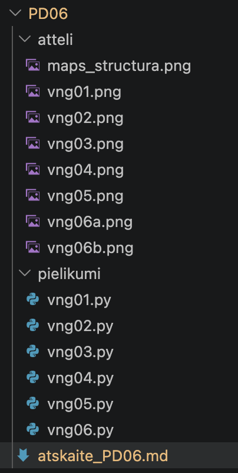
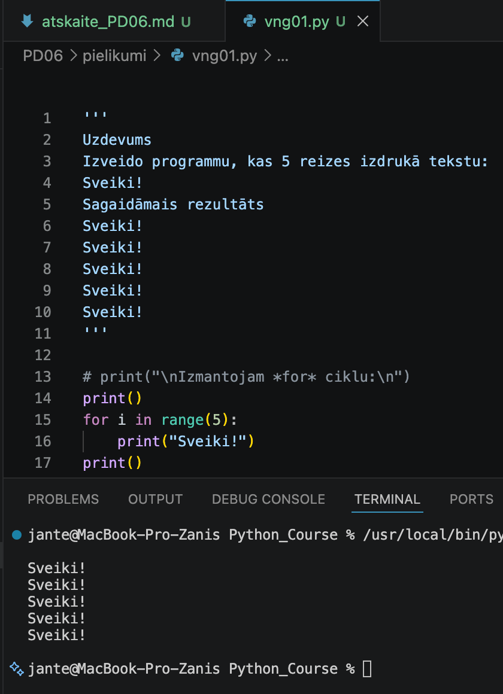
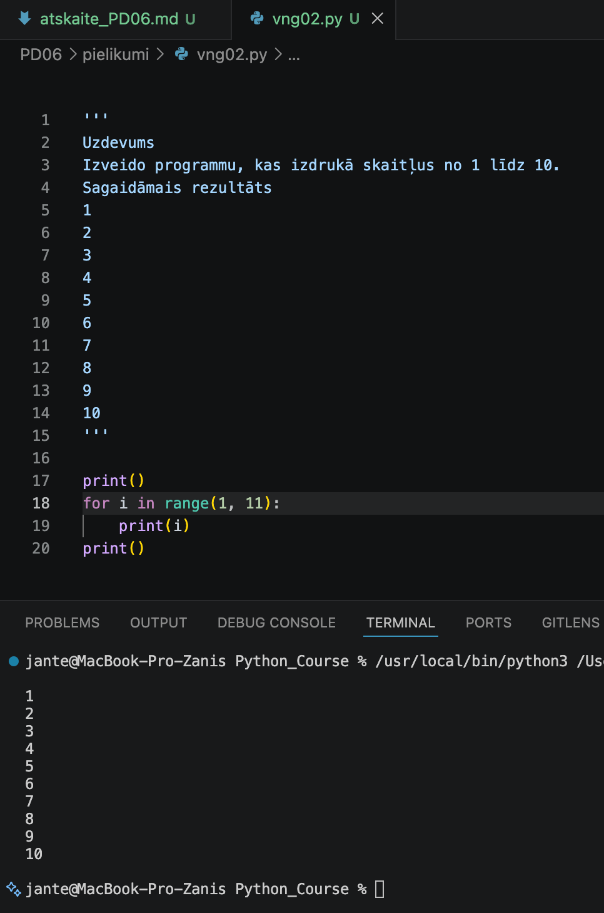
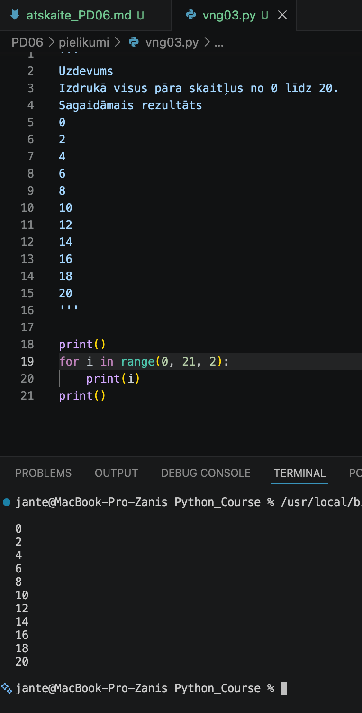
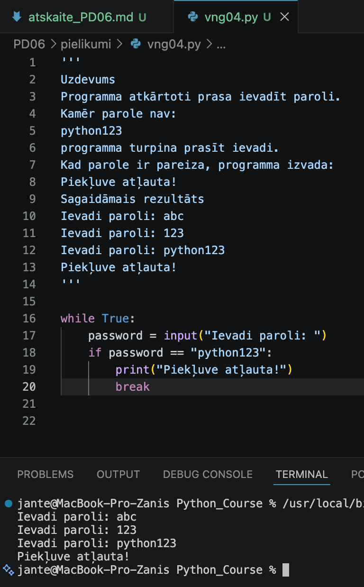
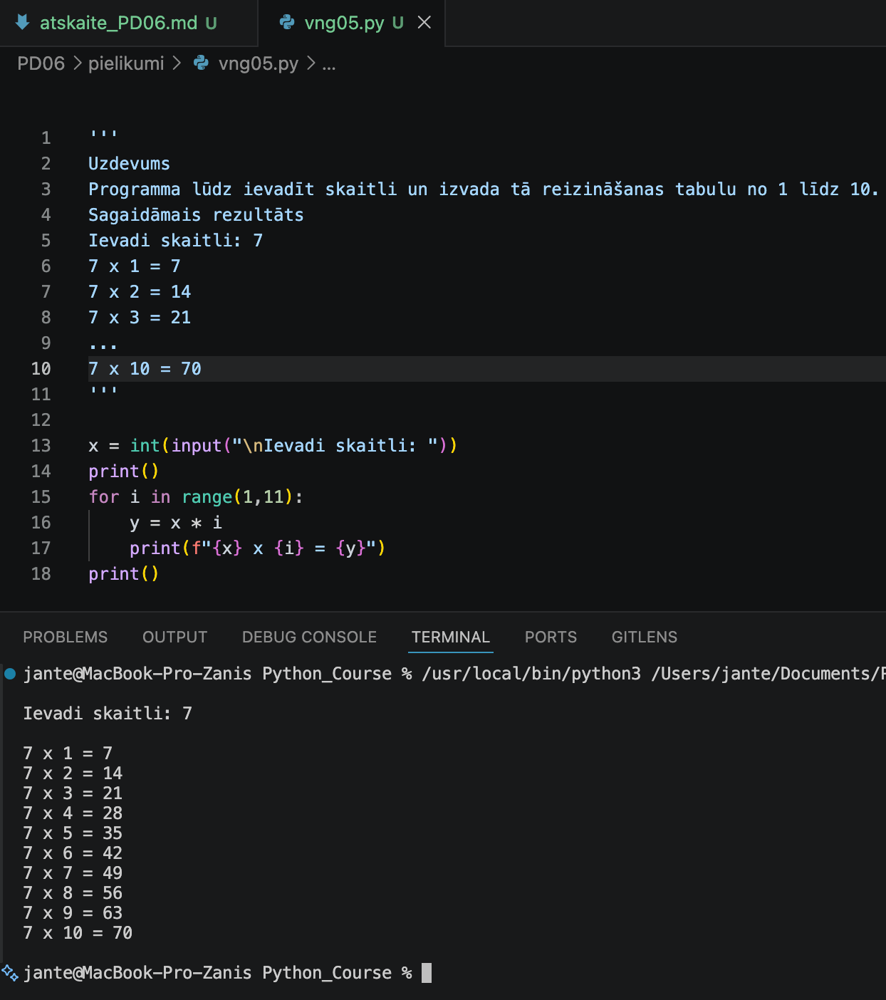
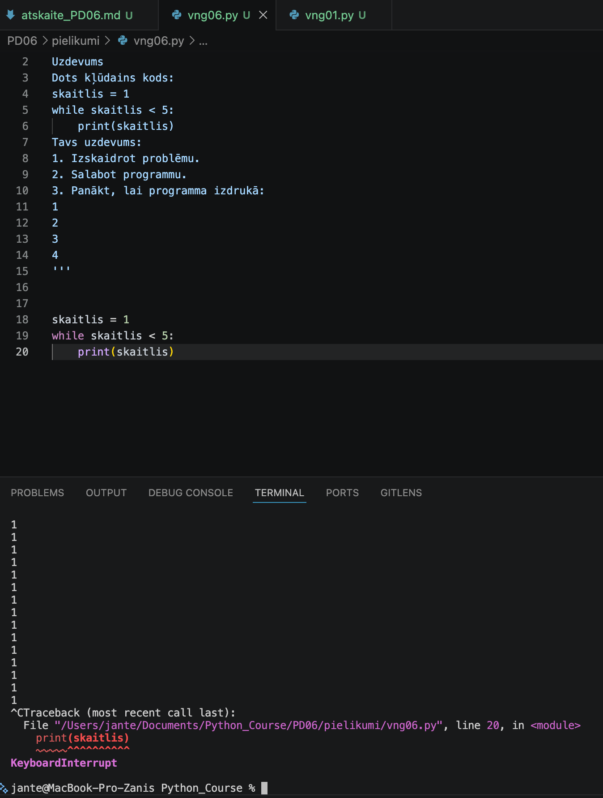
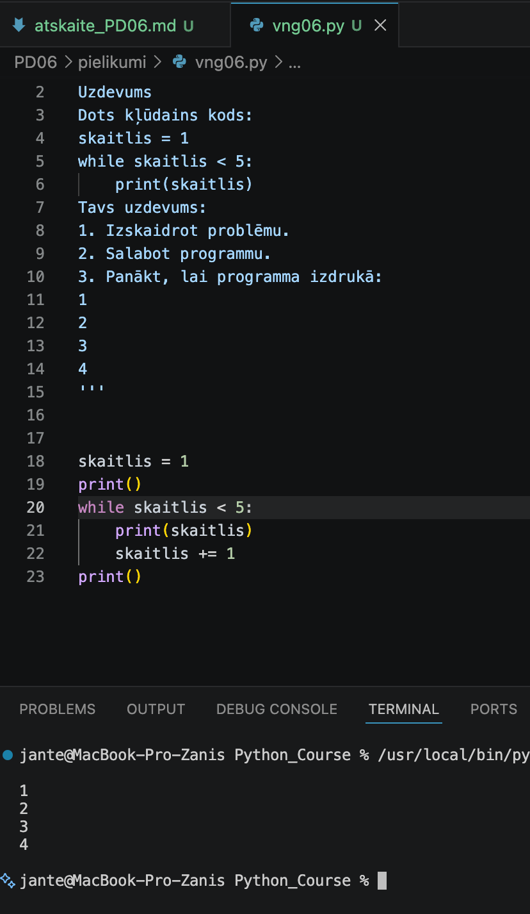

# Praktiskā darba atskaite — PD06

**Tēma:** Lēmumu pieņemšana programmā 
**Vārds, Uzvārds:** Zhan Teivan 
**Datums:** 2026-05-16  
**Grupa:**  DAAVP_Daugavpils_80


[Mana praktiskā darba mape GitHub platformā](https://github.com/JanTey/Python_Course/blob/main/PD06/atskaite_PD06.md)

---
# 📁 0. Sagatavošanās darbi

Pārbaudi, vai sagatavota darba vide:

* [x] Izveidota mape `PD06`
* [x] Izveidota apakšmape `pielikumi`
* [x] Izveidota apakšmape `atteli`
* [x] Izveidots fails `atskaite_PD06.md`

---

## Mapju struktūra

```text
PD06/
├─ Pielikumi/
│  ├─ vng01.py
│  ├─ vng02.py
│  ├─ vng03.py
│  ├─ vng04.py
│  ├─ vng05.py
│  └─ vng06.py
├─ atteli/
│  ├─ maps_structure.png
│  ├─ vng01.png
│  ├─ vng02.png
│  ├─ vng03.png
│  ├─ vng04.png
│  ├─ vng05.png
│  ├─ vng06a.png
│  └─ vng06b.png
└─ atskaite_PD06.md
````

---

## Ekrānuzņēmums

Pievieno ekrānuzņēmumu ar mapes struktūru.

```markdown id="j0m2om"
[Mapes struktūra](atteli/maps_structura.png)
```


---

# 🧩 vnginājums 01

## Faila nosaukums

```text id="sdm8v5"
vng01.py
```
---

## Python kods

```python id="mt3k0v"
'''
Uzdevums
Izveido programmu, kas 5 reizes izdrukā tekstu:
Sveiki!
Sagaidāmais rezultāts
Sveiki!
Sveiki!
Sveiki!
Sveiki!
Sveiki!
'''

# print("\nIzmantojam *for* ciklu:\n")
print()
for i in range(5):
    print("Sveiki!")   
print()
'''
print("\nIzmantojam *while* ciklu:\n")
i = 0
while i < 5:
    print("Sveiki!")
    i += 1 
print()
'''
```
---

## Rezultāts / izvade

Pievieno:

* ekrānuzņēmumu.

Rezultāts



---

## Komentāri / piezīmes

Papildus izpildīju uzdevumu, izmantojot ciklu „While“ 

---

# 🧩 vnginājums 02

## Faila nosaukums

```text id
vng02.py
```
---

## Python kods

```python id="mt3k0v"
'''
Uzdevums
Izveido programmu, kas izdrukā skaitļus no 1 līdz 10.
Sagaidāmais rezultāts
1
2
3
4
5
6
7
8
9
10
'''

print()
for i in range(1, 11):
    print(i)   
print()
```
---

## Rezultāts / izvade

Pievieno:

* ekrānuzņēmumu.

Rezultāts



---

## Komentāri / piezīmes

Programma demonstrē cikla for darbību ar skaitītāju. Izmantojot funkciju range(1, 11), 
cikls secīgi ģenerē skaitļus no 1 līdz 10 (ieskaitot) un izvada katru no tiem ekrānā 
jaunā rindā. Tukšās print() funkcijas koda sākumā un beigās tiek izmantotas vizuālajai 
formatēšanai, lai konsolē izveidotu atkāpes pirms un pēc skaitļu izvadīšanas.

---

# 🧩 vnginājums 03 

## Faila nosaukums

```text id="sdm8v5"
vng03.py
```
---

## Python kods

```python id="mt3k0v"
'''
'''
Uzdevums
Izdrukā visus pāra skaitļus no 0 līdz 20.
Sagaidāmais rezultāts
0
2
4
6
8
10
12
14
16
18
20
'''

print()
for i in range(0, 21, 2):
    print(i)
print()
```
---

## Rezultāts / izvade

Pievieno:

* ekrānuzņēmumu.

Rezultāts



---

## Komentāri / piezīmes

Programma demonstrē cikla for darbību, izmantojot trīs argumentus funkcijā range(start, stop, step).

0 — sākuma vērtība (atskaite sākas no nulles).

21 — beigu robeža (skaitlis 21 netiek ieskaitīts, tāpēc cikls apstājas pie 20).

2 — cikla solis.

Pateicoties solim 2, programma secīgi ģenerē un izvada ekrānā tikai pāra skaitļus diapazonā no 0 
līdz 20 (ieskaitot). Tukšās print() funkcijas kalpo vizuālajam noformējumam konsolē.

---

# 🧩 vnginājums 04 

## Faila nosaukums

```text id
vng04.py
```
---

## Python kods

```python id="mt3k0v"
'''
Uzdevums
Programma atkārtoti prasa ievadīt paroli.
Kamēr parole nav:
python123
programma turpina prasīt ievadi.
Kad parole ir pareiza, programma izvada:
Piekļuve atļauta!
Sagaidāmais rezultāts
Ievadi paroli: abc
Ievadi paroli: 123
Ievadi paroli: python123
Piekļuve atļauta!
'''

while True:
    password = input("Ievadi paroli: ")
    if password == "python123":
        print("Piekļuve atļauta!")
        break
```
---

## Rezultāts / izvade

Pievieno:

* ekrānuzņēmumu.

Kods ir labots



---

## Komentāri / piezīmes

Programma demonstrē cikla izveidi ar nezināmu atkārtojumu skaitu (dinamiskais cikls).

Konstrukcija while True izveido bezgalīgu ciklu, kas pieprasīs paroli no lietotāja atkal un atkal, 
līdz tiks ievadīta pareizā vērtība.

Cikla iekšienē ir iebūvēta validācija (if). Ja ievadītā rinda sakrīt ar "python123", programma 
izvada paziņojumu par piekļuvi.

Atslēgvārds break acumirklī pārtrauc bezgalīgā cikla darbību un nodod vadību kodam, kas seko aiz tā. 

---

# 🧩 vnginājums 05

## Faila nosaukums

```text id
vng05.py
```
---

## Python kods

```python id="mt3k0v"
'''
'''
Uzdevums
Programma lūdz ievadīt skaitli un izvada tā reizināšanas tabulu no 1 līdz 10.
Sagaidāmais rezultāts
Ievadi skaitli: 7
7 x 1 = 7
7 x 2 = 14
7 x 3 = 21
...
7 x 10 = 70
'''

x = int(input("\nIevadi skaitli: "))
print()
for i in range(1,11):
    y = x * i
    print(f"{x} x {i} = {y}")
print()     
```
---

## Rezultāts / izvade

Pievieno:

* ekrānuzņēmumu.

Rezultāts



---

## Komentāri / piezīmes

Programma dinamiski ģenerē reizināšanas tabulu lietotāja ievadītajam skaitlim.

Funkcija input() saņem vērtību, kas uzreiz tiek pārveidota par veselu skaitli, 
izmantojot int().

Cikls for i in range(1, 11) veic tieši 10 iterācijas, kur mainīgais i katrā 
aplī secīgi kļūst par skaitli no 1 līdz 10.

Cikla iekšienē notiek aprēķins (x * i) un rezultāta izvade, izmantojot 
f-rindas (f-strings)

---

# 🧩 vnginājums 06

# Faila nosaukums

```text id
vng06.py
```
---

## Python kods

```python id="mt3k0v"
'''
Uzdevums
Dots kļūdains kods:
skaitlis = 1
while skaitlis < 5:
    print(skaitlis)
Tavs uzdevums:
1. Izskaidrot problēmu.
2. Salabot programmu.
3. Panākt, lai programma izdrukā:
1
2
3
4
'''

skaitlis = 1
print()
while skaitlis < 5:
    print(skaitlis)
    skaitlis += 1 
print()
```
---

## Rezultāts / izvade

Pievieno:

* ekrānuzņēmumu.

Kods ar kļūdu



Kods ir labots



---

## Komentāri / piezīmes

Problēmas skaidrojums: Kodā radās bezgalīgs cikls, jo skaitītāja mainīgais skaitlis cikla 
iekšienē netika mainīts un visu laiku palika vienāds ar 1. Nosacījums skaitlis < 5 vienmēr 
bija patiess (True), kā rezultātā programma bezgalīgi drukāja skaitli 1, līdz tā tika piespiedu 
kārtā pārtraukta (KeyboardInterrupt).
Risinājums: Cikla ķermenī ir jāpievieno solis skaitlis += 1, lai katrā iterācijā vērtība 
palielinātos un cikls spētu sasniegt beigu robežu un apstāties.

---

# Piedzīvojumi un secinājumi

  Šodien apguvām ciklus for un while, kā arī praktiski analizējām kļūdas (piemēram, bezgalīgos ciklus). 
  Pagaidām viss šķiet loģiski un saprotami, un, domājot par ciklu izmantošanu nopietnās bibliotēkās, 
  interese tikai pieaug. Galvenais — saglabāt šo aizrautību arī sarežģītākos posmos.

# Pamatota pašnovērtējums

*Domāju, ka uzdevumus esmu izpildījis precīzi un detalizēti, kas varētu tikt novērtēts ar 100%. 
Tomēr neviens nav apdrošināts pret kļūdām.*