# Praktiskā darba atskaite — PD07

**Tēma:** Praktiskie uzdevumi ar cikliem 
**Vārds, Uzvārds:** Zhan Teivan 
**Datums:** 2026-05-19  
**Grupa:**  DAAVP_Daugavpils_80


[Mana praktiskā darba mape GitHub platformā](https://github.com/JanTey/Python_Course/blob/main/PD06/atskaite_PD07.md)

---
# 📁 0. Sagatavošanās darbi

Pārbaudi, vai sagatavota darba vide:

* [x] Izveidota mape `PD07`
* [x] Izveidota apakšmape `pielikumi`
* [x] Izveidota apakšmape `atteli`
* [x] Izveidots fails `atskaite_PD07.md`

---

## Mapju struktūra

```text
PD07/
├─ Pielikumi/
│  ├─ vng01.py
│  ├─ vng02.py
│  ├─ vng03.py
│  ├─ vng04.py
│  ├─ vng05.py
│  └─ vng06.py
├─ atteli/
│  ├─ maps_structure.png
│  ├─ vng01.png
│  ├─ vng02.png
│  ├─ vng03.png
│  ├─ vng04.png
│  ├─ vng05.png
│  ├─ vng06a.png
│  └─ vng06b.png
└─ atskaite_PD07.md
````

---

## Ekrānuzņēmums

Pievieno ekrānuzņēmumu ar mapes struktūru.

```markdown id="j0m2om"

```


---

# 🧩 vnginājums 01

## Faila nosaukums

```text id="pjlwmj"
vng01.py
```
---

## Python kods

```python id="p62h2r"
'''
Uzdevums
Izveido programmu, kas 5 reizes izvada tekstu:
Python ir interesants!
Sagaidāmais rezultāts
Python ir interesants!
Python ir interesants!
Python ir interesants!
Python ir interesants!
Python ir interesants!
'''

print("\nIzmantojam *for* ciklu:\n")
for i in range(5):
    print("Python ir interesants!")   
print()

print("\nIzmantojam *while* ciklu:\n")
i = 0
while i < 5:
    print("Python ir interesants!")
    i += 1 
print()
```
---

## Rezultāts / izvade

Pievieno:

* ekrānuzņēmumu.

Rezultāts

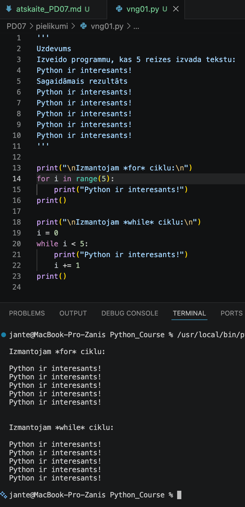

---

## Komentāri / piezīmes

Programma demonstrē divus dažādus veidus, kā panākt vienu un to pašu rezultātu — teksta izvadīšanu piecas reizes.

* for cikls kopā ar range(5) automātiski kontrolē iterāciju skaitu.

* while cikls nodrošina to pašu darbību, taču tam nepieciešama manuāla skaitītāja inicializācija (i = 0) un tā 
vērtības palielināšana (i += 1) katrā solī.

---

# 🧩 vnginājums 02

## Faila nosaukums

```text id="sdm8v5"
vng02.py
```
---

## Python kods

```python id="mt3k0v"
'''
Uzdevums
Izveido programmu, kas izdrukā skaitļus no 1 līdz 10.
Sagaidāmais rezultāts
1
2
3
4
5
6
7
8
9
10
'''

print("\nIzmantojam *for* ciklu:\n")
for i in range(1, 11):
    print(i)
print()    

'''
print("\nIzmantojam *while* ciklu:\n")
i = 1
while i < 11:
    print(f"{i}")
    i += 1
print()    
'''
```
---

## Rezultāts / izvade

Pievieno:

* ekrānuzņēmumu.

Rezultāts

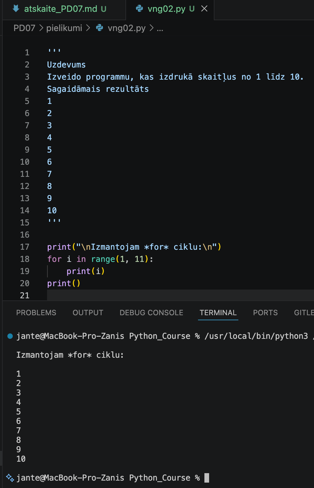

---

## Komentāri / piezīmes

Programma demonstrē cikla for darbību ar skaitītāju. Izmantojot funkciju range(1, 11), 
cikls secīgi ģenerē skaitļus no 1 līdz 10 (ieskaitot) un izvada katru no tiem ekrānā 
jaunā rindā. Tukšās print() funkcijas koda sākumā un beigās tiek izmantotas vizuālajai 
formatēšanai, lai konsolē izveidotu atkāpes pirms un pēc skaitļu izvadīšanas.

---

# 🧩 vnginājums 03 

## Faila nosaukums

```text id="sdm8v5"
vng03.py
```
---

## Python kods

```python id="mt3k0v"
'''
Uzdevums
Izveido programmu, kas izvada tikai pāra skaitļus no 2 līdz 20 .
Sagaidāmais rezultāts
2
4
6
8
10
12
14
16
18
20
'''

print()
for i in range(2, 21, 2):
    print(i)
print()

'''
i = 1
print()
for i in range(i, 21):
    if i % 2 == 0 :
        print(f"{i}")
print()
'''
```
---

## Rezultāts / izvade

Pievieno:

* ekrānuzņēmumu.

Rezultāts

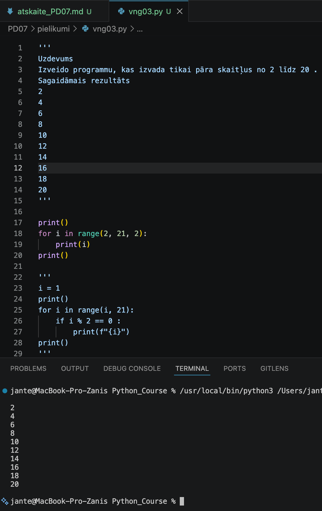

---

## Komentāri / piezīmes

Tiek piedāvāti divi koda varianti, kas risina vienu un to pašu uzdevumu – izvada uz ekrāna 
pāra skaitļus skaitļu rindā no 1 līdz 20 ieskaitot. Pirmais variants ir vienkāršākais, 
ātrākais un efektīvākais, jo mēs neapgrūtinām kodu ar 'if' nosacījuma konstrukciju un 
netērējam procesora resursus, lai pārbaudītu katra skaitļa pāra piederību.

---

# 🧩 vnginājums 04 

## Faila nosaukums

```text id="sdm8v5"
vng04.py
```
---

## Python kods

```python id="mt3k0v"
'''
Uzdevums
Izveido programmu, kas:
sāk skaitīt no 
1 ;
izvada skaitļus līdz 
5 .
Izmanto 
while ciklu.
Sagaidāmais rezultāts
1
2
3
4
5
'''

print()
i = 1
while i <= 5:
    print(f"{i}")
    i += 1
print()
```
---

## Rezultāts / izvade

Pievieno:

* ekrānuzņēmumu.

Kods ir labots

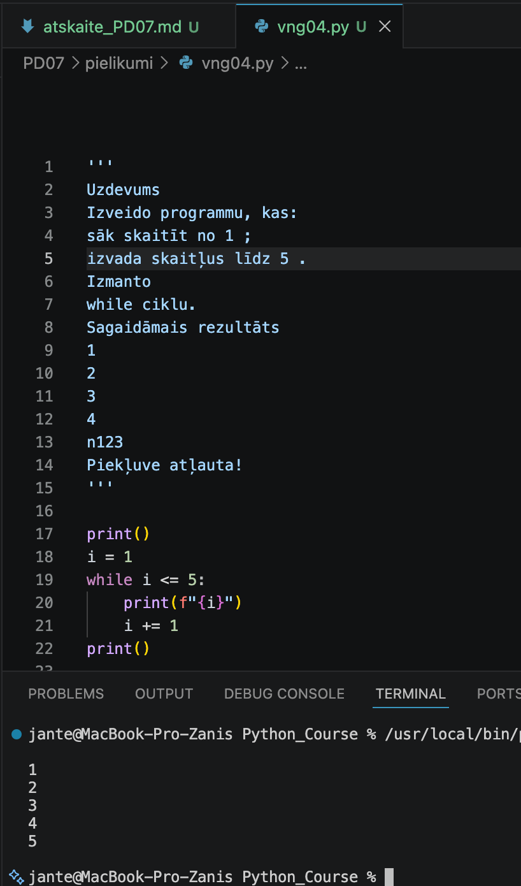

---

## Komentāri / piezīmes

Kods demonstrē while cikla darbību, izvadot skaitļus no 1 līdz 5. Cikls darbojas, kamēr i <= 5. 
Katrā solī mainīgā i vērtība tiek izvadīta ekrānā un palielināta par vienu (i += 1), lai novērstu 
bezgalīgu ciklu.

---

# 🧩 vnginājums 05

## Faila nosaukums

```text id="sdm8v5"
vng05.py
```
---

## Python kods

```python id="mt3k0v"
'''
Uzdevums
Izveido programmu, kas atkārtoti prasa ievadīt paroli.
Pareizā parole: python123
Ja parole ir nepareiza, programma turpina jautāt.
Kad parole ievadīta pareizi:
Piekļuve atļauta
Sagaidāmais rezultāts
Ievadi paroli:
abc
Ievadi paroli:
123
Ievadi paroli:
python123
Piekļuve atļauta
'''

print()
parole = ""
while parole != "python123":
    parole = input("Ievadi paroli: ")
print("Piekļuve atļauta")
print()  
```
---

## Rezultāts / izvade

Pievieno:

* ekrānuzņēmumu.

Rezultāts

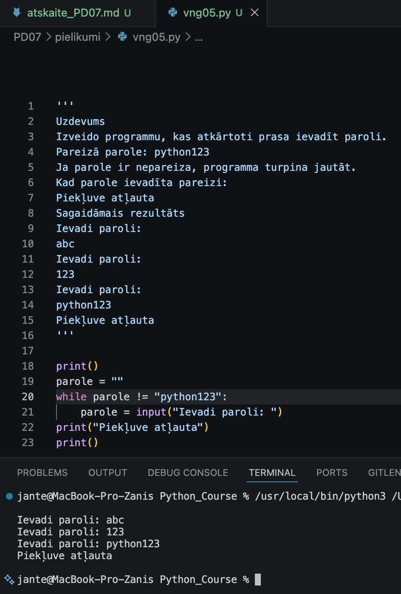

---

## Komentāri / piezīmes

Kods demonstrē paroles pārbaudi ar while ciklu. Cikls darbojas, kamēr ievadītā vērtība 
nesakrīt ar "python123". Katrā solī lietotājam tiek prasīts ievadīt paroli, un pēc 
pareizas paroles ievades cikls apstājas, izvadot paziņojumu par atļautu piekļuvi.

---

# 🧩 vnginājums 06

# Faila nosaukums

```text id="sdm8v5"
vng06.py
```
---

## Python kods

```python id="mt3k0v"
'''
Uzdevums
Izveido programmu, kas izvada skaitļa 
7 reizināšanas tabulu.
Sagaidāmais rezultāts
7 x 1 = 7
7 x 2 = 14
7 x 3 = 21
...
7 x 10 = 70
'''

print()
skaitlis = 7
for i in range(1, 11):
    print(f"{i} x {skaitlis} = {i * skaitlis}")
print()   
    
    
'''
i = 1
skaitlis = 7
while i < 11:
    print(f"{i} x {skaitlis} = {i * skaitlis}")
    i += 1
'''
```
---

## Rezultāts / izvade

Pievieno:

* ekrānuzņēmumu.

Rezultāts

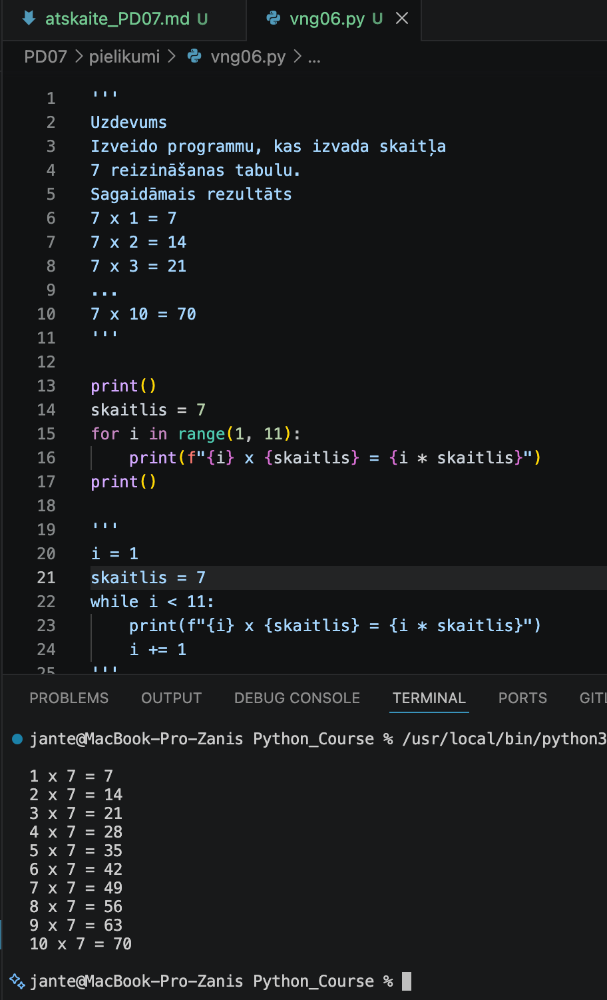

---

## Komentāri / piezīmes

Kods demonstrē reizināšanas tabulas izvadi ar skaitli 7 divos dažādos veidos. 
Pirmais variants izmanto efektīvāku for ciklu ar range(1, 11), kas automātiski 
kontrolē skaitītāju un novērš kļūdu iespējamību. Otrais variants realizē to pašu 
darbību ar while ciklu, kurā nepieciešams manuāli definēt sākuma vērtību i = 1, 
uzstādīt drošu nosacījumu i < 11 un katrā solī palielināt skaitītāju 
par viens (i += 1).

---

# 🧩 vnginājums 07

# Faila nosaukums

```text id="sdm8v5"
vng07.py
```
---

## Python kods

```python id="mt3k0v"
'''
Uzdevums
Izveido vienkāršu izvēlni:
1 - Sasveicināties
2 - Parādīt dienas novēlējumu
0 - Iziet
Programmai jādarbojas ciklā, līdz lietotājs izvēlas 0 .
Sagaidāmais rezultāts
1 - Sasveicināties
2 - Parādīt dienas novēlējumu
0 - Iziet
Izvēle: 1
Sveiki!
Izvēle: 2
Lai tev laba diena!
Izvēle: 0
Programma beigusies
'''

print()
print("1 - Sasveicināties")
print("2 - Parādīt dienas novēlējumu")
print("0 - Iziet")
x = ""

while x != 0 :
    x = int(input("\nIzvēle: "))
    if x == 1 :
        print("Sveiki!")
    elif x == 2:
        print("Lai tev laba diena!")   
print("\nProgramma beigusies\n")
```
---

## Rezultāts / izvade

Pievieno:

* ekrānuzņēmumu.

Rezultāts

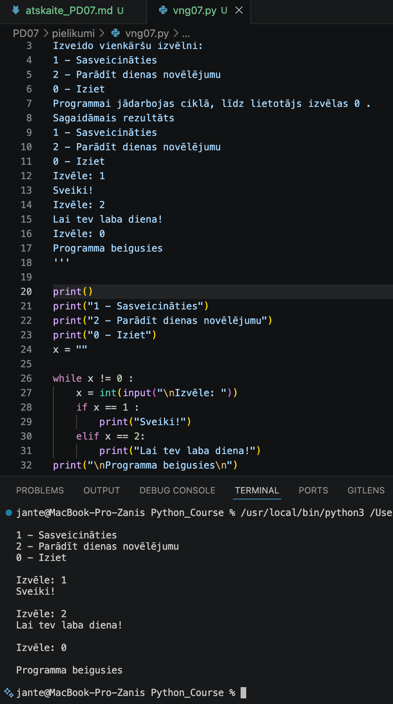

---

## Komentāri / piezīmes

Kods īsteno interaktīvu lietotāja izvēlni, izmantojot ciklu „while“, kas turpina darboties, 
kamēr netiek ievadīts skaitlis 0. Programma nolasīta lietotāja ievadi kā veselu skaitli (int) un, 
izmantojot konstrukciju „if-elif“, veic izvēlēto darbību (parāda sveicienu vai novēlējumu).

---

# 🧩 vnginājums 08

# Faila nosaukums

```text id="sdm8v5"
vng08.py
```
---

## Python kods

```python id="mt3k0v"
'''
Uzdevums
Programmai ir kļūda.
Tā iestrēgst bezgalīgā ciklā.
Izlabo programmu.
skaititajs = 1
while skaititajs <= 5:
    print(skaititajs)
Sagaidāmais rezultāts
1
2
3
4
5
'''

skaititajs = 1
print()
while skaititajs <= 5:
    print(skaititajs)
    skaititajs += 1
print()
```
---

## Rezultāts / izvade

Pievieno:

* ekrānuzņēmumu.

Kods ar kļūdu

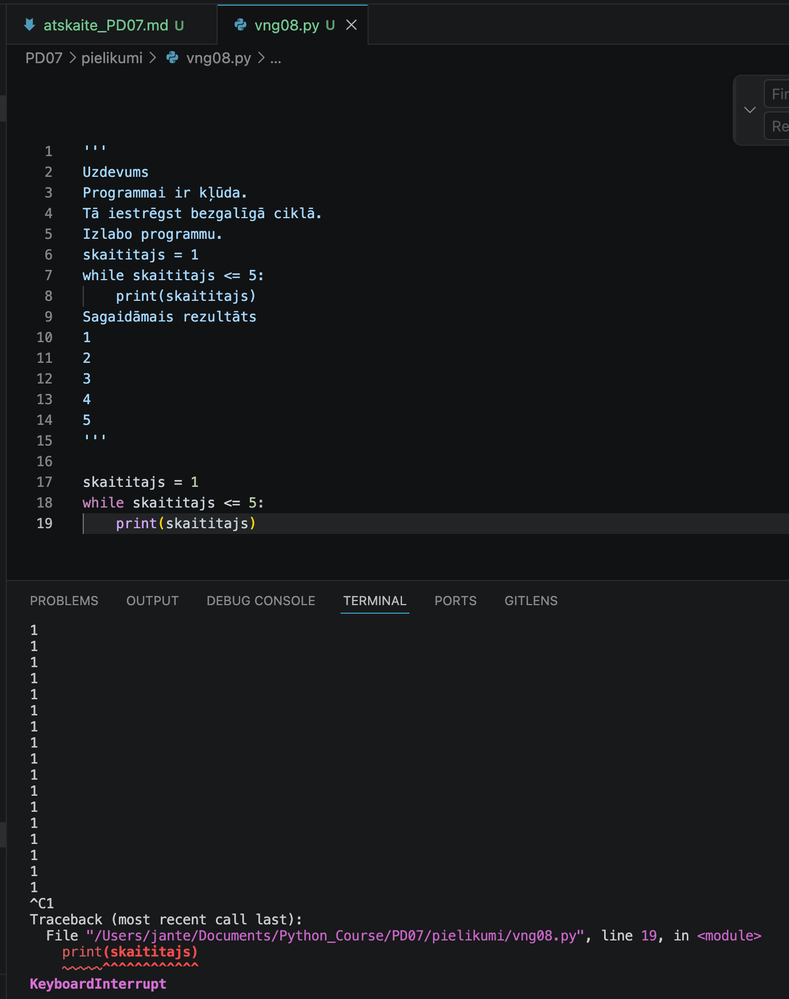

Kods ir labots

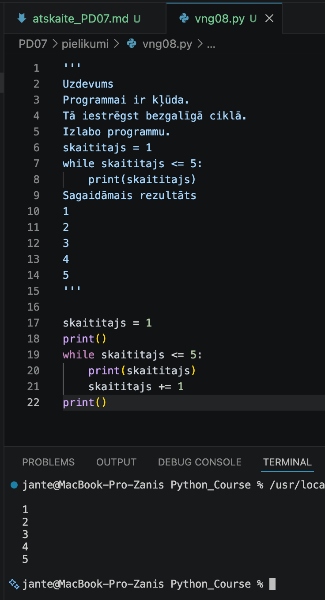

---

## Komentāri / piezīmes

Ja cikla „while“ ķermenī nav skaitītāja „skaititajs += 1“, programma nonāk bezgalīgā cilpā. 
Skaitītāja pievienošana nodrošina koda pareizu izpildi atbilstoši uzdevumam.

---

# 🧩 vnginājums 09

# Faila nosaukums

```text id="sdm8v5"
vng09.py
```
---

## Python kods

```python id="mt3k0v"
'''
Uzdevums
Izveido programmu, kas:
prasa ievadīt 5 skaitļus;
aprēķina to summu;
beigās izvada rezultātu.
Sagaidāmais rezultāts
Ievadi skaitli: 5
Ievadi skaitli: 3
Ievadi skaitli: 7
Ievadi skaitli: 2
Ievadi skaitli: 1
Summa = 18
'''

akumulator = 0 # mainīgais, kurā tiks uzkrāta summa
print()
for i in range(1, 6):
   # katru reizi, kad tiek ievadīts skaitlis, tas tiek pieskaitīts akumulatoram
   akumulator = akumulator + int(input("Ievadi skaitli: "))  
print(f"\nSumma = {akumulator}\n")
```
---

## Rezultāts / izvade

Pievieno:

* ekrānuzņēmumu.

Rezultāts

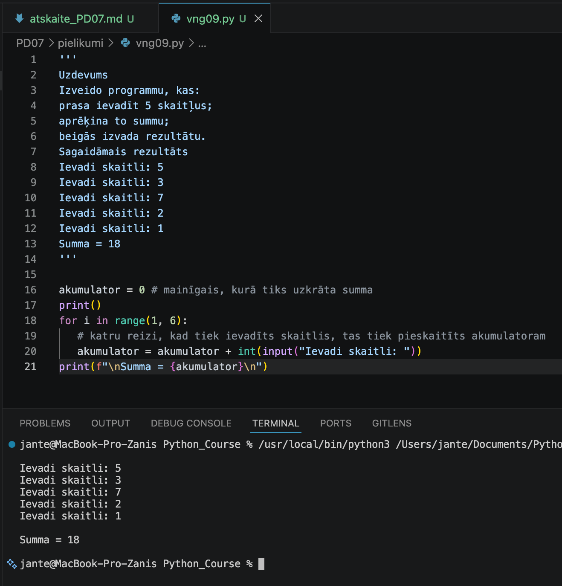

---

## Komentāri / piezīmes

Kods demonstrē skaitļu uzkrāšanas jeb akumulatora algoritmu, izmantojot for ciklu. 
Programma piecas reizes pēc kārtas lūdz lietotājam ievadīt veselu skaitli, pārveido 
to par int datu tipu un pieskaita pie mainīgā "akumulator", kura sākuma vērtība ir 0. 
Cikla beigās tiek izvadīta visu ievadīto skaitļu kopējā summa.

---

# 🧩 vnginājums 10

# Faila nosaukums

```text id="sdm8v5"
vng10.py
```
---

## Python kods

```python id="mt3k0v"
'''
Uzdevums
Izveido programmu, kas:
ļauj ievadīt 3 vārdus;
saglabā tos sarakstā;
beigās izvada visus vārdus.
💡
 Šis ir neliels ieskats nākamajā tēmā.
Sagaidāmais rezultāts
Ievadi vārdu:
Anna
Ievadi vārdu:
Jānis
Ievadi vārdu:
Pēteris
Ievadītie vārdi:
Anna
Jānis
Pēteris
'''

vardu_saraksts = []     # Izveidosim tukšu sarakstu, kurā tiks saglabāti ievadītie vārdiim vārdus
print()                 # Lai atvieglotu lasīšanu, ekrānā tiek parādīta tukša rinda

for i in range(3):
    vardu_saraksts.append(input("Ievadi vārdu: ")) 

print("\nIevadītie vārdi: \n")
for vards in vardu_saraksts:      # Lai izvadītu visus vārdus, izmantojam for ciklu, kas iterē cauri sarakstam
    print(vards)
print()
```
---

## Rezultāts / izvade

Pievieno:

* ekrānuzņēmumu.

Rezultāts

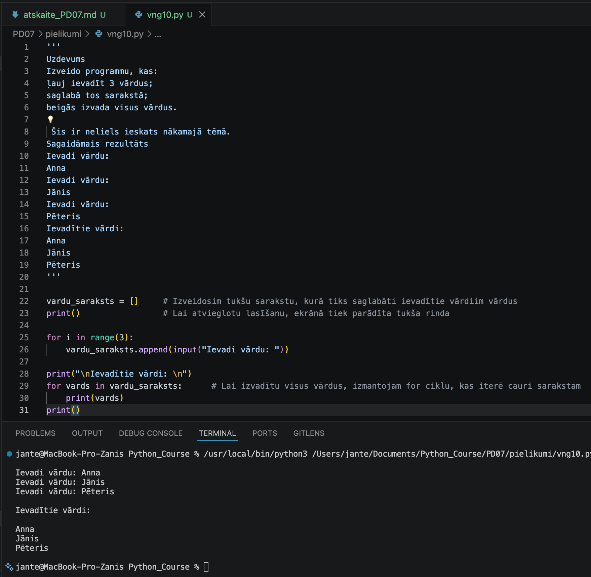

---

## Komentāri / piezīmes

KKods demonstrē saraksta izveidi un elementu secīgu apstrādi, izmantojot divus neatkarīgus 
for ciklus. Pirmajā ciklā programma trīs reizes pēc kārtas lūdz lietotājam ievadīt vārdu un 
ar append() metodi pievieno to tukšajam sarakstam "vardu_saraksts". Otrajā ciklā programma 
secīgi iet cauri visiem izveidotā saraksta elementiem un izvada katru saglabāto vārdu ekrānā.

---

# 📝 Refleksija — piedzīvojumi un pārdzīvojumi

Apraksti īsi un godīgi:

* Kas šodien izdevās vislabāk?
  Man vislabāk izdevās saprast, kā darbojas cikli „for“ un „while“.
* Kas radīja grūtības?
  Sākumā bija grūti atcerēties, kā strādāt ar sarakstiem.
* Kādu kļūdu tu atklāji un izlaboji?
  Es novērsu „IndentationError“, pievienojot pareizos atkāpumus (4 atstarpes) nosacījumu blokos.
* Kas tev sagādāja prieku vai interesi?
  Prieku sagādāja tas, ka apgūstam interaktīvo darbu ar lietotāju un pieskārāmies sarakstu tēmai.
* Ko tu vēlētos saprast labāk?
  Es vēlētos padziļināti apgūt darbu ar sarakstiem un bibliotēkām.

---

# 🎯 Pamatots pašvērtējums (0-100)

| Kritērijs | Punkti | Pamatojums |
| :---      | :---:  | :---       |
| Kods un funkcionalitāte | 60 | Visi uzdevumi ir izpildīti un strādā bez kļūdām. |
| Izpratne un komentāri | 20 | Koda rindas ir nokomentētas, izpratne par tēmu ir pilnīga. |
| Refleksija | 10 | Refleksija ir sniegta godīgi un pilnā apjomā. |
| Noformējums un struktūra | 10 | Visi faili un attēli ir sakārtoti atbilstošajās mapēs. |
| **Kopā** | **100/100** | Viss ir izpildīts precīzi pēc prasībām. |

---

# 📦 Iesniegšana

Pirms iesniegšanas pārbaudi:

* [x] Visi `.py` faili atrodas mapē `Pielikumi`
* [x] Ekrānuzņēmumi ievietoti mapē `atteli`
* [x] Atskaites fails ir aizpildīts
* [x] Programmas darbojas

---

## Arhivēšana

Arhivē visu mapi:

```text id="h1xcm7" 
PD07.zip
```