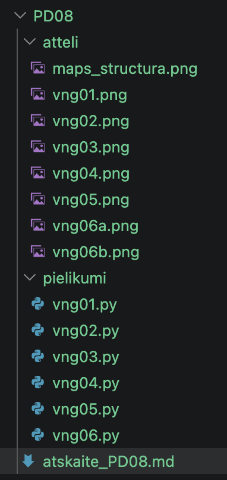
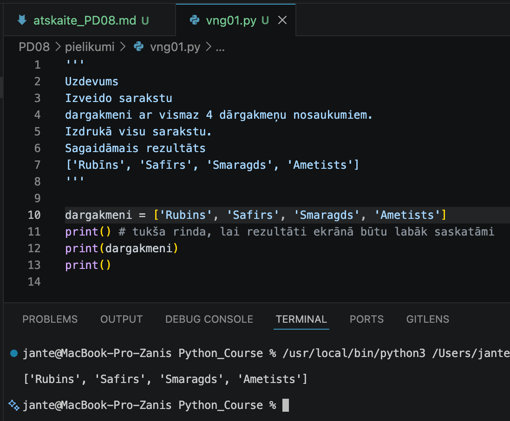
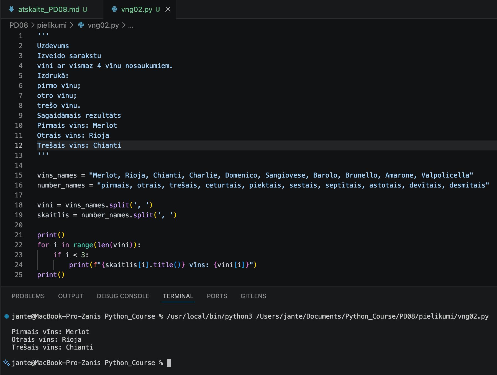
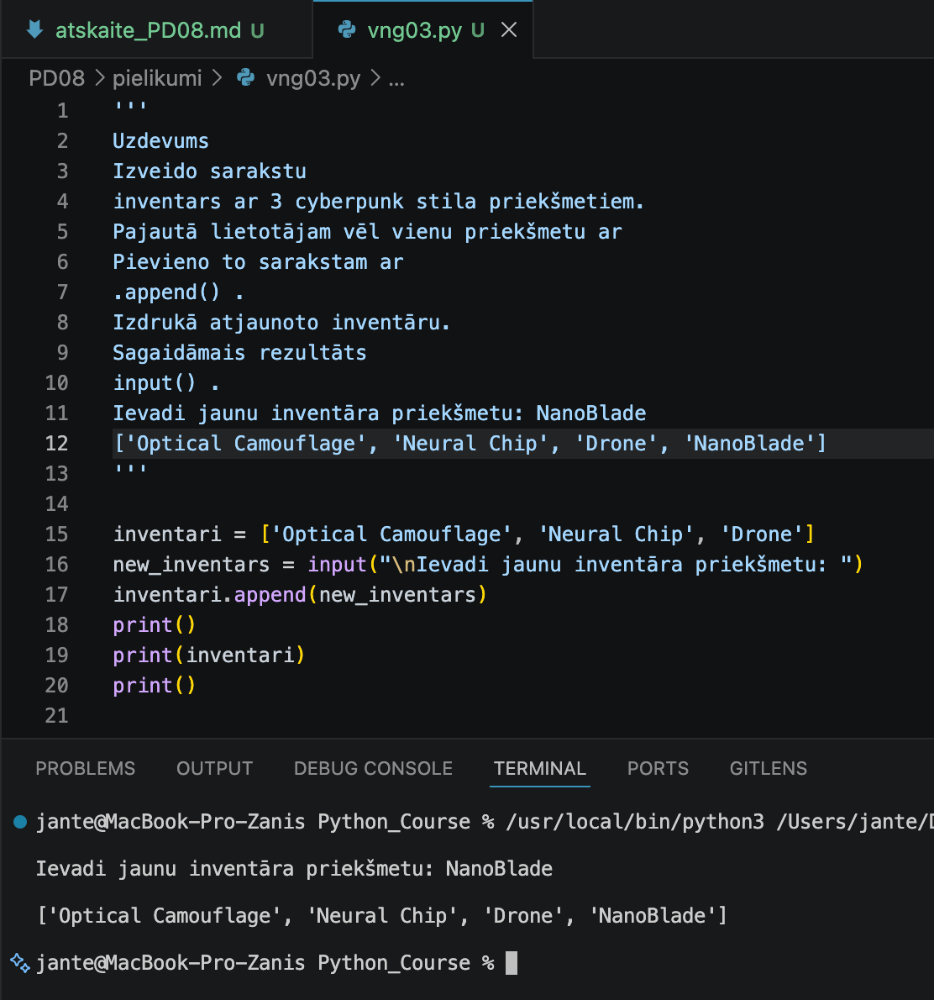
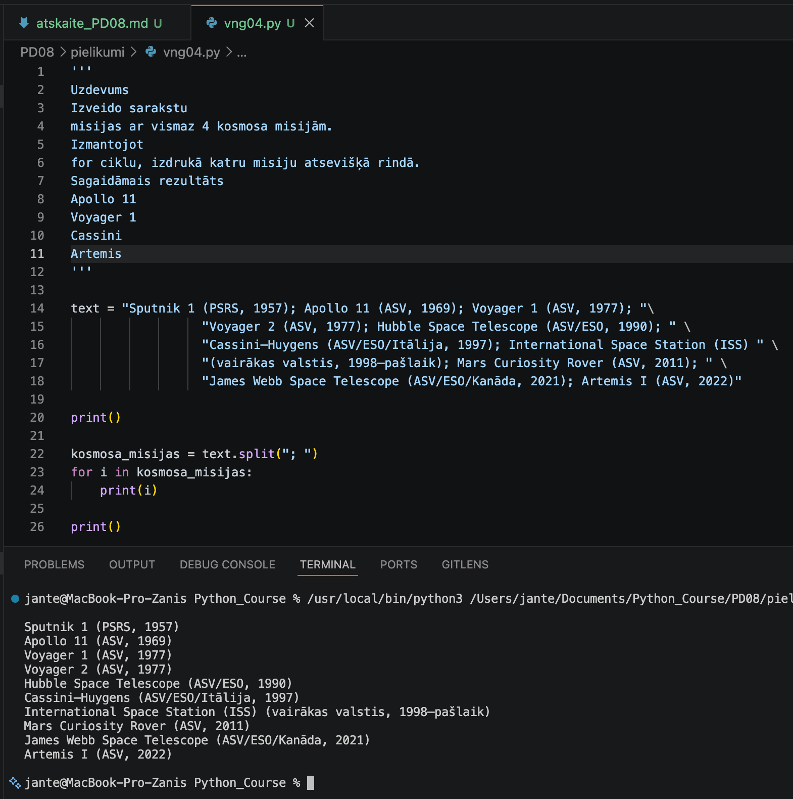
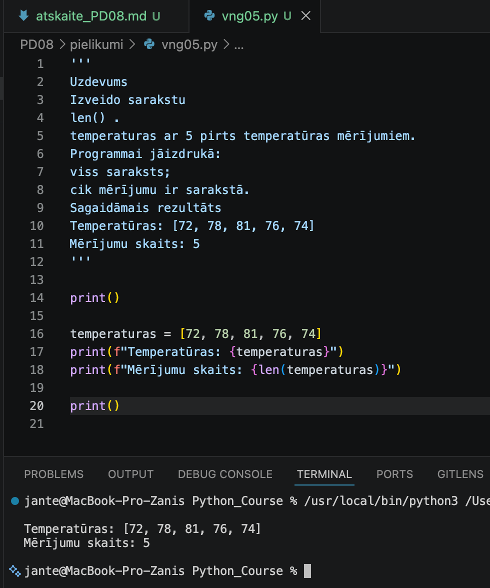
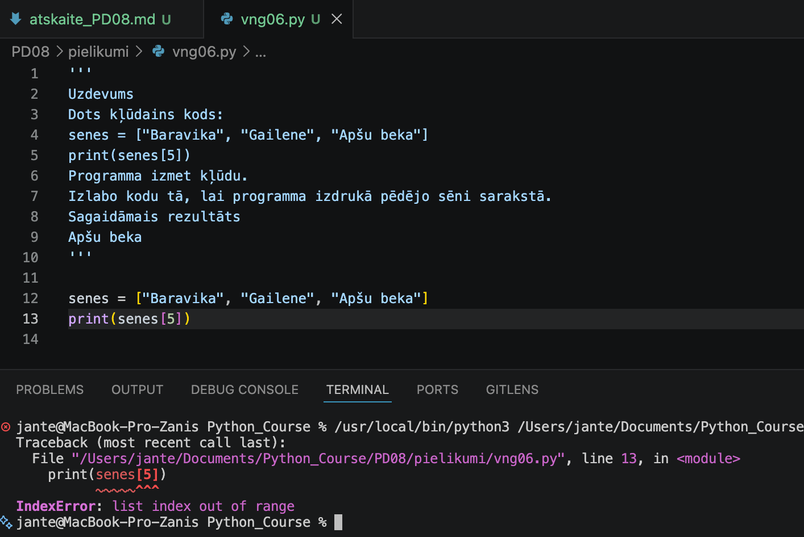
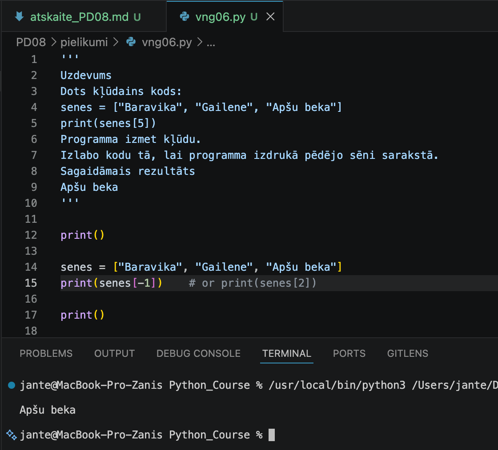

# Praktiskā darba atskaite — PD08

**Tēma:** Saraksti un datu kolekcijas 
**Vārds, Uzvārds:** Zhan Teivan 
**Datums:** 2026-05-20  
**Grupa:**  DAAVP_Daugavpils_80


[Mana praktiskā darba mape GitHub platformā](https://github.com/JanTey/Python_Course/blob/main/PD08/atskaite_PD08.md)


---
# 📁 0. Sagatavošanās darbi

Pārbaudi, vai sagatavota darba vide:

* [x] Izveidota mape `PD08`
* [x] Izveidota apakšmape `pielikumi`
* [x] Izveidota apakšmape `atteli`
* [x] Izveidots fails `atskaite_PD08.md`

---

## Mapju struktūra

```text
PD08/
├─ Pielikumi/
│  ├─ vng01.py
│  ├─ vng02.py
│  ├─ vng03.py
│  ├─ vng04.py
│  ├─ vng05.py
│  └─ vng06.py
├─ atteli/
│  ├─ maps_structure.png
│  ├─ vng01.png
│  ├─ vng02.png
│  ├─ vng03.png
│  ├─ vng04.png
│  ├─ vng05.png
│  ├─ vng06a.png
│  └─ vng06b.png
└─ atskaite_PD08.md
````

---

## Ekrānuzņēmums

Pievieno ekrānuzņēmumu ar mapes struktūru.

```markdown id="j0m2om"

```


---

# 🧩 vnginājums 01

## Faila nosaukums

```text id="pjlwmj"
vng01.py
```
---

## Python kods

```python id="p62h2r"
'''
Uzdevums
Izveido sarakstu 
dargakmeni ar vismaz 4 dārgakmeņu nosaukumiem.
Izdrukā visu sarakstu.
Sagaidāmais rezultāts
['Rubīns', 'Safīrs', 'Smaragds', 'Ametists']
'''

dargakmeni = ['Rubins', 'Safirs', 'Smaragds', 'Ametists']
print() # tukša rinda, lai rezultāti ekrānā būtu labāk saskatāmi
print(dargakmeni)
print()
```
---

## Rezultāts / izvade

Pievieno:

* ekrānuzņēmumu.

Rezultāts



---

## Komentāri / piezīmes

Šajā kodā tiek izveidots saraksts no četriem elementiem un izvadīts uz ekrāna.

---

# 🧩 vnginājums 02

## Faila nosaukums

```text id="sdm8v5"
vng02.py
```
---

## Python kods

```python id="mt3k0v"
'''
Uzdevums
Izveido sarakstu 
vini ar vismaz 4 vīnu nosaukumiem.
Izdrukā:
pirmo vīnu;
otro vīnu;
trešo vīnu.
Sagaidāmais rezultāts
Pirmais vīns: Merlot
Otrais vīns: Rioja
Trešais vīns: Chianti
'''

vins_names = "Merlot, Rioja, Chianti, Charlie, Domenico, Sangiovese, Barolo, Brunello, Amarone, Valpolicella"
number_names = "pirmais, otrais, trešais, ceturtais, piektais, sestais, septītais, astotais, devītais, desmitais"

vini = vins_names.split(', ')
skaitlis = number_names.split(', ')

print()
for i in range(len(vini)):
    if i < 3:
        print(f"{skaitlis[i].title()} vīns: {vini[i]}")
print()
```
---

## Rezultāts / izvade

Pievieno:

* ekrānuzņēmumu.

Rezultāts



---

## Komentāri / piezīmes

Kods demonstrē simbolu virkņu (String) transformēšanu sarakstos un datu selektīvu atlasi. 
Izmantojot metodi .split(', '), divas garas teksta virknes (vīnu nosaukumi un kārtas skaitļu 
vārdi) tiek automātiski sadalītas un pārvērstas par diviem neatkarīgiem sarakstiem. Tālāk 
programma ar for ciklu iet cauri visam vīnu saraksta garumam, taču, pateicoties nosacījumam 
"if i < 3", ekrānā izvada tikai pirmos trīs elementus (indeksi 0, 1, 2). Izvades laikā kārtas 
skaitļa vārds tiek formatēts ar lielo sākuma burtu, izmantojot .title() metodi, kas nodrošina 
vizuāli kārtīgu un strukturētu informācijas pasniegšanu.

---

# 🧩 vnginājums 03 

## Faila nosaukums

```text id="sdm8v5"
vng03.py
```
---

## Python kods

```python id="mt3k0v"
'''
Uzdevums
Izveido sarakstu 
inventars ar 3 cyberpunk stila priekšmetiem.
Pajautā lietotājam vēl vienu priekšmetu ar 
Pievieno to sarakstam ar 
.append() .
Izdrukā atjaunoto inventāru.
Sagaidāmais rezultāts
input() .
Ievadi jaunu inventāra priekšmetu: NanoBlade
['Optical Camouflage', 'Neural Chip', 'Drone', 'NanoBlade']
'''

inventari = ['Optical Camouflage', 'Neural Chip', 'Drone']
new_inventars = input("\nIevadi jaunu inventāra priekšmetu: ")
inventari.append(new_inventars)
print()
print(inventari)
print()
```
---

## Rezultāts / izvade

Pievieno:

* ekrānuzņēmumu.

Rezultāts



---

## Komentāri / piezīmes

Kods demonstrē dinamiska saraksta papildināšanu ar jauniem datiem, izmantojot lietotāja 
interaktīvo ievadi. Sākumā tiek inicializēts saraksts "inventari" ar trim noklusējuma 
elementiem. Pēc tam programma ar input() funkciju aicina lietotāju ievadīt jaunu priekšmetu 
un ar .append() metodi dinamiski pievieno to saraksta beigās. Noslēgumā ekrānā tiek izvadīts 
modificētais saraksts, uzskatāmi parādot, kā saraksta struktūra un izmērs ir mainījies 
programmas darbības laikā.

---

# 🧩 vnginājums 04 

## Faila nosaukums

```text id="sdm8v5"
vng04.py
```
---

## Python kods

```python id="mt3k0v"
'''
Uzdevums
Izveido sarakstu 
misijas ar vismaz 4 kosmosa misijām.
Izmantojot 
for ciklu, izdrukā katru misiju atsevišķā rindā.
Sagaidāmais rezultāts
Apollo 11
Voyager 1
Cassini
Artemis
'''

text = "Sputnik 1 (PSRS, 1957); Apollo 11 (ASV, 1969); Voyager 1 (ASV, 1977); "\
                  "Voyager 2 (ASV, 1977); Hubble Space Telescope (ASV/ESO, 1990); " \
                  "Cassini–Huygens (ASV/ESO/Itālija, 1997); International Space Station (ISS) " \
                  "(vairākas valstis, 1998–pašlaik); Mars Curiosity Rover (ASV, 2011); " \
                  "James Webb Space Telescope (ASV/ESO/Kanāda, 2021); Artemis I (ASV, 2022)"

print()

kosmosa_misijas = text.split("; ")
for i in kosmosa_misijas:
    print(i)

print()
```
---

## Rezultāts / izvade

Pievieno:

* ekrānuzņēmumu.

Kods ir labots



---

## Komentāri / piezīmes

Es nedaudz sarežģīju uzdevumu, lai panāktu lielāku informatīvumu un interesi. Kods demonstrē garas teksta rindas pārveidošanu par elementu sarakstu, izmantojot specifisku atdalītāju. Tā kā dati iekavās (valstis un gadi) jau satur parastos komatus, semikola ar atstarpi ("; ") izmantošana kā ārējā atdalītāja ļauj programmai precīzi noteikt katras kosmosa misijas robežas un nesadalīt vienu elementu daļās. Metode .split("; ") pārveido virkni par glītu sarakstu, pēc kā for cikls secīgi izvada katru iegūto elementu jaunā rindā, saglabājot teksta iekšējās struktūras integritāti.

---

# 🧩 vnginājums 05

## Faila nosaukums

```text id="sdm8v5"
vng05.py
```
---

## Python kods

```python id="mt3k0v"
'''
Uzdevums
Izveido sarakstu 
len() .
temperaturas ar 5 pirts temperatūras mērījumiem.
Programmai jāizdrukā:
viss saraksts;
cik mērījumu ir sarakstā.
Sagaidāmais rezultāts
Temperatūras: [72, 78, 81, 76, 74]
Mērījumu skaits: 5
'''

print()

temperaturas = [72, 78, 81, 76, 74]
print(f"Temperatūras: {temperaturas}")
print(f"Mērījumu skaits: {len(temperaturas)}")

print()
```
---

## Rezultāts / izvade

Pievieno:

* ekrānuzņēmumu.

Rezultāts



---

## Komentāri / piezīmes

Kods demonstrē darbu ar skaitlisku sarakstu un uzstādītās funkcijas len() praktisku pielietojumu. 
Sākumā tiek inicializēts saraksts "temperaturas" ar pieciem elementiem (mērījumiem). Pēc tam 
programma izvada visu sarakstu ekrānā un, izmantojot funkciju len(), nosaka un izvada kopējā 
sarakstā esošo elementu jeb mērījumu skaitu. 

---

# 🧩 vnginājums 06

# Faila nosaukums

```text id="sdm8v5"
vng06.py
```
---

## Python kods

```python id="mt3k0v"
'''
Uzdevums
Dots kļūdains kods:
senes = ["Baravika", "Gailene", "Apšu beka"]
print(senes[5])
Programma izmet kļūdu.
Izlabo kodu tā, lai programma izdrukā pēdējo sēni sarakstā.
Sagaidāmais rezultāts
Apšu beka
'''

print()

senes = ["Baravika", "Gailene", "Apšu beka"]
print(senes[-1])    # or print(senes[2])

print()
```
---

## Rezultāts / izvade

Pievieno:

* ekrānuzņēmumu.

Kods ar kļūdu



Kods ir labots



---

## Komentāri / piezīmes

Kods demonstrē bieži sastopamu indeksācijas kļūdu (IndexError: list index out of range) un 
tās pareizu novēršanu. Sākotnējā koda versijā tika mēģināts piekļūt elementam ar indeksu 5, 
lai gan trīs elementu sarakstā pēdējais derīgais indekss ir 2. Lai izpildītu uzdevuma nosacījumu 
un droši izvadītu pēdējo sēņu saraksta elementu ("Apšu beka"), kļūdainais skaitlis tika aizstāts 
ar indeksu -1 (vai 2). Python programmēšanas valodā negatīvā indeksācija (indekss -1) ir izcils 
risinājums, jo tā automātiski piekļūst saraksta pēdējam elementam, neatkarīgi no tā, cik kopumā 
elementu atrodas sarakstā.

---

# 📝 Refleksija — piedzīvojumi un pārdzīvojumi

* Kas šodien izdevās vislabāk?

Man vislabāk izdevās izprast, kā darbojas «for» cikli, strādājot ar sarakstiem.

* Kas sagādāja vislielākās grūtības?

Sākumā bija grūti atcerēties, kā pārveidot simbolu virkni (tekstu) par sarakstu.

* Kādu kļūdu atradi un izlaboji?

Es izlaboju kļūdu «IndexError: list index out of range», pievienojot pareizo elementa indeksu sarakstā.

* Kas radīja prieku vai interesi?

Man patika strādāt ar sarakstiem. Tas var būt ļoti interesanti, strādājot ar bibliotēkām.

* Ko gribētu vēl saprast labāk?

Es gribētu uzzināt vairāk par darbu ar sarakstiem un bibliotēkām.

---

# 🎯 Pamatots pašvērtējums (0-100)

| Kritērijs | Punkti | Pamatojums |
| :---      | :---:  | :---       |
| Kods un funkcionalitāte | 60 | Visi uzdevumi ir izpildīti un strādā bez kļūdām. |
| Izpratne un komentāri | 20 | Koda rindas ir nokomentētas, izpratne par tēmu ir pilnīga. |
| Refleksija | 10 | Refleksija ir sniegta godīgi un pilnā apjomā. |
| Noformējums un struktūra | 10 | Visi faili un attēli ir sakārtoti atbilstošajās mapēs. |
| **Kopā** | **100/100** | Viss ir izpildīts precīzi pēc prasībām. |

---

# 📦 Iesniegšana

Pirms iesniegšanas pārbaudi:

* [x] Visi `.py` faili atrodas mapē `Pielikumi`
* [x] Ekrānuzņēmumi ievietoti mapē `atteli`
* [x] Atskaites fails ir aizpildīts
* [x] Programmas darbojas

---

## Arhivēšana

Arhivē visu mapi:

```text id="h1xcm7" 
PD08.zip
```