# Praktiskā darba atskaite — PD09

**Tēma:** Programma sāk saprast tekstu 
**Vārds, Uzvārds:** Zhan Teivan 
**Datums:** 2026-05-21  
**Grupa:**  DAAVP_Daugavpils_80


[Mana praktiskā darba mape GitHub platformā](https://github.com/JanTey/Python_Course/blob/main/PD08/atskaite_PD09.md)


---
# 📁 0. Sagatavošanās darbi

Pārbaudi, vai sagatavota darba vide:

* [x] Izveidota mape `PD09`
* [x] Izveidota apakšmape `pielikumi`
* [x] Izveidota apakšmape `atteli`
* [x] Izveidots fails `atskaite_PD09.md`

---

## Mapju struktūra

```text
PD09/
├─ Pielikumi/
│  ├─ vng01.py
│  ├─ vng02.py
│  ├─ vng03.py
│  ├─ vng04.py
│  ├─ vng05.py
│  └─ vng06.py
│  ├─ vng07.py
│  └─ vng08.py
│  ├─ vng09.py
│  └─ vng10.py
├─ atteli/
│  ├─ maps_structure.png
│  ├─ vng01.png
│  ├─ vng02.png
│  ├─ vng03.png
│  ├─ vng04.png
│  ├─ vng05.png
│  ├─ vng06.png
│  ├─ vng07.png
│  ├─ vng08.png
│  ├─ vng09.png
│  ├─ vng10a.png
│  └─ vng10b.png
└─ atskaite_PD09.md
````

---

## Ekrānuzņēmums

Pievieno ekrānuzņēmumu ar mapes struktūru.

```markdown id="j0m2om"
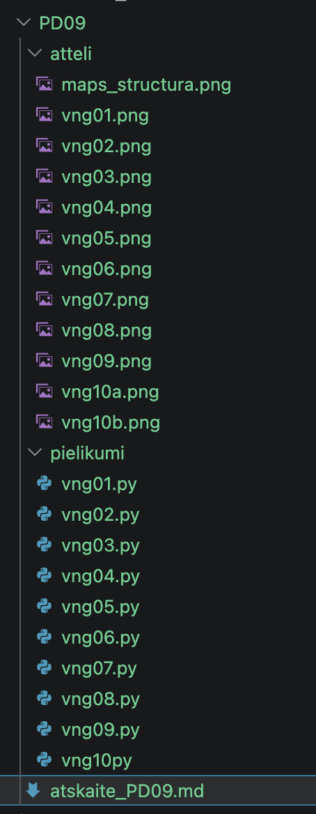
```


---

# 🧩 vnginājums 01

## Faila nosaukums

```text id="pjlwmj"
vng01.py
```
---

## Python kods

```python id="p62h2r"
'''
Uzdevums
Izveido programmu, kas:
1. saglabā mainīgajā slepenu kodu;
2. izvada:
pirmo simbolu;
pēdējo simbolu.
Sagaidāmais rezultāts
Slepenais kods: OMEGA-77
Pirmais simbols:
O
Pēdējais simbols:
7

'''

slep_kods = "OMEGA-77"
print("\nPirmais simbols:\n", slep_kods[0], sep="")
print("Pēdējais simbols:\n" + slep_kods[-1] + "\n")
```
---

## Rezultāts / izvade

Pievieno:

* ekrānuzņēmumu.

Rezultāts

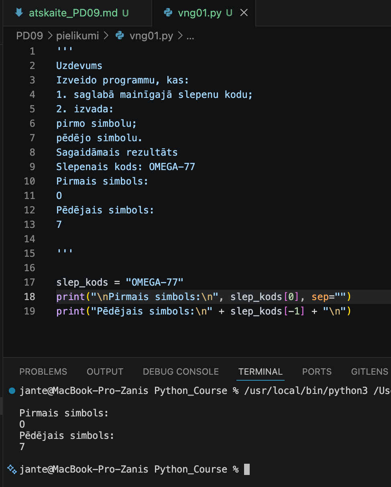

---

## Komentāri / piezīmes

Es sekmīgi izpildīju pirmo uzdevumu, izgūstot kodu simbolus ar indeksiem [0] un [-1]. Lai 
novērstu nevēlamas atstarpes termināļa izvadē pēc jaunās rindas (\n) simbola, es pirmajā 
gadījumā izmantoju argumentu sep='', bet otrajā — teksta virkņu saskaitīšanu (+). Tas ļāva 
iegūt precīzu un tīru vizuālo rezultātu bez liekiem bīdījumiem.


---

# 🧩 vnginājums 02

## Faila nosaukums

```text id="sdm8v5"
vng02.py
```
---

## Python kods

```python id="mt3k0v"
'''
Uzdevums
Izveido programmu, kas:
1. saglabā termināļa ziņojumu mainīgajā;
2. aprēķina simbolu skaitu;
3. izvada rezultātu.
Sagaidāmais rezultāts
Ziņojums:
Savienojums pārtraukts
Simbolu skaits:
24
'''

# ziņojums = "Savienojums pārtraukts  "
ziņojums = input("\nZiņojums:\n")
print("\nSimbolu skaits:")
print(len(ziņojums))        
print()
```
---

## Rezultāts / izvade

Pievieno:

* ekrānuzņēmumu.

Rezultāts

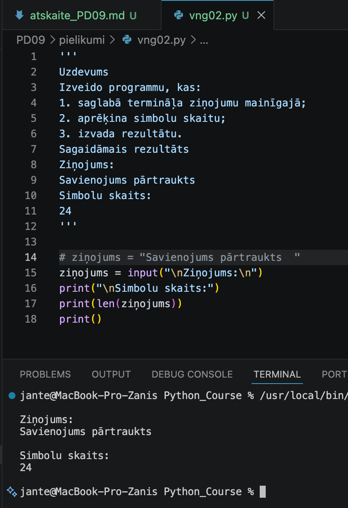

---

## Komentāri / piezīmes

Ziņojuma garuma noteikšanai tika izmantota iebūvētā funkcija `len()`. Lai sasniegtu sagaidāmo 
rezultātu un iegūtu precīzi 24 simbolu garumu, ievadītās teksta rindas "Savienojums pārtraukts" 
(kas pati par sevi satur 22 simbolus) beigās bija nepieciešams pievienot divas papildu atstarpes. 
Programma uzskatāmi parāda, ka funkcija `len()` saskaita pilnīgi visus simbolus, ieskaitot 
neredzamās rakstzīmes un atstarpes.


---

# 🧩 vnginājums 03 

## Faila nosaukums

```text id="sdm8v5"
vng03.py
```
---

## Python kods

```python id="mt3k0v"
'''
Uzdevums
Izveido programmu, kas:
1. saglabā:
prefiksu;
segvārdu;
2. savieno tos vienā lietotājvārdā;
3. izvada rezultātu.
Sagaidāmais rezultāts
Izveidotais lietotājvārds:
CyberNeo
'''

# 1. saglabā prefiksu un segvārdu
prefiks = "Cyber"
segvards = "Neo"    
lietotājvārds = prefiks + segvards
print("\nIzveidotais lietotājvārds:\n" + lietotājvārds + "\n")
```
---

## Rezultāts / izvade

Pievieno:

* ekrānuzņēmumu.

Rezultāts

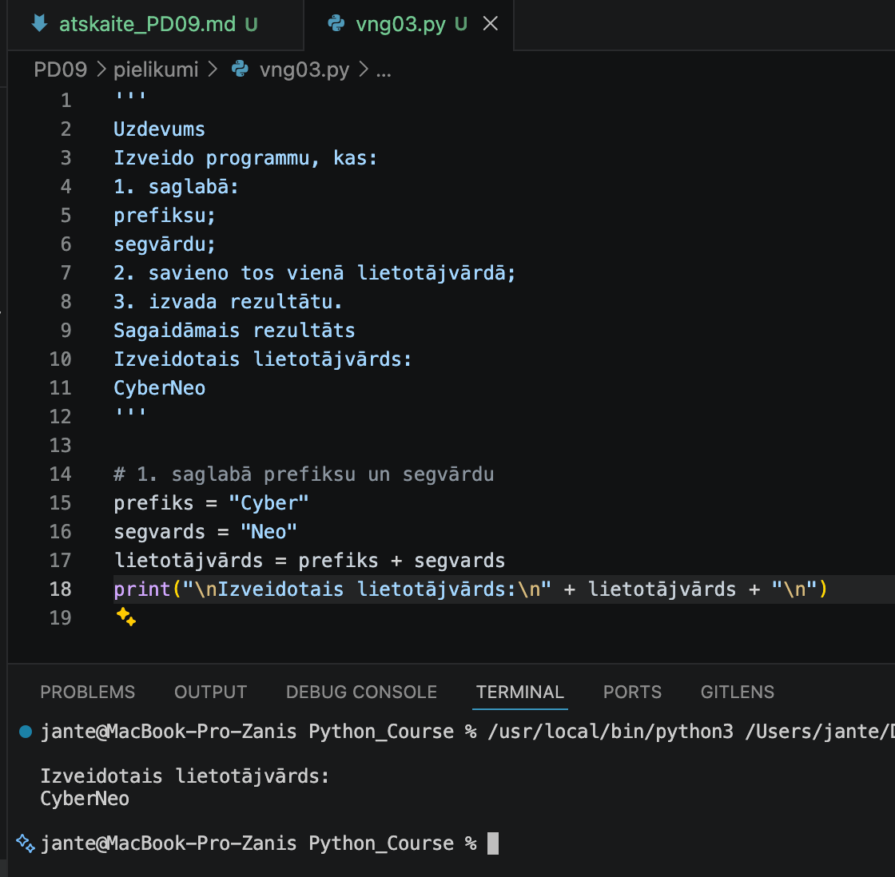

---

## Komentāri / piezīmes

Lietotājvārda izveidei un divu teksta virkņu (prefiksa un segvārda) apvienošanai tika izmantota 
saskaitīšanas darbība jeb konkatenācija ar operatoru `+`. Rezultāts tika saglabāts jaunā mainīgajā 
un izvadīts terminālī, izmantojot jaunas rindas simbolu `\n` vizuāli tīram noformējumam.


---

# 🧩 vnginājums 04 

## Faila nosaukums

```text id="sdm8v5"
vng04.py
```
---

## Python kods

```python id="mt3k0v"
'''
Uzdevums
Izveido programmu, kas:
1. saglabā lietotāja ievadītu kodu;
2. izvada:
tekstu ar mazajiem burtiem;
tekstu ar LIELAJIEM burtiem.
Sagaidāmais rezultāts
Oriģinālais teksts:
Neo-Admin
Mazie burti:
neo-admin
Lielie burti:
NEO-ADMIN
'''
# 1. saglabā lietotāja ievadītu kodu;
teksts = input("\nIevadi tekstu: ")   
print("\nOriģinālais teksts:\n" + teksts)
print("\nMazie burti:\n" + teksts.lower())
print("\nLielie burti:\n" + teksts.upper() + "\n")
```
---

## Rezultāts / izvade

Pievieno:

* ekrānuzņēmumu.

Kods ir labots

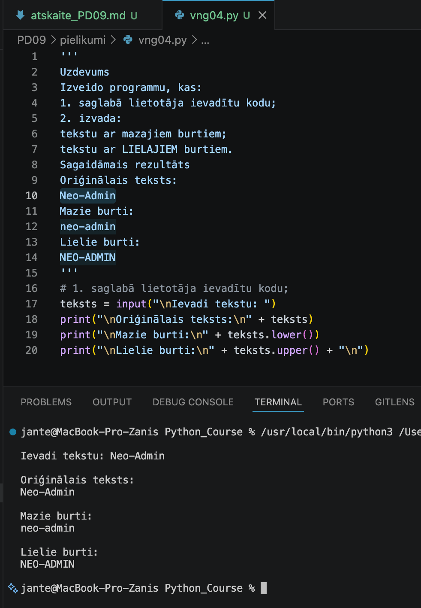

---

## Komentāri / piezīmes

Lietotāja ievadītā teksta reģistra normalizācijai tika izmantotas iebūvētās simbolu virkņu 
metodes `.lower()` (teksta pārvēršanai mazajos burtos) un `.upper()` (teksta pārvēršanai 
lielajos burtos). Rezultāti kopā ar oriģinālo tekstu tika izvadīti terminālī, izmantojot 
konkatenāciju ar operatoru `+` un jaunas rindas simbolu `\n` strukturētam un pārskatāmam 
vizuālajam noformējumam.


---

# 🧩 vnginājums 05

## Faila nosaukums

```text id="sdm8v5"
vng05.py
```
---

## Python kods

```python id="mt3k0v"
'''
Uzdevums
Lietotāji bieži nejauši ievada liekas atstarpes.
Izveido programmu, kas:
1. saglabā tekstu ar liekām atstarpēm;
2. izvada:
oriģinālo tekstu;
sakopto tekstu.
Sagaidāmais rezultāts
Oriģinālais:
"   sektors_B7   "
Sakoptais:
"sektors_B7"
'''

# Saglabā tekstu ar liekām atstarpēm
teksts = "   sektors_B7   "
print(f"\nOriģinālais: \"{teksts}\"")
print(f"\nSakoptais: \"{teksts.strip()}\"\n")
```
---

## Rezultāts / izvade

Pievieno:

* ekrānuzņēmumu.

Rezultāts

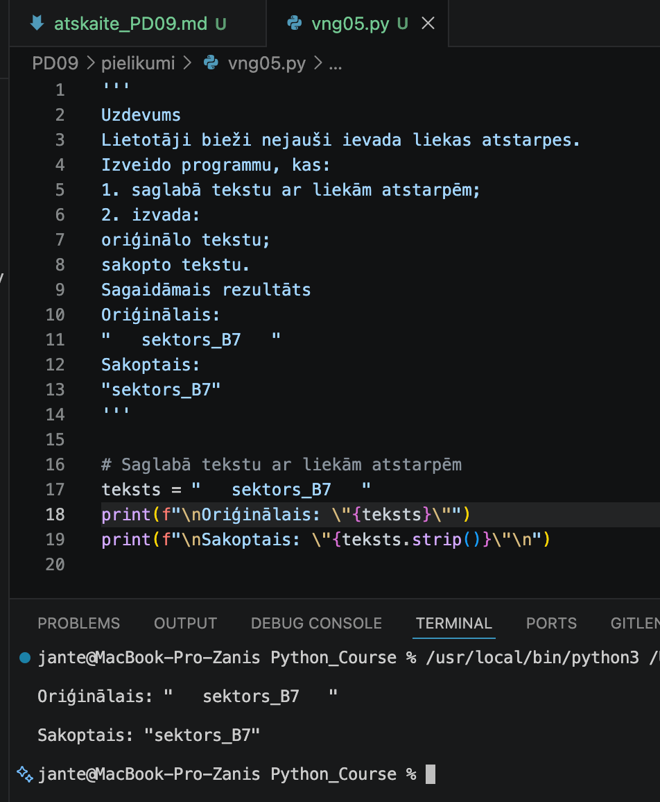

---

## Komentāri / piezīmes

Lietotāja ievadītā teksta attīrīšanai no nevēlamām sākuma un beigu atstarpēm tika izmantota 
iebūvētā simbolu virkņu metode `.strip()`. Rezultāts kopā ar oriģinālo tekstu tika izvadīts 
terminālī, izmantojot f-virknes (`f-string`) formatējumu un papildu pēdiņu ekranēšanu (`\"`), 
kas ļāva vizuāli precīzi attēlot atstarpju klātbūtni un to sekmīgu likvidēšanu.
 

---

# 🧩 vnginājums 06

# Faila nosaukums

```text id="sdm8v5"
vng06.py
```
---

## Python kods

```python id="mt3k0v"
'''
Uzdevums
Izveido programmu, kas pārbauda:
vai drošības žurnālā eksistē vārds:
BRĪDINĀJUMS
Izmanto:
.lower()
in
Sagaidāmais rezultāts
Vai sistēmā ir brīdinājums?
True
'''

security_log = "2024-06-01 12:00:00 - BRĪDINĀJUMS: Neautorizēta piekļuve mēģinājums"
print(f"\nVai sistēmā ir brīdinājums?\n{ 'brīdinājums' in security_log.lower() }\n")
```
---

## Rezultāts / izvade

Pievieno:

* ekrānuzņēmumu.

Rezultāts

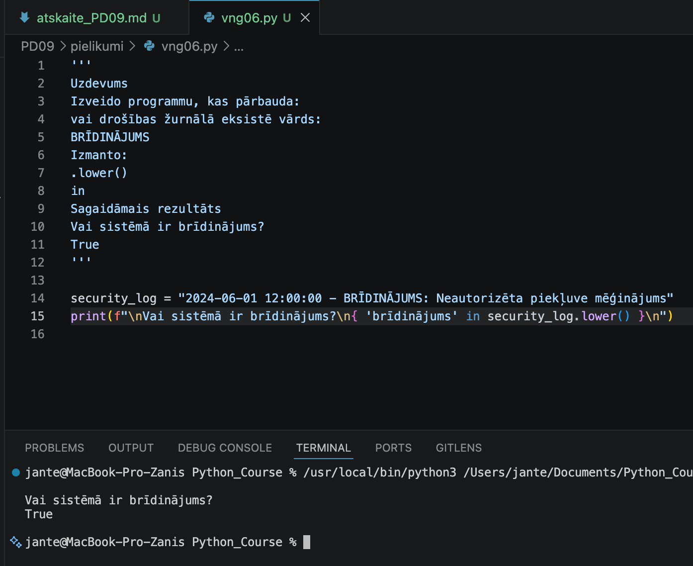

---

## Komentāri / piezīmes

Drošības žurnāla ieraksta pārbaudei un konkrēta atslēgvārda meklēšanai tika izmantots piederības 
operators `in` savienojumā ar metodi `.lower()`. Metodes `.lower()` pielietošana nodrošina 
reģistrnedēvīgu (case-insensitive) pārbaudi, novēršot situāciju, kad meklētais vārds netiek 
atrasts atšķirīga burtu reģistra dēļ. Rezultāts (loģiskā vērtība `True`) tiek izvadīts terminālī, 
izmantojot f-virknes (`f-string`) formatējumu un jaunas rindas simbolus.


---

# 🧩 vnginājums 07

# Faila nosaukums

```text id="sdm8v5"
vng07.py
```
---

## Python kods

```python id="mt3k0v"
'''
Uzdevums
Izveido programmu, kas:
1. saglabā termināļa komandu;
2. sadala to vārdos;
3. izvada iegūto sarakstu.
Sagaidāmais rezultāts
['restartēt', 'serveri_01']
'''

print()
command = input("\nIevadi termināļa komandu: ") # command = "restartēt serveri_01"
words = command.split()
print("\n", words, "\n")
```
---

## Rezultāts / izvade

Pievieno:

* ekrānuzņēmumu.

Rezultāts

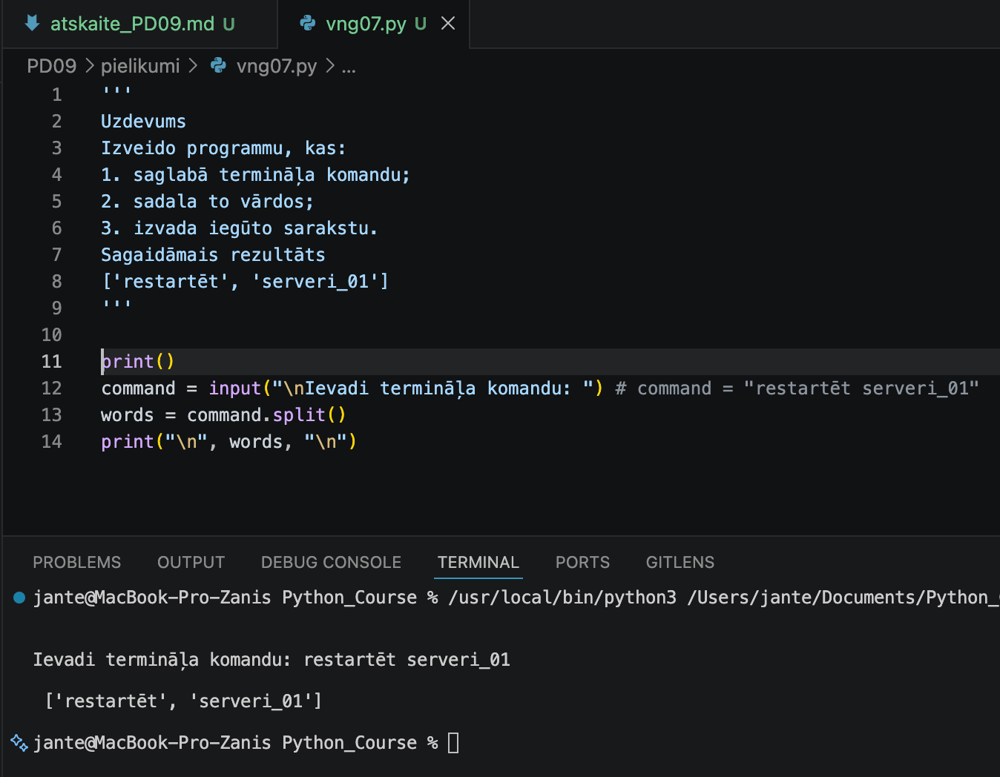

---

## Komentāri / piezīmes

Lietotāja ievadītās termināļa komandas sadalīšanai atsevišķos vārdos tika izmantota iebūvētā 
simbolu virkņu metode `.split()`. Tā kā metode tika izsaukta bez argumentiem, teksta sadalīšana 
automātiski notiek pēc tukšumzīmēm (atstarpēm), pārvēršot sākotnējo tekstu elementu sarakstā (list). 
Iegūtais saraksts tiek izvadīts terminālī, izmantojot jaunas rindas simbolus ērtākai vizuālai uztverei.

---

# 🧩 vnginājums 08

# Faila nosaukums

```text id="sdm8v5"
vng08.py
```
---

## Python kods

```python id="mt3k0v"
'''
Uzdevums
Izveido programmu, kas:
1. sadala komandu vārdos;
2. izvada:
darbību;
mērķi.
Sagaidāmais rezultāts
Darbība:
restartēt
Mērķis:
serveri_01
'''
command = input("\nIevadi termināļa komandu: ") # Ievadi termināļa komandu: restartēt serveri_01
words = command.split()
print("\nDarbība:")
print(words[0])
print("\nMērķis:")
if len(words) > 1:
    print(words[1], "\n")
else:
    print("Nav norādīts mērķis.\n")     
```
---

## Rezultāts / izvade

Pievieno:

* ekrānuzņēmumu.

Rezultāts

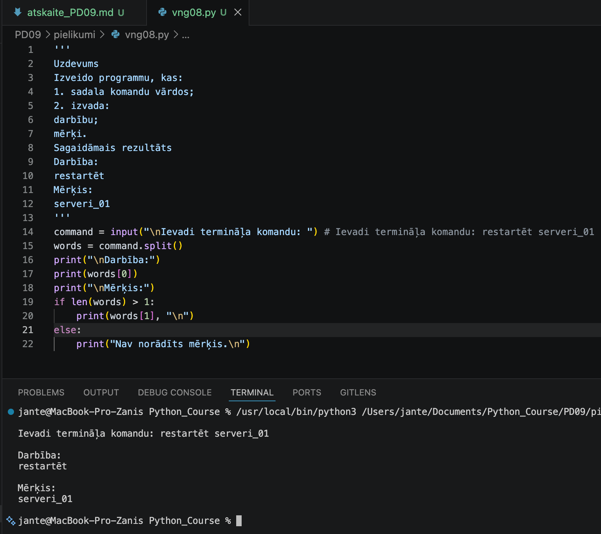

---

## Komentāri / piezīmes

Lietotāja ievadītās termināļa komandas drošai analīzei tika izmantota metode `.split()` un nosacījuma 
pārbaude `if-else`. Programma sadala ievadi vārdos un piekļūst pirmajam elementam (darbībai) ar 
indeksu `[0]`. Lai novērstu kritisku programmas avāriju (`IndexError`) gadījumos, kad tiek izpildīta 
vienskaitlīga komanda bez papildu parametriem, ar nosacījumu `len(words) > 1` tiek pārbaudīts saraksta 
garums. Ja mērķis ir norādīts, programma to izvada, pretējā gadījumā droši izvada paziņojumu "Nav 
norādīts mērķis.", garantējot koda stabilitāti.

---

# 🧩 vnginājums 09

# Faila nosaukums

```text id="sdm8v5"
vng09.py
```
---

## Python kods

```python id="mt3k0v"
'''
Uzdevums
Izveido programmu, kas:
1. saņem neapstrādātu ievadi;
2. izmanto:
.strip()
.lower()
.split()
3. izvada:
sakopto tekstu;
sadalīto sarakstu;
pirmo komandas daļu.
Sagaidāmais rezultāts
Sakoptais teksts:
skanēt sektoru_b4
Sadalītais saraksts:
['skanēt', 'sektoru_b4']
Komanda:
skanēt
'''
command = input("\nIevadi termināļa komandu: ") # Ievadi termināļa komandu: skanēt sektoru_b4
command = command.strip().lower()
words = command.split()
print("\nSakoptais teksts:")
print(command)
print("\nSadalītais saraksts:")
print(words)
print("\nKomanda:")
print(words[0], "\n")
```
---

## Rezultāts / izvade

Pievieno:

* ekrānuzņēmumu.

Rezultāts

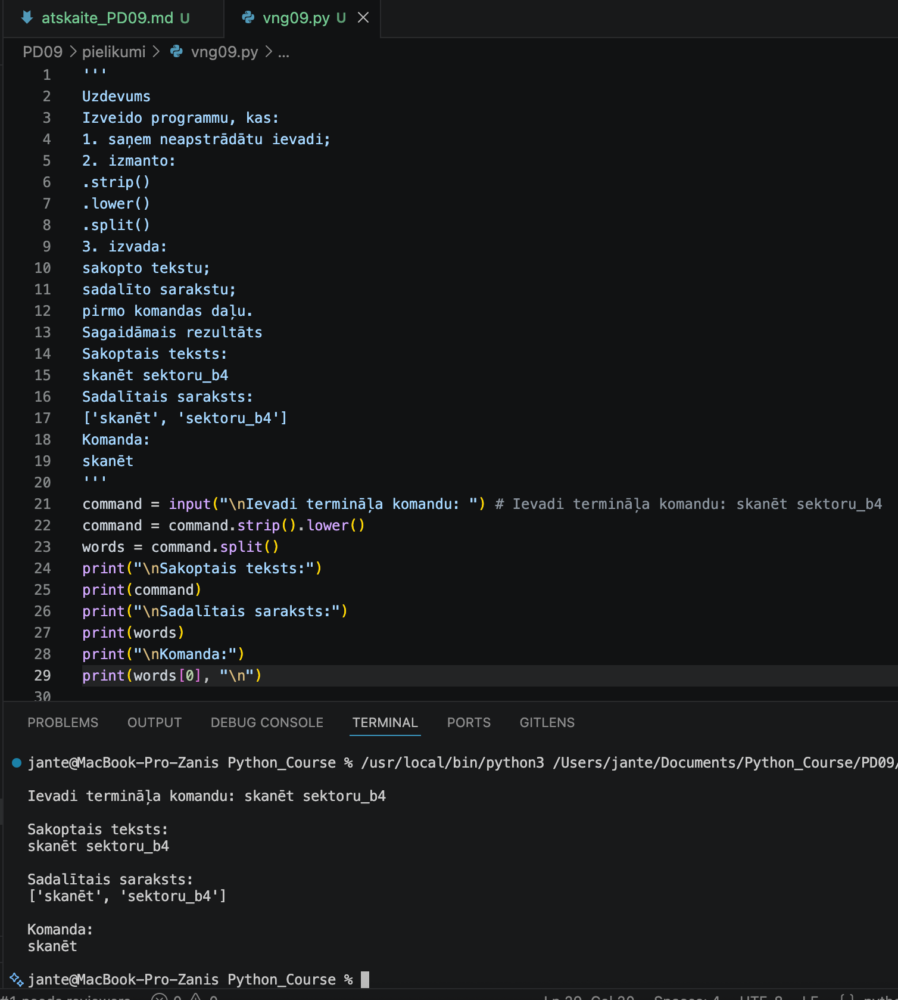

---

## Komentāri / piezīmes

Lietotāja ievadītās termināļa komandas kompleksai apstrādei tika pielietota metožu ķēde (method chaining), 
secīgi izsaucot `.strip()` nevēlamo sākuma un beigu atstarpju likvidēšanai un `.lower()` teksta 
normalizācijai reģistrnedēvīgā formā. Iegūtā sakoptā simbolu virkne tika sadalīta atsevišķos elementos 
ar `.split()` metodi, automātiski izveidojot sarakstu (list). Galvenā komanda (darbība) tika izgūta no saraksta, 
piekļūstot tā pirmajam elementam ar indeksu `[0]`. Visi apstrādes posmi tika secīgi un pārskatāmi izvadīti 
terminālī vizuālai pārbaudei.

---

# 🧩 vnginājums 10

# Faila nosaukums

```text id="sdm8v5"
vng10.py
```
---

## Python kods

```python id="mt3k0v"
'''
Uzdevums
Programma satur vairākas kļūdas.
Atrodi un izlabo tās.
teksts = "   NEO-77"
teksts.strip
teksts.lower()
print(teksts)
Jautājumi pārdomām
Kāpēc 
.strip nedarbojās?
Kāpēc teksts nepārvērtās mazajos burtos?
Kāpēc rezultāts neizmainījās?
'''

teksts = "   NEO-77"
# teksts.strip
# teksts.lower()

teksts = teksts.strip()
teksts = teksts.lower()

print("\n", teksts, "\n", sep="")
```
---

## Rezultāts / izvade

Pievieno:

* ekrānuzņēmumu.

Kods ar kļūdu

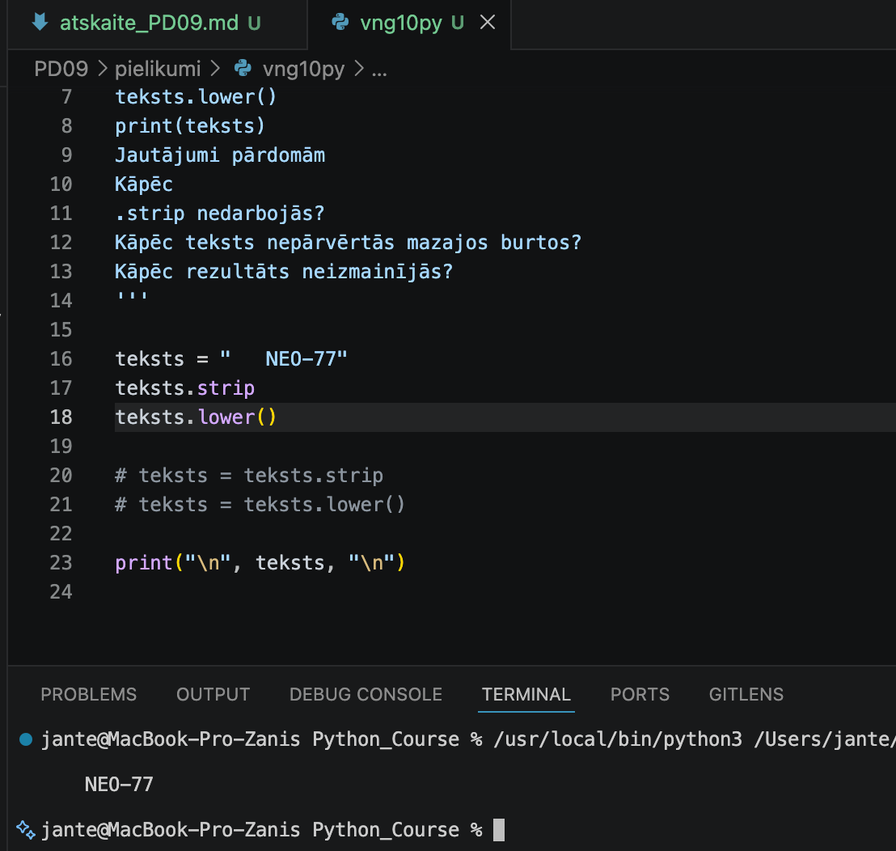

Kods ir labots

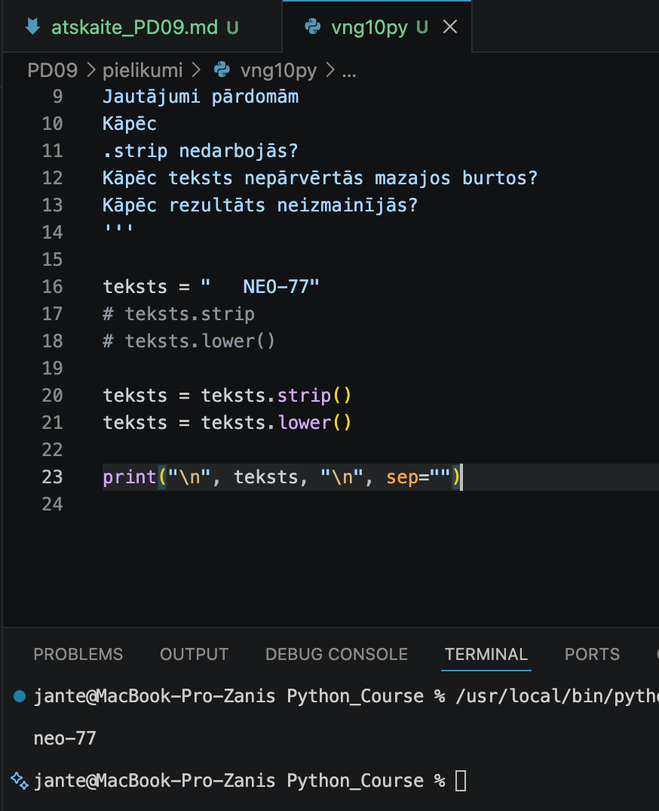

---

## Komentāri / piezīmes

Koda atkļūdošanas (debugging) laikā tika identificēti un novērsti kļūdu cēloņi, kas saistīti ar nepareizu 
metožu izsaukšanu un simbolu virkņu nemainības (immutability) principu.

Atbildes uz pārdomu jautājumiem:
1. Kāpēc .strip nedarbojās?
Metode `.strip` nedarbojās, jo tā tika pierakstīta bez apaļajām iekavām `()`. Python valodā metodes ir 
jāizsauc kā funkcijas; bez iekavām programma tikai atsaucas uz pašu metodi kā objektu, bet to neizpilda.

2. Kāpēc teksts nepārvērtās mazajos burtos?
Metode `.lower()` tika izsaukta pareizi, taču tās rezultāts netika saglabāts. Python valodā simbolu virknes 
ir nemainīgi (immutable) objekti. Jebkura manipulācija ar tiem rada jaunu vērtību, tāpēc rezultāts ir manuāli 
jāpārraksta atpakaļ mainīgajā (piemēram, `teksts = teksts.lower()`).

3. Kāpēc rezultāts neizmainījās?
Rezultāts neizmainījās abu iepriekš minēto iemeslu dēļ. Tā kā neviena no veiktajām darbībām neizmainīja pašu 
mainīgo `teksts`, funkcija `print()` izvadīja sākotnējo, neapstrādāto teksta virkni ar visām sākuma atstarpēm 
un lielajiem burtiem.

Labotajā koda versijā šīs kļūdas ir novērstas, veicot secīgu metožu izsaukšanu un vērtību pārrakstīšanu 
mainīgajā `teksts`.


---

# 📝 Refleksija — piedzīvojumi un pārdzīvojumi

* Kas jums šodien visvairāk patika?
Man visvairāk patika strādāt ar simbolu virknēm (stringiem), izmantojot dažādās metodes.

* Kas bija vissarežģītākais?
Bija sarežģīti apgūt visas Python iebūvētās metodes.

* Kādu kļūdu jūs atradāt un izlabojāt?
Es izlaboju kļūdu 10. uzdevumā, kur metode .strip neizpildījās, jo tā bija pierakstīta bez apaļajām iekavām (), kā arī es saglabāju .lower() metodes rezultātu mainīgajā, lai turpmākajā kodā varētu izmantot šo rezultātu.

* Kas bija interesants vai jautrs?
Viss bija interesanti.

---

# 🎯 Pamatots pašvērtējums (0-100)

| Kritērijs | Punkti | Pamatojums |
| :---      | :---:  | :---       |
| Kods un funkcionalitāte | 60 | Visi uzdevumi ir izpildīti un strādā bez kļūdām. |
| Izpratne un komentāri | 20 | Koda rindas ir nokomentētas, izpratne par tēmu ir pilnīga. |
| Refleksija | 10 | Refleksija ir sniegta godīgi un pilnā apjomā. |
| Noformējums un struktūra | 10 | Visi faili un attēli ir sakārtoti atbilstošajās mapēs. |
| **Kopā** | **100/100** | Viss ir izpildīts precīzi pēc prasībām. |

---

# 📦 Iesniegšana

Pirms iesniegšanas pārbaudi:

* [x] Visi `.py` faili atrodas mapē `Pielikumi`
* [x] Ekrānuzņēmumi ievietoti mapē `atteli`
* [x] Atskaites fails ir aizpildīts
* [x] Programmas darbojas

---

## Arhivēšana

Arhivē visu mapi:

```text id="h1xcm7" 
PD09.zip
```