# Praktiskā darba atskaite — PD10

**Tēma:** Programma sāk sadalīt pienākumus 
**Vārds, Uzvārds:** Zhan Teivan 
**Datums:** 2026-05-22  
**Grupa:**  DAAVP_Daugavpils_80


[Mana praktiskā darba mape GitHub platformā](https://github.com/JanTey/Python_Course/blob/main/PD10/atskaite_PD10.md)


---
# 📁 0. Sagatavošanās darbi

Pārbaudi, vai sagatavota darba vide:

* [x] Izveidota mape `PD10`
* [x] Izveidota apakšmape `pielikumi`
* [x] Izveidota apakšmape `atteli`
* [x] Izveidots fails `atskaite_PD10.md`

---

## Mapju struktūra

```text
PD10/
├─ Pielikumi/
│  ├─ vng01.py
│  ├─ vng02.py
│  ├─ vng03.py
│  ├─ vng04.py
│  ├─ vng05.py
│  ├─ vng06.py
│  ├─ vng07.py
│  ├─ vng08.py
│  ├─ vng09.py
│  └─ vng10.py
├─ atteli/
│  ├─ maps_structure.png
│  ├─ vng01.png
│  ├─ vng02.png
│  ├─ vng03.png
│  ├─ vng04.png
│  ├─ vng05.png
│  ├─ vng06.png
│  ├─ vng07.png
│  ├─ vng08a.png
│  ├─ vng08b.png
│  ├─ vng09.png
│  └─ vng10.png
└─ atskaite_PD10.md
````

---

## Ekrānuzņēmums

Pievieno ekrānuzņēmumu ar mapes struktūru.

```markdown id="j0m2om"
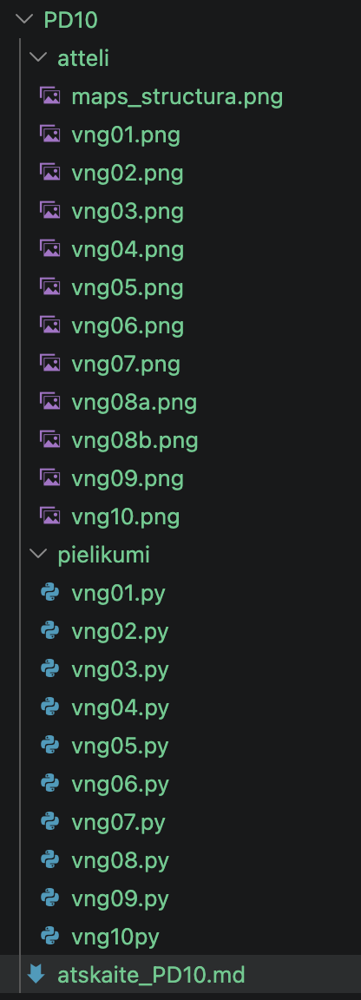
```


---

# 🧩 vnginājums 01

## Faila nosaukums

```text id="pjlwmj"
vng01.py
```
---

## Python kods

```python id="p62h2r"
'''
Uzdevums
Izveido funkciju:
sasveicinaties()
Funkcijai jāizvada:
Sveiks, kadet!
Pēc definēšanas funkciju izsauc.
Sagaidāmais rezultāts
Sveiks, kadet!
'''

def sasveicinaties():
    print()
    print("Sveiks, kadet!")
    print()    
    
sasveicinaties()
```
---

## Rezultāts / izvade

Pievieno:

* ekrānuzņēmumu.

Rezultāts

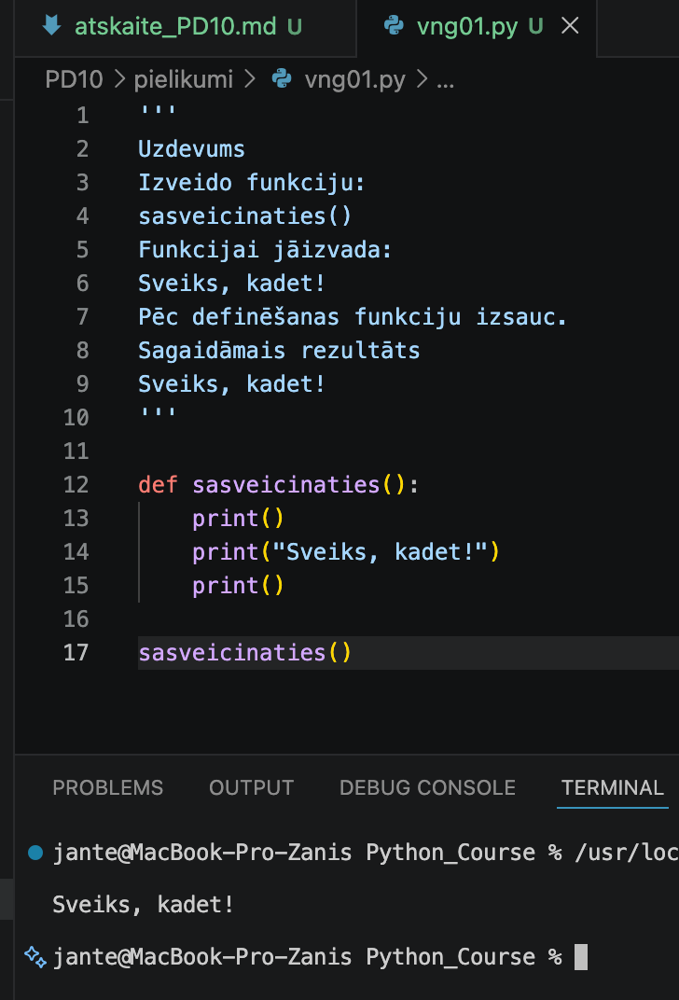

---

## Komentāri / piezīmes

**Komentārs par darbu (vng01.py):**
Koda strukturēšanai un loģiskai sadalīšanai tika definēta vienkārša lietotāja funkcija `sasveicinaties()`, 
izmantojot atslēgvārdu `def`. 


---

# 🧩 vnginājums 02

## Faila nosaukums

```text id="sdm8v5"
vng02.py
```
---

## Python kods

```python id="mt3k0v"
'''
Uzdevums
Izveido funkciju:
signalizet()
Funkcijai jāizvada:
⚠
 Sistēmas brīdinājums!
Izsauc funkciju 3 reizes.
Sagaidāmais rezultāts
⚠️ Sistēmas brīdinājums!
⚠️ Sistēmas brīdinājums!
⚠️Sistēmas brīdinājums!
'''

def signalizet():
    print("⚠️ Sistēmas brīdinājums!")  
       
print()
for i in range(3):  
    signalizet()
print()
```
---

## Rezultāts / izvade

Pievieno:

* ekrānuzņēmumu.

Rezultāts

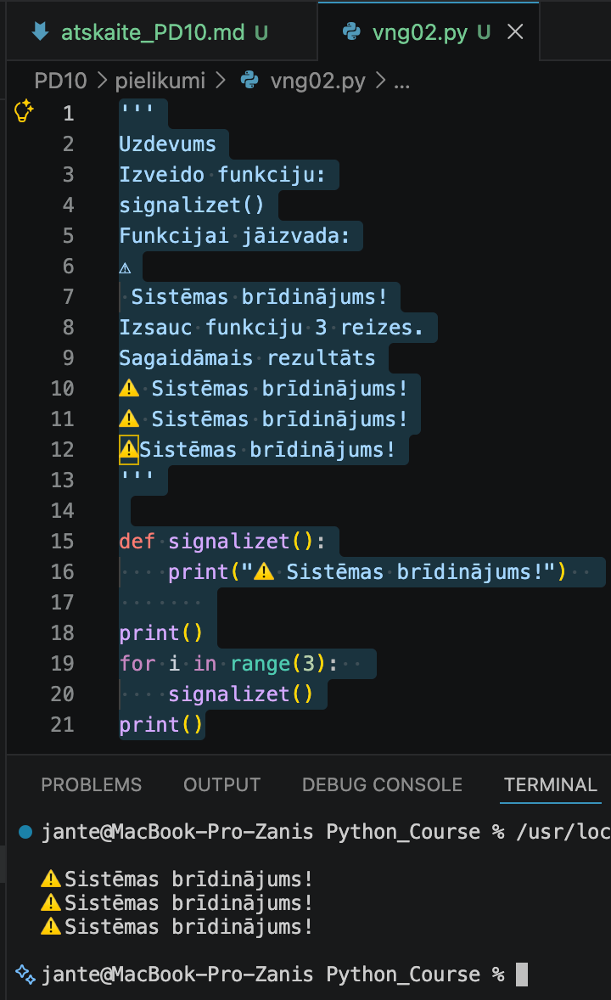

---

## Komentāri / piezīmes

Tika definēta lietotāja funkcija `signalizet()`, kas izvada sistēmas brīdinājuma paziņojumu. 
Lai nodrošinātu funkcijas izpildi trīs reizes pēc kārtas un izvairītos no koda dublēšanas, 
tika izmantots `for` cikls ar `range(3)` funkciju.


---

# 🧩 vnginājums 03 

## Faila nosaukums

```text id="sdm8v5"
vng03.py
```
---

## Python kods

```python id="mt3k0v"
'''
Uzdevums
Izveido funkciju:
sasveicinaties(vards)
Funkcijai jāizvada personalizēts sveiciens.
Programmai jāprasa lietotāja vārds ar 
input() .
Sagaidāmais rezultāts
Ievadi vārdu:
Neo
Sveiks, Neo!
'''

def sasveicinaties(vards):
    print()
    print(f"Sveiks, {vards}!")
    print()
    
vards = input("\nIevadi savu vārdu: ")
sasveicinaties(vards)
```
---

## Rezultāts / izvade

Pievieno:

* ekrānuzņēmumu.

Rezultāts

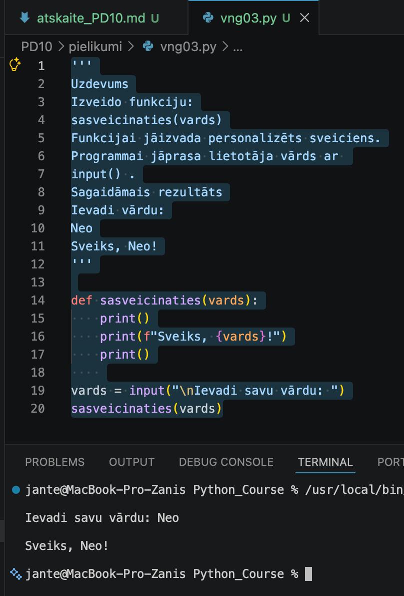

---

## Komentāri / piezīmes

Tika definēta funkcija `sasveicinaties(vards)`, kas saņem vienu parametru personalizēta sveiciena 
izveidei. Lietotāja ievadītais vārds tiek nolasīts ar `input()` funkciju un nodots kā arguments, 
izsaucot funkciju.


---

# 🧩 vnginājums 04 

## Faila nosaukums

```text id="sdm8v5"
vng04.py
```
---

## Python kods

```python id="mt3k0v"
'''
Uzdevums
Izveido funkciju:
sakopt_signalu(teksts)
Funkcijai:
1. jānotīra liekās atstarpes;
2. jāpārveido teksts uz mazajiem burtiem;
3. jāatgriež rezultāts ar 
return .
Sagaidāmais rezultāts
neo
'''

def sakopt_signalu(teksts):
    print()
    teksts = teksts.strip()  
    teksts = teksts.lower() 
    print()
    return teksts

# teksts = input("\nIevadi tekstu: ")
# rezultats = sakopt_signalu(teksts)
rezultats = sakopt_signalu(input("\nIevadi tekstu: "))
print(rezultats, "\n")
```
---

## Rezultāts / izvade

Pievieno:

* ekrānuzņēmumu.

Kods ir labots

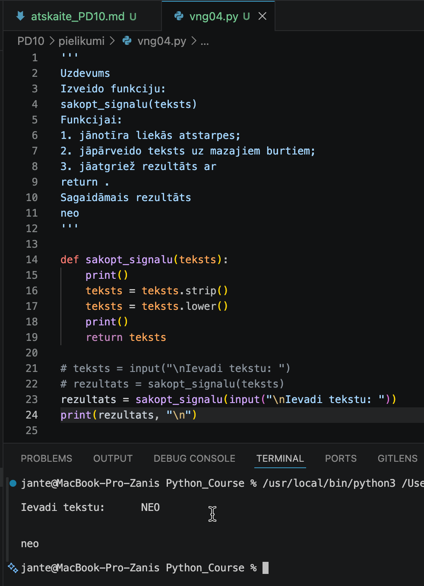

---

## Komentāri / piezīmes

Tika definēta funkcija `sakopt_signalu(teksts)`, kas apstrādā saņemtos datus ar `.strip()` 
un `.lower()` metodēm. Funkcija nevis vienkārši izvada tekstu ekrānā, bet atgriež apstrādāto 
rezultātu programmā ar `return` atslēgvārdu, ļaujot to saglabāt mainīgajā un izmantot 
tālākā koda izpildē


---

# 🧩 vnginājums 05

## Faila nosaukums

```text id="sdm8v5"
vng05.py
```
---

## Python kods

```python id="mt3k0v"
'''
Uzdevums
Lietotāji bieži nejauši ievada liekas atstarpes.
Izveido programmu, kas:
1. saglabā tekstu ar liekām atstarpēm;
2. izvada:
oriģinālo tekstu;
sakopto tekstu.
Sagaidāmais rezultāts
Oriģinālais:
"   sektors_B7   "
Sakoptais:
"sektors_B7"
'''

# Saglabā tekstu ar liekām atstarpēm
teksts = "   sektors_B7   "
print(f"\nOriģinālais: \"{teksts}\"")
print(f"\nSakoptais: \"{teksts.strip()}\"\n")
```
---

## Rezultāts / izvade

Pievieno:

* ekrānuzņēmumu.

Rezultāts

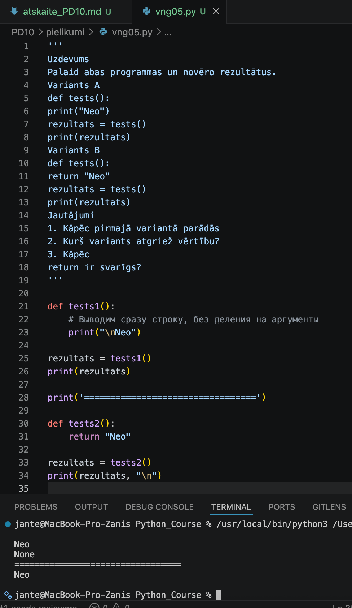

---

## Komentāri / piezīmes

Atbildes uz jautājumiem (Iesniegšanai atskaitē)
1. Kāpēc pirmajā variantā parādās None?
Pirmajā variantā funkcija veic tikai darbību — izvada tekstu ekrānā ar print(), 
bet tai nav return atslēgvārda. Ja funkcija Python valodā neatgriež konkrētu vērtību, 
tā automātiski atgriež speciālu tukšuma vērtību None. Tāpēc, mēģinot saglabāt funkcijas 
rezultātu mainīgajā rezultats, tajā ierakstās None.

2. Kurš variants atgriež vērtību?
Vērtību atgriež Variants B, jo tajā ir izmantots atslēgvārds return "Neo". Tas veiksmīgi 
nodod virkni "Neo" ārpus funkcijas un saglabā to mainīgajā.

3. Kāpēc return ir svarīgs?
return ir svarīgs, jo tas ļauj funkcijai nodot tās darba rezultātu (datus) atpakaļ 
galvenajai programmai. Bez return funkcijas aprēķinātos datus nevarētu saglabāt mainīgajos, 
nodot citām funkcijām vai izmantot tālākos aprēķinos.
 

---

# 🧩 vnginājums 06

# Faila nosaukums

```text id="sdm8v5"
vng06.py
```
---

## Python kods

```python id="mt3k0v"
'''
Uzdevums
Izveido funkciju:
parbaudit_degvielu(litri)
Ja degvielas daudzums ir mazāks par 20:
⚠
 KRITISKS: Zems degvielas līmenis!
Pretējā gadījumā:
✅
 Degvielas sistēma: NOMINĀLA.
Sagaidāmais rezultāts
⚠
 KRITISKS: Zems degvielas līmenis!
'''

def parbaudit_degvielu(litri):
    if litri < 20:
        return "⚠️ KRITISKS: Zems degvielas līmenis!"
    else:
        return "✅ Degvielas sistēma: NOMINĀLA."

ievade = int(input("\nCik daudz degvielas ir jūsu automašīnā?: "))

pazinojums = parbaudit_degvielu(ievade)

print("\n", pazinojums, "\n")
```
---

## Rezultāts / izvade

Pievieno:

* ekrānuzņēmumu.

Rezultāts

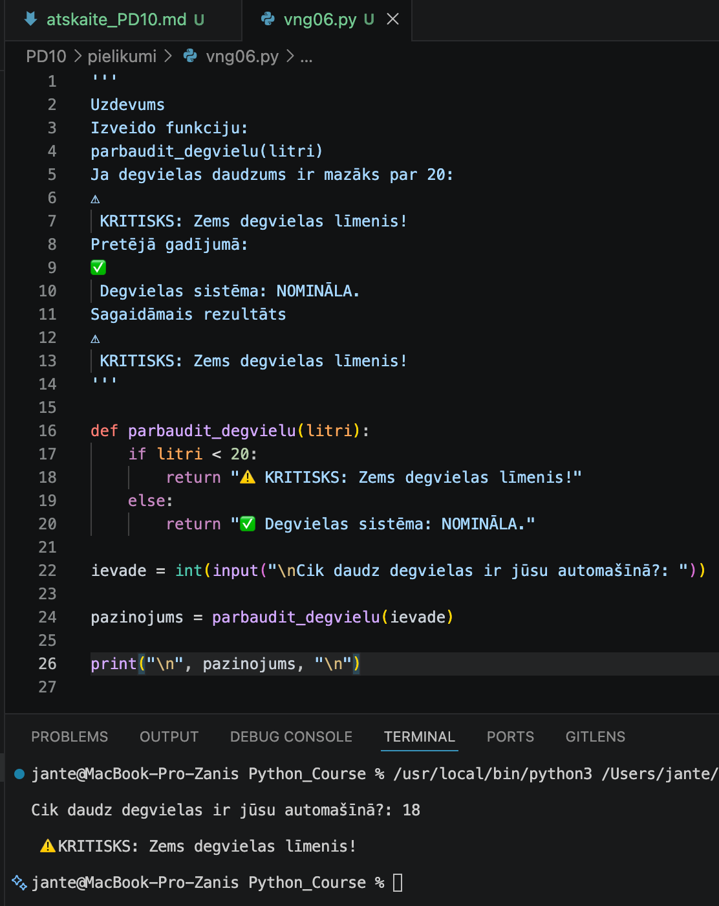

---

## Komentāri / piezīmes

Tika definēta funkcija `parbaudit_degvielu(litri)`, kas apvieno nosacījuma operatoru `if-else` 
ar vērtības atgriešanu. Funkcija pārbauda saņemto skaitlisko vērtību un ar `return` atgriež 
attiecīgu teksta paziņojumu. Galvenajā programmā lietotāja ievade tiek pārvērsta par skaitli, 
nodota funkcijai, un saņemtais rezultāts tiek izvadīts terminālī.


---

# 🧩 vnginājums 07

# Faila nosaukums

```text id="sdm8v5"
vng07.py
```
---

## Python kods

```python id="mt3k0v"
'''
Uzdevums
Dots kods:
vards1 = input("1. vārds: ")
vards1 = vards1.strip()
vards1 = vards1.lower()
vards2 = input("2. vārds: ")
vards2 = vards2.strip()
vards2 = vards2.lower()
print(vards1)
print(vards2)
Pārveido šo programmu, izmantojot funkciju:
sakopt_vardu()
'''

def sakopt_vardu(vards):
    vards = vards.strip()
    vards = vards.lower()
    return vards

vards1 = input("\n1. vārds: ")
vards1 = sakopt_vardu(vards1)

vards2 = input("\n2. vārds: ")
vards2 = sakopt_vardu(vards2)
print()
print(vards1)
print(vards2, "\n" )   
---

## Rezultāts / izvade

Pievieno:

* ekrānuzņēmumu.

Rezultāts

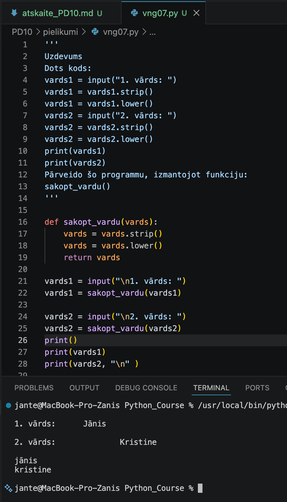

---

## Komentāri / piezīmes

Lai novērstu koda dublēšanos un strukturētu programmu, tika izveidota funkcija `sakopt_vardu(vards)`. 
Tā centralizēti veic teksta apstrādi ar `.strip()` un `.lower()` metodēm un atgriež rezultātu. 
Galvenajā programmā šī funkcija tiek veiksmīgi izsaukta katram lietotāja ievadītajam vārdam atsevišķi.

---

# 🧩 vnginājums 08

# Faila nosaukums

```text id="sdm8v5"
vng08.py
```
---

## Python kods

```python id="mt3k0v"
'''
'''
Uzdevums
Dots kods:
vards1 = input("1. vārds: ")
vards1 = vards1.strip()
vards1 = vards1.lower()
vards2 = input("2. vārds: ")
vards2 = vards2.strip()
vards2 = vards2.lower()
print(vards1)
print(vards2)
Pārveido šo programmu, izmantojot funkciju:
sakopt_vardu()
'''
def sakopt_vardu(vards):
    vards = vards.strip()
    vards = vards.lower()
    return vards

vards1 = input("\n1. vārds: ")
vards1 = sakopt_vardu(vards1)

vards2 = input("\n2. vārds: ")
vards2 = sakopt_vardu(vards2)
print()
print(vards1)
print(vards2, "\n" )     
```
---

## Rezultāts / izvade

Pievieno:

* ekrānuzņēmumu.

Rezultāts


---

## Komentāri / piezīmes

Lai novērstu koda dublēšanos un strukturētu programmu, tika izveidota funkcija `sakopt_vardu(teksts)`. T
ā centralizēti veic teksta apstrādi ar `.strip()` un `.lower()` metodēm un atgriež rezultātu. Galvenajā 
programmā šī funkcija tiek veiksmīgi izsaukta katram lietotāja ievadītajam vārdam atsevišķi.

---

# 🧩 vnginājums 08

# Faila nosaukums

```text id="sdm8v5"
vng08.py
```
---

## Python kods

```python id="mt3k0v"
'''
Uzdevums
Programma nedarbojas.
Atrodi un izlabo kļūdu.
def tests():
print("Sistēma aktivizēta!")
tests()
Sagaidāmais rezultāts
Sistēma aktivizēta!
'''

def tests():
    print("\nSistēma aktivizēta!\n")
tests()
```
---

## Rezultāts / izvade

Pievieno:

* ekrānuzņēmumu.

Kods ar kļūdu

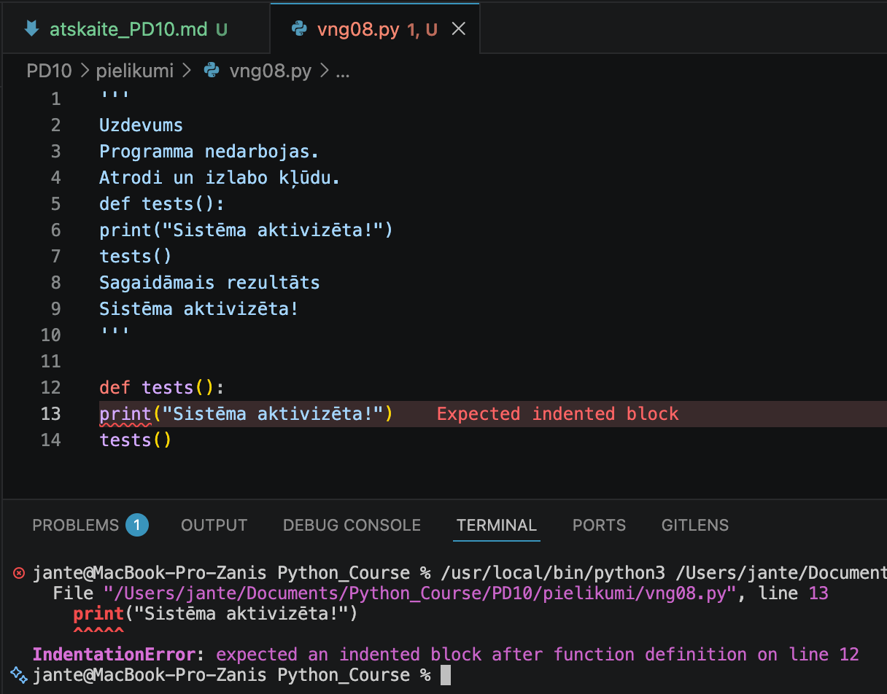

Kods ir labots

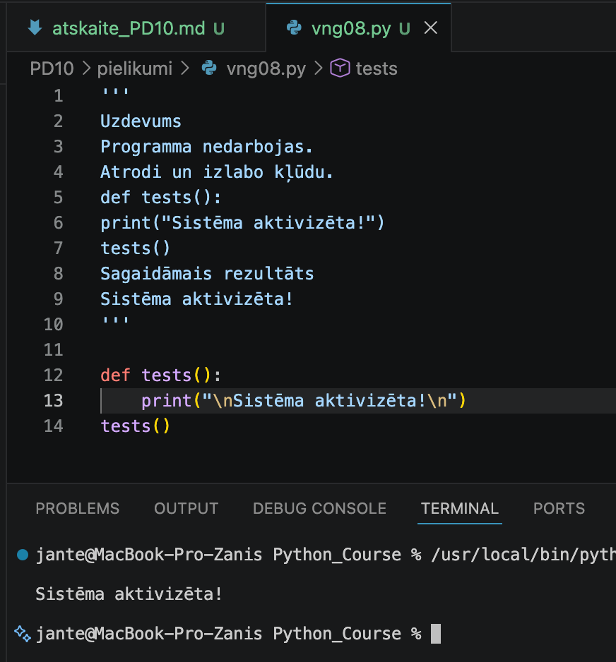

---

## Komentāri / piezīmes

Koda atkļūdošanas laikā tika identificēta un novērsta sintakses kļūda `IndentationError`. 
Sākotnējā koda versijā funkcijas ķermenis (`print` funkcija) bija uzrakstīts bez obligātās 
atkāpes. Veicot pareizu koda formatēšanu un pievienojot nepieciešamo četru atstarpju atkāpi 
funkcijas iekšienē, tika nodrošināta veiksmīga programmas izpilde un sagaidāmā rezultāta 
izvadīšana terminālī.

---

# 🧩 vnginājums 09

# Faila nosaukums

```text id="sdm8v5"
vng09.py
```
---

## Python kods

```python id="mt3k0v"
'''
Uzdevums
Izveido funkcijas:
parbaudit_degvielu()
parbaudit_temperaturu()
parbaudit_signalus()
Galvenajai programmai:
1. jāizsauc visas funkcijas;
2. jāizvada pilns diagnostikas ziņojums.
Sagaidāmais rezultāts--- DIAGNOSTIKA --
✅
 Degvielas sistēma stabila
⚠
 Temperatūra paaugstināta
✅
 Signāli stabili
'''

def parbaudit_degvielu():
    return "✅ Degvielas sistēma stabila"
def parbaudit_temperaturu():
    return "⚠️ Temperatūra paaugstināta"
def parbaudit_signalus():
    return "✅ Signāli stabili"

print("\n--- DIAGNOSTIKA ---")
print(parbaudit_degvielu())
print(parbaudit_temperaturu())
print(parbaudit_signalus())
print()
```
---

## Rezultāts / izvade

Pievieno:

* ekrānuzņēmumu.

Rezultāts

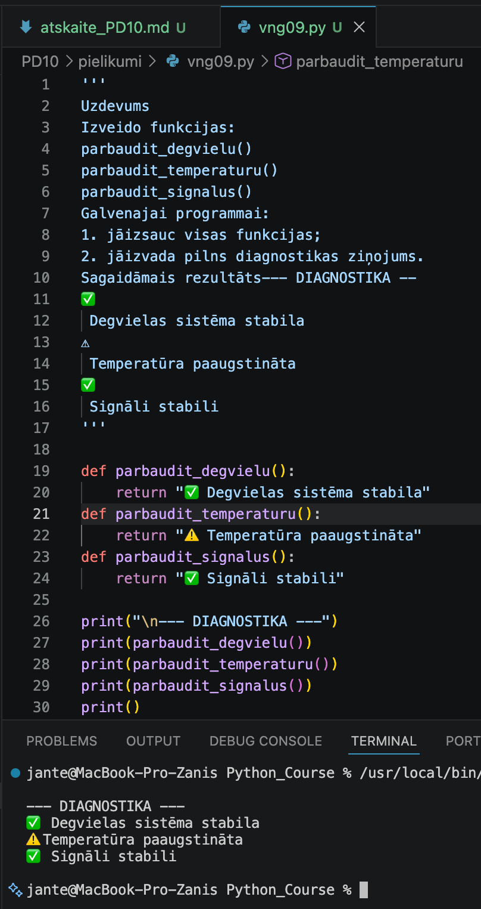

---

## Komentāri / piezīmes

Tika izveidotas trīs funkcijas, kur katra atgriež attiecīgu teksta ziņojumu ar return 
komandu. Galvenajā programmā visas funkcijas tiek secīgi izsauktas, un to atgrieztie 
rezultāti tiek parādīti terminālī.

---

# 🧩 vnginājums 10

# Faila nosaukums

```text id="sdm8v5"
vng10.py
```
---

## Python kods

```python id="mt3k0v"
'''
Uzdevums
Izdomā un izveido savu funkciju.
Piemēri:
piekļuves validācija.
Funkcijai jāizmanto:
parametrs;
return ;
vismaz viens 
if .
'''

import subprocess
import sys
def pārbaudīt_sistēmu(parole):
    # 1. Pārbaude uz latīņu šriftu (ASCII)
    if not parole.isascii():
        print("\n❌ Kļūda: Atļauti tikai latīņu burti!")
        return False # Пароль не подошел
        
    # 2. Paroles pārbaude
    if parole == "asd":
        ludzu()
        return True # Сигнал успеха! Пароль верный.
    else:
        if i == 4:
            print("\n❌ Maksimālais mēģinājumu skaits sasniegts. Sistēma bloķēta.")
        else:
            print("\n⚠️ Parole netika pieņemta! Mēģiniet vēlreiz.")
            return False # Parole nedarbojās

def ludzu():
    print("\n✅ Parole pieņemta. Degvielas sistēma: NOMINĀLA.")

# Galvenā programma
for i in range(1, 5):
    ievade = input(f"\nMēģinājums {i}/4. Ievadi parole: ")
    
    # Izsauciet funkciju cikla iekšpusē un pārbaudiet tās atbildi
    uzvara = pārbaudīt_sistēmu(ievade)
    
    if uzvara == True:
        print("\nSistēma aktivizēta. Palaižam nākamo programmu...")
        import os
            
        # 2. Atrodiet precīzu mapi, kurā fiziski atrodas pašreizējais vng10.py fails.
        tekoša_mape = os.path.dirname(__file__)
            
        # 3. Savienojiet ceļu ar mapi ar vēlamā faila nosaukumu vng09.py
        cela_uz_failu = os.path.join(tekoša_mape, "vng06.py")
            
        #4. Palaidiet, izmantojot precīzu pilnu ceļu
        subprocess.run([sys.executable, cela_uz_failu])
        exit()
```
---

## Rezultāts / izvade

Pievieno:

* ekrānuzņēmumu.

Rezultāts

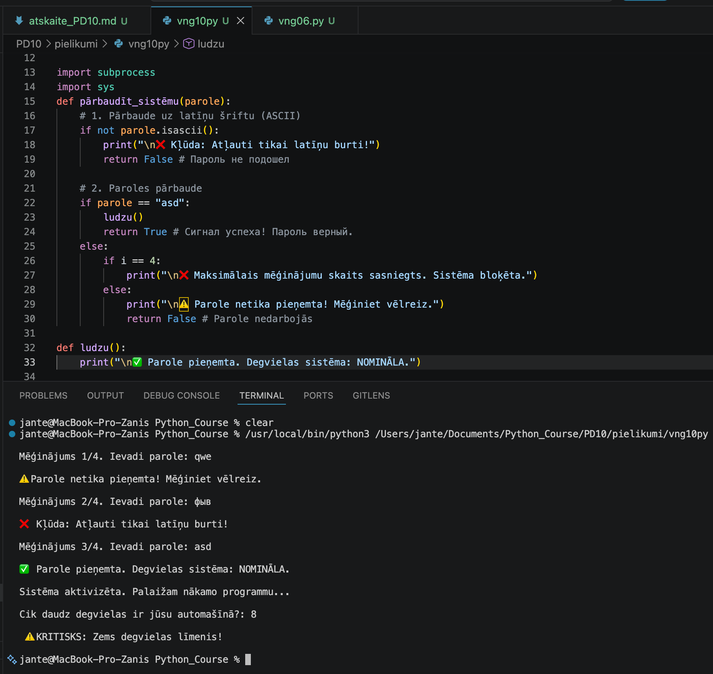

---

## Komentāri / piezīmes

Programma pilnībā izpilda uzdevuma nosacījumus. Ir izveidota funkcija pārbaudīt_sistēmu, 
kas drošības pārbaudei izmanto parametru (parole) un atgriež vērtību (return True/False). 
Funkcijas iekšienē ir realizēta vairāku līmeņu zarošanās (if-else). Galvenā programma ietver 
mēģinājumu ciklu un, ja piekļuve ir apstiprināta, automātiski palaiž nākamo sistēmas failu, 
izmantojot subprocess moduli.


---

# 📝 Refleksija — piedzīvojumi un pārdzīvojumi

* Kas jums šodien patika vislabāk?
Vislabāk man patika pēdējais uzdevums, kurā varēja izpausties radoši.

* Kas bija vissarežģītākais?
Sarežģītākais bija īstenot savas ieceres (fantāzijas) ar diezgan ierobežotām Python zināšanām.

* Kādu kļūdu jūs atradāt un izlabojāt?
Es izlaboju kļūdu 8. uzdevumā, kur funkcijai nebija ievēroti atkāpumi (atkāpes) print() operatoram.

* Kas bija interesants vai jautrs?
Viss bija interesanti.

---

# 🎯 Pamatots pašvērtējums (0-100)

| Kritērijs | Punkti | Pamatojums |
| :---      | :---:  | :---       |
| Kods un funkcionalitāte | 60 | Visi uzdevumi ir izpildīti un strādā bez kļūdām. |
| Izpratne un komentāri | 20 | Koda rindas ir nokomentētas, izpratne par tēmu ir pilnīga. |
| Refleksija | 10 | Refleksija ir sniegta godīgi un pilnā apjomā. |
| Noformējums un struktūra | 10 | Visi faili un attēli ir sakārtoti atbilstošajās mapēs. |
| **Kopā** | **100/100** | Viss ir izpildīts precīzi pēc prasībām. |

---

# 📦 Iesniegšana

Pirms iesniegšanas pārbaudi:

* [x] Visi `.py` faili atrodas mapē `Pielikumi`
* [x] Ekrānuzņēmumi ievietoti mapē `atteli`
* [x] Atskaites fails ir aizpildīts
* [x] Programmas darbojas

---

## Arhivēšana

Arhivē visu mapi:

```text id="h1xcm7" 
PD10.zip
```