# Praktiskā darba atskaite — PD12

**Tēma:** Faili un datu saglabāšana 
**Vārds, Uzvārds:** Zhan Teivan 
**Datums:** 2026-05-26  
**Grupa:**  DAAVP_Daugavpils_80


[Mana praktiskā darba mape GitHub platformā](https://github.com/JanTey/Python_Course/blob/main/PD12/atskaite_PD12.md)


---
# 📁 0. Sagatavošanās darbi

Pārbaudi, vai sagatavota darba vide:

* [x] Izveidota mape `PD12`
* [x] Izveidota apakšmape `pielikumi`
* [x] Izveidota apakšmape `atteli`
* [x] Izveidots fails `atskaite_PD12.md`

---

## Mapju struktūra

```text
PD12/
├─ Pielikumi/
│  ├─ vng01.py
│  ├─ vng02.py
│  ├─ vng03.py
│  ├─ vng04.py
│  ├─ vng05.py
│  ├─ vng06.py
│  ├─ vng07.py
│  ├─ vng08.py
│  ├─ vng09.py
│  └─ vng10.py
├─ atteli/
│  ├─ maps_structure.png
│  ├─ vng01.png
│  ├─ vng02.png
│  ├─ vng03.png
│  ├─ vng04.png
│  ├─ vng05.png
│  ├─ vng06.png
│  ├─ vng07.png
│  ├─ vng08a.png
│  ├─ vng08b.png
│  ├─ vng09.png
│  └─ vng10.png
├─ atskaite_PD12.md
├─ dienasgramata.txt
├─ piezime.txt
├─ pirmais_fails.txt
├─ rindas.txt
├─ tests.txt
├─ vards.txt
├─ viesi.txt
└─ zurnals.txt
````

---

## Ekrānuzņēmums

Pievieno ekrānuzņēmumu ar mapes struktūru.

```markdown id="j0m2om"
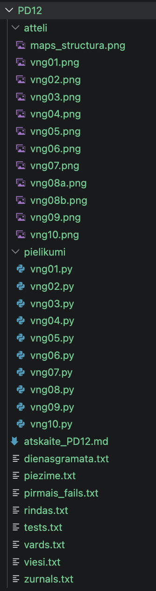
```


---

# 🧩 vnginājums 01

## Faila nosaukums

```text id="pjlwmj"
vng01.py
```
---

## Python kods

```python id="p62h2r"
"""
Uzdevums
Izveido programmu, kas failā pirmais_fails.txt ieraksta tekstu:
Mana programma sāk atcerēties.
Izmanto:
with open(...)
Sagaidāmais rezultāts
Mapē parādās fails:
pirmais_fails.txt
Tajā ir teksts:
Mana programma sāk atcerēties.
"""

with open("PD12/pirmais_fails.txt", "w") as f:
    f.write("Mana programma sāk atcerēties.")
```
---

## Rezultāts / izvade

Pievieno:

* ekrānuzņēmumu.

Rezultāts

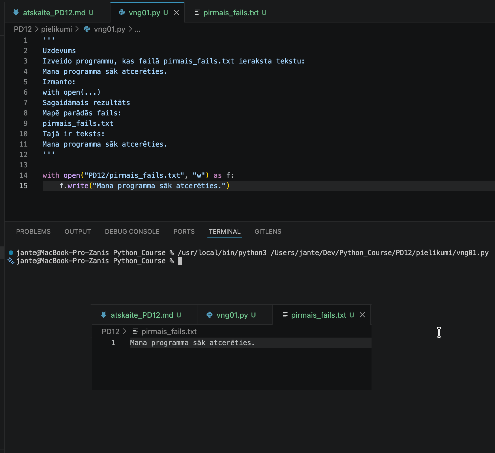

---

## Komentāri / piezīmes

**Komentārs par darbu (vng01.py):**
KLai atvērtu failu Python valodā, visbiežāk izmanto with open() konstrukciju. Šeit ir galvenie elementi:
1) open() funkcija: Pamata funkcija faila atvēršanai. Tā pieņem faila ceļu un režīmu.
2) Faila ceļš (file path): Norāde uz faila atrašanās vietu (piemēram, "fails.txt" vai "mape/fails.txt").

3) Režīmi (modes): Nosaka, ko darīsim ar failu:

   -  'r' (read) – lasīšana (noklusējuma režīms).

   - 'w' (write) – rakstīšana (izdzēš faila saturu, ja tas eksistē).

   - 'a' (append) – pievienošana (raksta faila beigās).

   - 'x' (exclusive creation) – izveido failu, ja tas neeksistē.

4) with paziņojums: Konteksta pārvaldnieks. Tas automātiski aizver failu pēc darbību beigām, pat ja rodas kļūda, 
tādējādi pasargājot no atmiņas noplūdēm.

5) as f (aliass): Piešķir faila objektam ērtu nosaukumu (mainīgo), ar kuru veikt tālākās darbības 
(piemēram, f.read() vai f.write()). 


---

# 🧩 vnginājums 02

## Faila nosaukums

```text id="sdm8v5"
vng02.py
```
---

## Python kods

```python id="mt3k0v"
"""
Uzdevums
Programma prasa ievadīt vārdu un saglabā to failā vards.txt.
Sagaidāmais rezultāts
Ievadi vārdu:
Anna
Vārds saglabāts.
Failā:
Anna
"""

vards = input("\nIevadi vārdu: \n")

with open("PD12/vards.txt", "w") as f:
    f.write(vards)

print("\nVārds saglabāts.\n")

with open("PD12/vards.txt", "r") as f:
    print(f"Failā:\n{f.read()}\n")
```
---

## Rezultāts / izvade

Pievieno:

* ekrānuzņēmumu.

Rezultāts

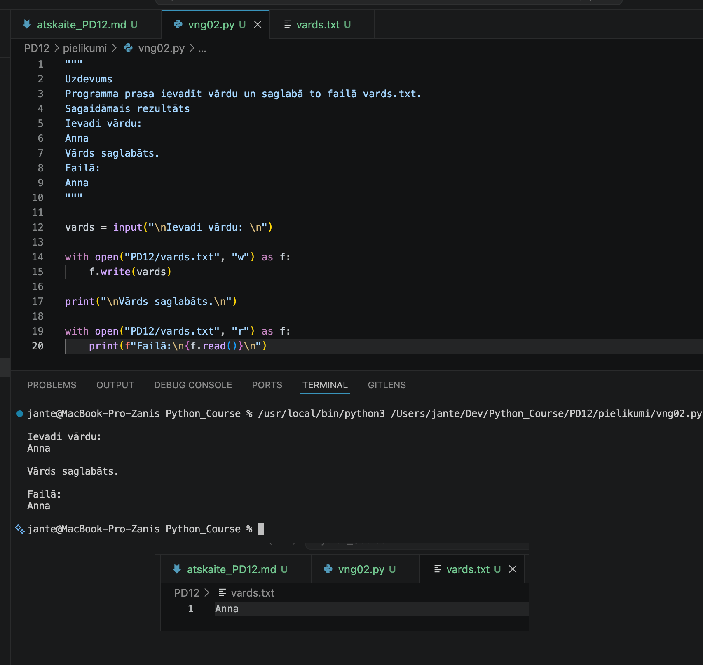

---

## Komentāri / piezīmes

Programma iegūst lietotāja ievadīto vārdu, ieraksta to failā un pēc tam nolasīto saturu izvada 
terminālī. with open() konstrukcija nodrošina drošu faila atvēršanu un aizvēršanu, 'w' režīms 
veic datu ieraksti, bet 'r' režīms — nolasīšanu.


---

# 🧩 vnginājums 03 

## Faila nosaukums

```text id="sdm8v5"
vng03.py
```
---

## Python kods

```python id="mt3k0v"
"""
Uzdevums
Programma nolasa failu vards.txt un izvada tā saturu ekrānā.
Sagaidāmais rezultāts
Failā saglabāts:
Anna
"""
print("\nFailā saglabāts:\n")

with open("PD12/vards.txt", "r") as f:
    print(f.read() + "\n")
```
---

## Rezultāts / izvade

Pievieno:

* ekrānuzņēmumu.

Rezultāts

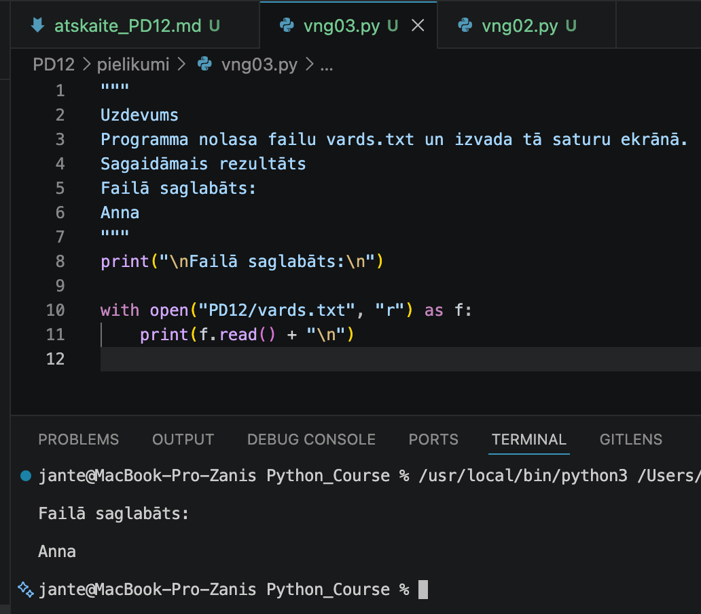

---

## Komentāri / piezīmes

Programma nolasa datus no faila un izvada tos terminālī. with open() konstrukcija nodrošina drošu 
faila atvēršanu un aizvēršanu, bet 'r' režīms veic datu nolasīšanu.

---

# 🧩 vnginājums 04 

## Faila nosaukums

```text id="sdm8v5"
vng04.py
```
---

## Python kods

```python id="mt3k0v"
"""
Uzdevums
Programma:
1. prasa ievadīt īsu piezīmi;
2. saglabā to failā piezime.txt;
3. nolasa šo failu;
4. izvada saturu ekrānā.
Sagaidāmais rezultāts
Ievadi piezīmi:
Šodien mācos failus.
Saglabātā piezīme:
Šodien mācos failus.
"""

piezime = input("\nIevadi piezīmi: \n")

with open("PD12/piezime.txt", "w") as f:
    f.write(piezime)

# print(f"\nSaglabātā piezīme:")

with open("PD12/piezime.txt", "r") as f:
    print("\nSaglabātā piezīme:\n" + f.read() + "\n")
```
---

## Rezultāts / izvade

Pievieno:

* ekrānuzņēmumu.

Kods ir labots

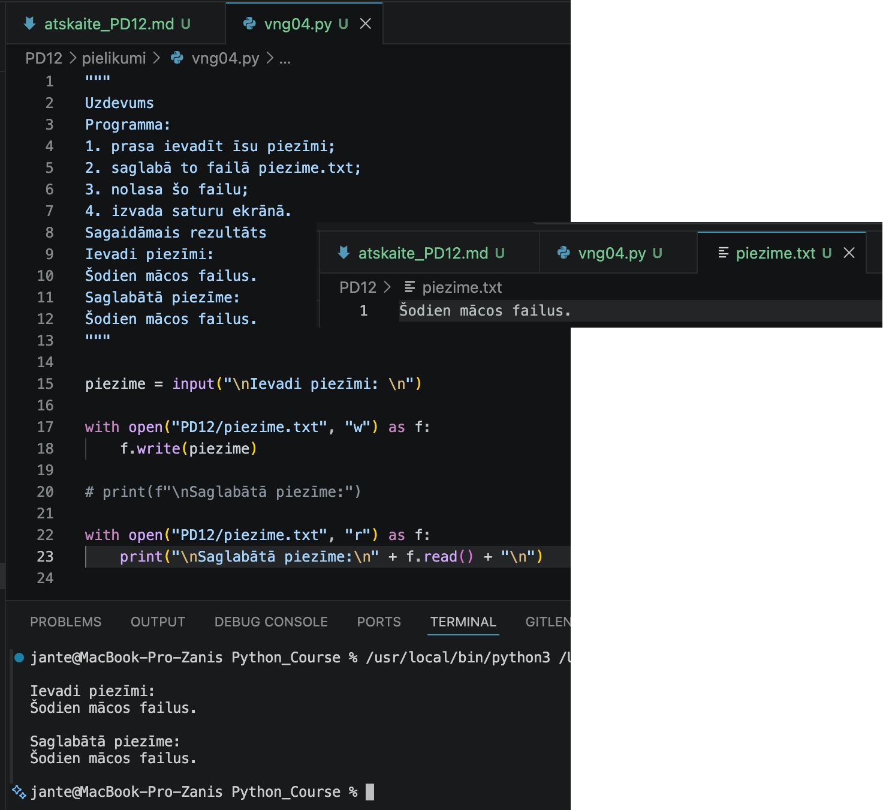

---

## Komentāri / piezīmes

Programma iegūst lietotāja ievadīto piezīmi, ieraksta to failā un nolasīto saturu izvada 
terminālī. with open() nodrošina faila automātisku aizvēršanu, 'w' režīms veic datu ieraksti, 
bet 'r' režīms — nolasīšanu.

---

# 🧩 vnginājums 05

## Faila nosaukums

```text id="sdm8v5"
vng05.py
```
---

## Python kods

```python id="mt3k0v"
"""
Uzdevums
Izveido programmu:
with open("tests.txt", "w", encoding="utf-8") as fails:
    fails.write("Pirmā rinda\n")
with open("tests.txt", "w", encoding="utf-8") as fails:
    fails.write("Otrā rinda\n")
with open("tests.txt", "r", encoding="utf-8") as fails:
    saturs = fails.read()
print(saturs)

Palaid programmu un atbildē pieraksti:
kura rinda palika failā?
kāpēc pirmā rinda pazuda?
Sagaidāmais rezultāts
Otrā rinda
"""
with open("PD12/tests.txt", "w", encoding="utf-8") as fails:
    fails.write("Pirmā rinda\n")
    
with open("PD12/tests.txt", "w", encoding="utf-8") as fails:
    fails.write("Otrā rinda\n")
    
with open("PD12/tests.txt", "r", encoding="utf-8") as fails:
    saturs = fails.read()
    
print("\n" + saturs)
```
---

## Rezultāts / izvade

Pievieno:

* ekrānuzņēmumu.

Rezultāts

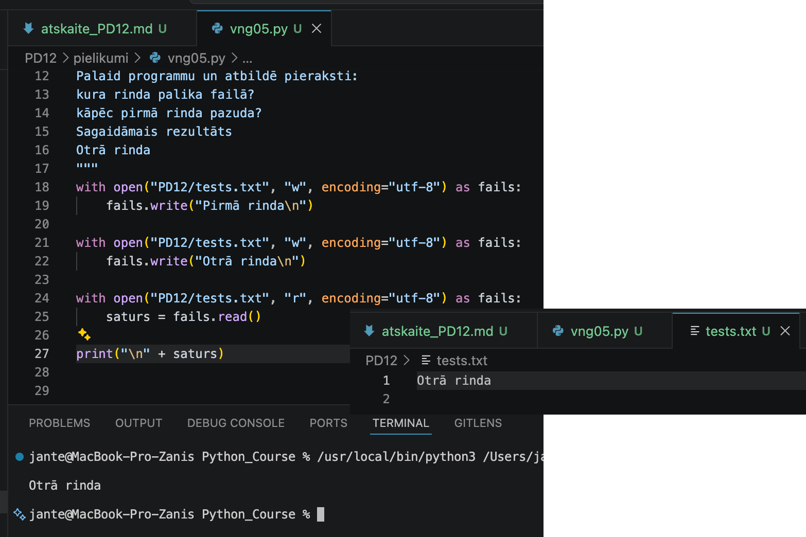

---

## Komentāri / piezīmes

Programma failā saglabā tikai „Otrā rinda”, jo režīms 'w' (write) katru reizi atver failu 
no jauna un dzēš tā iepriekšējo saturu. Pirmā ieraksta darbība tiek pilnībā pārrakstīta ar otro.

---

# 🧩 vnginājums 06

# Faila nosaukums

```text id="sdm8v5"
vng06.py
```
---

## Python kods

```python id="mt3k0v"
"""
Uzdevums
Izveido programmu, kas failā dienasgramata.txt pieraksta klāt vienu rindu:
Šodien es iemācījos saglabāt datus.
Izmanto režīmu "a".
Sagaidāmais rezultāts
Ja programmu palaiž vairākas reizes, failā parādās vairākas rindas.
Šodien es iemācījos saglabāt datus.
Šodien es iemācījos saglabāt datus.
Šodien es iemācījos saglabāt datus.
"""

for i in range(3):
    with open("PD12/dienasgramata.txt", "a", encoding="utf-8") as fails:
        fails.write("Šodien es iemācījos saglabāt datus.\n")
    
with open("PD12/dienasgramata.txt", "r", encoding="utf-8") as fails:
    print("\n" + fails.read())
```
---

## Rezultāts / izvade

Pievieno:

* ekrānuzņēmumu.

Rezultāts

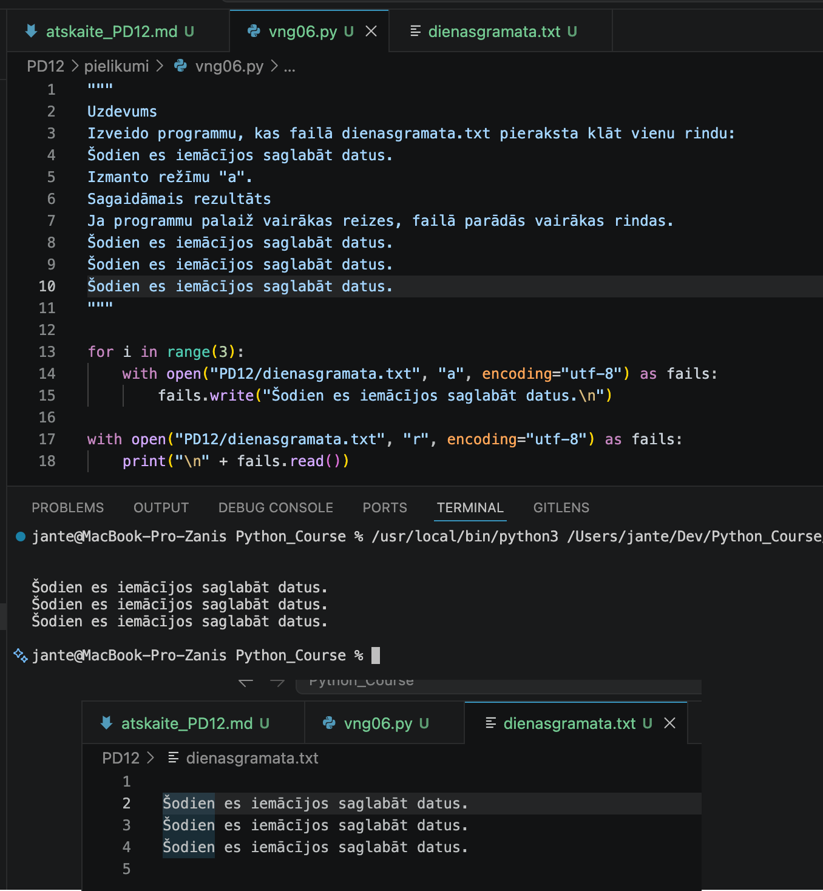

---

## Komentāri / piezīmes

Programma trīs reizes pēc kārtas ieraksta failā tekstu, izmantojot 'a' (append) režīmu, 
kas pievieno datus faila beigās, nevis dzēš iepriekšējo saturu. Pēc tam programma nolasīto 
faila saturu izvada terminālī.

---

# 🧩 vnginājums 07

# Faila nosaukums

```text id="sdm8v5"
vng07.py
```
---

## Python kods

```python id="mt3k0v"
"""
Uzdevums
Izveido programmu, kas failā rindas.txt ieraksta trīs rindas:
Pirmā rinda
Otrā rinda
Trešā rinda
Izmanto \n.
Sagaidāmais rezultāts
Failā:
Pirmā rinda
Otrā rinda

Trešā rinda
"""
with open("PD12/rindas.txt", "w", encoding="utf-8") as fails:
    fails.write("Pirmā rinda\n")
    fails.write("Otrā rinda\n")
    fails.write("\nTrešā rinda\n")

with open("PD12/rindas.txt", "r", encoding="utf-8") as fails:
    print("\n" + fails.read())
ards2, "\n" )     
```
---

## Rezultāts / izvade

Pievieno:

* ekrānuzņēmumu.

Rezultāts

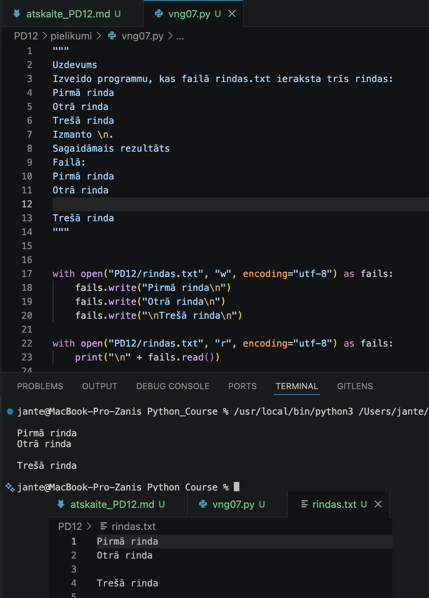

---

## Komentāri / piezīmes

Programma ieraksta failā trīs rindas, izmantojot \n (newline) simbolu, kas pārvieto teksta 
kursoru uz nākamo rindiņu. Katrs \n pēc teksta izveido jaunu rindu, bet papildu \n pirms 
„Trešā rinda” izveido tukšu rindiņu starp otro un trešo ierakstu. Pēc tam programma visu 
saturu nolasa un izvada terminālī.

---

# 🧩 vnginājums 08

# Faila nosaukums

```text id="sdm8v5"
vng08.py
```
---

## Python kods

```python id="mt3k0v"
"""
Uzdevums
Dots kods:
with open("nav_tada_faila.txt", "r", encoding="utf-8") as fails:
    saturs = fails.read()
print(saturs)
Programma izraisa kļūdu.
Izlabo situāciju vienā no diviem veidiem:
1. vispirms izveido failu;
2. vai nomaini faila nosaukumu uz tādu, kas eksistē.
Sagaidāmais rezultāts
Programma nolasa failu bez kļūdas.
"""

# with open("nav_tada_faila.txt", "r", encoding="utf-8") as fails:  
# Files "nav_tada_faila.txt" not found ==> error
with open("PD12/dienasgramata.txt", "r", encoding="utf-8") as fails:
    saturs = fails.read()
    
print(saturs)
```
---

## Rezultāts / izvade

Pievieno:

* ekrānuzņēmumu.

Kods ar kļūdu

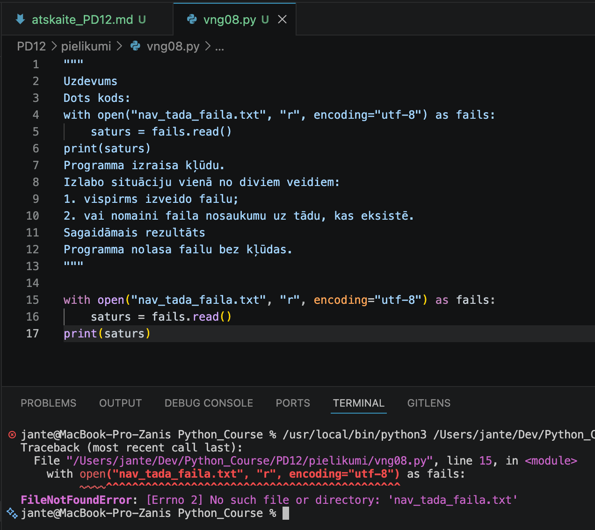

Kods ir labots

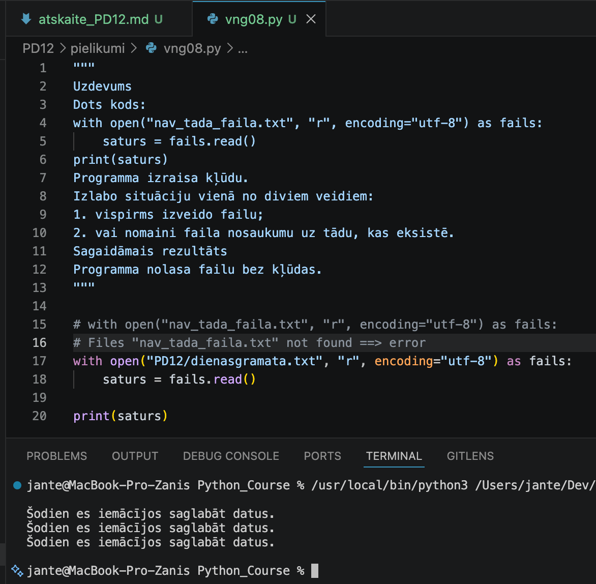

---

## Komentāri / piezīmes

Programma mēģina atvērt lasīšanai neeksistējošu failu, kā rezultātā programma pārtrauc 
darbību ar FileNotFoundError kļūdu. Es nomainīju faila nosaukumu uz eksistējošu, un programma 
izpildījās bez kļūdām.

---

# 🧩 vnginājums 09

# Faila nosaukums

```text id="sdm8v5"
vng09.py
```
---

## Python kods

```python id="mt3k0v"
"""
Uzdevums
Programma:
1. prasa ievadīt vārdu;
2. saglabā to failā viesi.txt;
3. izmanto režīmu "a";
4. pēc tam nolasa visu failu;
5. izvada visus viesus.
Sagaidāmais rezultāts
Ievadi vārdu:
Anna

Visi viesi:

Juris
Anna
"""
vards = input("\nIevadi vārdu: \n")
with open("PD12/viesi.txt", "a", encoding="utf-8") as fails:
    fails.write(vards + "\n")

with open("PD12/viesi.txt", "r", encoding="utf-8") as fails:
    print("\nVisi viesi:\n\n" + fails.read())
```
---

## Rezultāts / izvade

Pievieno:

* ekrānuzņēmumu.

Rezultāts

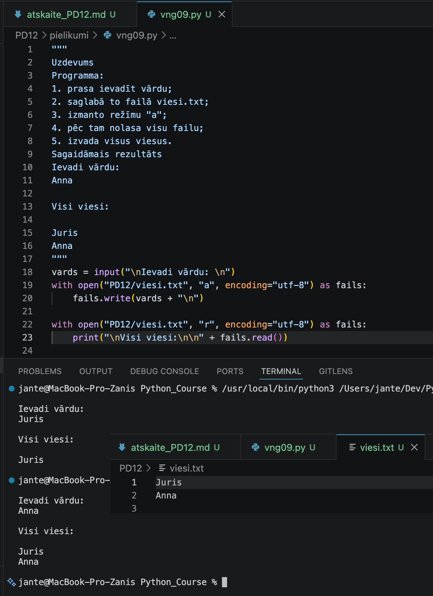

---

## Komentāri / piezīmes

Programma lūdz lietotājam ievadīt vārdu, pievieno to faila viesi.txt beigām, 
izmantojot 'a' (append) režīmu, un pēc tam izvada visu faila saturu terminālī. 
vards + "\n" nodrošina, ka katrs vārds tiek saglabāts jaunā rindā, savukārt 
encoding="utf-8" garantē pareizu latviešu valodas rakstzīmju attēlošanu.

---

# 🧩 vnginājums 10

# Faila nosaukums

```text id="sdm8v5"
vng10.py
```
---

## Python kods

```python id="mt3k0v"
"""
Uzdevums
Izveido programmu, kas failā zurnals.txt pieraksta notikumu.
Programma prasa:
Ievadi notikumu:
Piemēram:
Serveris pārbaudīts
Pēc tam programma:
1. pieraksta notikumu failā;
2. nolasa visu žurnālu;
3. izvada to ekrānā.
Sagaidāmais rezultāts
Ievadi notikumu:
Serveris pārbaudīts

Žurnāls:

Programma palaista
Serveris pārbaudīts
"""

notikums = input("\nIevadi notikumu: \n")
with open("PD12/zurnals.txt", "a", encoding="utf-8") as fails:
    fails.write(notikums + "\n")
with open("PD12/zurnals.txt", "r", encoding="utf-8") as fails:
    print("\nŽurnāls:\n\n" + fails.read())
```
---

## Rezultāts / izvade

Pievieno:

* ekrānuzņēmumu.

Rezultāts

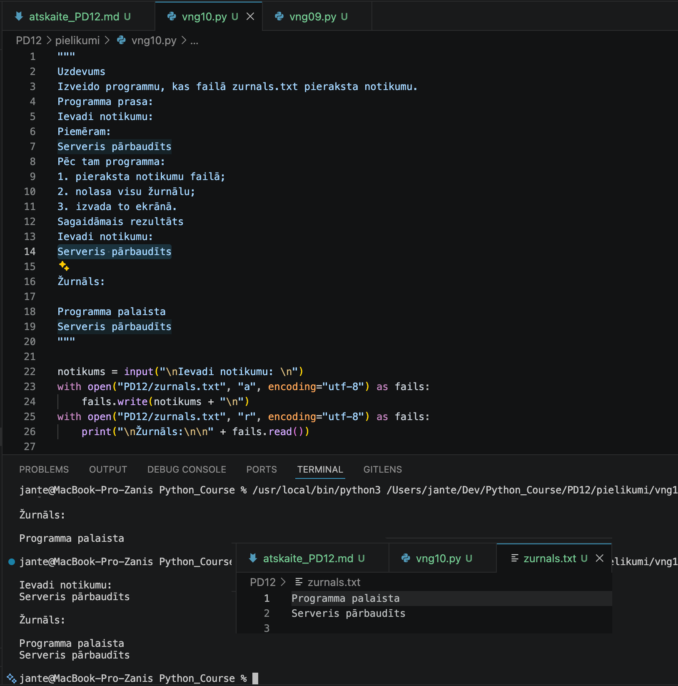

---

## Komentāri / piezīmes

Programma lūdz lietotājam ievadīt notikumu, pievieno to žurnāla failam zurnals.txt (izmantojot 'a' režīmu, 
lai saglabātu iepriekšējos ierakstus) un izvada visu atjaunināto sarakstu terminālī. notikums + "\n" nodrošina, 
ka katrs jauns notikums sākas no jaunas rindas, bet encoding="utf-8" nodrošina pareizu latviešu valodas 
rakstzīmju attēlojumu.

---

# 📝 Refleksija — piedzīvojumi un pārdzīvojumi

* Kas jums šodien patika visvairāk?
Visvairāk man patika pēdējais uzdevums, kurā varēja izveidot žurnālu un pievienot tam ierakstus.

* Kas bija vissarežģītākais?
Vissarežģītākais bija īstenot savas idejas (fantāzijas) ar samērā ierobežotām Python zināšanām.

* Kādu kļūdu jūs atradāt un izlabojāt?
Es izlaboju kļūdu 8. uzdevumā, kur notika vēršanās pie neesoša faila lasīšanas nolūkos.

* Kas bija interesants vai smieklīgs?
Viss bija interesanti.

---

# 🎯 Pamatots pašvērtējums (0-100)

| Kritērijs | Punkti | Pamatojums |
| :---      | :---:  | :---       |
| Kods un funkcionalitāte | 60 | Visi uzdevumi ir izpildīti un strādā bez kļūdām. |
| Izpratne un komentāri | 20 | Koda rindas ir nokomentētas, izpratne par tēmu ir pilnīga. |
| Refleksija | 10 | Refleksija ir sniegta godīgi un pilnā apjomā. |
| Noformējums un struktūra | 10 | Visi faili un attēli ir sakārtoti atbilstošajās mapēs. |
| **Kopā** | **100/100** | Viss ir izpildīts precīzi pēc prasībām. |

---

# 📦 Iesniegšana

Pirms iesniegšanas pārbaudi:

* [x] Visi `.py` faili atrodas mapē `Pielikumi`
* [x] Ekrānuzņēmumi ievietoti mapē `atteli`
* [x] Atskaites fails ir aizpildīts
* [x] Programmas darbojas

---

## Arhivēšana

Arhivē visu mapi:

```text id="h1xcm7" 
PD12.zip
```