# Praktiskā darba atskaite — PD13

**Tēma:** Faili un datu saglabāšana 
**Vārds, Uzvārds:** Zhan Teivan 
**Datums:** 2026-05-27  
**Grupa:**  DAAVP_Daugavpils_80


[Mana praktiskā darba mape GitHub platformā](https://github.com/JanTey/Python_Course/blob/main/PD12/atskaite_PD13.md)


---
# 📁 0. Sagatavošanās darbi

Pārbaudi, vai sagatavota darba vide:

* [x] Izveidota mape `PD13`
* [x] Izveidota mape `Pielikumi`
* [x] Izveidota mape `atteli`
* [x] Izveidota atskaite `atskaite_PD13.md`

---

## Mapju struktūra

```text
PD13/
├─ Pielikumi/
│  ├─ vng01.py
│  ├─ vng02.py
│  ├─ vng03.py
│  ├─ vng04.py
│  ├─ vng05.py
│  ├─ vng06.py
│  ├─ vng07.py
│  ├─ vng08.py
│  ├─ vng09.py
│  └─ vng10.py
├─ atteli/
│  ├─ maps_structure.png
│  ├─ vng01a.png
│  ├─ vng01b.png
│  ├─ vng02a.png
│  ├─ vng02b.png
│  ├─ vng03a.png
│  ├─ vng03b.png
│  ├─ vng04.png
│  ├─ vng05.png
│  ├─ vng06.png
│  ├─ vng07.png
│  ├─ vng08a.png
│  ├─ vng08b.png
│  ├─ vng09.png
│  └─ vng10.png
└─ atskaite_PD12.md
````

---

## Ekrānuzņēmums

Pievieno ekrānuzņēmumu ar mapes struktūru.

```markdown id="j0m2om"
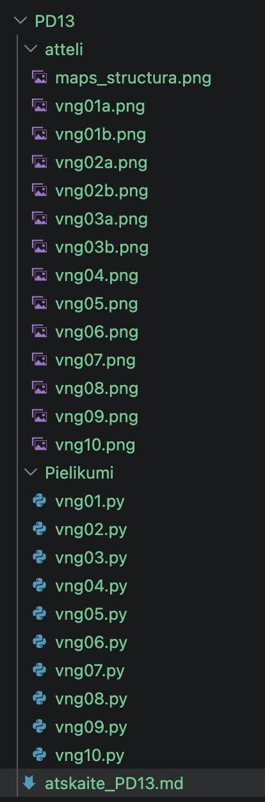
```


---

# 🧩 vnginājums 01

## Faila nosaukums

```text id="pjlwmj"
vng01.py
```
---

## Python kods

```python id="p62h2r"
"""
Uzdevums
Izveido failu:
vng01.py
Ieraksti:
if 10 > 5
    print("Darbojas")
Palaid programmu.
Nosaki:
kāda kļūda parādījās;
kas jāizlabo.
Sagaidāmais rezultāts
Darbojas
"""

if 10 > 5:
    print("\nDarbojas\n")
```
---

## Rezultāts / izvade

Pievieno:

* ekrānuzņēmumu.

Kods ar kļūdu

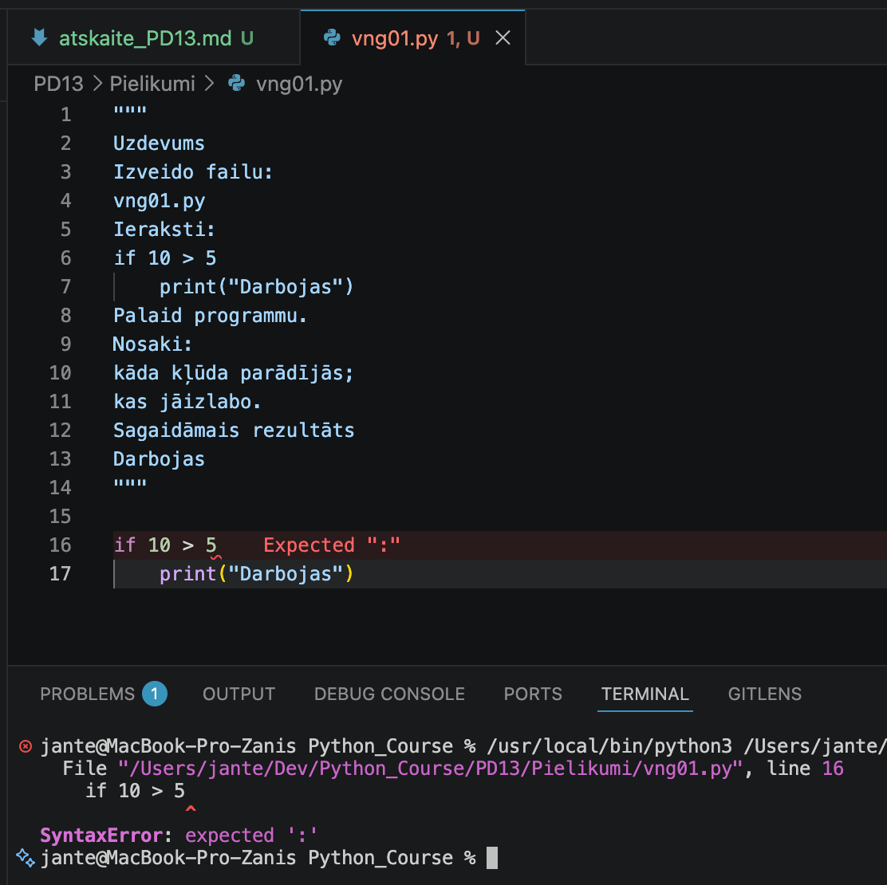

Kods ir labots

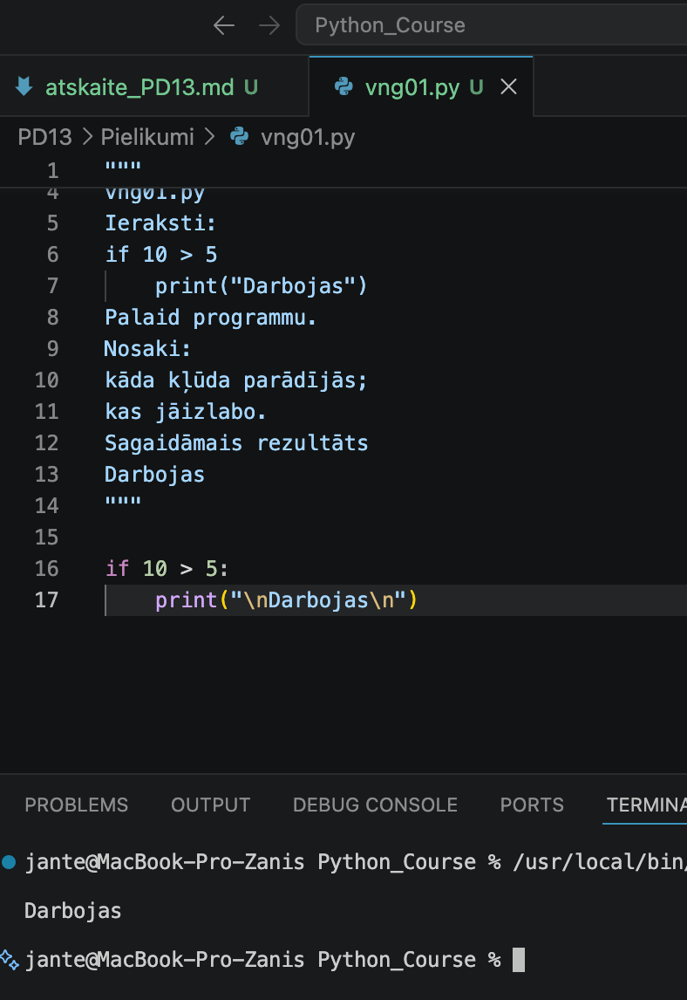

---

## Komentāri / piezīmes

**Komentārs par darbu (vng01.py):**

SyntaxError. Pirmajā koda rindā trūkst ':', kas izraisīja programmas izpildes kļūdu.

---

# 🧩 vnginājums 02

## Faila nosaukums

```text id="sdm8v5"
vng02.py
```
---

## Python kods

```python id="mt3k0v"
"""
Uzdevums
Izveido:
print(vards)
Salabo tā, lai programma izvada:
Sveiks!
"""

vards = "Sveiks!"
print(f"\n{vards}\n")
```
---

## Rezultāts / izvade

Pievieno:

* ekrānuzņēmumu.

Kods ar kļūdu

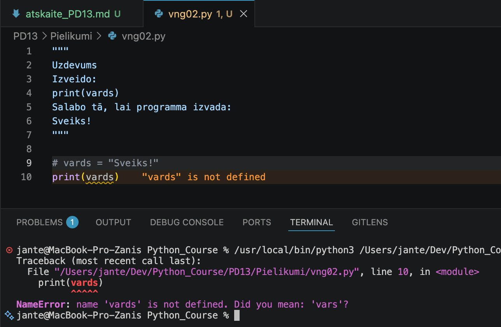

Kods ir labots

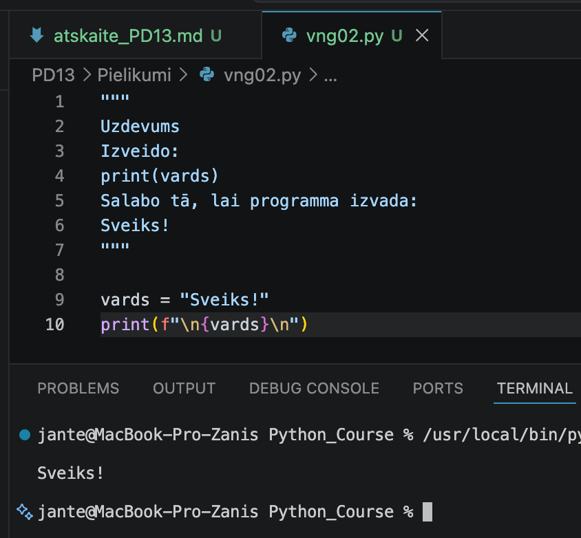

---

## Komentāri / piezīmes

Ja mēģina izdrukāt mainīgā vērtību, kurš nav definēts, programma pārtrauc darbību ar kļūdu NameError.


---

# 🧩 vnginājums 03 

## Faila nosaukums

```text id="sdm8v5"
vng03.py
```
---

## Python kods

```python id="mt3k0v"
"""
Uzdevums
vecums = "18"
print(vecums + 2)
Izlabo.
Sagaidāmais rezultāts
20
"""

vecums = "18"
# print(vecums + 2)
print(f"\n{int(vecums) + 2}\n")
```
---

## Rezultāts / izvade

Pievieno:

* ekrānuzņēmumu.

Kods ar kļūdu

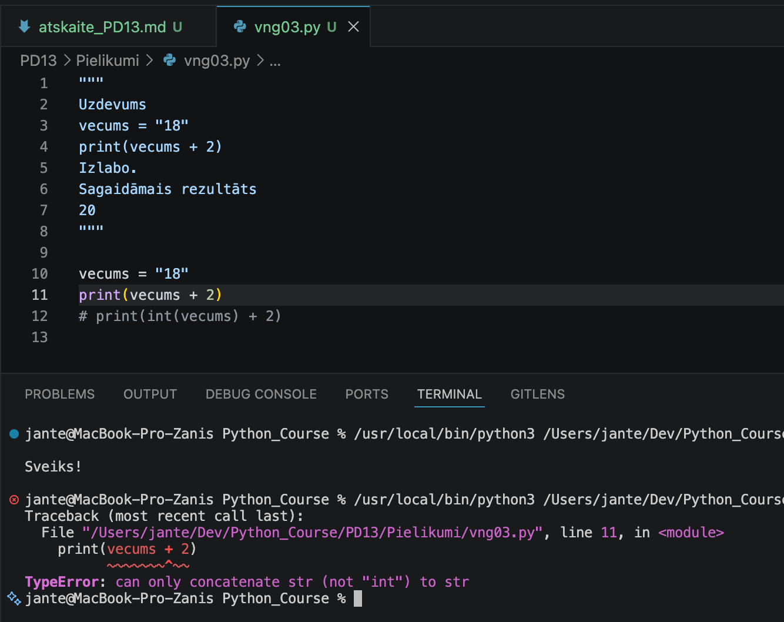

Kods ir labots

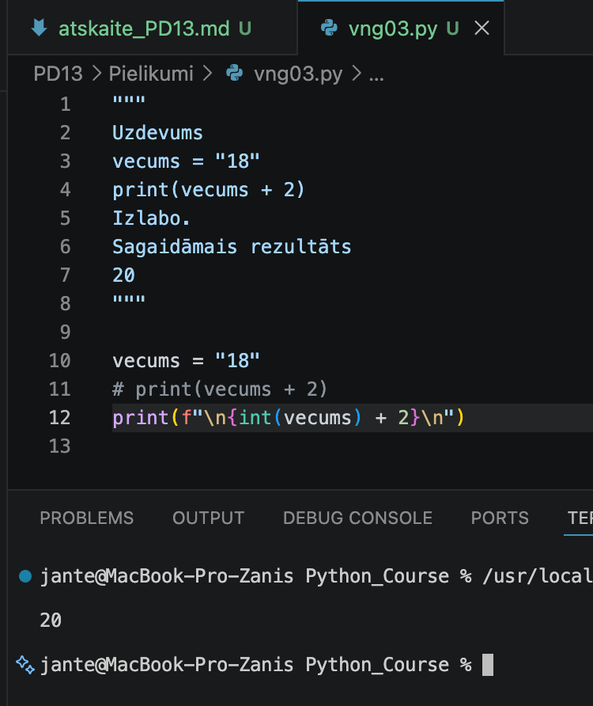

---

## Komentāri / piezīmes

Mēģinot izdrukāt teksta (str) un skaitļa (int) saskaitīšanas rezultātu, radās kļūda TypeError.

---

# 🧩 vnginājums 04 

## Faila nosaukums

```text id="sdm8v5"
vng04.py
```
---

## Python kods

```python id="mt3k0v"
"""
Tips
🔍 Izpētīt rezultātu
Uzdevums
skaitlis = int(input())
print(100 / skaitlis)
Pārbaudi:
20
0
Atskaitē pieraksti:
kas notika;
kā saucas kļūda.
"""

skaitlis = int(input("\nIevadi skaitli: "))
print(f"\n{100 / skaitlis:.0f}\n")
```
---

## Rezultāts / izvade

Pievieno:

* ekrānuzņēmumu.

Rezultāts

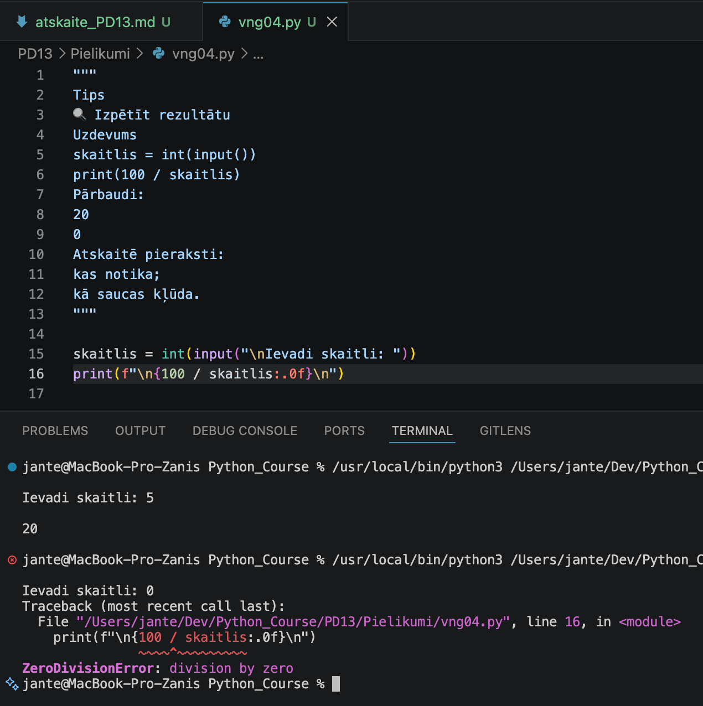

---

## Komentāri / piezīmes

Mēģinājums dalīt ar nulli izraisa kļūdu ZeroDivisionError.

---

# 🧩 vnginājums 05

## Faila nosaukums

```text id="sdm8v5"
vng05.py
```
---

## Python kods

```python id="mt3k0v"
"""
Uzdevums
skaitlis = int(input())
print("Sākums")
print(100 / skaitlis)
print("Beigas")
Ievadi:
0
Atbildi:
kura rinda salūza;
kura netika izpildīta.
"""

skaitlis = int(input("\nIevadi skaitli: "))
print("\nSākums")
print(f"\n{100 / skaitlis:.0f}\n")
print("Beigas\n")
```
---

## Rezultāts / izvade

Pievieno:

* ekrānuzņēmumu.

Rezultāts

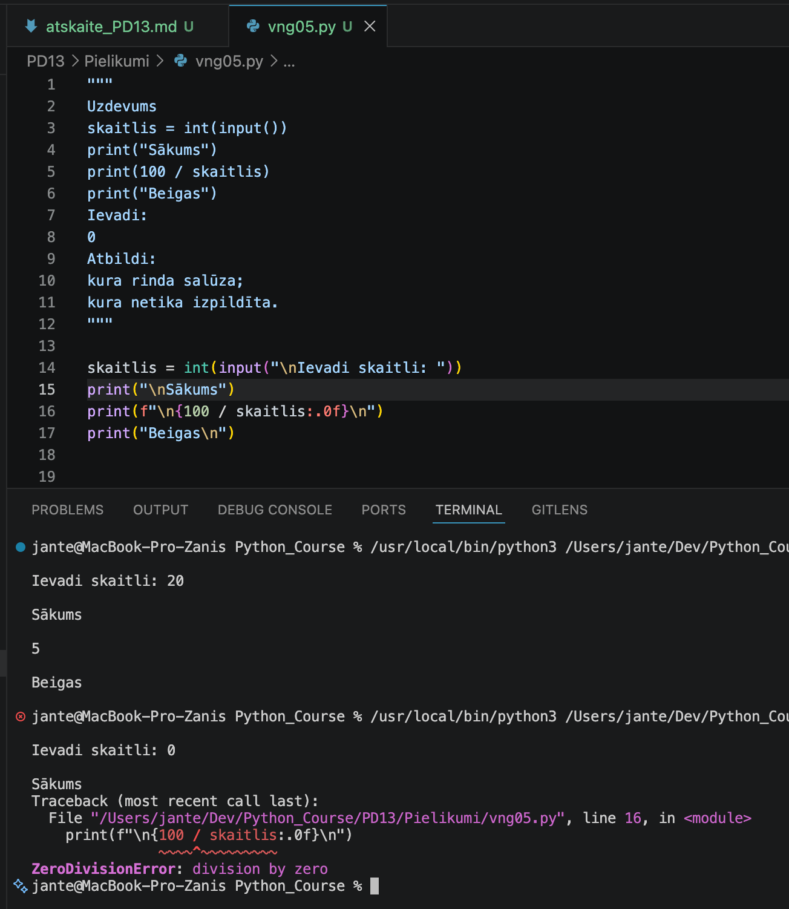

---

## Komentāri / piezīmes

Programma neizpildīja rindu print(f"\n{100 / skaitlis:.0f}\n"), jo mēģinājums dalīt ar nulli 
izraisīja ZeroDivisionError kļūdu.

---

# 🧩 vnginājums 06

# Faila nosaukums

```text id="sdm8v5"
vng06.py
```
---

## Python kods

```python id="mt3k0v"
"""
Uzdevums
skaitli = [10,20,30]
summa = 0
for skaitlis in skaitli:
summa = summa + 1
print(summa)
Pievieno print().
Atrodi kļūdu.
Sagaidāmais rezultāts
60
"""

skaitli = [10,20,30]
summa = 0
for skaitlis in skaitli:
#    summa = summa + 1
    summa = summa + skaitlis
print(f"\n{summa}\n")
```
---

## Rezultāts / izvade

Pievieno:

* ekrānuzņēmumu.

Rezultāts

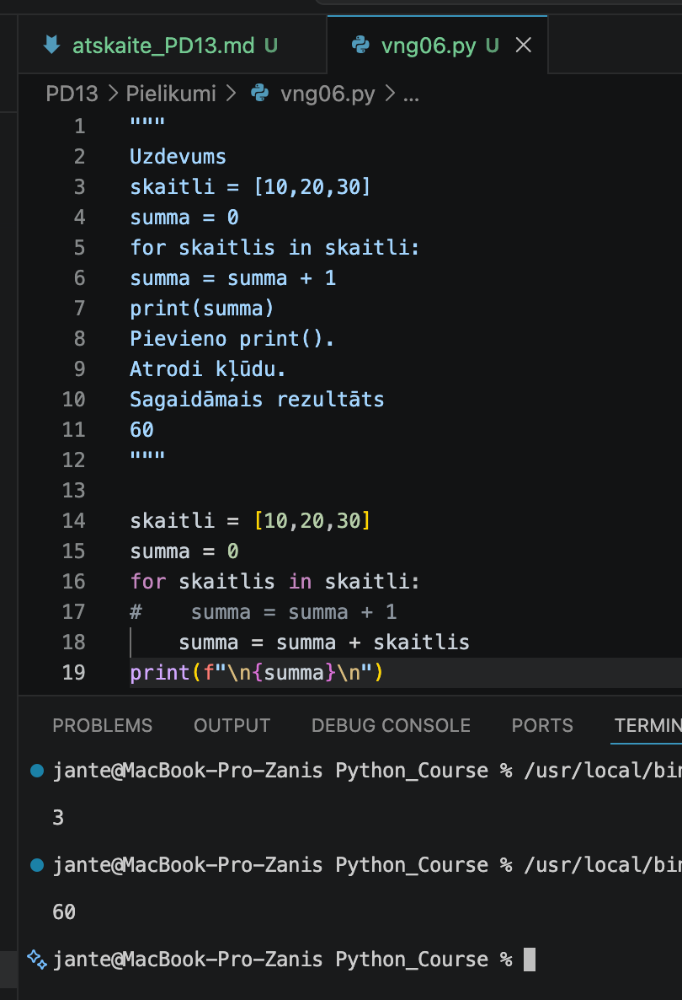

---

## Komentāri / piezīmes

Ja ciklā tiek lietota rinda summa = summa + 1, tad tā darbojas kā skaitītājs, kas uzskaita, 
cik elementu ir sarakstā skaitli = [10, 20, 30] jeb cik reizes cikls izpildās. Lai iegūtu 
sarakstā esošo elementu summu, šī rinda jāaizstāj ar summa = summa + skaitlis.

---

# 🧩 vnginājums 07

# Faila nosaukums

```text id="sdm8v5"
vng07.py
```
---

## Python kods

```python id="mt3k0v"
"""
Uzdevums
cena = 100
atlaide = 20
rezultats = cena + atlaide
print(rezultats)
Programma strādā.
Bet rezultāts nav pareizs.
Izlabo.
"""

cena = 100
atlaide = 20
# rezultats = cena + atlaide
rezultats = cena - atlaide
print(f"\n {rezultats}\n")
```
---

## Rezultāts / izvade

Pievieno:

* ekrānuzņēmumu.

Rezultāts

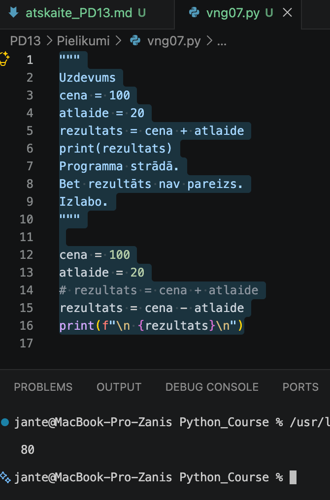

---

## Komentāri / piezīmes

Šajā programmā bija loģiska kļūda preces cenas aprēķināšanā, izmantojot atlaidi. 
Atlaide ir jāatņem no preces cenas, nevis jāpieskaita.

---

# 🧩 vnginājums 08

# Faila nosaukums

```text id="sdm8v5"
vng08.py
```
---

## Python kods

```python id="mt3k0v"
"""
Uzdevums
Izveido programmu.
Prasības:
prasa skaitli;
teksts neizraisa sarkanu kļūdu.
Piemērs:
Ievadi:
abc
Ievadi skaitli.
"""

while True:
    try:
        skaitlis = int(input("\nIevadi skaitli: "))
        print()
        break
    except ValueError:
        print("Kļūda! Lūdzu, ievadi veselu skaitli.")   
```
---

## Rezultāts / izvade

Pievieno:

* ekrānuzņēmumu.

Rezultāts

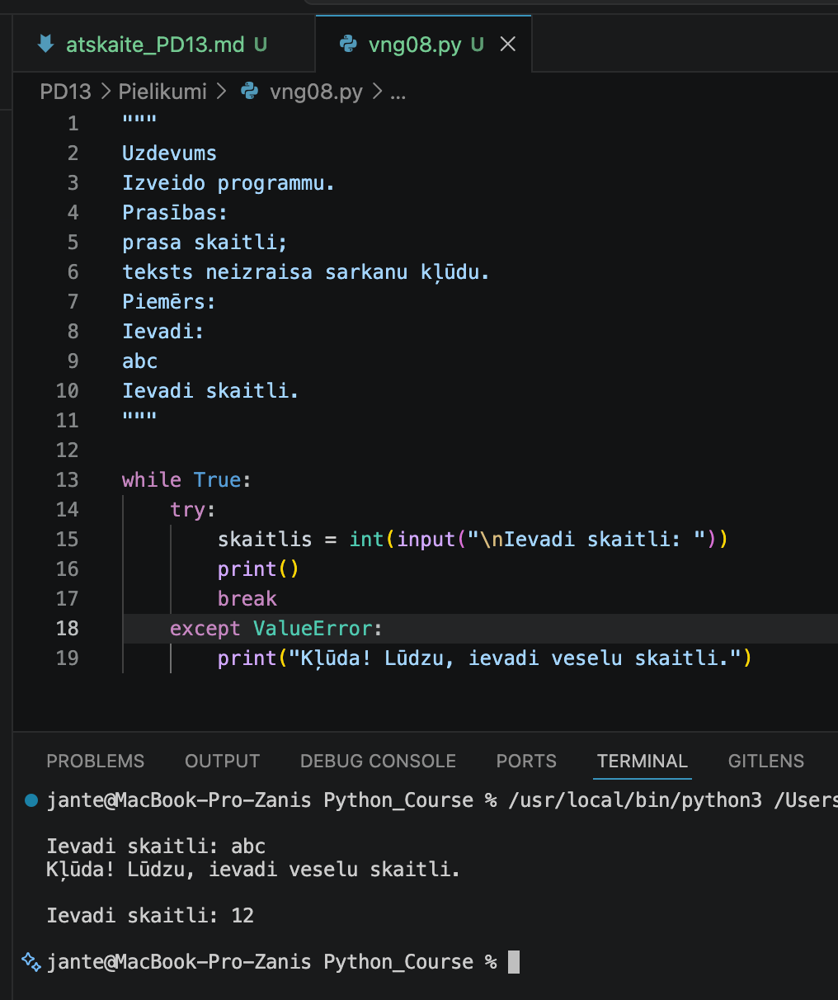

---

## Komentāri / piezīmes

Programma bezgalīgā ciklā pieprasa lietotājam ievadīt veselu skaitli.
Izmantojot try/except ValueError, tiek apstrādāta kļūda, ja lietotājs ievada tekstu
(piemēram, burtus vai simbolus) nevis skaitli. Šādā gadījumā programma parāda
kļūdas paziņojumu un atkārto jautājumu. Cikls turpinās, līdz tiek ievadīts
korekts vesels skaitlis, pēc kā programma izpilda break un beidz darbu.

---

# 🧩 vnginājums 09

# Faila nosaukums

```text id="sdm8v5"
vng09.py
```
---

## Python kods

```python id="mt3k0v"
"""
Uzdevums
try:
    vecums = int(input())
    print(100 / vecums)
except:
    print("Kaut kas nogāja greizi")
Uzlabo.
Nosacījums:
lietotājam jāsaprot problēma.
"""

while True:
    try:
        vecums = int(input("\nIevadi savu vecumu: "))
        print(f"\n100 / {vecums} = {100 / vecums:.2f}\n")
        break
    except ValueError:
        print("Kļūda: Lūdzu, ievadi veselu skaitli (ciparus)!")
    except ZeroDivisionError:
        print("Kļūda: Vecums nevar būt 0!")
```
---

## Rezultāts / izvade

Pievieno:

* ekrānuzņēmumu.

Rezultāts

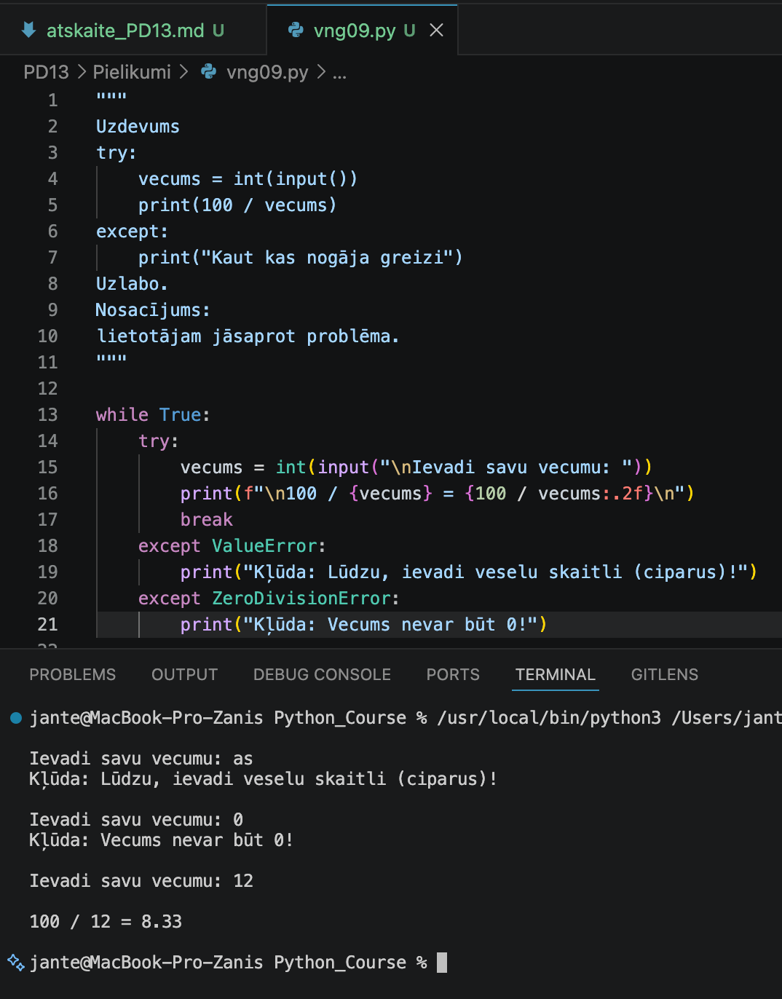

---

## Komentāri / piezīmes

Šajā kodā programma pieprasa lietotājam ievadīt veselu skaitli (vecumu),
pēc tam aprēķina un izvada rezultātu dalīšanai 100 ar šo skaitli.
Ja rodas jebkāda kļūda (lietotājs ievada tekstu, dalīšana ar nulli vai cita),
programma vienkārši izvada "Kaut kas nogāja greizi",
nenorādot precīzu kļūdas iemeslu.

Problēmas:
1. Nav ievades uzvednes (prompt)	
   input() bez teksta – lietotājs nesaprot, ko ievadīt
2. Tukšs except:	
   Noķer VISAS kļūdas, bet nedod informāciju par to, kas gāja greizi
3. Slēpj kļūdas cēloni	
   Lietotājs neredz, vai kļūda bija nepareiza ievade, dalīšana ar nulli vai kas cits
4. Nav cikla	
   Programma apstājas pēc pirmās kļūdas – neprasa ievadīt vēlreiz
5. Neatšķir kļūdu tipus	
   ValueError (nevis skaitlis) un ZeroDivisionError (dalīšana ar 0) tiek apstrādātas vienādi

---

# 🧩 vnginājums 10

# Faila nosaukums

```text id="sdm8v5"
vng10.py
```
---

## Python kods

```python id="mt3k0v"
#ienkāršs kalkulators (dalīšana) ar kļūdu apstrādi.
#Lietotājs var turpināt rēķināt vai iziet programmu.

def ievade_ar_parbaudi(prompt, tips, izejas_atslega="N"):
    while True:
        ievade = input(prompt)
        
        # Pārbauda, vai lietotājs vēlas iziet
        if ievade.upper() == izejas_atslega:
            return None, True
        
        # Mēģina pārveidot ievadi
        try:
            if tips == "int":
                vertiba = int(ievade)
            elif tips == "float":
                vertiba = float(ievade)
            else:
                vertiba = ievade
            return vertiba, False
        except ValueError:
            print(f"Kļūda: Lūdzu, ievadi {tips} tipa vērtību!")
            # Turpina ciklu - prasa vēlreiz


# Galvenā programma
print("\n" + "=" * 50)
print("   KALKULATORS (dalīšana)")
print("=" * 50)
print("Lai izietu no programmas, ievadi N jebkurā brīdī.")
print("=" * 50)

while True:
    print("\n" + "-" * 40)
    
    # Ievada pirmo skaitli
    skaitlis1, iziet = ievade_ar_parbaudi("Ievadi pirmo skaitli: ", "float")
    if iziet:
        print("\nProgramma beidz darbu. Uz redzēšanos!")
        break
    
    # Ievada otro skaitli
    skaitlis2, iziet = ievade_ar_parbaudi("Ievadi otro skaitli: ", "float")
    if iziet:
        print("\nProgramma beidz darbu. Uz redzēšanos!\n")
        break
    
    # Mēģina veikt dalīšanu
    try:
        rezultats = skaitlis1 / skaitlis2
        print(f"\n{skaitlis1} / {skaitlis2} = {rezultats:.2f}")
    except ZeroDivisionError:
        print("\nKļūda: Nevar dalīt ar nulli! Mēģini vēlreiz.")
        continue  # Sāk ciklu no sākuma
    except Exception as e:
        print(f"\nNeparedzēta kļūda: {e}")
        break
    
    # Jautājums pēc veiksmīga aprēķina
    print("\n" + "-" * 40)
    turpinat = input("Vai vēlies turpināt rēķināt? (Y/N): ")
    if turpinat.upper() == "N":
        print("\nProgramma beidz darbu. Uz redzēšanos!")
        break
    # Ja Y vai Enter - cikls turpinās
```
---

## Rezultāts / izvade

Pievieno:

* ekrānuzņēmumu.

Rezultāts

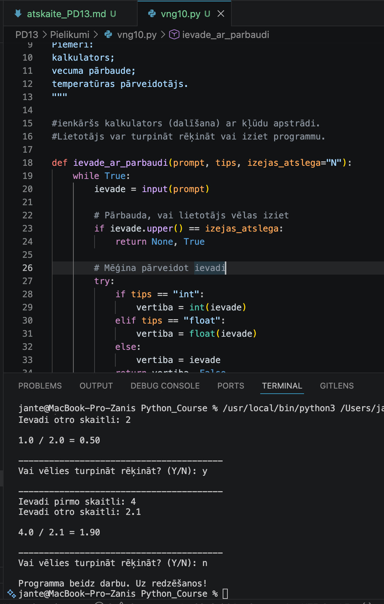

---

## Komentāri / piezīmes

Lai atrisinātu uzdevumu, es izvēlējos programmēt vienkāršu kalkulatoru. Intereses pēc es 
uzdevumu nedaudz sarežģīju – pievienoju vairāku kļūdu apstrādi un dialogu ar lietotāju, 
lai viņš varētu izvēlēties turpināt dalīšanas aprēķinus vai beigt programmu.

---

# 📝 Refleksija — piedzīvojumi un pārdzīvojumi

* Kas jums šodien visvairāk patika?
Visvairāk man patika pēdējais uzdevums, kur vajadzēja izveidot programmu pēc paša izvēles.

* Kas bija visgrūtākais?
Visgrūtākais bija īstenot savas idejas (fantāzijas) ar samērā ierobežotām Python zināšanām.

* Kādu kļūdu atradāt un izlabojāt?
Es izlaboju kļūdas 1.-9. uzdevumā.

* Kas bija interesanti vai smieklīgi?
Viss bija interesanti.

---

# 🎯 Pamatots pašvērtējums (0-100)

| Kritērijs | Punkti | Pamatojums |
| :---      | :---:  | :---       |
| Kods un funkcionalitāte | 60 | Visi uzdevumi ir izpildīti un strādā bez kļūdām. |
| Izpratne un komentāri | 20 | Koda rindas ir nokomentētas, izpratne par tēmu ir pilnīga. |
| Refleksija | 10 | Refleksija ir sniegta godīgi un pilnā apjomā. |
| Noformējums un struktūra | 10 | Visi faili un attēli ir sakārtoti atbilstošajās mapēs. |
| **Kopā** | **100/100** | Viss ir izpildīts precīzi pēc prasībām. |

---

# 📦 Iesniegšana

Pirms iesniegšanas pārbaudi:

* [x] Visi `.py` faili atrodas mapē `Pielikumi`
* [x] Ekrānuzņēmumi ievietoti mapē `atteli`
* [x] Atskaites fails ir aizpildīts
* [x] Programmas darbojas

---

## Arhivēšana

Arhivē visu mapi:

```text id="h1xcm7" 
PD13.zip
```