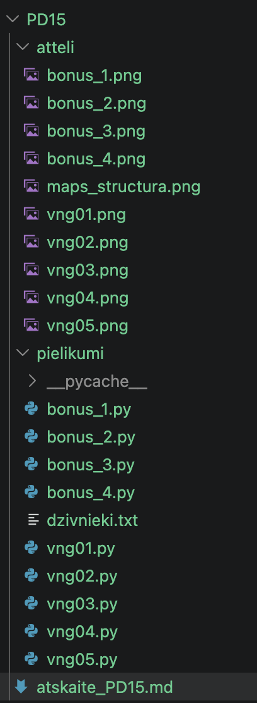
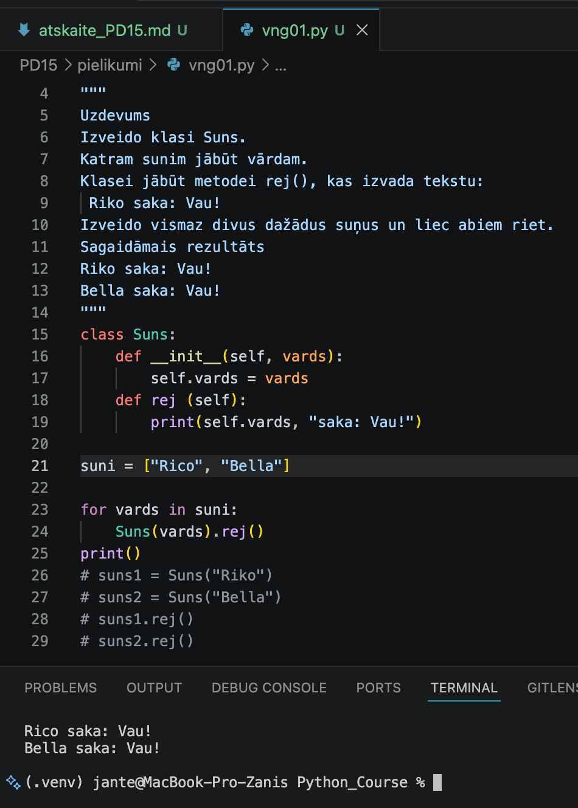
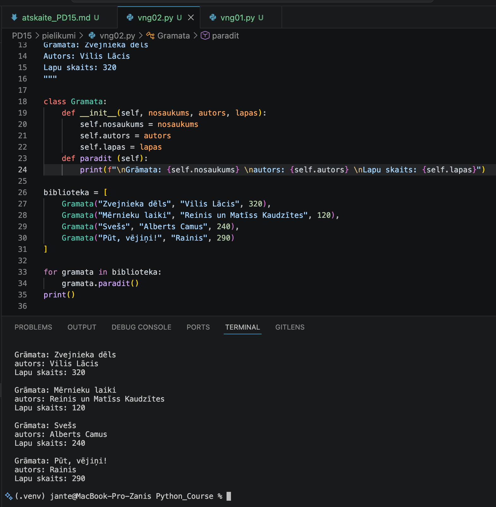
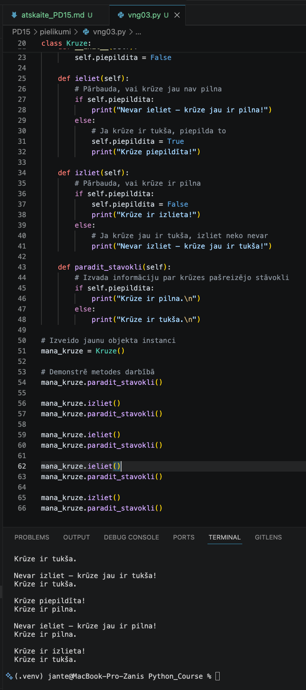
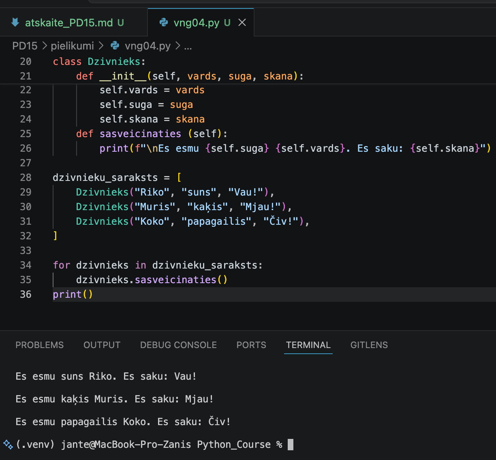
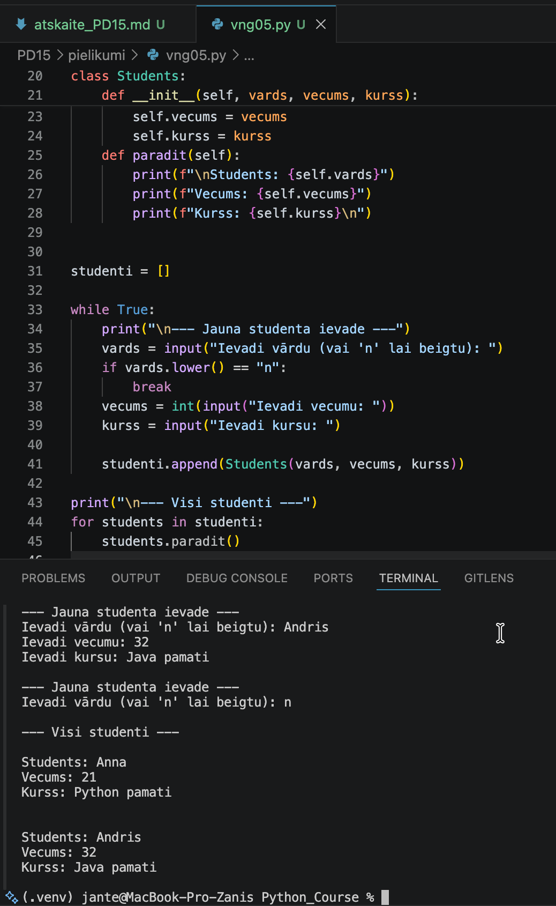
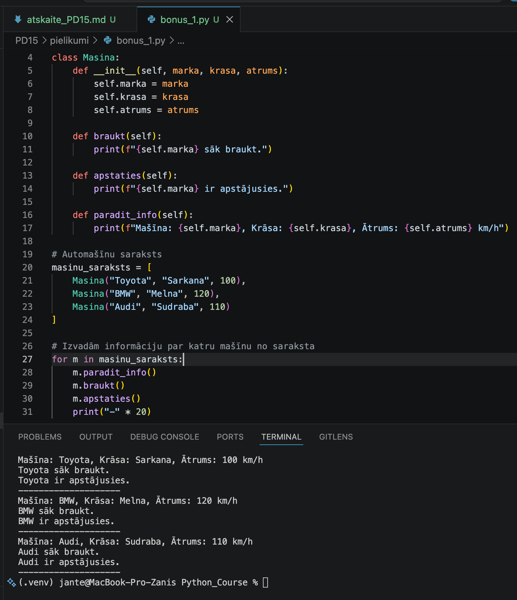
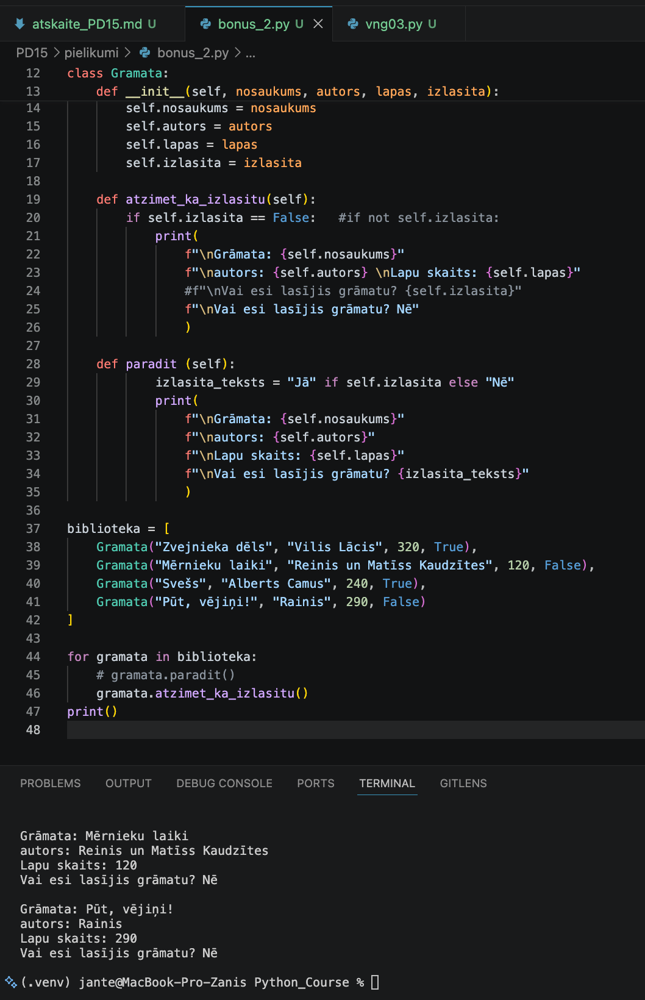
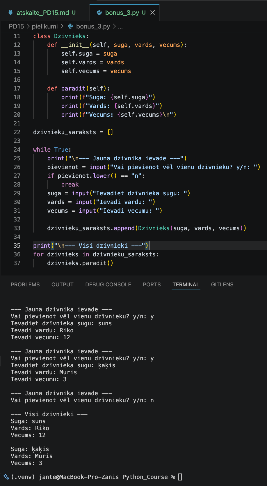
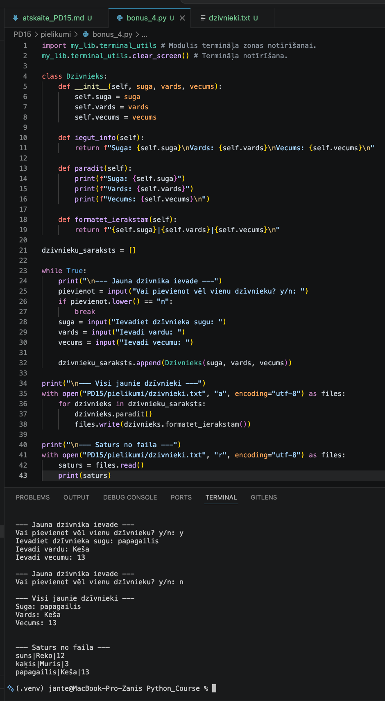

# Praktiskā darba atskaite — PD15

**Tēma:** Objektorientētās programmēšanas pamati 
**Vārds, Uzvārds:** Zhan Teivan 
**Datums:** 2026-05-29  
**Grupa:**  Daugavpils_77978_11.05.2026.-05.06.2026


[Mana praktiskā darba mape GitHub platformā](https://github.com/JanTey/Python_Course/blob/main/PD15/atskaite_PD15.md)


---
# 📁 0. Sagatavošanās darbi

Pārbaudi, vai sagatavota darba vide:

* [x] Izveidota mape `PD15`
* [x] Izveidota apakšmape `pielikumi`
* [x] Izveidota apakšmape `atteli`
* [x] Izveidota atskaite `atskaite_PD15.md`

---

## Mapju struktūra

```text
PD15_Teivan_Zhan/
├─ Pielikumi/
│  ├─ bonus_1.py
│  ├─ bonus_2.py
│  ├─ bonus_3.py
│  ├─ bonus_4.py
│  ├─ mans_riku_komplekts.py
│  ├─ dzivnieki.txt
│  ├─ vng01.py
│  ├─ vng02.py
│  ├─ vng03.py
│  ├─ vng04.py
│  └─ vng05.py
├─ atteli/
│  ├─ bonus_1.png
│  ├─ bonus_2.png
│  ├─ bonus_3.png
│  ├─ bonus_4.png
│  ├─ maps_structure.png
│  ├─ vng01.png
│  ├─ vng02.png
│  ├─ vng03.png
│  ├─ vng04.png
│  └─ vng05.png
└─ atskaite_PD15.md
```

---

## Ekrānuzņēmums

Pievieno ekrānuzņēmumu ar mapes struktūru.

```markdown id="j0m2om"

```


---

# 🧩 vnginājums 01

## Faila nosaukums

```text id="pjlwmj"
vng01.py, vng01_sasveicinas.py
```
---

## Python kods

```python id="p62h2r"
# vng01.py
"""
Uzdevums
Izveido klasi Suns.
Katram sunim jābūt vārdam.
Klasei jābūt metodei rej(), kas izvada tekstu:
 Riko saka: Vau!
Izveido vismaz divus dažādus suņus un liec abiem riet.
Sagaidāmais rezultāts
Riko saka: Vau!
Bella saka: Vau!
"""
class Suns:
    def __init__(self, vards):
        self.vards = vards
    def rej (self):
        print(self.vards, "saka: Vau!")

suni = ["Rico", "Bella"]

for vards in suni:
    Suns(vards).rej()
print()
# suns1 = Suns("Riko")
# suns2 = Suns("Bella")
# suns1.rej()
# suns2.rej()
```

## Rezultāts / izvade

Pievieno:

* ekrānuzņēmumu.

Rezultāts



---

## Komentāri / piezīmes

Šī programma demonstrē objektorientētās programmēšanas (OOP) pamatus,
izmantojot klasi Suns.

Programma satur:
- Klasi Suns ar konstruktoru __init__, kas saņem suņa vārdu un saglabā to
  atribūtā self.vards.
- Metodi rej(), kas izvada uz ekrāna frāzi: "[vārds] saka: Vau!".


---

# 🧩 vnginājums 02

## Faila nosaukums

```text id="sdm8v5"
vng02.py
```
---

## Python kods

```python id="mt3k0v"
"""
Uzdevums
Izveido klasi Gramata.
Katrai grāmatai jābūt:
nosaukumam
autoram
lapu skaitam
Izveido metodi paradit_info(), kas izvada grāmatas informāciju.
Izveido vismaz divas grāmatas.
Sagaidāmais rezultāts
Grāmata: Zvejnieka dēls
Autors: Vilis Lācis
Lapu skaits: 320
"""

class Gramata:
    def __init__(self, nosaukums, autors, lapas):
        self.nosaukums = nosaukums
        self.autors = autors
        self.lapas = lapas
    def paradit (self):
        print(f"\nGrāmata: {self.nosaukums} \nautors: {self.autors} \nLapu skaits: {self.lapas}")

biblioteka = [
    Gramata("Zvejnieka dēls", "Vilis Lācis", 320),
    Gramata("Mērnieku laiki", "Reinis un Matīss Kaudzītes", 120),
    Gramata("Svešs", "Alberts Camus", 240),
    Gramata("Pūt, vējiņi!", "Rainis", 290)
]

for gramata in biblioteka:
    gramata.paradit()
print()
```
---

## Rezultāts / izvade

Pievieno:

* ekrānuzņēmumu.

Rezultāts



---

## Komentāri / piezīmes

Programma veido klasi Gramata ar trim atribūtiem:
nosaukums, autors, lappušu skaits.
Metode paradit() izvada informāciju par grāmatu.
Objekti tiek glabāti sarakstā biblioteka. Cikls for pārskata sarakstu un
izvada datus par katru grāmatu.


---

# 🧩 vnginājums 03 

## Faila nosaukums

```text id="sdm8v5"
vng03.py, vng03_aprekini.py
```
---

## Python kods

```python id="mt3k0v"
# vng03.py
"""
Uzdevums
Izveido klasi Kruze.
Sākumā krūze ir tukša.
Klasei jābūt:
atribūtam piepildita
metodei ieliet()
metodei izdzert()
metodei paradit_stavokli()
Programmai jāparāda, kā krūzes stāvoklis mainās.
Sagaidāmais rezultāts
Krūze ir tukša.
Krūze piepildīta!
Krūze ir pilna.
Tēja izdzerta.
Krūze ir tukša.
"""
class Kruze:
    def __init__(self):
        # Inicializē krūzi kā tukšu (False)
        self.piepildita = False
        
    def ieliet(self):
        # Pārbauda, vai krūze jau nav pilna
        if self.piepildita: 
            print("Nevar ieliet – krūze jau ir pilna!")
        else:               
            # Ja krūze ir tukša, piepilda to
            self.piepildita = True
            print("Krūze piepildīta!") 
            
    def izliet(self):
        # Pārbauda, vai krūze ir pilna
        if self.piepildita:  
            self.piepildita = False
            print("Krūze ir izlieta!")
        else:                
            # Ja krūze jau ir tukša, izliet neko nevar
            print("Nevar izliet – krūze jau ir tukša!") 
        
    def paradit_stavokli(self):
        # Izvada informāciju par krūzes pašreizējo stāvokli
        if self.piepildita:
            print("Krūze ir pilna.\n") 
        else:
            print("Krūze ir tukša.\n")    
            
# Izveido jaunu objekta instanci
mana_kruze = Kruze()

# Demonstrē metodes darbībā
mana_kruze.paradit_stavokli()

mana_kruze.izliet()
mana_kruze.paradit_stavokli()

mana_kruze.ieliet()
mana_kruze.paradit_stavokli()

mana_kruze.ieliet()
mana_kruze.paradit_stavokli()

mana_kruze.izliet()
mana_kruze.paradit_stavokli()
```
---

## Rezultāts / izvade

Pievieno:

* ekrānuzņēmumu.

Rezultāts



---

## Komentāri / piezīmes

Es nedaudz sarežģīju uzdevuma nosacījumu, ieviešot papildu pārbaudes: 
ja krūze ir tukša, no tās neko nevar izliet, un ja tā ir pilna, tajā nevar ieliet.

Programma demonstrē objektorientētās programmēšanas pamatus ar klasi Kruze.
Tiek izmantoti trīs atribūti - ieliet(), izliet() un paradit_stavokli().
Katra metode satur nosacījumu pārbaudi, kas neļauj veikt neloģiskas darbības.

Programmas gaitā tiek veiktas šādas darbības: mēģinājums izliet no tukšas krūzes,
piepildīšana, atkārtota ieliešana, izliešana un atkārtota izliešana.

Rezultātā tiek parādīts, ka krūze pareizi seko līdzi savam stāvoklim (pilna/tukša)
un atbilstoši reaģē uz neloģiskām darbībām ar kļūdas paziņojumu.

---

# 🧩 vnginājums 04 

## Faila nosaukums

```text id="sdm8v5"
vng04.py
```
---

## Python kods

```python id="mt3k0v"
"""
Uzdevums
Izveido klasi Dzivnieks.
Katram dzīvniekam jābūt:
 vārdam
 sugai
 skaņai
Izveido metodi sasveicinaties(), kas izvada, piemēram:
 Es esmu suns Riko. Es saku: Vau!
Izveido vismaz 3 dzīvniekus.
Saglabā tos sarakstā.
Ar ciklu izsauc katra dzīvnieka metodi sasveicinaties().
Sagaidāmais rezultāts
 Es esmu suns Riko. Es saku: Vau!
 Es esmu kaķis Muris. Es saku: Mjau!
 Es esmu papagailis Koko. Es saku: Čiv!
"""
class Dzivnieks:
    def __init__(self, vards, suga, skana):
        self.vards = vards
        self.suga = suga
        self.skana = skana
    def sasveicinaties (self):
        print(f"\nEs esmu {self.suga} {self.vards}. Es saku: {self.skana}")

dzivnieku_saraksts = [
    Dzivnieks("Riko", "suns", "Vau!"),
    Dzivnieks("Muris", "kaķis", "Mjau!"),
    Dzivnieks("Koko", "papagailis", "Čiv!"),
]

for dzivnieks in dzivnieku_saraksts:
    dzivnieks.sasveicinaties()
print()
```
---

## Rezultāts / izvade

Pievieno:

* ekrānuzņēmumu.

Rezultāts



---

## Komentāri / piezīmes

Programma demonstrē objektorientētās programmēšanas pamatus,
izmantojot klasi Dzivnieks.

Klasei ir trīs atribūti: vards, suga un skana.
Metode sasveicinaties() izvada dzīvnieka sveicienu, izmantojot visus trīs atribūtus.

Objekti tiek izveidoti un glabāti sarakstā dzivnieku_saraksts.
Cikls for pārskata sarakstu un izsauc sveiciena metodi katram dzīvniekam.

Programma parāda, kā viena klase var kalpot par veidni dažādu objektu 
(suns, kaķis, papagailis) izveidei, kur katram objektam ir savi unikāli dati,
bet visi izmanto vienu un to pašu metodi.


---

# 🧩 vnginājums 05

## Faila nosaukums

```text id="sdm8v5"
vng05.py
```
---

## Python kods

```python id="mt3k0v"
class Students:
    def __init__(self, vards, vecums, kurss):
        self.vards = vards
        self.vecums = vecums
        self.kurss = kurss
    def paradit(self):
        print(f"\nStudents: {self.vards}")
        print(f"Vecums: {self.vecums}")
        print(f"Kurss: {self.kurss}\n")


studenti = []

while True:
    print("\n--- Jauna studenta ievade ---")
    vards = input("Ievadi vārdu (vai 'n' lai beigtu): ")
    if vards.lower() == "n":
        break
    vecums = int(input("Ievadi vecumu: "))
    kurss = input("Ievadi kursu: ")
    
    studenti.append(Students(vards, vecums, kurss))

print("\n--- Visi studenti ---")
for students in studenti:
    students.paradit()

```
---

## Rezultāts / izvade

Pievieno:

* ekrānuzņēmumu.

Rezultāts



---

## Komentāri / piezīmes

Programma veido klasi Students ar trim atribūtiem: vārds, vecums, kurss.
Metode paradit() izvada studenta datus.

Bezgalīgā ciklā tiek prasīta datu ievade.
Ievadot 'n', cikls beidzas.
Katrs ievadītais students tiek pievienots sarakstam studenti.
Pēc cikla beigām programma pārskata sarakstu un izvada visu studentu datus.
 
---

# 🧩 Bonus 1

# Faila nosaukums

```text id="sdm8v5"
bonus_1.py
```
---

## Python kods

```python id="mt3k0v"
"""
Izveido klasi Masina.
Katram objektam jābūt:
 markai
 krāsai
 ātrumam
Metodes:
 braukt()
 apstaties()
 paradit_info()
Papildus: izveido 3 mašīnas un saglabā tās sarakstā.
"""
class Masina:
    def __init__(self, marka, krasa, atrums):
        self.marka = marka
        self.krasa = krasa
        self.atrums = atrums
        
    def braukt(self):
        print(f"{self.marka} sāk braukt.")
        
    def apstaties(self):
        print(f"{self.marka} ir apstājusies.")
        
    def paradit_info(self):
        print(f"Mašīna: {self.marka}, Krāsa: {self.krasa}, Ātrums: {self.atrums} km/h")

# Automašīnu saraksts
masinu_saraksts = [
    Masina("Toyota", "Sarkana", 100),
    Masina("BMW", "Melna", 120),
    Masina("Audi", "Sudraba", 110)
]

# Izvadām informāciju par katru mašīnu no saraksta
for m in masinu_saraksts:
    m.paradit_info()
    m.braukt()
    m.apstaties()
    print("-" * 20)
```
---

## Rezultāts / izvade

Pievieno:

* ekrānuzņēmumu.

Rezultāts



---

## Komentāri / piezīmes

Klase Masina satur trīs atribūtus: marka, krāsa, ātrums.

Metodes:
- braukt() — izvada paziņojumu par kustības sākšanu
- apstaties() — izvada paziņojumu par apstāšanos
- paradit_info() — izvada pilnu informāciju par mašīnu

Tiek izveidots saraksts masinu_saraksts ar trim Masina klases objektiem.
Cikls for pārskata sarakstu un katram objektam izsauc visas trīs metodes.


---

# 🧩 Bonus 2

# Faila nosaukums

```text id="sdm8v5"
bonus_2.py
```
---

## Python kods

```python id="mt3k0v"
"""
Papildini klasi Gramata.
Pievieno atribūtu:
 izlasita = False
Pievieno metodi:
 atzimet_ka_izlasitu()
Programmai jāspēj parādīt, kuras grāmatas vēl nav izlasītas.
"""
class Gramata:
    def __init__(self, nosaukums, autors, lapas, izlasita):
        self.nosaukums = nosaukums
        self.autors = autors
        self.lapas = lapas
        self.izlasita = izlasita
        
    def atzimet_ka_izlasitu(self):
        if self.izlasita == False:   #if not self.izlasita:
            print(
                f"\nGrāmata: {self.nosaukums}" 
                f"\nautors: {self.autors} \nLapu skaits: {self.lapas}" 
                #f"\nVai esi lasījis grāmatu? {self.izlasita}"
                f"\nVai esi lasījis grāmatu? Nē"
                )      

    def paradit (self):
            izlasita_teksts = "Jā" if self.izlasita else "Nē"
            print(
                f"\nGrāmata: {self.nosaukums}" 
                f"\nautors: {self.autors}" 
                f"\nLapu skaits: {self.lapas}" 
                f"\nVai esi lasījis grāmatu? {izlasita_teksts}"
                )
               
biblioteka = [
    Gramata("Zvejnieka dēls", "Vilis Lācis", 320, True),
    Gramata("Mērnieku laiki", "Reinis un Matīss Kaudzītes", 120, False),
    Gramata("Svešs", "Alberts Camus", 240, True),
    Gramata("Pūt, vējiņi!", "Rainis", 290, False)
]

for gramata in biblioteka:
    # gramata.paradit()
    gramata.atzimet_ka_izlasitu()
print()
```
---

## Rezultāts / izvade

Pievieno:

* ekrānuzņēmumu.

Rezultāts



---

## Komentāri / piezīmes

Klase Gramata ir papildināta ar atribūtu izlasita (Būla vērtība: True/False).
Metode atzimet_ka_izlasitu() izvada tikai tās grāmatas, kuras NAV izlasītas (izlasita == False).
Metode paradit() izvada informāciju par jebkuru grāmatu, pārveidojot True par "Jā", False par "Nē".

Izveidots saraksts biblioteka ar 4 grāmatām (2 izlasītas, 2 nav).
Cikls for izsauc metodi atzimet_ka_izlasitu(), kas parāda tikai neizlasītās grāmatas.

---

# 🧩 Bonus 3

# Faila nosaukums

```text id="sdm8v5"
bonus_3.py
```
---

## Python kods

```python id="mt3k0v"

"""
Izveido programmu, kur lietotājs pats ievada vairākus dzīvniekus.
Programma jautā:
 Vai pievienot vēl vienu dzīvnieku? jā/nē
Visi dzīvnieki tiek saglabāti sarakstā.
Beigās programma izvada visu dzīvnieku sarakstu.
"""
class Dzivnieks:
    def __init__(self, suga, vards, vecums):
        self.suga = suga
        self.vards = vards
        self.vecums = vecums
        
    def paradit(self):
        print(f"Suga: {self.suga}")
        print(f"Vards: {self.vards}")
        print(f"Vecums: {self.vecums}\n")    

dzivnieku_saraksts = []

while True:
    print("\n--- Jauna dzivnika ievade ---")
    pievienot = input("Vai pievienot vēl vienu dzīvnieku? y/n: ")
    if pievienot.lower() == "n":
        break
    suga = input("Ievadiet dzīvnieka sugu: ")
    vards = input("Ievadi vardu: ")
    vecums = input("Ievadi vecumu: ")
    
    dzivnieku_saraksts.append(Dzivnieks(suga, vards, vecums))

print("\n--- Visi dzivnieki ---")
for dzivnieks in dzivnieku_saraksts:
    dzivnieks.paradit()
```
---

## Rezultāts / izvade

Pievieno:

* ekrānuzņēmumu.

Rezultāts



---

## Komentāri / piezīmes

Programma veido klasi Dzivnieks ar trim atribūtiem: suga, vārds, vecums.

Bezgalīgā ciklā lietotājam tiek uzdots jautājums: pievienot dzīvnieku vai nē.
Ievadot 'n', cikls beidzas, pretējā gadījumā tiek prasīti dzīvnieka dati.
Katrs jauns dzīvnieks tiek pievienots sarakstam dzivnieku_saraksts.

Pēc cikla beigām programma pārskata sarakstu un izvada informāciju par visiem 
pievienotajiem dzīvniekiem.

---

# 🧩 Bonus 4

# Faila nosaukums

```text id="sdm8v5"
bonus_4.py, dzivnieki.txt
```
---

## Python kods

```python id="mt3k0v"
class Dzivnieks:
    def __init__(self, suga, vards, vecums):
        self.suga = suga
        self.vards = vards
        self.vecums = vecums
        
    def iegut_info(self):
        return f"Suga: {self.suga}\nVards: {self.vards}\nVecums: {self.vecums}\n"    
        
    def paradit(self):
        print(f"Suga: {self.suga}")
        print(f"Vards: {self.vards}")
        print(f"Vecums: {self.vecums}\n")

    def formatet_ierakstam(self):
        return f"{self.suga}|{self.vards}|{self.vecums}\n"        

dzivnieku_saraksts = []

while True:
    print("\n--- Jauna dzivnika ievade ---")
    pievienot = input("Vai pievienot vēl vienu dzīvnieku? y/n: ")
    if pievienot.lower() == "n":
        break
    suga = input("Ievadiet dzīvnieka sugu: ")
    vards = input("Ievadi vardu: ")
    vecums = input("Ievadi vecumu: ")
    
    dzivnieku_saraksts.append(Dzivnieks(suga, vards, vecums))

print("\n--- Visi jaunie dzīvnieki ---")
with open("PD15/pielikumi/dzivnieki.txt", "a", encoding="utf-8") as files:
    for dzivnieks in dzivnieku_saraksts:
        dzivnieks.paradit()          
        files.write(dzivnieks.formatet_ierakstam())
    
print("\n--- Saturs no faila ---")
with open("PD15/pielikumi/dzivnieki.txt", "r", encoding="utf-8") as files:
    saturs = files.read()
    print(saturs)
```
---

## Rezultāts / izvade

Pievieno:

* ekrānuzņēmumu.

Rezultāts



---

## Komentāri / piezīmes

Programma dzīvnieku reģistrācijai ar datu saglabāšanu failā.

Klase Dzivnieks:
- Atribūti: suga, vards, vecums
- iegut_info() - atgriež tekstu ar dzīvnieka informāciju
- paradit() - izvada informāciju uz ekrāna
- formatet_ierakstam() - pārveido datus glabāšanas formātā (atdalītājs |)

Darbības loģika:
1. Ciklā lietotājs ievada datus par dzīvniekiem (izeja ar 'n')
2. Katrs jauns dzīvnieks tiek pievienots sarakstam dzivnieku_saraksts
3. Pēc ievades beigām:
   - Uz ekrāna izvada informāciju par pievienotajiem dzīvniekiem
   - Dati tiek PIEVIENOTI (režīms 'a') faila PD15/pielikumi/dzivnieki.txt beigās
4. Beigās programma nolasa un izvada VISU faila saturu

Īpatnības:
- Tiek izmantots režīms 'a' (append), tāpēc vecie ieraksti netiek dzēsti
- Fails atrodas ceļā PD15/pielikumi/dzivnieki.txt (relatīvais ceļš)
- UTF-8 kodējums latviešu burtu atbalstam

---

# 📝 Refleksija — piedzīvojumi un pārdzīvojumi

* Kas jums šodien visvairāk patika?
Man šodien patika viss — jauna tēma: objektorientētā programmēšana.

* Kas bija visgrūtākais?
Grūtības bija jaunās tēmas izpratnē.

* Kādu kļūdu atradāt un izlabojāt?
Kļūdu bija daudz. Nācās ilgi sēdēt un mēģināt panākt, lai kods strādātu.

* Kas bija interesants vai smieklīgs?
Viss bija interesanti.

---

# 🎯 Pamatots pašvērtējums (0-100)

| Kritērijs | Punkti | Pamatojums |
| :---      | :---:  | :---       |
| Kods un funkcionalitāte | 60 | Visi uzdevumi ir izpildīti un strādā bez kļūdām. |
| Izpratne un komentāri | 20 | Koda rindas ir nokomentētas, izpratne par tēmu ir pilnīga. |
| Refleksija | 10 | Refleksija ir sniegta godīgi un pilnā apjomā. |
| Noformējums un struktūra | 10 | Visi faili un attēli ir sakārtoti atbilstošajās mapēs. |
| **Kopā** | **100/100** | Viss ir izpildīts precīzi pēc prasībām. |

---

# 📦 Iesniegšana

Pirms iesniegšanas pārbaudi:

* [x] Visi `.py` faili atrodas mapē `Pielikumi`
* [x] Ekrānuzņēmumi ievietoti mapē `atteli`
* [x] Atskaites fails ir aizpildīts
* [x] Programmas darbojas

---

## Arhivēšana

Arhivē visu mapi:

```text id="h1xcm7" 
PD15.zip
```