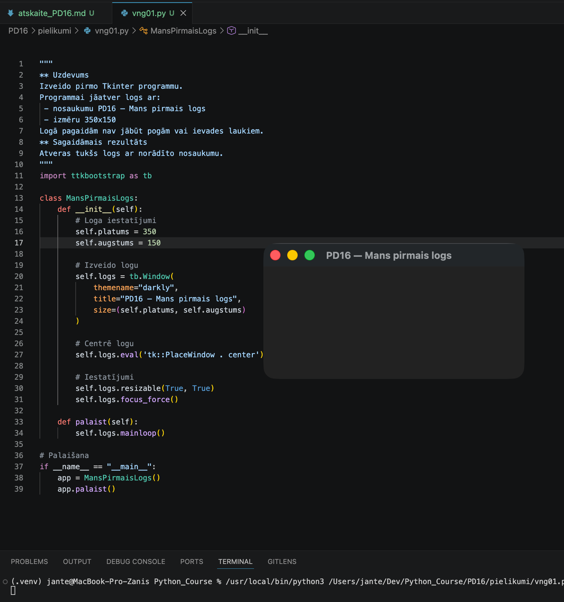
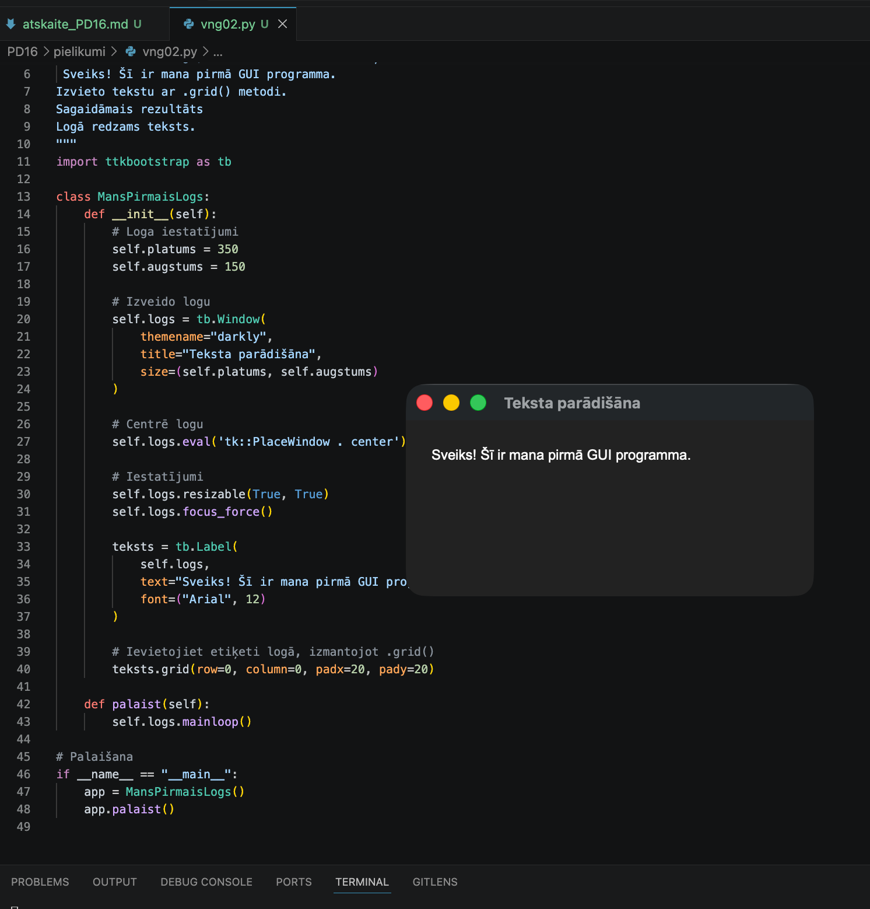
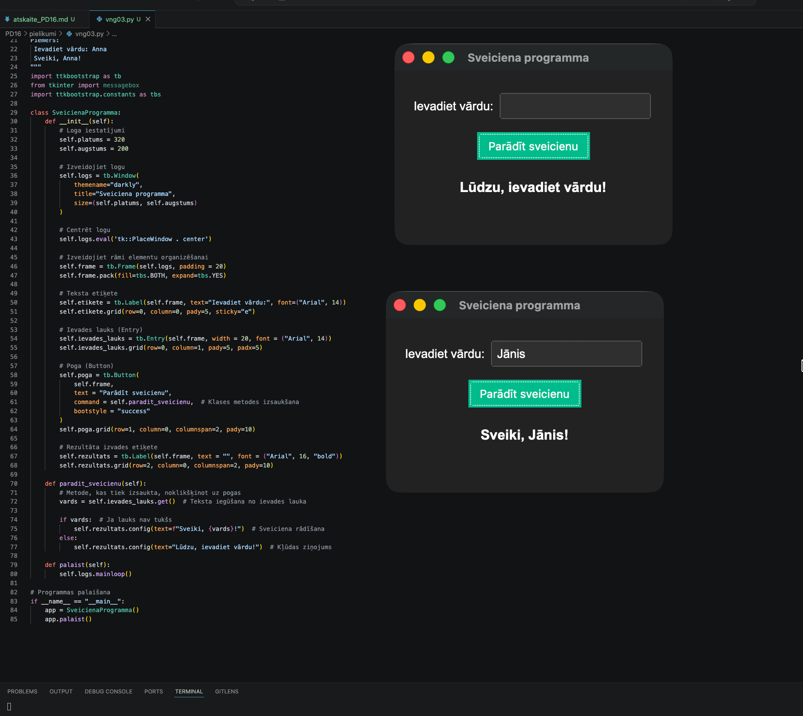
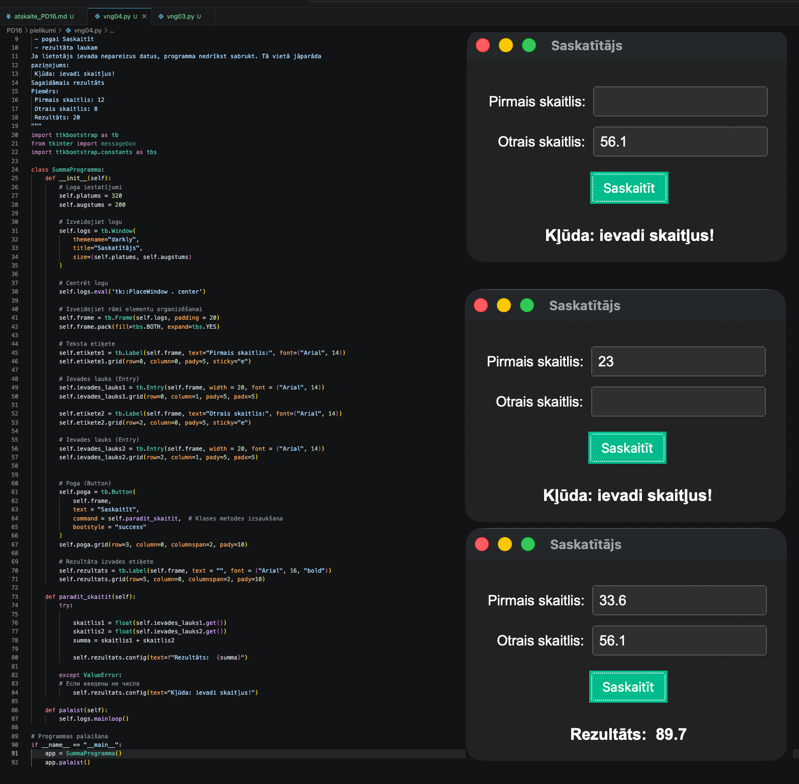
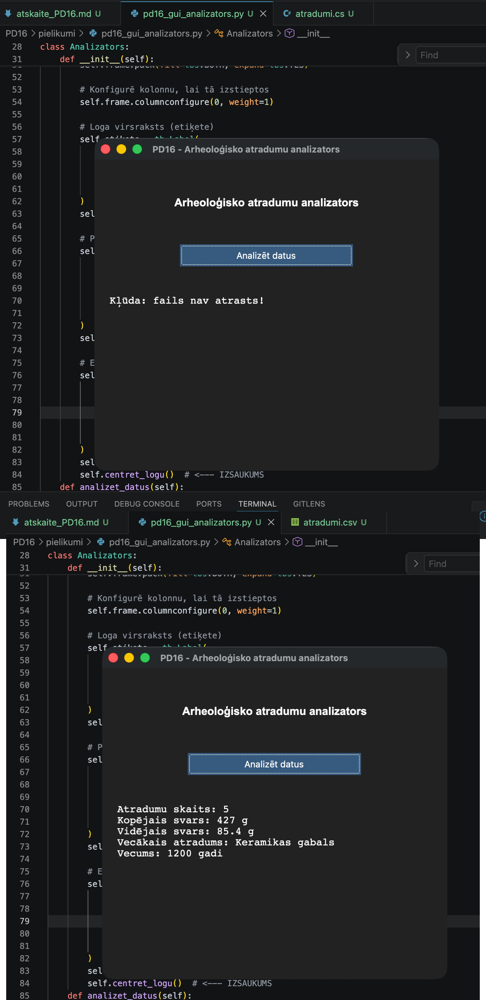

# Praktiskā darba atskaite — PD16

**Tēma:** Praktiskā datu apstrāde ar Tkinter
**Vārds, Uzvārds:** Zhan Teivan 
**Datums:** 2026-06-01  
**Grupa:**  Daugavpils_77978_11.05.2026.-05.06.2026


[Mana praktiskā darba mape GitHub platformā](https://github.com/JanTey/Python_Course/blob/main/PD16/atskaite_PD16.md)


---
# 📁 0. Sagatavošanās darbi

Pārbaudi, vai sagatavota darba vide:

* [x] Izveidota mape `PD16`
* [x] Izveidota apakšmape `pielikumi`
* [x] Izveidota apakšmape `atteli`
* [x] Izveidota atskaite `atskaite_PD16.md`

---

## Mapju struktūra

```text
PD15_Teivan_Zhan/
├─ Pielikumi/
│  ├─ atradumi.csv
│  ├─ pd16_gui_analizators.py
│  ├─ vng01.py
│  ├─ vng02.py
│  ├─ vng03.py
│  └─ vng04.py
├─ atteli/
│  ├─ maps_structure.png
│  ├─ vng01.png
│  ├─ vng02.png
│  ├─ vng03.png
│  ├─ vng04.png
│  └─ vng06.png
└─ atskaite_PD16.md
```

---

## Ekrānuzņēmums

Pievieno ekrānuzņēmumu ar mapes struktūru.

```markdown id="j0m2om"

```


---

# 🧩 vnginājums 01

## Faila nosaukums

```text id="pjlwmj"
vng01.py
```
---

## Python kods

```python id="p62h2r"
# vng01.py
"""
** Uzdevums
Izveido pirmo Tkinter programmu.
Programmai jāatver logs ar:
 - nosaukumu PD16 — Mans pirmais logs
 - izmēru 350x150
Logā pagaidām nav jābūt pogām vai ievades laukiem.
** Sagaidāmais rezultāts
Atveras tukšs logs ar norādīto nosaukumu.
"""
import ttkbootstrap as tb

class MansPirmaisLogs:
    def __init__(self):
        # Loga iestatījumi
        self.platums = 350
        self.augstums = 150
        
        # Izveido logu
        self.logs = tb.Window(
            themename="darkly", 
            title="PD16 — Mans pirmais logs", 
            size=(self.platums, self.augstums)
        )
        
        # Centrē logu
        self.logs.eval('tk::PlaceWindow . center')
        
        # Iestatījumi
        self.logs.resizable(True, True)
        self.logs.focus_force()
    
    def palaist(self):
        self.logs.mainloop()

# Palaišana
if __name__ == "__main__":
    app = MansPirmaisLogs()
    app.palaist()
```

## Rezultāts / izvade

Pievieno:

* ekrānuzņēmumu.

Rezultāts



---

## Komentāri / piezīmes

Izveidota Tkinter programma ar ttkbootstrap bibliotēku. Programma atver tukšu logu 
"PD16 — Mans pirmais logs" (350x150 pikseļi). Logs automātiski centrēts, izmanto tumšo 
tēmu "darkly" un atļauj izmēra maiņu. Programma veidota kā klase, kas ļauj to importēt 
citos projektos.

---

# 🧩 vnginājums 02

## Faila nosaukums

```text id="sdm8v5"
vng02.py
```
---

## Python kods

```python id="mt3k0v"
"""
Uzdevums
Izveido Tkinter logu, kurā redzama teksta etiķete:
 Sveiks! Šī ir mana pirmā GUI programma.
Izvieto tekstu ar .grid() metodi.
Sagaidāmais rezultāts
Logā redzams teksts.
"""
import ttkbootstrap as tb

class MansPirmaisLogs:
    def __init__(self):
        # Loga iestatījumi
        self.platums = 350
        self.augstums = 150
        
        # Izveido logu
        self.logs = tb.Window(
            themename="darkly", 
            title="Teksta parādišāna", 
            size=(self.platums, self.augstums)
        )
        
        # Centrē logu
        self.logs.eval('tk::PlaceWindow . center')
        
        # Iestatījumi
        self.logs.resizable(True, True)
        self.logs.focus_force()
        
        teksts = tb.Label(
            self.logs, 
            text="Sveiks! Šī ir mana pirmā GUI programma.",
            font=("Arial", 12)
        )
        
        # Ievietojiet etiķeti logā, izmantojot .grid()
        teksts.grid(row=0, column=0, padx=20, pady=20)
    
    def palaist(self):
        self.logs.mainloop()

# Palaišana
if __name__ == "__main__":
    app = MansPirmaisLogs()
    app.palaist()
```
---

## Rezultāts / izvade

Pievieno:

* ekrānuzņēmumu.

Rezultāts



---

## Komentāri / piezīmes

Izveidota Tkinter programma ar ttkbootstrap bibliotēku. Programma atver logu ar 
nosaukumu "Teksta parādīšana" un izmēru 350x150 pikseļi. Loga ķermenī, izmantojot 
.grid() metodi, tiek parādīts teksts: "Sveiks! Šī ir mana pirmā GUI programma." 
Teksts izvietots rindā 0, kolonnā 0 ar 20 pikseļu atkāpēm horizontāli un vertikāli. 
Logs automātiski tiek centrēts uz ekrāna, tam ir tumšā dizaina tēma "darkly" un 
iespēja mainīt izmēru. Programma ir uzrakstīta, izmantojot klasi, un tai ir iespēja 
importēt logu citās programmās.


---

# 🧩 vnginājums 03 

## Faila nosaukums

```text id="sdm8v5"
vng03.py
```
---

## Python kods

```python id="mt3k0v"
# vng03.py
"""
Uzdevums
Izveido klasi Kruze.
Sākumā krūze ir tukša.
Klasei jābūt:
atribūtam piepildita
metodei ieliet()
metodei izdzert()
metodei paradit_stavokli()
Programmai jāparāda, kā krūzes stāvoklis mainās.
Uzdevums
Izveido programmu, kurā lietotājs ievada savu vārdu.
Programmai jābūt:
 - ievades laukam
 - pogai Parādīt sveicienu
 - rezultāta tekstam
Kad lietotājs nospiež pogu, logā jāparādās sveicienam.
Sagaidāmais rezultāts
Piemērs:
 Ievadiet vārdu: Anna
 Sveiki, Anna!
"""
import ttkbootstrap as tb
from tkinter import messagebox
import ttkbootstrap.constants as tbs 

class SveicienaProgramma:
    def __init__(self):
        # Loga iestatījumi
        self.platums = 320
        self.augstums = 200
        
        # Izveidojiet logu
        self.logs = tb.Window(
            themename="darkly", 
            title="Sveiciena programma", 
            size=(self.platums, self.augstums)
        )
        
        # Centrēt logu
        self.logs.eval('tk::PlaceWindow . center')
        
        # Izveidojiet rāmi elementu organizēšanai
        self.frame = tb.Frame(self.logs, padding = 20)
        self.frame.pack(fill=tbs.BOTH, expand=tbs.YES)
        
        # Teksta etiķete
        self.etikete = tb.Label(self.frame, text="Ievadiet vārdu:", font=("Arial", 14))
        self.etikete.grid(row=0, column=0, pady=5, sticky="e")
        
        # Ievades lauks (Entry)
        self.ievades_lauks = tb.Entry(self.frame, width = 20, font = ("Arial", 14))
        self.ievades_lauks.grid(row=0, column=1, pady=5, padx=5)
        
        # Poga (Button)
        self.poga = tb.Button(
            self.frame, 
            text = "Parādīt sveicienu", 
            command = self.paradit_sveicienu,  # Klases metodes izsaukšana
            bootstyle = "success"
        )
        self.poga.grid(row=1, column=0, columnspan=2, pady=10)
        
        # Rezultāta izvades etiķete
        self.rezultats = tb.Label(self.frame, text = "", font = ("Arial", 16, "bold"))
        self.rezultats.grid(row=2, column=0, columnspan=2, pady=10)
        
    def paradit_sveicienu(self):
        # Metode, kas tiek izsaukta, noklikšķinot uz pogas
        vards = self.ievades_lauks.get()  # Teksta iegūšana no ievades lauka
        
        if vards:  # Ja lauks nav tukšs
            self.rezultats.config(text=f"Sveiki, {vards}!")  # Sveiciena rādīšana
        else:
            self.rezultats.config(text="Lūdzu, ievadiet vārdu!")  # Kļūdas ziņojums
    
    def palaist(self):
        self.logs.mainloop()

# Programmas palaišana
if __name__ == "__main__":
    app = SveicienaProgramma()
    app.palaist() 
```
---

## Rezultāts / izvade

Pievieno:

* ekrānuzņēmumu.

Rezultāts



---

## Komentāri / piezīmes

Izveidota Tkinter programma ar ttkbootstrap bibliotēku. Programma atver logu ar 
nosaukumu "Sveiciena programma" un izmēru 320x200 pikseļi. Logā izvietoti: teksta 
etiķete "Ievadiet vārdu:", ievades lauks, poga "Parādīt sveicienu" un rezultāta 
izvades etiķete. Nospiežot pogu, programma, izmantojot .get() metodi, nolasa tekstu 
no ievades lauka un parāda sveicienu "Sveiki, [vārds]!". Ja ievades lauks ir tukšs, 
tiek parādīts paziņojums "Lūdzu, ievadiet vārdu!". Visi elementi ir izvietoti, 
izmantojot .grid() metodi. Logs automātiski tiek centrēts uz ekrāna, tam ir tumšā 
dizaina tēma "darkly" un iespēja mainīt izmēru. Programma ir uzrakstīta, izmantojot 
klasi, un tai ir iespēja importēt logu citās programmās.

---

# 🧩 vnginājums 04 

## Faila nosaukums

```text id="sdm8v5"
vng04.py
```
---

## Python kods

```python id="mt3k0v"
"""
Uzdevums
Izveido programmu, kas aprēķina divu skaitļu summu.
Programmai jābūt:
 - pirmajam ievades laukam
 - otrajam ievades laukam
 - pogai Saskaitīt
 - rezultāta laukam
Ja lietotājs ievada nepareizus datus, programma nedrīkst sabrukt. Tā vietā jāparāda
paziņojums:
 Kļūda: ievadi skaitļus!
Sagaidāmais rezultāts
Piemērs:
 Pirmais skaitlis: 12
 Otrais skaitlis: 8
 Rezultāts: 20
"""
import ttkbootstrap as tb
from tkinter import messagebox
import ttkbootstrap.constants as tbs 

class SummaProgramma:
    def __init__(self):
        # Loga iestatījumi
        self.platums = 320
        self.augstums = 200
        
        # Izveidojiet logu
        self.logs = tb.Window(
            themename="darkly", 
            title="Saskatītājs", 
            size=(self.platums, self.augstums)
        )
        
        # Centrēt logu
        self.logs.eval('tk::PlaceWindow . center')
        
        # Izveidojiet rāmi elementu organizēšanai
        self.frame = tb.Frame(self.logs, padding = 20)
        self.frame.pack(fill=tbs.BOTH, expand=tbs.YES)
        
        # Teksta etiķete
        self.etikete1 = tb.Label(self.frame, text="Pirmais skaitlis:", font=("Arial", 14))
        self.etikete1.grid(row=0, column=0, pady=5, sticky="e")
        
        # Ievades lauks (Entry)
        self.ievades_lauks1 = tb.Entry(self.frame, width = 20, font = ("Arial", 14))
        self.ievades_lauks1.grid(row=0, column=1, pady=5, padx=5)
        
        self.etikete2 = tb.Label(self.frame, text="Otrais skaitlis:", font=("Arial", 14))
        self.etikete2.grid(row=2, column=0, pady=5, sticky="e")
        
        # Ievades lauks (Entry)
        self.ievades_lauks2 = tb.Entry(self.frame, width = 20, font = ("Arial", 14))
        self.ievades_lauks2.grid(row=2, column=1, pady=5, padx=5)        
        
        
        # Poga (Button)
        self.poga = tb.Button(
            self.frame, 
            text = "Saskaitīt", 
            command = self.paradit_skaitit,  # Klases metodes izsaukšana
            bootstyle = "success"
        )
        self.poga.grid(row=3, column=0, columnspan=2, pady=10)
        
        # Rezultāta izvades etiķete
        self.rezultats = tb.Label(self.frame, text = "", font = ("Arial", 16, "bold"))
        self.rezultats.grid(row=5, column=0, columnspan=2, pady=10)
        
    def paradit_skaitit(self):
        try:
            skaitlis1 = float(self.ievades_lauks1.get())  
            skaitlis2 = float(self.ievades_lauks2.get())  
            summa = skaitlis1 + skaitlis2

            self.rezultats.config(text=f"Rezultāts:  {summa:.2f}")
        
        except ValueError:
        # Ja tiek ievadīti neskaitļi
            self.rezultats.config(text="Kļūda: ievadi skaitļus!")    
    
    def palaist(self):
        self.logs.mainloop()

# Programmas palaišana
if __name__ == "__main__":
    app = SummaProgramma()
    app.palaist() 
```
---

## Rezultāts / izvade

Pievieno:

* ekrānuzņēmumu.

Rezultāts



---

## Komentāri / piezīmes

Izveidota Tkinter programma ar ttkbootstrap bibliotēku. Programma atver logu ar 
nosaukumu "Saskatītājs" un izmēru 320x200 pikseļi. Logā izvietotas: divas teksta 
etiķetes "Pirmais skaitlis:" un "Otrais skaitlis:", divi ievades lauki, poga 
"Saskaitīt" un rezultāta izvades etiķete. Nospiežot pogu, programma ar .get() metodi 
nolasa vērtības no ievades laukiem, pārveido tās par skaitļiem, izmantojot float(), 
aprēķina summu un parāda rezultātu ar divām decimālzīmēm (formāts {summa:.2f}). 
Kļūdu apstrādei tiek izmantota try...except ValueError konstrukcija: ja lietotājs 
ievada neskaitļus, programma neavārijas beidzas, bet parāda ziņojumu "Kļūda: ievadi 
skaitļus!". Visi elementi ir izvietoti, izmantojot .grid() metodi. Logs automātiski 
tiek centrēts uz ekrāna, tam ir tumšā dizaina tēma "darkly" un iespēja mainīt izmēru. 
Programma ir uzrakstīta, izmantojot klasi, un tai ir iespēja importēt logu citās p
rogrammās.

---

# 🧩 vnginājums 05

## Faila nosaukums

```text id="sdm8v5"
Fails atradumi.csv
```
---

## Fails atradumi.csv

```python id="mt3k0v"
"""
Uzdevums
Mapē Pielikumi izveido failu:
atradumi.csv
Failā ievieto šādus datus:
 - nosaukums,svars,vecums
 - Moneta,15,600
 - Amulets,120,800
 - Gredzens,30,450
 - Keramikas gabals,250,1200
 - Bronzas adata,12,900
Pārbaudi, vai:
 - kolonnas ir atdalītas ar komatiem
 - pirmajā rindā ir kolonnu nosaukumi
 - dati nav nejauši sabojāti
Sagaidāmais rezultāts
Fails atradumi.csv ir sagatavots un atrodas mapē Pielikumi.
"""
```
---

## Komentāri / piezīmes

Fails atradumi.csv katalogā PD16/Pielikumi ir izveidots, dati ir pārbaudīti.

---

# 🧩 vnginājums 06 

## Faila nosaukums

```text id="sdm8v5"
vng06.py
```
---

## Python kods

```python id="mt3k0v"
"""
Uzdevums
Izveido programmu ar Tkinter logu, kas analizē failu atradumi.csv.
Programmai jābūt pogai:
    Analizēt datus
Kad lietotājs nospiež pogu, programma nolasa failu un parāda logā:
 - atradumu skaitu
 - kopējo svaru
 - vidējo svaru
 - vecākā atraduma nosaukumu
 - vecākā atraduma vecumu
Sagaidāmais rezultāts
Piemērs:
    Atradumu skaits: 5
    Kopējais svars: 427 g
    Vidējais svars: 85.4 g
    Vecākais atradums: Keramikas gabals
    Vecums: 1200 gadi
Ja fails nav atrasts, logā jāparādās kļūdas paziņojumam:
    Kļūda: fails nav atrasts!
"""
import ttkbootstrap as tb
import ttkbootstrap.constants as tbs
import os

class Analizators:
    # Klase arheoloģisko atradumu analizēšanai
    
    def __init__(self):
        #Konstruktors - izveido logu un visus elementus
        
        # Loga izmēri
        self.platums = 500
        self.augstums = 450
        
        # Izveido galveno logu ar tumšo tēmu
        self.logs = tb.Window(
            themename="darkly", 
            title="PD16 - Arheoloģisko atradumu analizators", 
            size=(self.platums, self.augstums)
        )
        
        # Centrē logu uz ekrāna
        self.logs.eval('tk::PlaceWindow . center')
        self.logs.resizable(True, True)
        
        # Izveido rāmi elementu izvietošanai
        self.frame = tb.Frame(self.logs, padding=20)
        self.frame.pack(fill=tbs.BOTH, expand=tbs.YES)
        
        # Konfigurē kolonnu, lai tā izstieptos
        self.frame.columnconfigure(0, weight=1)
        
        # Loga virsraksts (etiķete)
        self.etikete = tb.Label(
            self.frame, 
            text="Arheoloģisko atradumu analizators", 
            font=("Arial", 16, "bold"),
            anchor="center"
        )
        self.etikete.grid(row=0, column=0, pady=30, sticky="ew")
        
        # Poga datu analīzei
        self.poga = tb.Button(
            self.frame, 
            text="Analizēt datus", 
            command=self.analizet_datus,
            bootstyle="primary",
            width=25
        )
        self.poga.grid(row=1, column=0, pady=20)
        
        # Etiķete rezultāta parādīšanai (bez fona laukuma)
        self.rezultats = tb.Label(
            self.frame, 
            text="", 
            font=("Courier", 15),
            anchor="w",  # Piestiprina tekstu pie kreisās malas
            justify="left"  # Teksta izlīdzinājums pa kreisi
        )
        self.rezultats.grid(row=2, column=0, pady=20, sticky="w")
        self.centret_logu()  # <--- IZSAUKUMS    
    def analizet_datus(self):
        """Metode, kas nolasa CSV failu un veic datu analīzi"""
        
        # Meklē faila ceļu - vispirms tajā pašā mapē, tad Pielikumi mapē
        skripta_mape = os.path.dirname(os.path.abspath(__file__))
        faila_cels = os.path.join(skripta_mape, "atradumi.csv")
        
        # Ja fails nav atrasts, meklē Pielikumi apakšmapē
        if not os.path.exists(faila_cels):
            faila_cels = os.path.join(skripta_mape, "Pielikumi", "atradumi.csv")
        
        try:
            # Atver un nolasa failu
            with open(faila_cels, "r", encoding="utf-8") as f:
                lines = f.readlines()
            
            # Apstrādā datus - izlaiž pirmo rindu (virsrakstus)
            dati = []
            for line in lines[1:]:
                line = line.strip()
                if line:
                    parts = line.split(",")
                    if len(parts) == 3:
                        nosaukums = parts[0].strip()
                        svars = float(parts[1].strip())
                        vecums = float(parts[2].strip())
                        dati.append({
                            "nosaukums": nosaukums,
                            "svars": svars,
                            "vecums": vecums
                        })
            
            # Pārbauda, vai dati ir veiksmīgi nolasīti
            if not dati:
                self.rezultats.config(text="Kļūda: fails ir tukšs vai nav pareizi formatēts!")
                return
            
            # 1. Aprēķina atradumu skaitu
            skaits = len(dati)
            
            # 2. Aprēķina kopējo svaru
            kop_svars = sum(atradums["svars"] for atradums in dati)
            
            # 3. Aprēķina vidējo svaru
            vid_svars = kop_svars / skaits
            
            # 4. Atrast vecāko atradumu (ar lielāko vecumu)
            vecakais = max(dati, key=lambda x: x["vecums"])
            
            # Izveido rezultāta tekstu
            rezultata_teksts = f"""Atradumu skaits: {skaits}
Kopējais svars: {int(kop_svars)} g
Vidējais svars: {vid_svars:.1f} g
Vecākais atradums: {vecakais["nosaukums"]}
Vecums: {int(vecakais["vecums"])} gadi"""
            
            # Parāda rezultātu logā
            self.rezultats.config(text=rezultata_teksts)
            
        except FileNotFoundError:
            # Kļūdas paziņojums, ja fails nav atrasts
            self.rezultats.config(text="Kļūda: fails nav atrasts!")
        except Exception as e:
            # Citu kļūdu apstrāde
            self.rezultats.config(text=f"Kļūda: {str(e)}")
    
    def palaist(self):
        """Palaiž programmas galveno ciklu"""
        self.logs.mainloop()
    
    def centret_logu(self):
        self.logs.update_idletasks()
        x = (self.logs.winfo_screenwidth() // 2) - (self.platums // 2)
        y = (self.logs.winfo_screenheight() // 2) - (self.augstums // 2)
        self.logs.geometry(f"{self.platums}x{self.augstums}+{x}+{y}")

# Programmas palaišana
if __name__ == "__main__":
    app = Analizators()
    app.palaist()
```
---

## Rezultāts / izvade

Pievieno:

* ekrānuzņēmumu.

Rezultāts



---

## Komentāri / piezīmes

Izveidota Tkinter programma ar ttkbootstrap bibliotēku. Programma atver logu ar 
nosaukumu "PD16 - Arheoloģisko atradumu analizators" un izmēru 500x450 pikseļi. 
Logā izvietoti: virsraksts "Arheoloģisko atradumu analizators", poga "Analizēt 
datus" un rezultāta izvades etiķete. Nospiežot pogu, programma nolasa failu 
"atradumi.csv" no Pielikumi mapes (vai no esošās mapes), analizē datus un parāda 
rezultātus: atradumu skaitu, kopējo svaru, vidējo svaru, vecākā atraduma nosaukumu 
un tā vecumu. Kļūdu apstrādei tiek izmantota try...except konstrukcija: ja fails 
nav atrasts, tiek parādīts paziņojums "Kļūda: fails nav atrasts!", ja dati ir 
nepareizi - atbilstošs paziņojums. Visi elementi ir izvietoti, izmantojot .grid() 
metodi. Logs automātiski tiek centrēts uz ekrāna ar pašrakstīto metodi centret_logu(), 
tam ir tumšā dizaina tēma "darkly" un iespēja mainīt izmēru. Programma ir uzrakstīta, 
izmantojot klasi, un tai ir iespēja importēt logu citās programmās.

---

# 📝 Refleksija — piedzīvojumi un pārdzīvojumi

* Kas jums šodien patika visvairāk?
Man patika strādāt ar GUI.

* Kas bija vissarežģītākais?
Sarežģītība bija jaunās tēmas izpratnē.

* Kādu kļūdu jūs atradāt un izlabojāt?
Kļūdu bija daudz. Man nācās ilgi sēdēt un mēģināt panākt, lai kods strādātu.

* Kas bija interesants vai smieklīgs?
Viss bija interesanti.

---

# 🎯 Pamatots pašvērtējums (0-100)

| Kritērijs | Punkti | Pamatojums |
| :---      | :---:  | :---       |
| Kods un funkcionalitāte | 60 | Visi uzdevumi ir izpildīti un strādā bez kļūdām. |
| Izpratne un komentāri | 20 | Koda rindas ir nokomentētas, izpratne par tēmu ir pilnīga. |
| Refleksija | 10 | Refleksija ir sniegta godīgi un pilnā apjomā. |
| Noformējums un struktūra | 10 | Visi faili un attēli ir sakārtoti atbilstošajās mapēs. |
| **Kopā** | **100/100** | Viss ir izpildīts precīzi pēc prasībām. |

---

# 📦 Iesniegšana

Pirms iesniegšanas pārbaudi:

* [x] Visi `.py` faili atrodas mapē `Pielikumi`
* [x] Ekrānuzņēmumi ievietoti mapē `atteli`
* [x] Atskaites fails ir aizpildīts
* [x] Programmas darbojas

---

## Arhivēšana

Arhivē visu mapi:

```text id="h1xcm7" 
PD16.zip
```