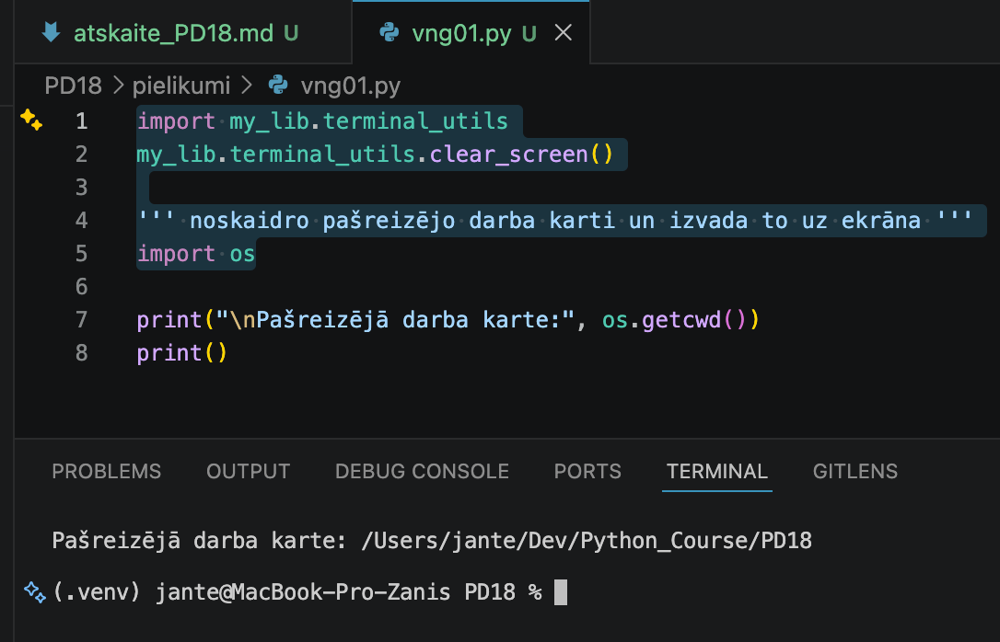
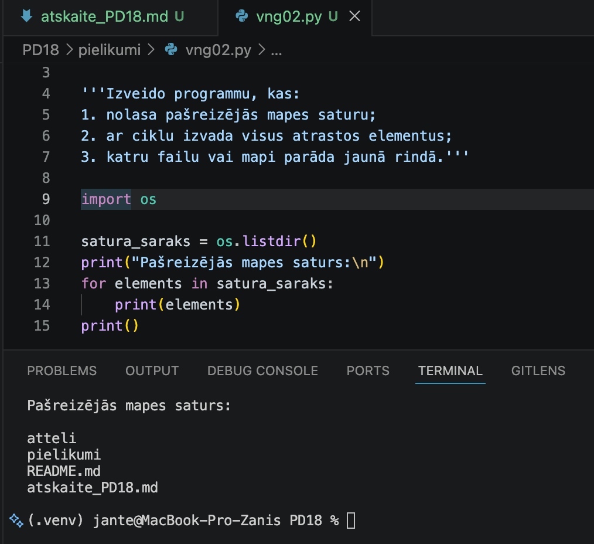
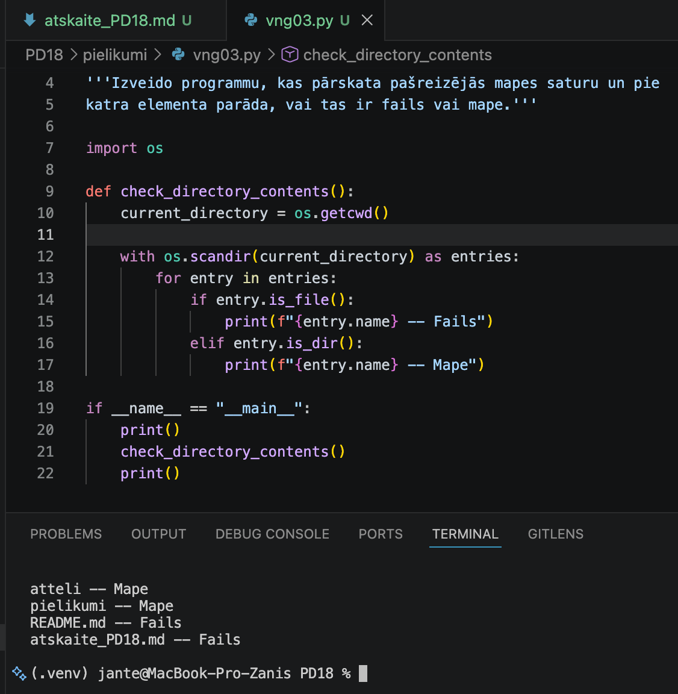
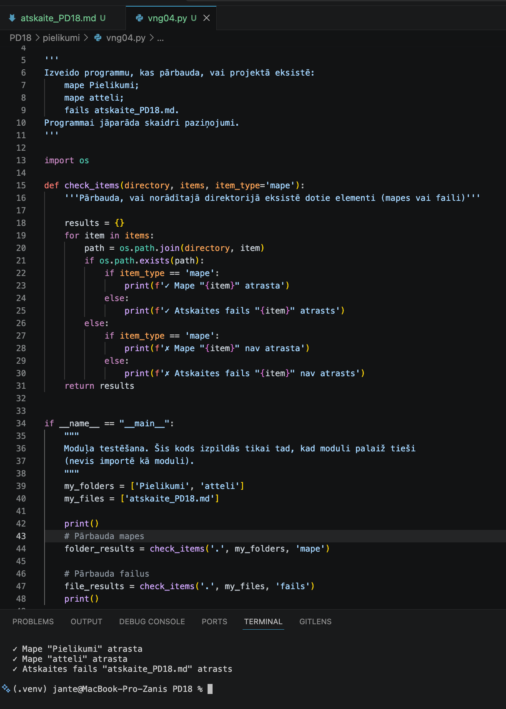
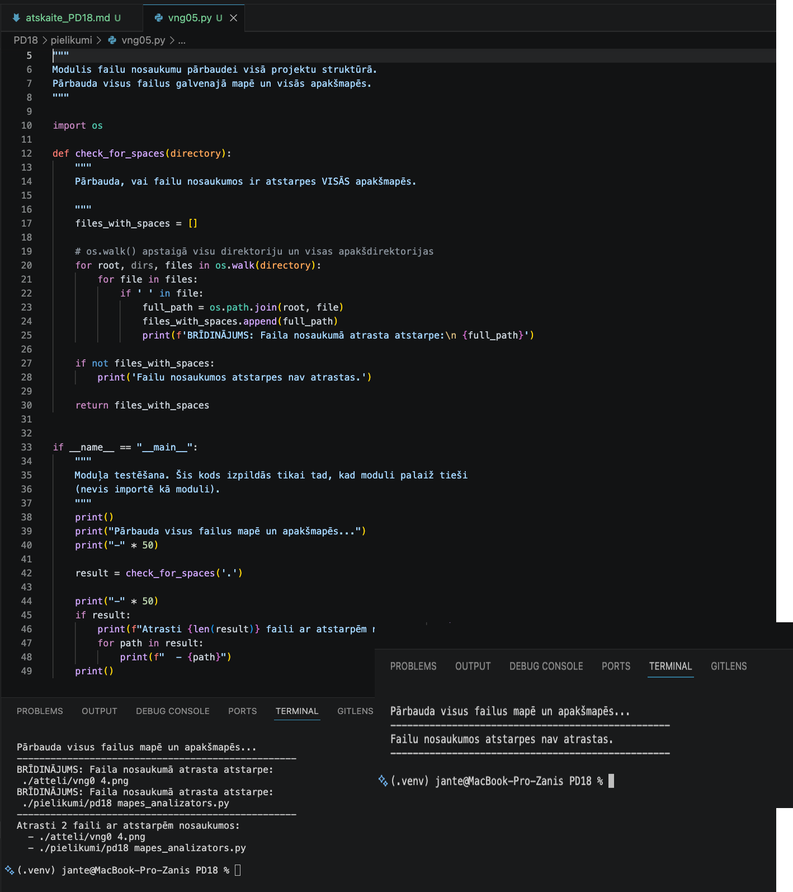
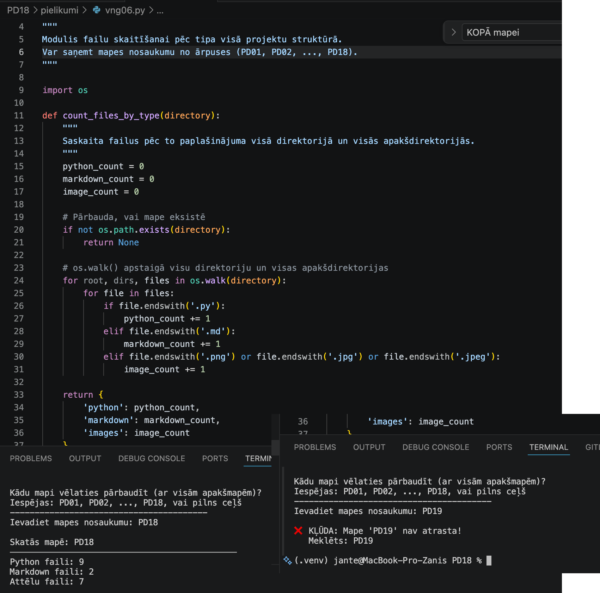
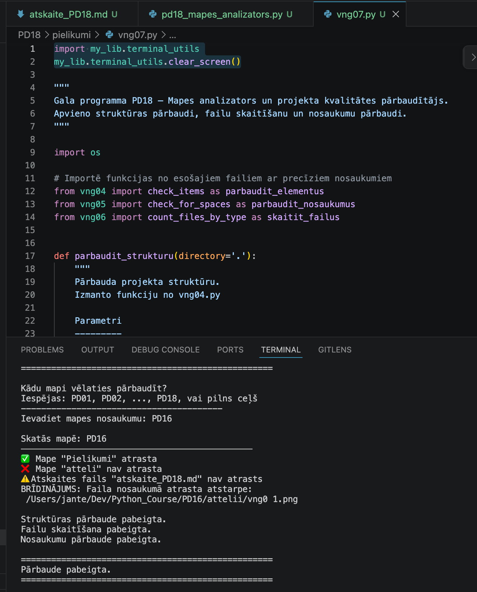
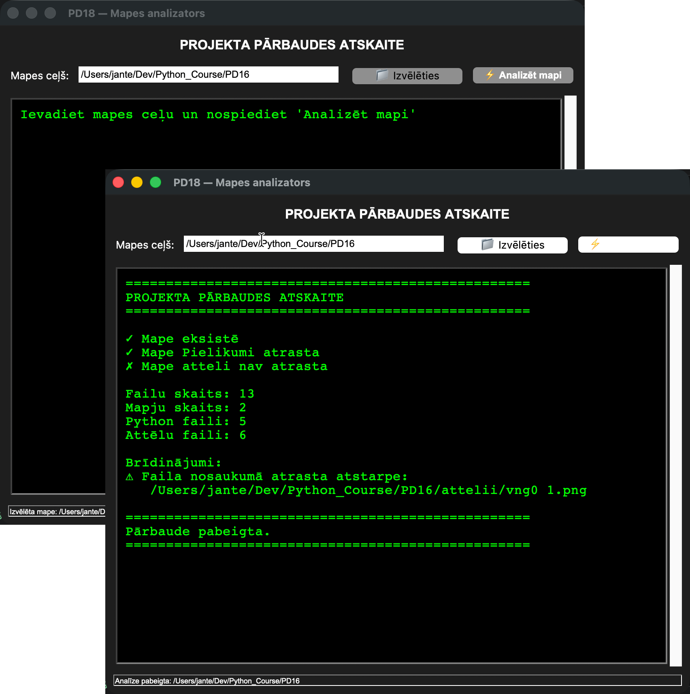

# Praktiskā darba atskaite

---

# 1. Vispārīgā informācija

* Vārds, Uzvārds:** Zhan Teivan 
* Grupa:**  Daugavpils_77978_11.05.2026.-05.06.2026
* Praktiskā darba kods: PD18
* Datums:** 2026-06-03  

[Mana praktiskā darba mape GitHub platformā](https://github.com/JanTey/Python_Course/blob/main/PD18/atskaite_PD18.md)

---

# 2. Darba mērķis

Šajā darbā bija paredzēts apgūt:

Šī darba mērķis bija iemācīties analizēt projekta mapes saturu ar Python palīdzību un pārbaudīt 
projekta kvalitāti. Darba laikā tika izmantots os modulis, nosacījumi, cikli, saraksti, funkcijas 
un Tkinter logs. Tika attīstītas prasmes strādāt ar failiem un mapēm, pārbaudīt projekta struktūru 
un veidot saprotamus rezultātu paziņojumus. Papildus tika nostiprinātas prasmes sadalīt programmu 
funkcijās un izvērtēt failu nosaukumu kvalitāti.

---

# 3. Darba konteksts

Šajā praktiskajā darbā tika analizēts mācību projekts PD18 — mapes analizators un projekta kvalitātes 
pārbaudītājs. Tas bija paša izstrādāts mācību projekts, kas tika veidots, izpildot vingrinājumus no 
sagataves. Darba uzdevums bija pakāpeniski izveidot Python programmu, kas pārbauda projekta mapes 
struktūru, saskaita failus, atrod problēmas failu nosaukumos un gala variantā strādā ar Tkinter grafisko 
logu. Projekts tika papildināts ar atskaiti, ekrānuzņēmumiem un pašvērtējumu.

---

# 4. Sākotnējais stāvoklis

Pirms darba uzsākšanas projekts vēl nebija izveidots pilnā apjomā. Bija pieejama uzdevuma sagatave ar prasībām, 
vingrinājumiem un atskaites struktūru, taču programma vēl neeksistēja. Bija skaidri definēta mapju struktūra, 
prasība izmantot moduli os un nepieciešamība izveidot gala risinājumu ar Tkinter logu. Sākotnēji galvenie 
izaicinājumi bija saprast, kā soli pa solim pārbaudīt mapi, kā atšķirt failus no mapēm un kā strukturēt kodu 
funkcijās.

---

# 5. Darba izpilde

## 5.1 Uzdevums 1

Pirmajā posmā tika izveidota darba vide un noteikta projekta mapes struktūra. Tika izveidotas mapes PD18, 
Pielikumi un atteli, kā arī fails atskaite_PD18.md. Tika pārbaudīts, kā ar Python un os moduli noteikt 
pašreizējo darba mapi un izvadīt to ekrānā. Rezultātā tika sagatavota vide turpmākajiem vingrinājumiem un p
ārbaudīts, ka programma spēj korekti noteikt darba atrašanās vietu.

### Rezultāts



[`vng01.py`](./pielikumi/vng01.py)

```python id="p62h2r"

# Programmas "Arheoloģisko izrakumu analizators" darbības rezultātu parādīšanas piemērs

''' noskaidro pašreizējo darba karti un izvada to uz ekrāna '''
import os

print("\nPašreizējā darba karte:", os.getcwd())
print()
```
---

## 5.2 Uzdevums 2

Otrajā etapā es izveidoju programmu, kas parāda pašreizējās mapes saturu. Es pieslēdzu os moduli, 
lai varētu strādāt ar failu sistēmu. Ar funkciju os.listdir() es nolasīju visu pašreizējās mapes 
saturu un saglabāju to sarakstā satura_saraks. Pēc tam es izveidoju ciklu for elements in satura_saraks, 
kas katru elementu (gan failu, gan mapi) izvadīja jaunā rindā. Tā kā programma vienkārši parāda visu, 
kas atrodas mapē, bez papildu pārbaudēm, es izvēlējos "Tips: Izpētīt rezultātu" — man nebija jāraksta 
sarežģīta loģika, tikai jāizmanto esošās os.listdir() iespējas. Šī programma ir noderīga, lai ātri 
apskatītos, kādi faili un mapes atrodas darba direktorijā. Vēlāk, kad veidoju gala programmu, šo pašu 
principu izmantoju, lai apstaigātu mapes un skaitītu failus.

### Rezultāts



[`vng03.py`](./pielikumi/vng03.py)

```python id="p62h2r"    
'''Izveido programmu, kas:
1. nolasa pašreizējās mapes saturu;
2. ar ciklu izvada visus atrastos elementus;
3. katru failu vai mapi parāda jaunā rindā.'''

import os

satura_saraks = os.listdir()
print("Pašreizējās mapes saturs:\n")
for elements in satura_saraks:
    print(elements)
print()
```
---

## 5.3 Uzdevums 3

Trešajā etapā es izveidoju programmu, kas ne tikai parāda mapes saturu, bet arī atšķir failus no mapēm. 
Es izmantoju funkciju os.getcwd(), lai noteiktu pašreizējo darba mapi. Pēc tam ar os.scandir() es iegūju 
visu mapes elementu sarakstu. Atšķirībā no os.listdir(), os.scandir() sniedz vairāk informācijas par katru 
elementu. Ciklā es pārbaudīju katru elementu: ja entry.is_file() ir patiess, tad elements ir fails; ja 
entry.is_dir() ir patiess, tad elements ir mape. Šī programma ir pamats turpmākajām struktūras pārbaudēm, 
piemēram, lai atrastu mapes "Pielikumi" un "atteli". Šo pašu principu es izmantoju arī gala programmā ar 
Tkinter, lai analizētu lietotāja izvēlēto mapi.

### Rezultāts



[`vng03.py`](./pielikumi/vng03.py)

```python id="p62h2r" 

'''Izveido programmu, kas pārskata pašreizējās mapes saturu un pie 
katra elementa parāda, vai tas ir fails vai mape.'''

import os

def check_directory_contents():
    current_directory = os.getcwd()
    
    with os.scandir(current_directory) as entries:
        for entry in entries:
            if entry.is_file():
                print(f"{entry.name} -- Fails")
            elif entry.is_dir():
                print(f"{entry.name} -- Mape")

if __name__ == "__main__":
    print()
    check_directory_contents()
    print()
```
---

## 5.2 Uzdevums 4

Ceturtajā etapā es izveidoju programmu, kas pārbauda projekta obligāto struktūru. Es uzrakstīju funkciju 
check_items(), kurai var nodot direktoriju, pārbaudāmo elementu sarakstu un elementa tipu (mape vai fails). 
Funkcija izmanto os.path.exists(), lai pārbaudītu, vai katrs elements eksistē. Atkarībā no item_type tiek 
izvadīts atbilstošs paziņojums — vai nu par mapi, vai par atskaites failu. Es izmantoju simbolus ✅ un ❌, 
lai rezultāti būtu vizuāli uztverami. Šī funkcija ir atkārtoti izmantojama — to pašu funkciju var izsaukt 
gan mapēm, gan failiem. Programmas galvenajā daļā es pārbaudu trīs būtiskus elementus: mapes "Pielikumi" 
un "atteli", kā arī failu "atskaite_PD18.md". Šī programma ir pamats projekta kvalitātes pārbaudei. Vēlāk, 
veidojot gala programmu ar Tkinter, es importēju šo pašu funkciju, lai pārbaudītu lietotāja izvēlētās mapes 
struktūru.

### Rezultāts



[`vng04.py`](./pielikumi/vng04.py)

```python id="p62h2r"    
'''
Izveido programmu, kas pārbauda, vai projektā eksistē:
    mape Pielikumi;
    mape atteli;
    fails atskaite_PD18.md.
Programmai jāparāda skaidri paziņojumi.
'''

import os

def check_items(directory, items, item_type='mape'):
    '''Pārbauda, vai norādītajā direktorijā eksistē dotie elementi (mapes vai faili)'''
    
    results = {}
    for item in items:
        path = os.path.join(directory, item)
        if os.path.exists(path):
            if item_type == 'mape':
                print(f'✅ Mape "{item}" atrasta')
            else:
                print(f'✅ Atskaites fails "{item}" atrasts')
        else:
            if item_type == 'mape':
                print(f'❌ Mape "{item}" nav atrasta')
            else:
                print(f'⚠️ Atskaites fails "{item}" nav atrasts')
    return results            
                

if __name__ == "__main__":
    """
    Moduļa testēšana. Šis kods izpildās tikai tad, kad moduli palaiž tieši
    (nevis importē kā moduli).
    """
    my_folders = ['Pielikumi', 'atteli']
    my_files = ['atskaite_PD18.md']
    
    print()
    # Pārbauda mapes
    folder_results = check_items('.', my_folders, 'mape')
    
    # Pārbauda failus
    file_results = check_items('.', my_files, 'fails')
    print()
```
---

## 5.2 Uzdevums 5

Piektajā etapā es izveidoju programmu, kas pārbauda failu nosaukumu kvalitāti — vai tajos nav atstarpju. 
Šoreiz es neaprobežojos tikai ar pašreizējo mapi, bet izmantoju os.walk(), lai pārbaudītu VISUS failus 
VISĀS apakšmapēs. Šī ir būtiska atšķirība no iepriekšējiem uzdevumiem — programma iedziļinās katrā apakšmapē 
jebkurā dziļumā. Katram failam es pārbaudu, vai tā nosaukumā ir atstarpe (' ' in file). Ja atstarpe ir, es 
pievienoju pilnu ceļu uz šo failu sarakstam files_with_spaces un izvadu brīdinājumu. Programma atgriež sarakstu 
ar visiem problemātiskajiem failiem, lai to varētu izmantot citās programmās. Beigās tiek parādīts kopsavilkums — 
cik faili ar atstarpēm atrasti un kādi tie ir. Šī programma ir ļoti noderīga, lai uzturētu projektu kārtībā, jo 
atstarpes failu nosaukumos var radīt problēmas darbā ar termināli un citām sistēmām. Vēlāk šo funkciju importēju 
gala programmā ar Tkinter.

### Rezultāts



[`vng05.py`](./pielikumi/vng05.py)

```python id="p62h2r"    
"""
Modulis failu nosaukumu pārbaudei visā projektu struktūrā.
Pārbauda visus failus galvenajā mapē un visās apakšmapēs.
"""

import os

def check_for_spaces(directory):
    
    """Pārbauda, vai failu nosaukumos ir atstarpes VISĀS apakšmapēs."""
    
    files_with_spaces = []
    
    # os.walk() apstaigā visu direktoriju un visas apakšdirektorijas
    for root, dirs, files in os.walk(directory):
        for file in files:
            if ' ' in file:
                full_path = os.path.join(root, file)
                files_with_spaces.append(full_path)
                print(f'BRĪDINĀJUMS: Faila nosaukumā atrasta atstarpe:\n {full_path}')
    
    if not files_with_spaces:
        print('Failu nosaukumos atstarpes nav atrastas.')
    
    return files_with_spaces


if __name__ == "__main__":
    """
    Moduļa testēšana. Šis kods izpildās tikai tad, kad moduli palaiž tieši
    (nevis importē kā moduli).
    """
    print()
    print("Pārbauda visus failus mapē un apakšmapēs...")
    print("-" * 50)
    
    result = check_for_spaces('.')
    
    print("-" * 50)
    if result:
        print(f"Atrasti {len(result)} faili ar atstarpēm nosaukumos:")
        for path in result:
            print(f"  - {path}")
    print()
```
---

## 5.2 Uzdevums 6

Sestajā etapā es izveidoju programmu, kas saskaita failus pēc to tipa. Šī programma atšķiras no 
iepriekšējām ar to, ka tā spēj saņemt mapes nosaukumu no ārpuses — lietotājs var ievadīt, piemēram, 
"PD18", un programma pati atradīs šo mapi. Es uzrakstīju funkciju count_files_by_type(), kas izmanto 
os.walk() lai apstaigātu visu mapi un apakšmapes, un ar .endswith() pārbauda katra faila paplašinājumu. 
Rezultāts tiek atgriezts vārdnīcā ar skaitītājiem Python, Markdown un attēlu failiem. Papildus es uzrakstīju 
funkciju find_pd_folder(), kas meklē PD mapi pašreizējā mapē un visās augšējās mapēs — tā paceļas augšup 
pa direktoriju koku, līdz atrod vajadzīgo mapi. Programma var strādāt divos režīmos: ja lietotājs ievada 
pilnu ceļu, to izmanto tieši; ja ievada, piemēram, "PD18", programma to meklē pati. Šī programma ir ērta, 
jo lietotājam nav jāraksta garie ceļi. Vēlāk šo pašu funkciju count_files_by_type() es importēju gala 
programmā ar Tkinter.

### Rezultāts



[`vng06.py`](./pielikumi/vng06.py)

```python id="p62h2r"    
"""
Modulis failu skaitīšanai pēc tipa visā projektu struktūrā.
Var saņemt mapes nosaukumu no ārpuses (PD01, PD02, ..., PD18).
"""

import os

def count_files_by_type(directory):
    """Saskaita failus pēc to paplašinājuma visā direktorijā un visās apakšdirektorijās."""
    
    python_count = 0
    markdown_count = 0
    image_count = 0
    
    # Pārbauda, vai mape eksistē
    if not os.path.exists(directory):
        return None
    
    # os.walk() apstaigā visu direktoriju un visas apakšdirektorijas
    for root, dirs, files in os.walk(directory):
        for file in files:
            if file.endswith('.py'):
                python_count += 1
            elif file.endswith('.md'):
                markdown_count += 1
            elif file.endswith('.png') or file.endswith('.jpg') or file.endswith('.jpeg'):
                image_count += 1
    
    return {
        'python': python_count,
        'markdown': markdown_count,
        'images': image_count
    }


def find_pd_folder(folder_name, start_path='.'):
    """
    Meklē PD mapi pašreizējā mapē un visās augšējās mapēs.
    """
    current = os.path.abspath(start_path)
    
    while True:
        test_path = os.path.join(current, folder_name)
        if os.path.exists(test_path) and os.path.isdir(test_path):
            return test_path
        
        parent = os.path.dirname(current)
        if parent == current:
            break
        current = parent
    
    return None


if __name__ == "__main__":
    print()
    
    # Prasa lietotājam ievadīt mapes nosaukumu
    print("Kādu mapi vēlaties pārbaudīt (ar visām apakšmapēm)?")
    print("Iespējas: PD01, PD02, ..., PD18, vai pilns ceļš")
    print("-" * 40)
    
    user_input = input("Ievadiet mapes nosaukumu: ").strip()
    
    # Nosaka, kuru mapi pārbaudīt
    if user_input.startswith('/') or user_input.startswith('.') or ':' in user_input or user_input.startswith('~'):
        # Pilns ceļš
        search_path = os.path.expanduser(user_input)
        display_name = search_path
    else:
        # Meklē PD mapi
        found_path = find_pd_folder(user_input)
        if found_path:
            search_path = found_path
            display_name = user_input  # Parāda tikai nosaukumu, nevis pilnu ceļu
        else:
            search_path = user_input
            display_name = user_input
    
    # Pārbauda, vai mape eksistē
    if not os.path.exists(search_path):
        print(f"\n❌ KĻŪDA: Mape '{display_name}' nav atrasta!")
        print(f"   Meklēts: {search_path}")
    else:
        # Skaita failus
        result = count_files_by_type(search_path)
        
        # Izvada rezultātu vienkāršā formātā
        print()
        print(f"Skatās mapē: {display_name}")
        print("──────────────────────────────────────────────")
        print(f"Python faili: {result['python']}")
        print(f"Markdown faili: {result['markdown']}")
        print(f"Attēlu faili: {result['images']}")
    
    print()
```
---

## 5.2 Uzdevums 7

Septītajā etapā es apvienoju visas iepriekšējās programmas vienā — izveidoju moduli, kas importē 
funkcijas no vng04.py, vng05.py un vng06.py. Tā vietā, lai rakstītu kodu no jauna, es izmantoju 
jau esošās funkcijas: parbaudit_elementus (struktūras pārbaudei), skaitit_failus (failu skaitīšanai) 
un parbaudit_nosaukumus (nosaukumu pārbaudei). Es uzrakstīju funkciju parbaudit_strukturu(), kas 
izmanto parbaudit_elementus, lai pārbaudītu obligātās mapes "Pielikumi" un "atteli", kā arī failu 
"atskaite_PD18.md". Funkciju find_pd_folder() es pārcēlu no vng06.py, lai programma varētu atrast 
PD mapi, ja lietotājs ievada tikai nosaukumu (piemēram, "PD18"). Galvenajā programmas daļā es izveidoju 
lietotājam draudzīgu interfeisu: programma prasa ievadīt mapes nosaukumu, pati to atrod (ja vajag), 
un pēc tam secīgi izsauc visas trīs pārbaudes. Beigās tiek izvadīti pabeigšanas statusi. Šī programma 
ir pilnīgs projekta analizators, kas apvieno visus iepriekšējos uzdevumus vienā veselumā. Vēlāk šo pašu 
loģiku es izmantoju, veidojot grafisko interfeisu ar Tkinter.

### Rezultāts



[`vng07.py`](./pielikumi/vng07.py)

```python id="p62h2r"    
"""
Gala programma PD18 — Mapes analizators un projekta kvalitātes pārbaudītājs.
Apvieno struktūras pārbaudi, failu skaitīšanu un nosaukumu pārbaudi.
"""

import os

# Importē funkcijas no esošajiem failiem ar precīziem nosaukumiem
from vng04 import check_items as parbaudit_elementus
from vng05 import check_for_spaces as parbaudit_nosaukumus
from vng06 import count_files_by_type as skaitit_failus


def parbaudit_strukturu(directory='.'):
    """
    Pārbauda projekta struktūru.
    Izmanto funkciju no vng04.py
    
    Parametri
    ---------
    directory : str, optional
        Ceļš uz mapi, kurā veikt pārbaudi (noklusējums - pašreizējā mape)
    
    Atgriež
    -------
    None
        Rezultāti tiek izvadīti konsolē, nevis atgriezti
    """
    my_folders = ['Pielikumi', 'atteli']
    my_files = ['atskaite_PD18.md']
    
    # Pārbauda mapes un failus
    parbaudit_elementus(directory, my_folders, 'mape')
    parbaudit_elementus(directory, my_files, 'fails')


def find_pd_folder(folder_name, start_path='.'):
    """
    Meklē PD mapi pašreizējā mapē un visās augšējās mapēs.
    
    Parametri
    ---------
    folder_name : str
        Mapes nosaukums (piemēram, 'PD18')
    start_path : str, optional
        Kur sākt meklēšanu (noklusējums - pašreizējā mape)
    
    Atgriež
    -------
    str or None
        Pilnu ceļu uz mapi, ja atrasta, vai None, ja nav atrasta
    """
    current = os.path.abspath(start_path)
    
    while True:
        test_path = os.path.join(current, folder_name)
        if os.path.exists(test_path) and os.path.isdir(test_path):
            return test_path
        
        parent = os.path.dirname(current)
        if parent == current:  # Sasniedzām saknes mapi
            break
        current = parent
    
    return None


if __name__ == "__main__":
    """
    Galvenā programmas daļa.
    Izpildās tikai tad, kad skriptu palaiž tieši (nevis importē kā moduli).
    """
    print()
    print("=" * 50)
    print("PROJEKTA PĀRBAUDES ATSKAITE")
    print("=" * 50)
    
    print("\nKādu mapi vēlaties pārbaudīt?")
    print("Iespējas: PD01, PD02, ..., PD18, vai pilns ceļš")
    print("-" * 40)
    
    user_input = input("Ievadiet mapes nosaukumu: ").strip()
    
    # Nosaka, kuru mapi pārbaudīt
    if user_input.startswith('/') or user_input.startswith('.') or ':' in user_input or user_input.startswith('~'):
        search_path = os.path.expanduser(user_input)
        display_name = search_path
    else:
        found_path = find_pd_folder(user_input)
        if found_path:
            search_path = found_path
            display_name = user_input
        else:
            search_path = user_input
            display_name = user_input
    
    # Pārbauda, vai mape eksistē
    if not os.path.exists(search_path):
        print(f"\n❌ KĻŪDA: Mape '{display_name}' nav atrasta!")
        print(f"   Meklēts: {search_path}")
    else:
        print(f"\nSkatās mapē: {display_name}")
        print("──────────────────────────────────────────────")
        
        # Izsauc trīs galvenās funkcijas (izvads notiek to iekšpusē)
        parbaudit_strukturu(search_path)
        skaitit_failus(search_path)
        parbaudit_nosaukumus(search_path)
        
        # Izvada pabeigšanas statusu
        print()
        print("Struktūras pārbaude pabeigta.")
        print("Failu skaitīšana pabeigta.")
        print("Nosaukumu pārbaude pabeigta.")
        
        print("\n" + "=" * 50)
        print("Pārbaude pabeigta.")
        print("=" * 50)
    
    print()
```
---

## 5.2 Uzdevums 8

Astotajā etapā es izveidoju grafigo interfeisu (GUI) savam projekta analizatoram, izmantojot 
Tkinter bibliotēku. Šis bija pēdējais un vissarežģītākais uzdevums, jo man vajadzēja savienot 
komandrindas versiju ar logu interfeisu.

Es izveidoju klasi ProjektAnalizators, kas satur visu loga elementus:

- Logu ar nosaukumu "PD18 — Mapes analizators"

- Ievades lauku mapes ceļam (lietotājs var ierakstīt ceļu manuāli)

- Pogu "Izvēlēties mapi" — atver dialoglodziņu mapes izvēlei (filedialog)

- Pogu "Analizēt" — sāk analīzi

- Rezultātu lauku (ScrolledText) ar ritjoslu, kur parādās pārbaudes rezultāti

- Kļūdas paziņojumu — ja mape neeksistē, programma parāda brīdinājumu

Lai izvairītos no koda dublēšanās, es importēju tās pašas funkcijas no vng04.py, vng05.py, vng06.py, 
ko izmantoju 7. etapā. Funkcija get_folder_stats() izmanto skaitit_failus() un parbaudit_nosaukumus(), 
lai savāktu visu nepieciešamo informāciju. Funkcija format_results() pārvērš šos datus lasāmā tekstā, 
ko parāda logā.

Viena no problēmām, ar ko saskāros, bija tā, ka logu dažreiz neredzēju — tas atvērās citā darba virsmā 
(macOS problēma). Es pievienoju attributes('-topmost', True) un focus_force(), lai logs parādītos 
priekšplānā.

Rezultātā es saņēmu pilnvērtīgu grafisko programmu, kas:

* Analizē lietotāja izvēlēto mapi (ieskaitot visas apakšmapes)

* Parāda, vai eksistē mapes "Pielikumi" un "atteli"

* Parāda kopējo failu un mapju skaitu

* Parāda Python un attēlu failu skaitu

* Brīdina par atstarpēm failu nosaukumos

Šī programma apvieno visu, ko es iemācījos PD18 praktiskajā darbā: darbu ar os moduli, failu sistēmu, funkcijām, moduļu importu un beidzot — grafiskā interfeisa izveidi.

### Rezultāts



[`pd18_mapes_analizators.py`](./pielikumi/pd18_mapes_analizators.py)

```python id="p62h2r"    
"""
Gala programma PD18 ar Tkinter logu — Mapes analizators un projekta kvalitātes pārbaudītājs.
Izmanto funkcijas no vng04.py, vng05.py, vng06.py.
"""

import os
import tkinter as tk
from tkinter import scrolledtext, messagebox, filedialog
import subprocess

# Importē jau esošās funkcijas
from vng04 import check_items as parbaudit_elementus
from vng05 import check_for_spaces as parbaudit_nosaukumus
from vng06 import count_files_by_type as skaitit_failus


def get_folder_stats(directory):
    """
    Analizē norādīto mapi, izmantojot esošās funkcijas.
    
    Parametri
    ---------
    directory : str
        Ceļš uz mapi, kuru analizēt
    
    Atgriež
    -------
    dict
        Vārdnīca ar analīzes rezultātiem
    """
    # Pārbauda, vai mape eksistē
    if not os.path.exists(directory):
        return None
    
    # 1. Savāc informāciju par mapēm un failiem (izmantojot os.walk)
    total_files = 0
    total_folders = 0
    
    for root, dirs, files in os.walk(directory):
        for d in dirs:
            total_folders += 1
        for f in files:
            total_files += 1
    
    # 2. Izmanto esošo funkciju no vng06.py failu skaitīšanai
    file_counts = skaitit_failus(directory)
    
    # 3. Pārbauda obligātās mapes (izmantojot os.path, jo vng04 tikai izvada)
    pielikumi_exists = os.path.exists(os.path.join(directory, 'Pielikumi')) and os.path.isdir(os.path.join(directory, 'Pielikumi'))
    atteli_exists = os.path.exists(os.path.join(directory, 'atteli')) and os.path.isdir(os.path.join(directory, 'atteli'))
    
    # 4. Pārbauda atstarpes nosaukumos (izmantojot esošo funkciju no vng05.py)
    # Piezīme: funkcija parbaudit_nosaukumus izvada rezultātu, bet arī atgriež sarakstu
    files_with_spaces = parbaudit_nosaukumus(directory)
    
    return {
        'exists': True,
        'total_files': total_files,
        'total_folders': total_folders,
        'python_files': file_counts.get('python', 0) if file_counts else 0,
        'markdown_files': file_counts.get('markdown', 0) if file_counts else 0,
        'image_files': file_counts.get('images', 0) if file_counts else 0,
        'pielikumi_exists': pielikumi_exists,
        'atteli_exists': atteli_exists,
        'files_with_spaces': files_with_spaces if files_with_spaces else []
    }

def format_results(result, directory):
    """
    Formatē analīzes rezultātus lasāmā tekstā.
    """
    if result is None:
        return f"❌ KĻŪDA: Mape '{directory}' neeksistē!"
    
    output = ""
    output += "=" * 50 + "\n"
    output += "PROJEKTA PĀRBAUDES ATSKAITE\n"
    output += "=" * 50 + "\n\n"
    
    # Mapes esamība
    output += "✓ Mape eksistē\n"
    
    # Obligātās mapes
    if result['pielikumi_exists']:
        output += "✓ Mape Pielikumi atrasta\n"
    else:
        output += "✗ Mape Pielikumi nav atrasta\n"
    
    if result['atteli_exists']:
        output += "✓ Mape atteli atrasta\n"
    else:
        output += "✗ Mape atteli nav atrasta\n"
    
    output += "\n"
    
    # Failu un mapju skaits
    output += f"Failu skaits: {result['total_files']}\n"
    output += f"Mapju skaits: {result['total_folders']}\n"
    output += f"Python faili: {result['python_files']}\n"
    output += f"Attēlu faili: {result['image_files']}\n"
    
    output += "\n"
    
    # Brīdinājumi par atstarpēm nosaukumos
    output += "Brīdinājumi:\n"
    if result['files_with_spaces']:
        for file_path in result['files_with_spaces']:
            output += f"⚠ Faila nosaukumā atrasta atstarpe:\n   {file_path}\n"
    else:
        output += "Nav atrasti faili ar atstarpēm nosaukumos.\n"
    
    output += "\n"
    output += "=" * 50 + "\n"
    output += "Pārbaude pabeigta.\n"
    output += "=" * 50
    
    return output

class ProjektAnalizators:
    """
    Tkinter loga klase projekta analīzei.
    """
    
    def __init__(self):
        """Inicializē Tkinter logu un visus elementus."""
        self.root = tk.Tk()
        
        
        
        self.root.title("PD18 — Mapes analizators")
        self.root.geometry("750x650")
        self.root.resizable(True, True)
        
        # self.root.attributes('-topmost', True)
        # self.root.lift()
        self.root.focus_force()
          
        # Galvenais rāmis
        main_frame = tk.Frame(self.root, padx=10, pady=10)
        main_frame.pack(fill=tk.BOTH, expand=True)
        
        # Virsraksts
        title_label = tk.Label(
            main_frame, 
            text="PROJEKTA PĀRBAUDES ATSKAITE", 
            font=("Arial", 16, "bold")
        )
        title_label.pack(pady=(0, 12))
        
        # Ievades rāmis
        input_frame = tk.Frame(main_frame)
        input_frame.pack(fill=tk.X, pady=(0, 12))
        
        # Ievades lauks
        tk.Label(input_frame, text="Mapes ceļš:").pack(side=tk.LEFT, padx=(0, 5))
        
        self.path_entry = tk.Entry(input_frame, font=("Arial", 12), width=45, bg="white", fg="black", relief=tk.SUNKEN, bd=2)
        self.path_entry.pack(side=tk.LEFT, fill=tk.X, expand=True, padx=(0, 10))
        
        # Poga "Izvēlēties mapi"
        self.browse_btn = tk.Button(
            input_frame, 
            text="📁 Izvēlēties", 
            command=self.browse_folder,
            width=12
        )
        self.browse_btn.pack(side=tk.LEFT, padx=(0, 5))
        
        # Poga "Analizēt mapi"
        self.analyze_btn = tk.Button(
            input_frame, 
            text="⚡ Analizēt mapi", 
            command=self.analyze_folder,
            bg="#4CAF50", 
            fg="white",
            font=("Arial", 12, "bold"),
            width=15
        )
        self.analyze_btn.pack(side=tk.LEFT)
        
        # Rezultātu lauks (ar ritjoslu)
        result_frame = tk.Frame(main_frame)
        result_frame.pack(fill=tk.BOTH, expand=True)
        
        self.result_text = scrolledtext.ScrolledText(
            result_frame, 
            wrap=tk.WORD, 
            font=("Courier", 16),
            height=20,
            bg="black",
            fg="lime",
            relief=tk.SUNKEN,
            bd=2,
            padx=10,
            pady=10
        )
        self.result_text.pack(fill=tk.BOTH, expand=True)
        
        # Sākotnējais teksts
        self.result_text.insert(tk.END, "Ievadiet mapes ceļu un nospiediet 'Analizēt mapi'")
        self.result_text.config(state=tk.DISABLED)
        
        # Statusa josla
        self.status_label = tk.Label(
            main_frame, 
            text="Gatavs", 
            bd=1, 
            relief=tk.SUNKEN, 
            anchor=tk.W,
            font=("Arial", 9)
        )
        self.status_label.pack(fill=tk.X, pady=(10, 0))
    
    def browse_folder(self):
        """Atver dialoglodziņu mapes izvēlei."""
        folder_path = filedialog.askdirectory(title="Izvēlieties mapi analīzei")
        if folder_path:
            self.path_entry.delete(0, tk.END)
            self.path_entry.insert(0, folder_path)
            self.status_label.config(text=f"Izvēlēta mape: {folder_path}")
    
    def analyze_folder(self):
        """Analizē norādīto mapi un parāda rezultātus."""
        directory = self.path_entry.get().strip()
        
        if not directory:
            messagebox.showwarning("Brīdinājums", "Lūdzu, ievadiet mapes ceļu!")
            return
        
        # Atjauno statusu
        self.status_label.config(text=f"Analizē mapi: {directory}...")
        self.root.update()
        
        # Analizē mapi (izmanto esošās funkcijas)
        result = get_folder_stats(directory)
        
        # Formatē un parāda rezultātus
        output = format_results(result, directory)
        
        # Ievieto rezultātus teksta laukā
        self.result_text.config(state=tk.NORMAL)
        self.result_text.delete(1.0, tk.END)
        self.result_text.insert(tk.END, output)
        self.result_text.config(state=tk.DISABLED)
        
        # Atjauno statusu
        if result is None:
            self.status_label.config(text=f"Kļūda: Mape '{directory}' nav atrasta!")
        else:
            self.status_label.config(text=f"Analīze pabeigta: {directory}")
    
    def run(self):
        """Palaid Tkinter galveno ciklu."""
        self.root.mainloop()


if __name__ == "__main__":
    # Palaid Tkinter programmu
    app = ProjektAnalizators()
    app.run()
```
---

# 6. Atrastās problēmas un novērojumi

| Problēma vai novērojums | Iespējamā ietekme |
| ----------------------- | ----------------- |
| 1. Failu nosaukumos atrastas atstarpes | Var rasties neskaidrības un problēmas ar failu apstrādi |
| 2. Projekta mapē var trūkt nepieciešamās apakšmapes | Programma nevar pilnībā izpildīt pārbaudi |
| 3. Viena funkcija sākotnēji darīja pārāk daudz | Kods bija grūtāk saprotams un uzturams |


---

# 7. Veiktās izmaiņas

Uzdevumu gaitā tika veiktas izmaiņas

| Izmaiņa | Pamatojums |
|---------|------------|
| Kods tika sadalīts funkcijās | Tas uzlaboja lasāmību un atviegloja uzturēšanu |
| Pievienota failu skaitīšana pēc tipa | Tas ļāva iegūt pilnīgāku informāciju par projektu |
| Izveidots Tkinter grafiskais logs | Lietotājam kļuva ērtāk izmantot gala programmu |

Izmaiņas tika veiktas, jo sākotnējais kods pildīja tikai atsevišķus vingrinājumus, bet gala risinājumam 
bija jāspēj apvienot visas pārbaudes vienā programmā. Tika papildināta funkcionalitāte, uzlabota koda 
struktūra un nodrošināta saprotamāka rezultātu izvade.
---

# 8. Uzturēšanas analīze

### Kāda veida uzturēšana tika veikta?

☐ **Corrective (koriģējošā)**

☐ Adaptive (adaptīvā)

✅ **Perfective (pilnveidojošā)** 

☐ Preventive (profilaktiskā)** 

Šajā darbā galvenokārt tika veikta pilnveidojošā uzturēšana, jo programma tika pakāpeniski uzlabota, 
papildināta ar jaunām funkcijām un pārveidota lietotājam draudzīgākā risinājumā. Kods tika strukturēts 
funkcijās, paplašināts ar pārbaudēm un noslēgumā papildināts ar grafisko saskarni.

---

### Vai tika identificēts tehniskais parāds?

✅ **Jā**

☐ Nē

Tehniskais parāds izpaudās tajā, ka sākotnējie risinājumi bija vienkārši un vairāk orientēti uz atsevišķiem 
vingrinājumiem nekā uz vienotu gala programmu. Vajadzēja pārstrukturēt kodu, sadalīt to funkcijās un padarīt 

---

### Incidenti pēc pieprasījuma un pēc izmaiņām

☐ Incident

✅ Change Request

☐ **Abi**

---

### Pamatojums

Darba gaitā tika īstenoti vairāki izmaiņu pieprasījumi, jo katrs nākamais vingrinājums paplašināja programmas 
iespējas. Tika pievienota failu tipa skaitīšana, failu nosaukumu pārbaude, koda sadalīšana funkcijās un gala 
loga izveide ar Tkinter.

---

# 9. Rezultāts

Gala rezultātā tika izveidota Python programma, kas spēj analizēt projekta mapi un pārbaudīt tās kvalitāti. 
Programma nosaka, vai mape eksistē, pārbauda nepieciešamo apakšmapju un failu esamību, saskaita failus pēc 
tipa un atrod neatbilstošus failu nosaukumus. Kods tika strukturēts funkcijās, bet gala risinājumam tika 
pievienota Tkinter grafiskā saskarne. Lietotājs iegūst skaidru pārskatu par projekta struktūru un iespējamiem 
trūkumiem.

---

# 10. Problēmas un to risinājumi

### Problēma

Viena no galvenajām problēmām bija nepieciešamība apvienot vairākus atsevišķus vingrinājumus vienā gala 
programmā. Sākumā kods bija sadalīts pa mazām daļām, un nebija uzreiz skaidrs, kā organizēt visas pārbaudes 
vienotā struktūrā. Problēma tika atrisināta, sadalot kodu funkcijās un pakāpeniski papildinot gala programmu 
ar visām iepriekš izstrādātajām pārbaudēm. Šajā procesā tika apgūts, ka uzturams kods ir vieglāk saprotams, 
ja katrai funkcijai ir viens konkrēts uzdevums.

---

# 11. Secinājumi

Šis darbs parādīja, cik svarīgi ir uzturēt kodu sakārtotu, lasāmu un viegli paplašināmu. Es iemācījos izmantot 
moduli os dažādu failu un mapju pārbaudēm, veidot vienkāršu grafisko logu ar Tkinter un strukturēt programmu 
funkcijās. Grūtākais bija savienot visas prasības vienā gala risinājumā, taču tieši tas deva visvairāk pieredzes. 
Nākamajā projekta versijā es vēl vairāk uzlabotu lietotāja saskarni un papildinātu programmu ar dziļāku apakšmapju 
analīzi.

---

# 12. Pašvērtējums

## Pašvērtējuma tabula

| Kritērijs               | Maks. punkti | Mani punkti |
| ----------------------- | ------------ | ----------- |
| Analīzes kvalitāte      | 25           | 23          |
| Problēmu identificēšana | 20           | 18          |
| Izmaiņu pamatojums      | 20           | 18          |
| Dokumentēšana           | 20           | 19          |
| Atskaite                | 15           | 14          |

Kopā: 92 / 100

---

## Komentārs

Atņemtie 8 punkti (pa 2 punktiem no analīzes kvalitātes, izmaiņu pamatojuma un dokumentēšanas), jo:

- Analīzē varēja vēl dziļāk izpētīt katra koda fragmenta ietekmi uz kopējo projektu
- Dažas izmaiņas varēja pamatot ar vairāk piemēriem no reālas prakses
- Dokumentācijā varēja pievienot vēl detalizētākus piemērus koda lietošanai

---

# 13. Pielikumi

Materiāli ir pievienoti

* projekta faili - /PD18/pielikumi/*.*; 
* ekrānattēli - /PD18/atteli/*.*;
* dokumentācija - READMI.md, atskaite_PD18.md; 
* [Git izmaiņu vēsture](https://github.com/JanTey/Python_Course/blob/main/PD18/atskaite_PD18.md).
