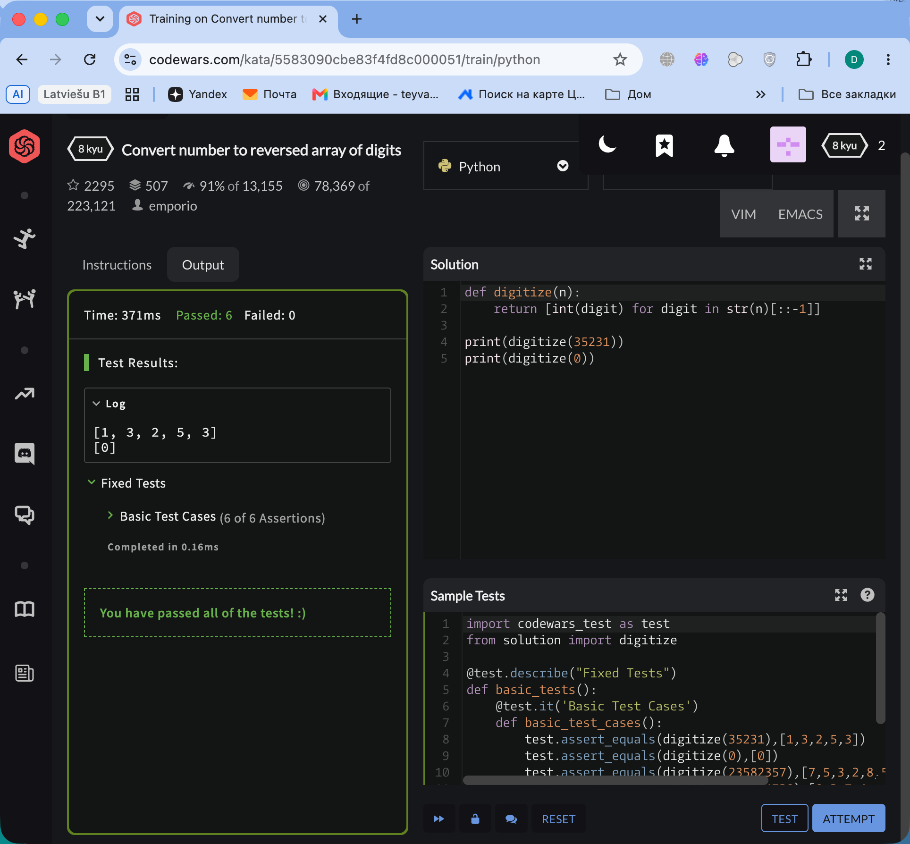
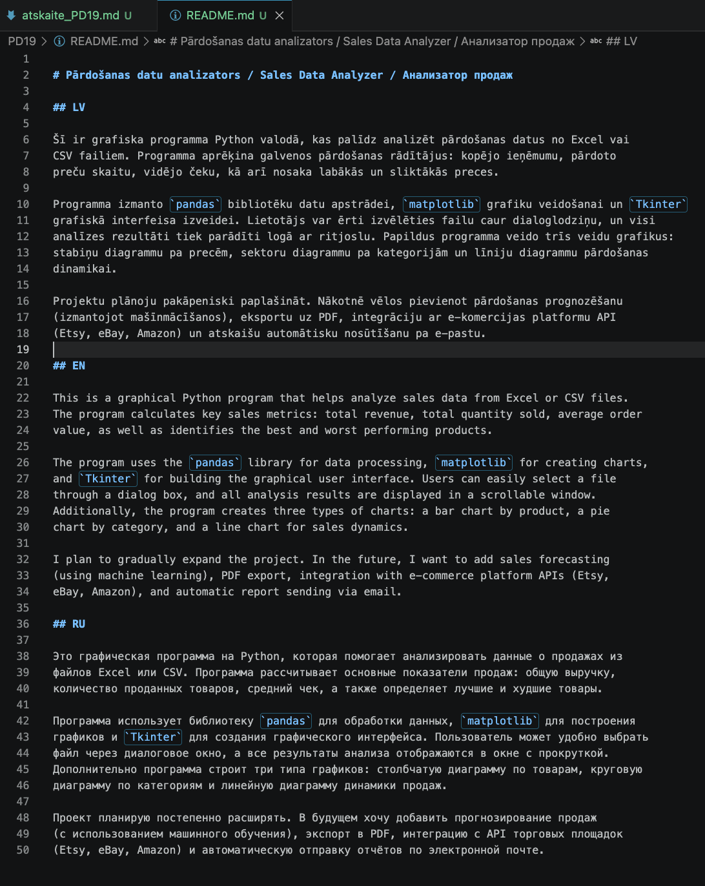

# Praktiskā darba atskaite — PD19

**Tēma:** Mans nākamais Python  
**Vārds, Uzvārds:** Zhan Teivan  
**Datums:** 2026-06-04  
**Grupa:** Daugavpils_77978_11.05.2026.-05.06.  

[Mana praktiskā darba mape GitHub platformā](https://github.com/JanTey/Python_Course/blob/main/PD19/atskaite_PD19.md)

# 📁 0. Sagatavošanās darbi

* [x] Izveidota mape `PD19`
* [x] Izveidota apakšmape `Pielikumi`
* [x] Izveidota apakšmape `atteli`
* [x] Izveidots fails `atskaite_PD19.md`

## Mapju struktūra

```text
PD03/
├─ Pielikumi/
├─ atteli/
│  ├─ maps_structure.png
│  ├─ vng01.png
│  ├─ vng02.png
│  └─ vng07.png
├─ atskaite_PD19.md
└─ README.md
````
## Ekrānuzņēmums

```markdown id="j0m2om"

```


# 🧩 Vingrinājums 01

## Faila nosaukums

```text id="pjlwmj"
vng01.png
```

Mana GitHub profila saite: https://github.com/JanTey

---

## Rezultāts / izvade

* ekrānuzņēmumu.

```markdown id="k9m4me"

```

---

## Komentāri / piezīmes

Man jau iepriekš bija izveidots GitHub profils, un es to aktīvi lietoju šo kursu apguves laikā.

---

# 🧩 Vingrinājums 02

## Rezultāts / izvade

* ekrānuzņēmumu.

```markdown id="k9m4me"

```

---

## Komentāri / piezīmes

#### Vai izdevās pieslēgties Codewars?

Jā.

#### Ko pamanīju, apskatot Codewars uzdevumus?

Codewars rangiem izmanto cīņas mākslām līdzīgu sistēmu:

 * 8 kyu — vienkāršākie (iesācējiem).
 * 1 kyu — sarežģītākie (profesionāļiem).

---

# 🧩 Vingrinājums 03

## Rezultāts / izvade

### Mana izvēlētā projekta ideja:

**Pārdošanas datu analizators**

Programma ar Tkinter grafisko interfeisu, kas ielādē failu ar pārdošanas datiem (Excel vai CSV), analizē 
tos un veido vizuālus grafikus.

---

### Kāpēc izvēlējos tieši šo projektu?

1. **Reāls praktisks ieguvums** — var izmantot mazu veikalu īpašnieki, tirgotāji interneta platformās un 
   pašnodarbinātie.

2. **Mērogojamība** — projektu var viegli paplašināt ar prognozēšanu, API integrācijām un PDF eksportu.

3. **Moderno tehnoloģiju izmantošana** — pandas, matplotlib un Tkinter.

4. **Svarīgu tēmu nostiprināšana** — failu lasīšana, datu apstrāde, grafiku veidošana.

---

### Kur šāds projekts varētu būt noderīgs?

1. **Mazajam biznesam** — analizēt, kuras preces nes visvairāk naudas.

2. **Tirgotājiem interneta platformās** — analizēt eksportētos datus no Etsy/eBay/Amazon.

3. **Frīlanseriem** — sekot līdzi ienākumiem pa projektiem un klientiem.

---

# 🧩 Vingrinājums 04

## Rezultāts / izvade

### Mana programma darīs:

1. **Ielādēs pārdošanas datu failu** — lietotājs izvēlas Excel/CSV failu caur dialoglodziņu.

2. **Analizēs pārdošanas datus** — aprēķinās kopējo ieņēmumu, vidējo čeku, labāko un sliktāko preci.

3. **Veidos grafikus un parādīs atskaiti** — stabiņu, sektoru un līniju diagrammas ar ritjoslu.

---

# 🧩 Vingrinājums 05

## Rezultāts / izvade

### Kuras tēmas būs vajadzīgas?

- [✅] Tkinter
- [✅] pandas
- [✅] matplotlib
- [✅] os modulis
- [✅] filedialog
- [✅] funkcijas
- [✅] cikli
- [✅] if / else
- [✅] vārdnīcas

### Vissvarīgākās tēmas:

1. **pandas** — datu apstrādei un analīzei.
2. **matplotlib** — grafiku veidošanai.
3. **Tkinter** — grafiskajam interfeisam.
4. **filedialog** — faila izvēlei ar peli.

### Nākotnes paplašināšanai:

1. **openpyxl** — darbam ar Excel failiem
2. **requests** — API integrācijām
3. **reportlab** — eksportam uz PDF
4. **fsklearn** — pārdošanas prognozēšanai

---

# 🧩 Vingrinājums 06

## Rezultāts / izvade

### Mana projekta mapes struktūra:

```
sales_analyzer/
├── README.md
├── requirements.txt
├── main.py
├── gui/
│   ├── __init__.py
│   ├── main_window.py
│   └── widgets.py
├── modules/
│   ├── __init__.py
│   ├── data_loader.py
│   ├── analyzer.py
│   └── chart_builder.py
├── data/
│   ├── sample_sales.csv
│   └── sample_sales.xlsx
├── exports/
│   └── .gitkeep
├── logs/
│   └── .gitkeep
├── tests/
│   ├── test_analyzer.py
│   └── test_data_loader.py
└── docs/
    ├── user_manual.md
    └── api_documentation.md
```
**Skaidrojums:**
```
- `main.py` — galvenais fails programmas palaišanai
- `gui/` — grafiskā interfeisa elementi (Tkinter)
- `modules/` — programmas loģika: datu ielāde (data_loader), 
   analīze (analyzer), grafiku veidošana (chart_builder)
- `data/` — datu paraugi testēšanai
- `exports/` — atskaišu un grafiku saglabāšana
- `logs/` — programmas darba žurnāli
- `tests/` — automatizētie testi
- `docs/` — dokumentācija
```
---

# 🧩 Vingrinājums 07

## Rezultāts / izvade

README.md Rezultāts



# Pārdošanas datu analizators / Sales Data Analyzer / Анализатор продаж

## LV

Šī ir grafiska programma Python valodā, kas palīdz analizēt pārdošanas datus no Excel vai 
CSV failiem. Programma aprēķina galvenos pārdošanas rādītājus: kopējo ieņēmumu, pārdoto 
preču skaitu, vidējo čeku, kā arī nosaka labākās un sliktākās preces.

Programma izmanto `pandas` bibliotēku datu apstrādei, `matplotlib` grafiku veidošanai un `Tkinter` 
grafiskā interfeisa izveidei. Lietotājs var ērti izvēlēties failu caur dialoglodziņu, un visi 
analīzes rezultāti tiek parādīti logā ar ritjoslu. Papildus programma veido trīs veidu grafikus: 
stabiņu diagrammu pa precēm, sektoru diagrammu pa kategorijām un līniju diagrammu pārdošanas 
dinamikai.

Projektu plānoju pakāpeniski paplašināt. Nākotnē vēlos pievienot pārdošanas prognozēšanu 
(izmantojot mašīnmācīšanos), eksportu uz PDF, integrāciju ar e-komercijas platformu API 
(Etsy, eBay, Amazon) un atskaišu automātisku nosūtīšanu pa e-pastu.

## EN

This is a graphical Python program that helps analyze sales data from Excel or CSV files. 
The program calculates key sales metrics: total revenue, total quantity sold, average order 
value, as well as identifies the best and worst performing products.

The program uses the `pandas` library for data processing, `matplotlib` for creating charts, 
and `Tkinter` for building the graphical user interface. Users can easily select a file 
through a dialog box, and all analysis results are displayed in a scrollable window. 
Additionally, the program creates three types of charts: a bar chart by product, a pie 
chart by category, and a line chart for sales dynamics.

I plan to gradually expand the project. In the future, I want to add sales forecasting 
(using machine learning), PDF export, integration with e-commerce platform APIs (Etsy, 
eBay, Amazon), and automatic report sending via email.

## RU

Это графическая программа на Python, которая помогает анализировать данные о продажах из 
файлов Excel или CSV. Программа рассчитывает основные показатели продаж: общую выручку, 
количество проданных товаров, средний чек, а также определяет лучшие и худшие товары.

Программа использует библиотеку `pandas` для обработки данных, `matplotlib` для построения 
графиков и `Tkinter` для создания графического интерфейса. Пользователь может удобно выбрать 
файл через диалоговое окно, а все результаты анализа отображаются в окне с прокруткой. 
Дополнительно программа строит три типа графиков: столбчатую диаграмму по товарам, круговую 
диаграмму по категориям и линейную диаграмму динамики продаж.

Проект планирую постепенно расширять. В будущем хочу добавить прогнозирование продаж 
(с использованием машинного обучения), экспорт в PDF, интеграцию с API торговых площадок 
(Etsy, eBay, Amazon) и автоматическую отправку отчётов по электронной почте.

---

# 📝 Noslēguma jautājumi

**1. Kas šajā kursā man izdevās vislabāk?**

Šajā kursā man vislabāk izdevās izprast darbu ar failu sistēmu (os modulis) un grafiskā 
interfeisa veidošanu ar Tkinter. 

**2. Kas man joprojām šķiet grūti?**

Ir grūti atrast kļūdas kodā, ja programma nedarbojas, kā paredzēts.

**3. Kuru Python tēmu es gribētu saprast labāk?**

Es gribētu labāk saprast datu analīzi ar pandas un matplotlib bibliotēkām. Man šķiet, ka šīs 
tēmas ir ļoti praktiskas un noderīgas reālajā dzīvē. Nākotnē es vēlos strādāt ar datiem, tāpēc 
vēlos iemācīties veidot sarežģītākus grafikus, analizēt lielus datu apjomus un pat prognozēt 
tendences. Interesants ir arī darbs ar neironu tīkliem.

**4. Ko es varētu izveidot pats, ja man būtu vairāk laika?**

Ja man būtu vairāk laika, es pilnībā iedziļinātos neironu tīklos. Bet pirmajos soļos, lai apgūtu Python un gūtu pieredzi, es plānoju izveidot pilnvērtīgu pārdošanas datu analizatoru. Šī programma varētu ielādēt datus no Excel/CSV failiem, aprēķināt galvenos rādītājus (kopējo ieņēmumu, vidējo čeku, labāko/sliktāko preci) un veidot trīs veidu grafikus. Nākotnē es pievienotu arī prognozēšanas iespējas un integrāciju ar e-komercijas platformu API (piemēram, Etsy, eBay, Amazon).

**5. Kāds būs mans nākamais mazais solis programmēšanā?**

Mans nākamais mazais solis ir sākt strādāt pie pārdošanas datu analizatora projekta. Es plānoju 
vispirms uzrakstīt vienkāršu versiju bez grafiskā interfeisa (tikai terminālī), pārliecināties, 
ka analīze darbojas pareizi, un tad pievienot Tkinter logu. Pēc tam es vēlos iemācīties izmantot 
pandas un matplotlib, lai padarītu projektu vēl profesionālāku. Katru dienu es plānoju rakstīt 
vismaz nedaudz koda, lai nostiprinātu zināšanas.
